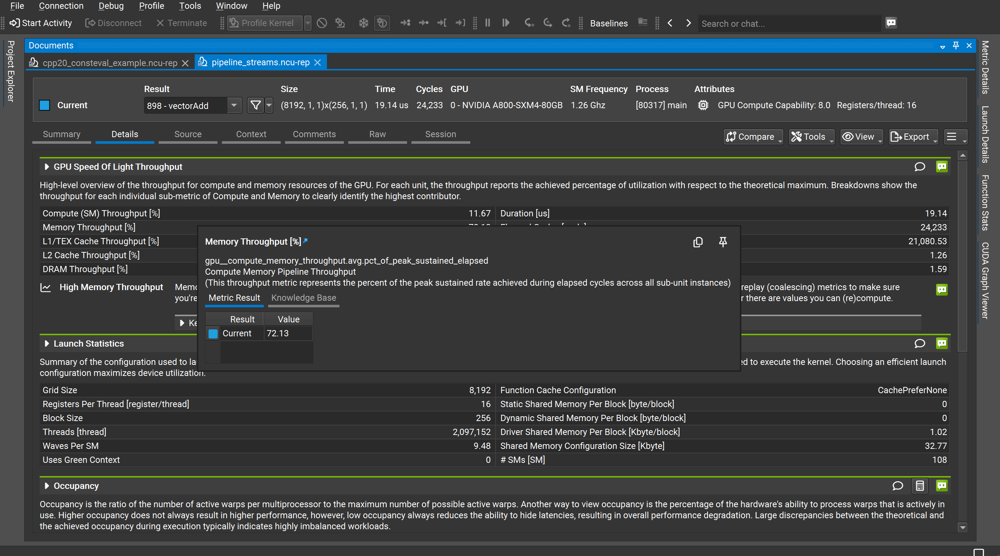
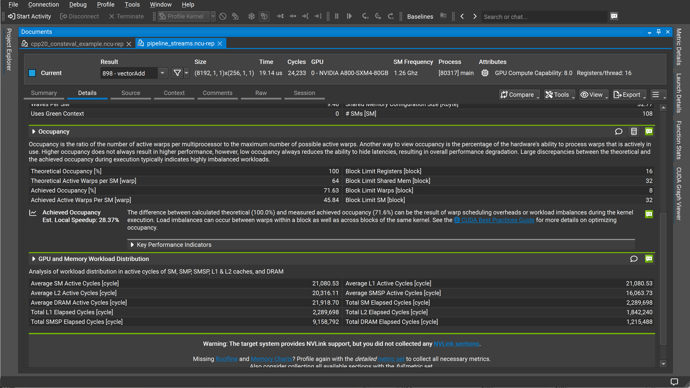

# 如何阅读 NVIDIA Nsight Compute (NCU) 报告

> 本教程以一个 `vectorAdd` kernel 的实际 profile 数据为例，带你系统性地读懂 NCU 报告的每个关键部分。

---

## 一、Summary 页：快速鸟瞰所有 kernel 执行情况

<!-- 【插图位置：图1 —— pipeline_streams.ncu-rep, Summary 页截图】 -->


打开 `.ncu-rep` 文件后，默认进入 **Summary** 页。这里汇总了本次 profile 中捕获到的所有 kernel 执行结果。

| 列名 | 含义 |
|------|------|
| **Function Name** | kernel 函数名（未解码） |
| **Demangled Name** | C++ 解码后的完整函数签名 |
| **Duration [us]** | 本次 kernel 实际执行时长（微秒） |
| **Compute Throughput [%]** | SM 计算吞吐量占理论峰值的百分比 |
| **Memory Throughput [%]** | 内存子系统吞吐量占峰值的百分比 |
| **# Registers** | 每线程使用的寄存器数 |
| **Grid Size / Block Size** | 启动配置 |

**读图要点：**

- 本例共有 3 条 `vectorAdd` 执行记录，分别耗时 19.14 µs、19.97 µs 和 35.33 µs。前两次 Grid Size 为 8192，第三次为 16384，对应不同的流水线测试场景。
- 三条记录的 **Memory Throughput** 均在 71–75%，远高于 **Compute Throughput**（约 10–12%），一眼就能判断这是一个**内存瓶颈型** kernel。
- 双击任意一行，即可进入该 kernel 的 **Details** 详细分析页。

---

## 二、Details 页 — GPU Speed of Light & Launch Statistics


<!-- 【插图位置：图2 —— Details 页，展开了 Memory Throughput [%] 的悬浮提示窗口】 -->

**Details** 页是 NCU 分析的核心，分为若干折叠区块。

### 2.1 GPU Speed of Light（光速吞吐量）

这个区块给出了 GPU 各子系统的利用率，是判断瓶颈的**第一入口**：

| 指标 | 当前值 | 含义 |
|------|--------|------|
| Compute (SM) Throughput [%] | 11.67 | SM 计算单元利用率极低 |
| **Memory Throughput [%]** | **72.13** | 内存管线繁忙，是主要瓶颈 |
| L1/TEX Cache Throughput [%] | — | L1 缓存命中情况 |
| L2 Cache Throughput [%] | 1.26 | L2 几乎空闲 |
| DRAM Throughput [%] | 1.59 | 实际 DRAM 带宽也很低 |

> **关键洞察：** Memory Throughput 高（72%）但 DRAM Throughput 低（1.59%），说明数据主要在 **L1/L2 缓存层**被命中，而不是真正打满了 HBM 带宽。这是 `vectorAdd` 这类 streaming 访问的典型特征。

悬浮在 **Memory Throughput [%]** 指标上可以看到详细说明：
> 该指标对应 `gpu_compute_memory_throughput.avg.pct_of_peak_sustained_elapsed`，即在 elapsed cycles 期间，内存管线达到峰值持续速率的百分比。

### 2.2 Launch Statistics（启动配置统计）

| 参数 | 值 |
|------|----|
| Grid Size | 8,192 |
| Block Size | 256 |
| Threads | 2,097,152（共 200 万线程） |
| Registers Per Thread | 16 |
| Waves Per SM | 9.48 |
| # SMs | 108 |
| Dynamic Shared Memory | 0 |

- **Waves Per SM = 9.48** 意味着每个 SM 要连续调度约 9–10 波 warps，足以隐藏延迟。
- 没有使用共享内存（0 bytes），符合 `vectorAdd` 的访存模式。

---

## 三、Details 页 — Occupancy（占用率）



<!-- 【插图位置：图3 —— Details 页，展开了 Occupancy 和 GPU & Memory Workload Distribution 区块】 -->

### 3.1 Occupancy 指标解读

| 指标 | 值 |
|------|----|
| Theoretical Occupancy [%] | **100** |
| Achieved Occupancy [%] | **71.63** |
| Theoretical Active Warps per SM | 64 |
| Achieved Active Warps Per SM | 45.84 |
| Block Limit Registers | 16 |
| Block Limit Shared Mem | 32 |
| Block Limit Warps | 8 |

**理论占用率 100%**，说明 kernel 的寄存器和共享内存用量不会限制 SM 的 warp 容量。

**实际占用率只有 71.63%**，NCU 给出了解释：

> 理论（100%）与实际（71.6%）之间的差距，可能来自 **warp 调度开销**或**负载不均衡**。
> 负载不均衡可能发生在同一 block 内的 warps 之间，也可能发生在不同 block 之间。

NCU 估算修复该问题可带来约 **28.37% 的本地加速**。

### 3.2 GPU and Memory Workload Distribution

| 指标 | 值 |
|------|-----|
| Average SM Active Cycles | 21,080.53 |
| Average L1 Active Cycles | 21,080.53 |
| Average L2 Active Cycles | 20,316.11 |
| Average DRAM Active Cycles | 21,918.70 |
| Total SM Elapsed Cycles | 2,289,698 |
| Total DRAM Elapsed Cycles | 1,215,488 |

**SM Active Cycles ≈ L1 Active Cycles ≈ DRAM Active Cycles**，说明整个 kernel 执行期间 SM、L1、DRAM 的活跃时间高度一致——这是 streaming 型 kernel 的健康特征，不存在明显的等待气泡。

---

## 四、Details 页 — 底部警告与进阶建议

<!-- 【插图位置：图4 —— 同图3（图3和图4内容相同，为同一截图）】 -->

> **提示：** 图3 与图4 为同一截图，无需重复插图。可将图3 放置于 3.1 小节前，图4 可省略或替换为其他截图。

页面底部出现两条重要提示：

1. **NVLink 警告：**
   > 目标系统支持 NVLink，但本次 profile 未采集 NVLink sections。
   如需分析多 GPU 通信，请在 profile 时加上 `--section NVLink`。

2. **缺少 Roofline 和 Memory Charts：**
   > 请使用 `detailed` 或 `full` metric set 重新 profile，才能生成 Roofline 图和内存带宽图。

   Roofline 模型是判断 kernel 是计算受限还是内存受限的黄金工具，强烈建议使用完整 metric set：
   ```bash
   ncu --set detailed -o my_report ./my_app
   # 或
   ncu --set full -o my_report ./my_app
   ```

---

## 五、总结：阅读 NCU 报告的标准流程

```
Summary 页
  └─ 看 Duration、Memory Throughput、Compute Throughput
       → 判断是内存瓶颈还是计算瓶颈
         ↓
Details → GPU Speed of Light
  └─ 确认瓶颈层级：DRAM / L2 / L1 / SM
         ↓
Details → Launch Statistics
  └─ 检查 Grid/Block 配置、Waves Per SM 是否合理
         ↓
Details → Occupancy
  └─ 对比理论 vs 实际占用率，定位 warp 调度效率
         ↓
Details → Workload Distribution
  └─ 检查 SM、L1、L2、DRAM 活跃周期是否均衡
         ↓
按需收集 detailed/full metric set → 查看 Roofline、Memory Charts
```

| 判断场景 | 典型表现 | 优化方向 |
|----------|----------|----------|
| 内存瓶颈（DRAM 高） | DRAM Throughput 接近峰值 | 合并访问、减少全局内存访问量 |
| 缓存瓶颈（L1 高） | L1/TEX Throughput 高，DRAM 低 | 优化数据局部性、使用共享内存 |
| 计算瓶颈（SM 高） | Compute Throughput 接近峰值 | 减少算术指令、使用 Tensor Core |
| 占用率不足 | Achieved < Theoretical | 减少寄存器/共享内存用量，调整 Block Size |
