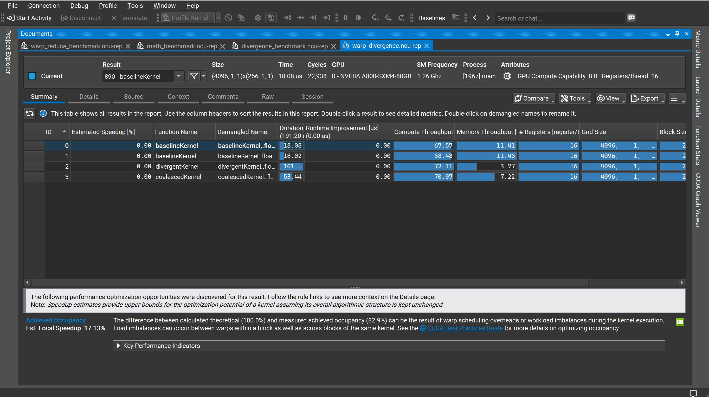
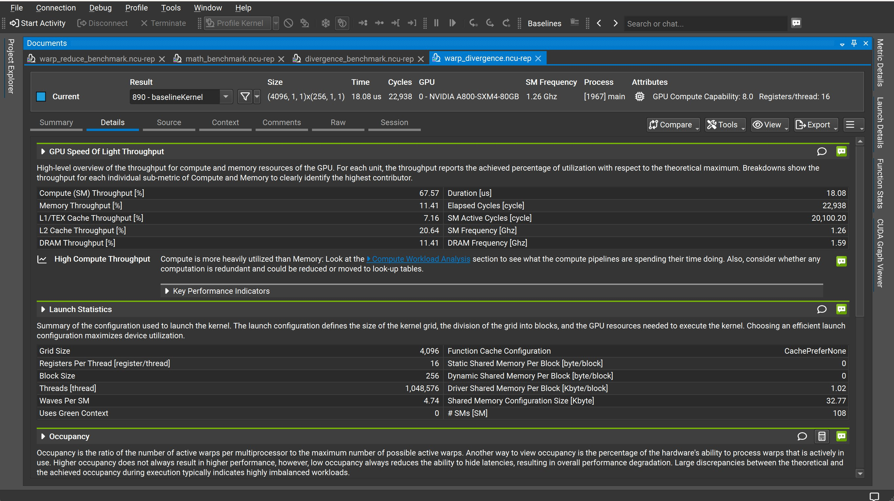
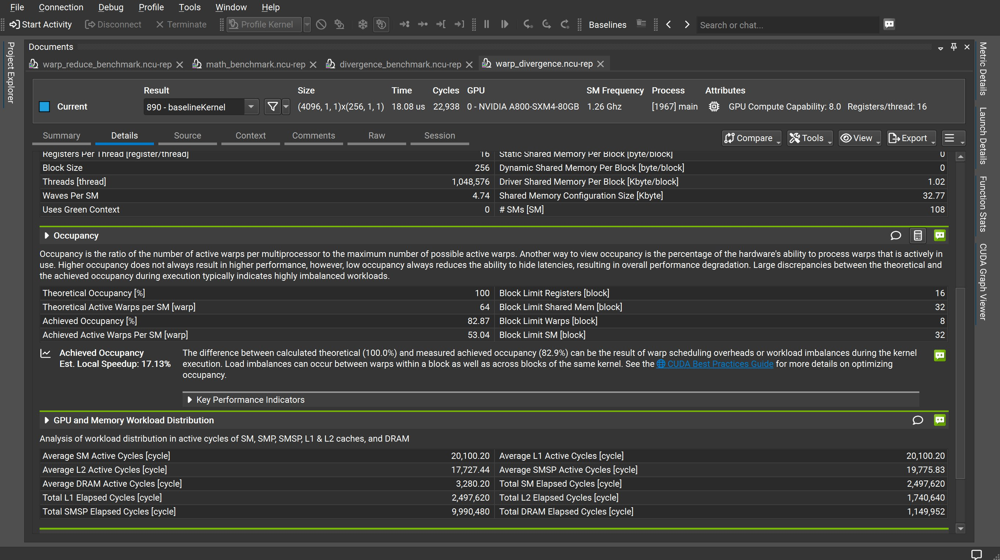

# CUDA Nsight Compute（NCU）报告阅读--以 Warp Divergence 报告为例

这次用 `warp_divergence.ncu-rep` 这份报告做示例，里面对比了三个 kernel：`baselineKernel`（基准实现）、`divergentKernel`（含分支发散）、`coalescedKernel`。和上一份归约（reduce）教程一样，按"先看全局对比、再看单个 kernel 细节"的顺序来读。

## 一、报告整体结构

`.ncu-rep` 文件打开后固定有 `Summary`、`Details`、`Source` 等标签页。推荐顺序依然是：先在 Summary 里定位哪个 kernel 慢，再到 Details 里看 Speed Of Light（判断瓶颈类型）、Launch Statistics/Occupancy（判断并行度够不够）、Workload Distribution（判断负载是否均衡）。

## 二、Summary 页面：三个 kernel 的全局对比

[NCU Summary 页面：baselineKernel / divergentKernel / coalescedKernel 对比](ncu2-summary.png)

顶部信息行：当前选中的是第 890 号结果 `baselineKernel`，启动配置 `Size` 为 `(4096,1,1)x(256,1,1)`，单次耗时 `Time` 18.08 us，`Cycles` 22,938，运行设备是 `NVIDIA A800-SXM4-80GB`，`SM Frequency` 1.26 GHz，每线程占用 16 个寄存器。

中间表格把三个 kernel 横向列出来，关键列摘出来对比如下：

| Kernel | Duration [us] | Compute Throughput [%] | Memory Throughput [%] | # Registers |
|---|---|---|---|---|
| baselineKernel | 18.08 | 67.57 | 11.41 | 16 |
| divergentKernel | ~101 | 72.11 | 3.77 | 16 |
| coalescedKernel | 53.44 | 70.07 | 7.22 | 16 |

三者 Grid/Block 配置完全一致（都是 4096 个 block、256 线程/block），唯一的变量是 kernel 内部的代码逻辑，这也是这类对比实验的标准做法——固定启动配置，只改变计算/访问模式，这样性能差异才能完全归因到代码逻辑本身。一个反直觉的地方是：`divergentKernel` 的 Compute Throughput（72.11%）反而比 `baselineKernel`（67.57%）还高，但耗时却暴涨了 5 倍多——这正是 warp divergence 的典型信号，后面案例分析部分会展开讲。

表格下方的提示区里，`Achieved Occupancy` 给出的建议是：理论占用率 100%、实测占用率 82.9%，估算消除这部分差距能带来 **17.13%** 的本地加速（Est. Local Speedup），这个数字是针对当前选中的 `baselineKernel` 算出来的。

## 三、Details 页面（上半部分）：GPU Speed Of Light Throughput 与 Launch Statistics

下图是切换到 `baselineKernel` 的 Details 页面看到的内容。

[NCU Details 页面：Speed Of Light Throughput 与 Launch Statistics](ncu2-details-throughput.png)

**GPU Speed Of Light Throughput**：Compute (SM) Throughput 67.57%、Memory Throughput 11.41%、L1/TEX Cache Throughput 7.16%、L2 Cache Throughput 20.64%、DRAM Throughput 11.41%。这组数字和前一份归约教程里的延迟瓶颈案例正好相反：Compute 远高于 Memory，NCU 自动弹出的提示也变成了 **High Compute Throughput**（而不是 Latency Issue），建议去看 `Compute Workload Analysis` 部分，确认计算单元具体在忙什么，以及"是否存在冗余计算、可以用查表（look-up table）代替"。这提示了一种常见的优化方向：如果计算量本身可以预先算好存表，就不需要每次都现场算。

**Launch Statistics**：Grid Size 4,096、Registers Per Thread 16、Block Size 256、Threads 1,048,576、Waves Per SM 4.74。Waves Per SM 表示要跑完所有 block 需要"轮"接近 5 批，说明这次的任务规模刚好能让 108 个 SM 都吃到饱（不存在某些 SM 闲置的尾部效应）。右边列出的共享内存相关字段都是 0，说明这几个 kernel 都没有主动申请共享内存，性能差异完全来自寄存器/分支/全局内存访问层面的代码逻辑。

## 四、Details 页面（下半部分）：Occupancy 与 Workload Distribution

继续往下滚动，是 Occupancy 和 Workload Distribution 两块面板。

[NCU Details 页面：Occupancy 与 Workload Distribution](ncu2-details-occupancy.png)

**Occupancy**：

| 指标 | 数值 |
|---|---|
| Theoretical Occupancy [%] | 100 |
| Theoretical Active Warps per SM | 64 |
| Achieved Occupancy [%] | 82.87 |
| Achieved Active Warps Per SM | 53.04 |

四个 Block Limit（Registers 16、Shared Mem 32、Warps 8、SM 32）里最小的是 Block Limit Warps=8，但理论占用率依然是 100%，说明 8 这个限制刚好等于硬件按当前 Block Size（256 线程=8 个 warp）能塞进去的数量，并不是真正的瓶颈。实测 82.87% 和理论值的差距，提示区解释为 warp 调度开销或 block/warp 间的负载不均衡，对应前面提到的 17.13% 本地加速空间。

**GPU and Memory Workload Distribution**：Average SM/L1 Active Cycles 20,100.20，对应的 Total SM/L1 Elapsed Cycles 是 2,497,620；Average L2 Active Cycles 17,727.44，Total L2 Elapsed Cycles 1,740,640；Average DRAM Active Cycles 只有 3,280.20，但 Total DRAM Elapsed Cycles 高达 1,149,952——DRAM 的"平均活跃周期/总经过周期"比值远低于 SM 和 L2，进一步印证了这是一个计算主导（compute-bound）而不是显存主导的 kernel，和前面 Speed Of Light 里 Memory Throughput 只有 11.41% 是一致的。

## 五、实战速查表

| 现象 | 可能原因 | 该看哪个面板 |
|---|---|---|
| Compute Throughput 远高于 Memory Throughput | 计算主导（compute-bound） | High Compute Throughput 提示 → Compute Workload Analysis |
| Compute Throughput 升高但 Duration 反而暴涨 | 大概率是 warp divergence，分支让 warp 内线程串行执行不同路径 | Source 页面看分支语句 + Warp State Statistics |
| Memory Throughput 随实现方式大幅波动，Grid/Block 配置不变 | 访问模式（是否合并访问）导致的差异 | Memory Workload Analysis / L1-L2-DRAM Throughput 拆解 |
| Theoretical 和 Achieved Occupancy 有差距但 Block Limit 都不小 | warp 调度开销或负载不均衡，不是资源配置问题 | Achieved Occupancy 提示 |

## 六、案例解读：baseline / divergent / coalesced 三者对比说明了什么

把三个 kernel 的数据放在一起看，能讲清楚两个经典的 CUDA 性能话题。第一个是 **warp divergence（warp 内分支发散)**：`divergentKernel` 的 Compute Throughput（72.11%）比 `baselineKernel`（67.57%）还高，乍看像是"计算更努力"，但 Duration 却从 18.08 us 涨到了约 101 us，Memory Throughput 也从 11.41% 跌到 3.77%。这是因为 GPU 以 warp（32 线程)为单位发射指令，如果同一个 warp 里的线程走进了不同的分支（比如 `if/else`），硬件会让整个 warp 把两条分支都执行一遍，未命中当前分支的线程被掩码（mask）成空闲但仍占着执行槛位——SM 看起来"很忙"（Compute Throughput 不低),但大量算力花在了被掩码线程的空转上,真正完成的有效计算反而更少,所以总耗时变长、内存访问的吞吐占比也被稀释。

第二个话题是**内存访问模式**：`coalescedKernel` 的耗时（53.44 us)介于另外两者之间，Memory Throughput（7.22%）比 baseline 还低一些。这提示一个常被忽视的点：kernel 名字带"coalesced"不代表它在这份对比里就是"最优"的那个——具体快慢还是要看 Source 页面里的实际访问模式和计算量,数据本身（Duration、Throughput 这些硬指标)永远比命名更可靠。这也是为什么读 NCU 报告时,要先看 Summary 表格里的真实数字,再去推断代码做了什么优化,而不是反过来。

## 七、小结

这份报告的特点和上一份归约 benchmark 正好相反:那边是延迟瓶颈（Compute、Memory 吞吐都很低),这边是计算主导（Compute Throughput 明显高于 Memory)。读 NCU 报告时,GPU Speed Of Light 这块面板给出的提示文字（Latency Issue / High Compute Throughput / Memory Bound 等)其实就是 NCU 自动帮你做的第一轮诊断,后面 Occupancy、Workload Distribution 这些面板则是在validate和细化这个诊断,最终要落到 Source 页面去看具体是哪一行代码造成的。
