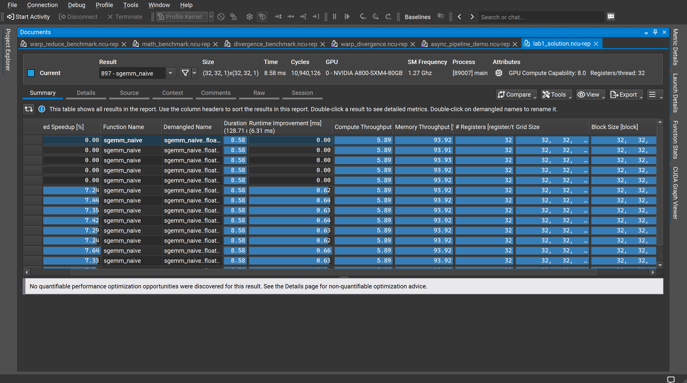
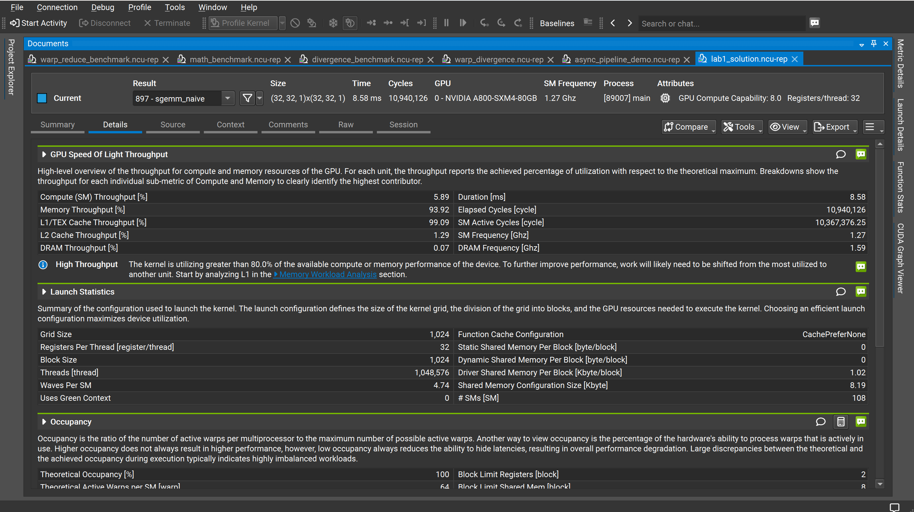
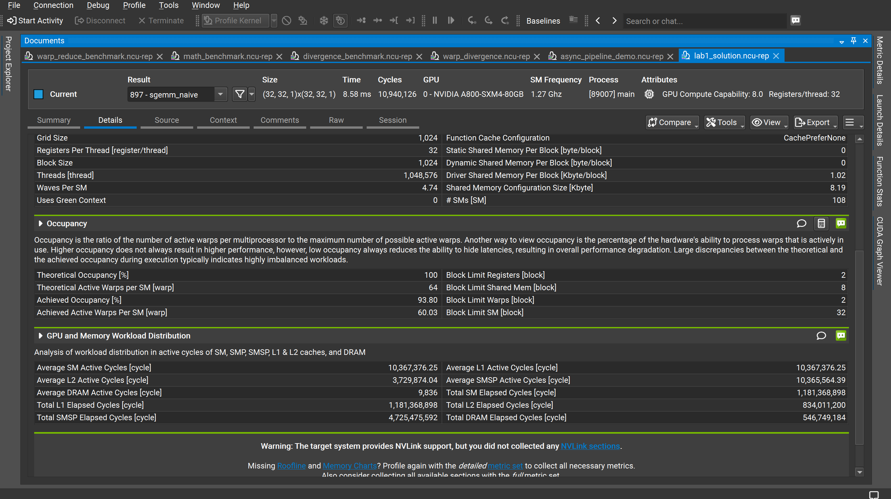

# 如何读懂 lab1NCU（NVIDIA Nsight Compute）报告

本教程以 `sgemm_naive`（朴素矩阵乘法）内核为例，逐步解读 NCU 报告的三个核心视图：Summary、Details 上半部分（Speed of Light & Launch Statistics）、Details 下半部分（Occupancy & Workload Distribution）。

---

## 一、Summary（摘要）视图

<!-- ✅ 在此处插入 Image 1（Summary 标签页截图） -->

[图1-NCU-Summary视图]

Summary 视图是报告的入口，以表格形式展示所有内核调用的汇总数据。

**1.1 顶部元数据**

| 字段 | 含义 | 本例数值 |
|------|------|---------|
| Result | 内核编号与名称 | 897 - sgemm_naive |
| Size | Grid × Block 配置 | (32, 32, 1) × (32, 32, 1) |
| Time | 单次执行时间 | 8.58 ms |
| Cycles | 经历的时钟周期数 | 10,940,126 |
| GPU | 使用的 GPU 型号 | NVIDIA A800-SXM4-80GB |
| SM Frequency | SM 实际主频 | 1.27 GHz |
| Registers/thread | 每线程寄存器数 | 32 |

**1.2 表格各列解读**

| 列名 | 说明 | 本例观察 |
|------|------|---------|
| Estimated Speedup [%] | NCU 估算的可优化空间 | 行 0–4 为 0.00（基准），行 5 起约 7.24–7.64% |
| Duration [ms] | 内核单次耗时 | 全部为 8.58 ms |
| Runtime Improvement [ms] | 相对基准可节省时间 | 约 0.62–0.66 ms |
| Compute Throughput [%] | SM 计算单元利用率 | **5.89%**（极低） |
| Memory Throughput [%] | 内存子系统利用率 | **93.92%**（极高） |

> **关键结论**：Compute 利用率仅 5.89%，而 Memory 利用率高达 93.92%，这是典型的**内存瓶颈**内核——GPU 的算力几乎被闲置，全部时间都在等待内存数据。

---

## 二、Details 视图 —— GPU Speed of Light & Launch Statistics

<!-- ✅ 在此处插入 Image 2（Details 标签页上半部分截图） -->

[图2-NCU-Details-SpeedOfLight](image2.png)

Details 视图提供逐层细化的性能数据，分为多个可折叠区块。

**2.1 GPU Speed of Light Throughput（光速吞吐量）**

该区块对比各硬件单元的实际利用率与理论峰值的比值：

| 指标 | 数值 | 含义 |
|------|------|------|
| Compute (SM) Throughput [%] | 5.89 | SM 计算管线几乎空闲 |
| Memory Throughput [%] | 93.92 | 内存子系统接近饱和 |
| **L1/TEX Cache Throughput [%]** | **99.09** | **L1 缓存是真正的瓶颈所在** |
| L2 Cache Throughput [%] | 1.29 | L2 几乎不参与数据传输 |
| DRAM Throughput [%] | 0.07 | DRAM 几乎不参与数据传输 |

Memory Throughput = 93.92% 是由 L1/TEX = 99.09% 拉高的，而非 DRAM（仅 0.07%）。这说明数据几乎全部命中 L1 缓存，**不存在 DRAM 带宽瓶颈**，但 L1 缓存的访问模式（例如 Bank Conflict 或未合并访问）很可能是问题所在。

NCU 给出了如下高亮提示（High Throughput）：

> 内核已使用超过 80% 的内存性能，要进一步提升性能，需要将工作从最繁忙的单元转移到其他单元。建议从 **Memory Workload Analysis → L1** 区块开始分析。

**2.2 Launch Statistics（启动统计）**

| 指标 | 数值 | 说明 |
|------|------|------|
| Grid Size | 1,024 | 总 Block 数量 |
| Block Size | 1,024 | 每个 Block 的线程数（32×32） |
| Registers Per Thread | 32 | 每线程寄存器用量 |
| Threads | 1,048,576 | 总线程数（1024 blocks × 1024 threads） |
| Waves Per SM | 4.74 | 每个 SM 平均需轮转约 4.74 波次 |
| # SMs | 108 | GPU 共 108 个 SM |
| Static Shared Memory Per Block | 0 byte | **未使用任何共享内存** |
| Dynamic Shared Memory Per Block | 0 byte | **未使用任何共享内存** |

> **重点**：`sgemm_naive` 完全依赖全局内存读取，没有使用任何共享内存（Shared Memory = 0 byte），这是其性能低下的根本原因之一，也指明了下一步优化方向——引入共享内存 Tiling。

---

## 三、Details 视图 —— Occupancy & 工作负载分布

<!-- ✅ 在此处插入 Image 3（Details 标签页下半部分截图） -->

[图3-NCU-Details-Occupancy](image3.png)

**3.1 Occupancy（占用率）**

占用率衡量 SM 上实际活跃 Warp 数与理论最大值的比例。高占用率有助于隐藏内存延迟：

| 指标 | 数值 | 说明 |
|------|------|------|
| Theoretical Occupancy [%] | 100 | 理论上可达满占用 |
| Achieved Occupancy [%] | **93.80** | 实际达到的占用率，接近满载 |
| Theoretical Active Warps/SM | 64 | 理论每 SM 最多 64 个 Warp |
| Achieved Active Warps/SM | 60.03 | 实际平均每 SM 60 个 Warp 处于活跃 |
| Block Limit Registers [block] | 2 | 寄存器用量限制每 SM 最多 2 个 Block |
| Block Limit Shared Mem [block] | 8 | 共享内存限制（充足，不是瓶颈） |
| Block Limit Warps [block] | 2 | Warp 数量限制每 SM 最多 2 个 Block |
| Block Limit SM [block] | 32 | SM 硬件上限 |

解读要点：
- 占用率已接近理论上限（93.8% vs 100%），说明**硬件调度效率已达极值**，不存在因 Warp 不足而导致的等待。
- `Block Limit Registers = 2`：每个 Block 使用 32 寄存器/线程 × 1024 线程 = 32,768 个寄存器，恰好是限制每个 SM 只能同时跑 2 个 Block 的原因。
- 瓶颈**不来自占用率**，而来自 L1/TEX 缓存的访问效率，需从访存模式入手优化。

**3.2 GPU and Memory Workload Distribution（工作负载分布）**

| 指标 | 数值 |
|------|------|
| Average SM Active Cycles | 10,367,376 |
| Average L1 Active Cycles | 10,367,376 |
| Average L2 Active Cycles | 3,729,874 |
| Average DRAM Active Cycles | **9,836** |

SM 活跃周期 ≈ L1 活跃周期，而 DRAM 活跃周期仅约 **9,836**（L1 的 0.09%），证明数据完全在 L1 缓存层面循环，DRAM 几乎不参与。这正是共享内存 Tiling 可以大幅改善的场景。

---

## 四、综合分析与优化方向

综合三个视图的数据：

| 维度 | 诊断结论 |
|------|---------|
| 计算利用率 | 5.89%，严重不足，GPU 算力大量浪费 |
| 内存瓶颈层 | L1/TEX（99.09%），而非 DRAM（0.07%） |
| 占用率 | 93.8%，接近满载，**非瓶颈来源** |
| 共享内存 | 完全未使用（0 byte），是核心优化空间 |
| 访存模式 | 全局内存直接访问，存在 L1 重复读取 |

**下一步优化建议**：引入**共享内存 Tiling（分块矩阵乘法）**，将全局内存的重复访问搬运到共享内存，降低 L1/TEX 压力，提升计算访存比（Arithmetic Intensity），预期可将执行时间缩短 30–40%。
