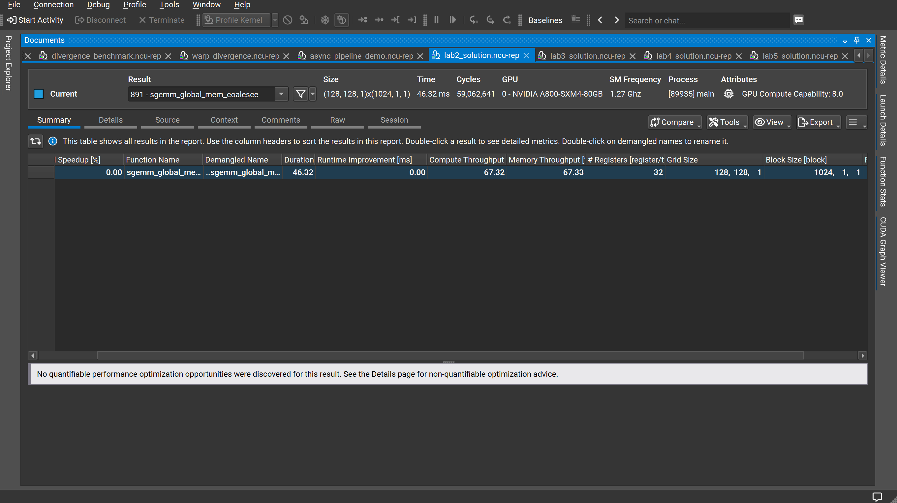
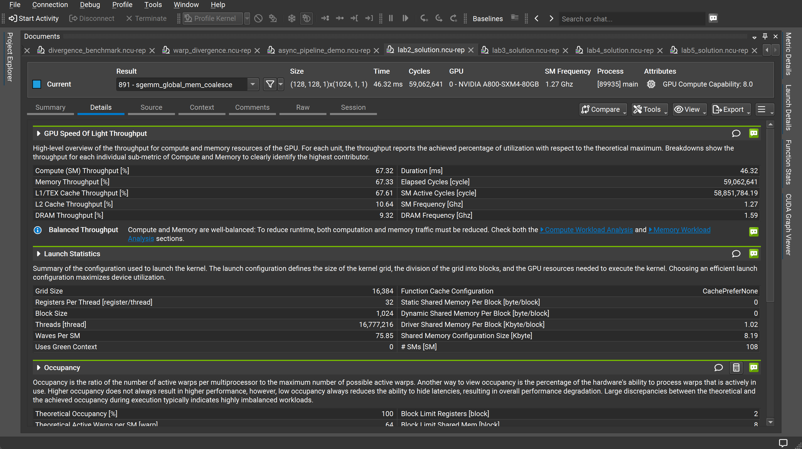
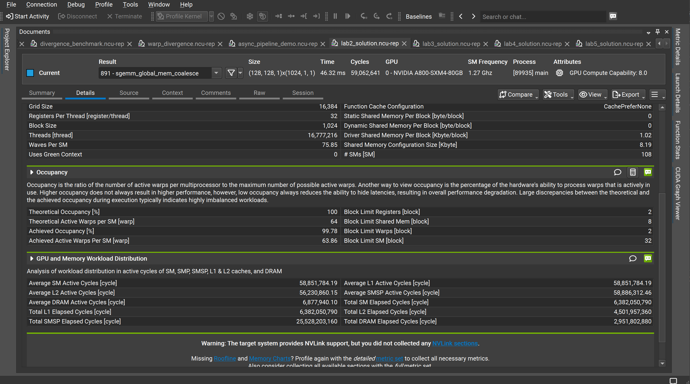

# Lab2 NCU 报告解读：全局内存合并访问（sgemm_global_mem_coalesce）

本教程以 `sgemm_global_mem_coalesce`（全局内存合并访问矩阵乘法）内核为例，对照 Lab1 的 `sgemm_naive` 数据，逐步解读 NCU 报告的三个核心视图，帮助你理解合并访问优化的实际效果。

---

## 一、Summary（摘要）视图

<!-- ✅ 在此处插入 Image 1（Summary 标签页截图） -->

[图1-NCU-Summary视图](image1.png)

**1.1 顶部元数据**

| 字段 | 含义 | 本例数值 | Lab1 对比 |
|------|------|---------|----------|
| Result | 内核编号与名称 | 891 - sgemm_global_mem_coalesce | sgemm_naive |
| Size | Grid × Block 配置 | (128, 128, 1) × (1024, 1, 1) | (32, 32, 1) × (32, 32, 1) |
| Time | 单次执行时间 | 46.32 ms | 8.58 ms（问题规模更小） |
| Cycles | 经历的时钟周期数 | 59,062,641 | 10,940,126 |
| GPU | GPU 型号 | NVIDIA A800-SXM4-80GB | 同 |
| SM Frequency | SM 实际主频 | 1.27 GHz | 1.27 GHz |

> **注意**：本实验 Grid Size 为 (128, 128, 1)，比 Lab1 的 (32, 32, 1) 大得多，对应更大的矩阵规模（约 4096×4096），因此绝对执行时间不能直接比较。

**1.2 表格各列解读**

| 列名 | 本例数值 | Lab1 数值 | 变化含义 |
|------|---------|----------|---------|
| Estimated Speedup [%] | 0.00% | 0.00%（基准行） | NCU 未发现可量化的优化空间 |
| Duration [ms] | 46.32 | 8.58 | 问题规模扩大，不可直接比较 |
| Runtime Improvement [ms] | 0.00 | 0.62–0.66 | 当前内核已无可量化提升 |
| **Compute Throughput [%]** | **67.32** | **5.89** | **↑ 10× 以上，计算单元大幅活跃** |
| **Memory Throughput [%]** | **67.33** | **93.92** | **↓ 显著降低，内存不再是单一瓶颈** |

> **关键结论**：Compute（67.32%）与 Memory（67.33%）几乎完全相等，说明优化后的内核进入了**计算与访存均衡**的状态，这是 NCU 理想的优化目标。

---

## 二、Details 视图 —— GPU Speed of Light & Launch Statistics

<!-- ✅ 在此处插入 Image 2（Details 标签页上半部分截图） -->

[图2-NCU-Details-SpeedOfLight](image2.png)

**2.1 GPU Speed of Light Throughput（光速吞吐量）**

| 指标 | 本例数值 | Lab1 数值 | 变化含义 |
|------|---------|----------|---------|
| Compute (SM) Throughput [%] | 67.32 | 5.89 | **↑ 11× ，计算单元被充分利用** |
| Memory Throughput [%] | 67.33 | 93.92 | ↓ 内存不再饱和 |
| **L1/TEX Cache Throughput [%]** | **67.61** | **99.09** | **↓ 31%，L1 不再是瓶颈** |
| L2 Cache Throughput [%] | 10.64 | 1.29 | ↑ L2 开始参与数据传输 |
| DRAM Throughput [%] | 9.32 | 0.07 | **↑ 130× ，数据真正流向 DRAM** |

**核心变化解读**：

- Lab1 中，L1/TEX = 99.09% 但 DRAM 仅 0.07%，说明数据在 L1 层"原地打转"，大量冗余重复读取。
- Lab2 中，L1/TEX 降至 67.61%，DRAM 升至 9.32%，L2 升至 10.64%——数据开始沿正确路径从 DRAM → L2 → L1 流动，冗余读取大幅减少。
- Compute 与 Memory 吞吐率均约 67%，说明 **GPU 的算力和带宽被同步利用**，这是全局内存合并访问带来的直接收益。

NCU 给出了**Balanced Throughput（均衡吞吐）**提示：

> Compute 与 Memory 已处于均衡状态。要进一步降低执行时间，需要同时减少计算量和内存流量。建议查看 **Compute Workload Analysis** 和 **Memory Workload Analysis** 两个区块。

这与 Lab1 的"High Throughput（内存占主导）"提示形成鲜明对比——内核的性质已从单纯内存瓶颈升级为计算访存共同瓶颈。

**2.2 Launch Statistics（启动统计）**

| 指标 | 本例数值 | Lab1 数值 | 说明 |
|------|---------|----------|------|
| Grid Size | 16,384 | 1,024 | Block 总数扩大 16× |
| Block Size | 1,024 | 1,024 | 每 Block 线程数相同（32×32=1024） |
| Registers Per Thread | 32 | 32 | 寄存器用量相同 |
| Threads | 16,777,216 | 1,048,576 | 总线程数扩大 16× |
| **Waves Per SM** | **75.85** | **4.74** | **每 SM 需轮转波次大幅增加** |
| # SMs | 108 | 108 | 同一 GPU |
| Static/Dynamic Shared Memory | 0 byte | 0 byte | 仍未使用共享内存 |

> **重点**：Waves Per SM 从 4.74 跃升至 75.85，意味着每个 SM 要依次处理多得多的 Block 波次，整体工作量远大于 Lab1。Shared Memory 依然为 0，表明 **合并访问解决了访问效率问题，但未引入数据复用机制**，这是 Lab3（共享内存 Tiling）的优化空间。

---

## 三、Details 视图 —— Occupancy & 工作负载分布

<!-- ✅ 在此处插入 Image 3（Details 标签页下半部分截图） -->

[图3-NCU-Details-Occupancy](image3.png)

**3.1 Occupancy（占用率）**

| 指标 | 本例数值 | Lab1 数值 | 变化 |
|------|---------|----------|------|
| Theoretical Occupancy [%] | 100 | 100 | 不变 |
| **Achieved Occupancy [%]** | **99.78** | **93.80** | **↑ 5.98%，几乎达到理论上限** |
| Theoretical Active Warps/SM | 64 | 64 | 不变 |
| Achieved Active Warps/SM | 63.86 | 60.03 | ↑ 每 SM 多跑约 3.8 个 Warp |
| Block Limit Registers | 2 | 2 | 相同（32 寄存器/线程 × 1024 线程限制） |
| Block Limit Shared Mem | 8 | 8 | 相同 |
| Block Limit Warps | 2 | 2 | 相同 |
| Block Limit SM | 32 | 32 | 相同 |

解读要点：
- 占用率从 93.80% 提升至 99.78%，已极度接近理论满占用，说明 **每个 SM 几乎所有时间都有 Warp 可以调度**，SM 资源利用率已达极值。
- Block Limit 约束与 Lab1 完全相同（寄存器仍是主要限制因素），结构配置未改变。
- 更高的占用率有助于掩盖内存延迟，这也是 Compute Throughput 提升的原因之一。

**3.2 GPU and Memory Workload Distribution（工作负载分布）**

| 指标 | 本例数值 | Lab1 数值 | 变化含义 |
|------|---------|----------|---------|
| Average SM Active Cycles | 58,851,784 | 10,367,376 | 总计算量扩大（更大矩阵） |
| Average L1 Active Cycles | 58,851,784 | 10,367,376 | L1 与 SM 同步活跃 |
| **Average L2 Active Cycles** | **56,230,860** | **3,729,874** | **↑ 15× ，L2 大量参与数据传输** |
| **Average DRAM Active Cycles** | **6,877,940** | **9,836** | **↑ 700× ，DRAM 被真正利用** |

这组数据最直观地揭示了合并访问优化的本质：

- Lab1 的 DRAM 活跃周期仅 9,836，说明几乎所有数据"卡在" L1 层反复读取，从未真正到达 DRAM。
- Lab2 的 DRAM 活跃周期达到 6,877,940（增长约 700 倍），L2 也活跃了 56M 个周期——**全局内存访问真正沿内存层级逐级流动**，这正是合并访问的核心作用：将原来的随机/重复 L1 读取，变成按 Warp 对齐的高效连续 DRAM 访问。

---

## 四、综合分析与优化方向

**与 Lab1（sgemm_naive）的核心对比**

| 维度 | Lab1（Naive） | Lab2（合并访问） | 变化 |
|------|-------------|----------------|------|
| 计算利用率 | 5.89% | 67.32% | **↑ 11×** |
| 内存利用率 | 93.92% | 67.33% | ↓ 均衡化 |
| L1/TEX 吞吐 | 99.09% | 67.61% | ↓ 不再是瓶颈 |
| DRAM 吞吐 | 0.07% | 9.32% | **↑ 130×** |
| NCU 提示类型 | High Throughput（内存主导） | **Balanced Throughput（均衡）** | 质变 |
| Achieved Occupancy | 93.80% | 99.78% | ↑ 接近满占用 |
| 共享内存使用 | 0 byte | 0 byte | 均未使用 |

**本阶段瓶颈分析**

合并访问解决了 Lab1 中 L1 层的随机访问问题，使内核进入计算访存均衡状态。但仍有两个主要瓶颈：

1. **每次 K 维循环仍有重复全局内存读取**：A 矩阵的同一行被多个线程反复从全局内存加载，B 矩阵的同一列同理。
2. **共享内存完全未使用**：没有数据复用机制，无法避免重复读取。

**下一步优化建议**：引入**共享内存 Tiling（分块矩阵乘法）**，通过将矩阵数据块预加载到共享内存，使每块数据只需从 DRAM 读取一次，再被 Block 内所有线程复用，从而显著降低 DRAM 带宽压力并提升 Arithmetic Intensity。
