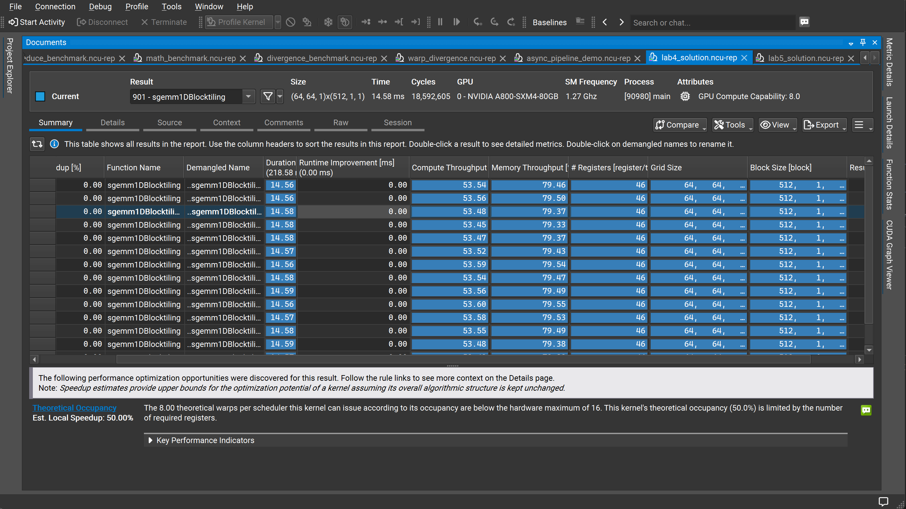
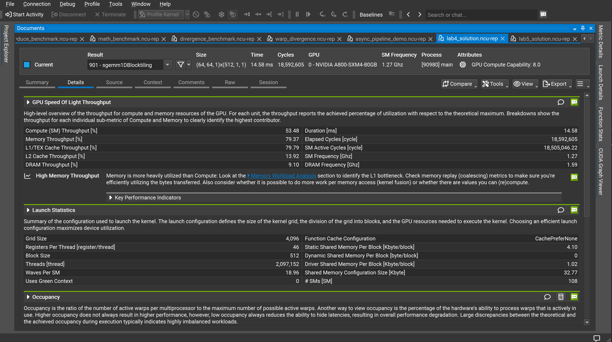
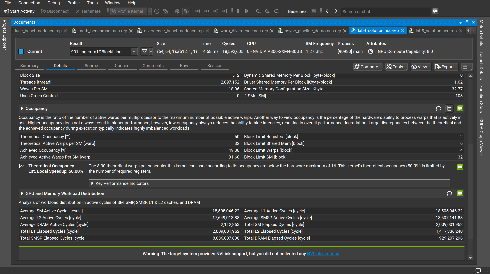

# Lab4：SGEMM 1D Block Tiling 性能分析

## 实验目标

在 Lab3 共享内存分块（Shared Memory Tiling）的基础上，进一步引入 **1D Block Tiling**——让每个线程负责计算输出矩阵 C 中同一列方向上的 TN 个元素，从而提升每次共享内存加载的计算复用率，降低访存压力。

---

<strong>1. Kernel 启动配置</strong>

本次实验 Kernel 为 `sgemm1DBlocktiling`，矩阵规模 4096×4096，使用以下启动参数：

| 参数 | 数值 |
|------|------|
| Grid Size | (64, 64, 1) = 4096 个 Block |
| Block Size | 512 threads |
| 总线程数 | 2,097,152 |
| 每 Block 静态共享内存 | 4.10 KB |
| 每 Block 动态共享内存 | 0 |
| 每线程寄存器数 | 46 |
| Waves Per SM | 18.96 |
| # SMs | 108 |

每个 Block 覆盖 C 矩阵的 64×64 子块，Block 内 512 个线程各自负责该子块中 **8 列**（TN=8）的结果，即 1D 方向上的 Thread-level Tiling。

---

<strong>2. 核心性能指标</strong>

| 指标 | 数值 |
|------|------|
| 执行时间（单次）| 14.56 ms |
| SM 频率 | 1.27 GHz |
| 总 Elapsed Cycles | 18,569,403 |
| SM Active Cycles | 18,505,161.90 |
| DRAM 频率 | 1.59 GHz |

---

<strong>3. 吞吐量分析</strong>

| 指标 | 数值 |
|------|------|
| Compute (SM) Throughput | 53.54% |
| Memory Throughput | 79.46% |
| L1/TEX Cache Throughput | 79.79% |
| L2 Cache Throughput | 13.95% |
| DRAM Throughput | 9.09% |

**关键观察**：Memory Throughput（79.46%）显著高于 Compute Throughput（53.54%），Nsight 给出 **"High Memory Throughput"** 警告，说明当前 Kernel 仍处于**访存瓶颈**状态。

进一步拆解访存层级：
- L1/TEX Throughput 高达 **79.79%**，而 DRAM Throughput 仅 **9.09%**
- 这表明大部分访存流量来自 **L1/共享内存层**，全局内存（DRAM）已被有效遮盖
- 瓶颈已从 Lab3 的"全局内存未合并访问"转移到**共享内存内部访问效率**上

---

<strong>4. Occupancy 分析</strong>

| 指标 | 数值 |
|------|------|
| Theoretical Occupancy | 50% |
| Achieved Occupancy | 49.38% |
| Theoretical Active Warps per SM | 32 |
| Achieved Active Warps per SM | 31.61 |
| Block Limit Registers（绑定约束）| **2 blocks/SM** |
| Block Limit Shared Mem | 6 blocks/SM |
| Block Limit Warps | 4 blocks/SM |
| Block Limit SM | 32 blocks/SM |

理论占用率仅 **50%**，根本原因是**寄存器用量过高**：

- 每线程使用 46 个寄存器
- A800-SXM4-80GB 每 SM 共有 65536 个寄存器，Block Size=512 threads
- 每 Block 需要 512 × 46 = 23,552 个寄存器
- 65536 ÷ 23,552 ≈ **2.78**，向下取整得 **Block Limit Registers = 2**
- 即每 SM 最多同时运行 2 个 Block = 32 个 Warp，占理论最大 64 Warp 的 50%

Nsight 给出提示：

> 8.00 theoretical warps per scheduler this kernel can issue according to its occupancy are below the hardware maximum of 16. This kernel's theoretical occupancy (50.0%) is limited by the number of required registers.

Achieved Occupancy 为 49.38%，与理论值 50% 几乎吻合，说明负载分布均匀，不存在明显的 Warp 调度浪费。

---

<strong>5. GPU 与内存工作负载分布</strong>

| 指标 | 数值 |
|------|------|
| Average SM Active Cycles | 18,505,161.90 |
| Average L1 Active Cycles | 18,505,161.90 |
| Average L2 Active Cycles | 17,614,197.09 |
| Average DRAM Active Cycles | 2,109,977.30 |
| Total SM Elapsed Cycles | 2,006,702,282 |
| Total L2 Elapsed Cycles | 1,415,477,840 |
| Total DRAM Elapsed Cycles | 928,069,120 |
| Total SMSP Elapsed Cycles | 8,026,809,128 |

SM Active Cycles 与 L1 Active Cycles 完全对齐，L2 活跃周期也极高，进一步印证计算单元在几乎全程等待 **L1/共享内存**返回数据。

---

<strong>6. 瓶颈定位：共享内存 Bank Conflict</strong>

当前 DRAM 吞吐仅 9.09%，说明全局内存带宽已不是主要矛盾；L1/TEX 高达 79.79%，说明**共享内存访问**是当前瓶颈。

在 1D Block Tiling 的内层循环中，每个线程读取共享内存 `As` 和 `Bs` 的访问模式如下：

```cpp
for (int dotIdx = 0; dotIdx < BLOCKSIZE; ++dotIdx) {
    // 每个线程读 As 的同一行，Bs 的 TN 个不同列
    float a = As[innerRowA * BLOCKSIZE + dotIdx];
    for (int resIdx = 0; resIdx < TN; ++resIdx) {
        tmp[resIdx] += a * Bs[dotIdx * BN + innerColB * TN + resIdx];
    }
}
```

多个线程同时访问 `Bs` 的相邻列，若 `BN`（block N 方向大小）是 32 的倍数，则不同线程可能落在同一 Bank，引发 **Bank Conflict**，导致共享内存访问被串行化。

---

<strong>7. 与 Lab3 对比</strong>

| 指标 | Lab3（共享内存 Tiling）| Lab4（1D Block Tiling）| 变化 |
|------|----------------------|----------------------|------|
| Compute (SM) Throughput | ~67.32% | 53.54% | ↓ 13.8% |
| Memory Throughput | ~89.76% | 79.46% | ↓ 10.3% |
| L1/TEX Throughput | ~89.99% | 79.79% | ↓ 10.2% |
| DRAM Throughput | ~15.17% | 9.09% | ↓ 6.1% |
| Theoretical Occupancy | 100% | 50% | ↓ 50% |
| Achieved Occupancy | ~99.62% | 49.38% | ↓ 50.2% |
| 执行时间（单次）| ~28.40 ms | 14.56 ms | **↓ 48.7%** |

核心结论：1D Block Tiling 通过提升每次内存加载的**计算复用率**，使执行时间缩短了近 **49%**，尽管 Occupancy 因寄存器压力减半，但更密集的计算量弥补了并行度的损失。DRAM 吞吐大幅下降，说明全局内存访问已被有效缓解，瓶颈收窄至**共享内存层**。

---

<strong>8. 下一步优化方向</strong>

<strong>8.1 消除共享内存 Bank Conflict → 2D Block Tiling</strong>

引入 **2D Thread-level Tiling**（每个线程同时计算 TM×TN 个输出元素），并对共享内存的存储布局进行转置或 Padding，使不同线程对 `Bs` 的访问分散到不同 Bank：

```cpp
// 对 Bs 转置存储，列访问变行访问，消除 Bank Conflict
Bs[dotIdx + resIdx * BLOCKSIZE] = B[...];
```

<strong>8.2 寄存器压力优化 → 减少 TN 或重构循环</strong>

当前每线程 46 个寄存器导致占用率仅 50%。可以尝试：
- 减小 TN（如从 8 降至 4），降低每线程寄存器需求
- 使用 `__launch_bounds__` 向编译器提示目标占用率，引导寄存器分配策略

<strong>8.3 向量化访存 → float4 加载</strong>

对全局内存到共享内存的搬运阶段，使用 `float4` 向量化加载，一条指令搬运 16 字节，提升内存带宽利用率并减少指令数。
