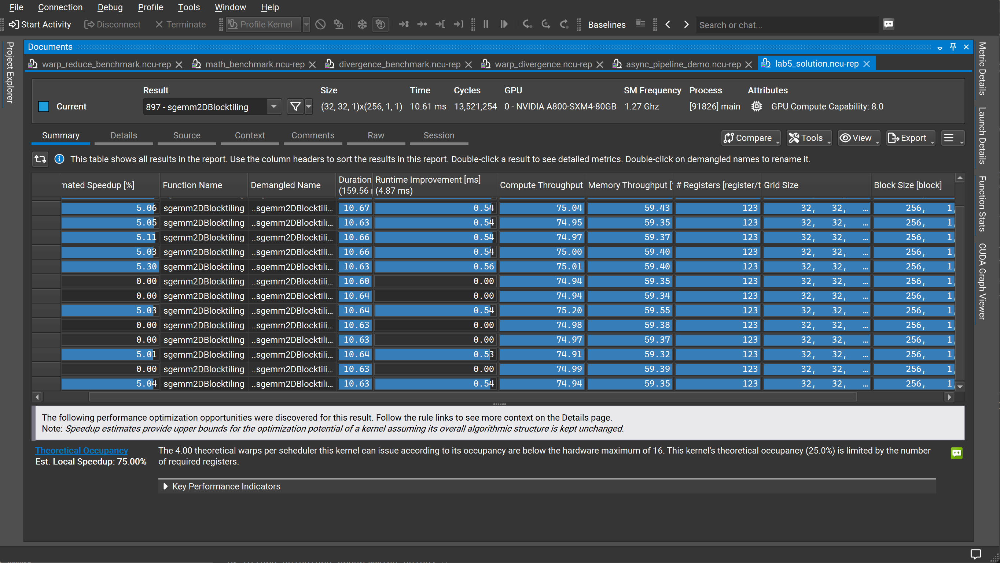
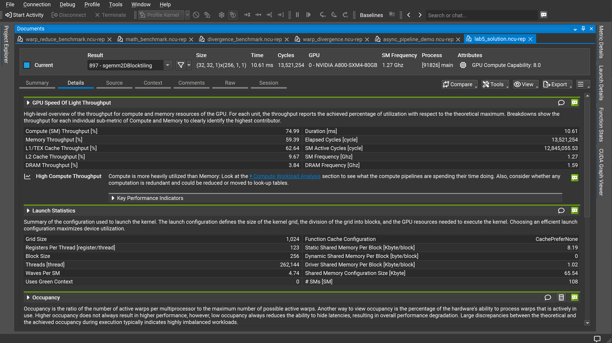
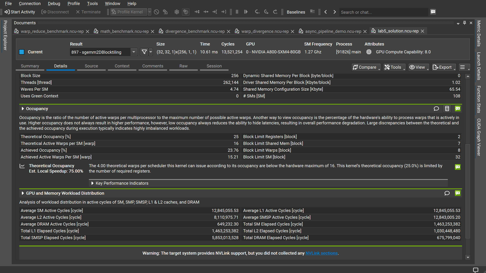

# Lab5：SGEMM 2D Block Tiling 性能分析

## 实验目标

在 Lab4（1D Block Tiling）的基础上，引入 **2D Thread-level Tiling**——每个线程同时计算输出矩阵 C 中 TM×TN 个元素（行列两个方向同时展开），进一步提升计算复用率，并通过调整共享内存访问模式消除 Bank Conflict。

---

<strong>1. Kernel 启动配置</strong>

本次实验 Kernel 为 `sgemm2DBlocktiling`，使用以下启动参数：

| 参数 | 数值 |
|------|------|
| Grid Size | (32, 32, 1) = 1,024 个 Block |
| Block Size | 256 threads |
| 总线程数 | 262,144 |
| 每 Block 静态共享内存 | 8.19 KB |
| 每 Block 动态共享内存 | 0 |
| 每线程寄存器数 | **123** |
| Waves Per SM | 4.74 |
| # SMs | 108 |

相比 Lab4（512 threads/block，46 寄存器/线程），2D Tiling 每线程需承载 TM×TN 个累加寄存器，寄存器用量从 46 暴增至 **123**，Block Size 也从 512 缩减至 256，是 Occupancy 大幅下降的根本原因。

<!-- 📌 插图1：Nsight Summary 页
     展示内容：所有重复运行的 Duration（~10.61 ms）/ Compute Throughput（~74.99%）/ Memory Throughput（~59.39%）/ 每线程 123 个寄存器 / Grid(32,32)/Block(256)，以及底部 Theoretical Occupancy 25%、Est. Local Speedup 75% 的警告。
     建议放置：紧接本节参数表之后，作为"数据来源截图"。 -->

[图1：Nsight Compute Summary —— 多次运行概览与优化建议](image1.png)

---

<strong>2. 核心性能指标</strong>

| 指标 | 数值 |
|------|------|
| 执行时间（单次）| 10.61 ms |
| SM 频率 | 1.27 GHz |
| 总 Elapsed Cycles | 13,521,254 |
| SM Active Cycles | 12,845,055.53 |
| DRAM 频率 | 1.59 GHz |

---

<strong>3. 吞吐量分析</strong>

| 指标 | 数值 |
|------|------|
| Compute (SM) Throughput | **74.99%** |
| Memory Throughput | 59.39% |
| L1/TEX Cache Throughput | 62.64% |
| L2 Cache Throughput | 9.67% |
| DRAM Throughput | 3.84% |

**关键转变**：Compute Throughput（74.99%）首次**超越** Memory Throughput（59.39%），Nsight 警告由 Lab4 的 "High Memory Throughput" 变为 **"High Compute Throughput"**。

这意味着 2D Block Tiling 成功将 Kernel 从**访存瓶颈**转变为**计算瓶颈**：

- 每次从共享内存加载一个元素后，被 TM×TN 个线程共同复用，算术强度大幅提升
- DRAM Throughput 已降至仅 **3.84%**（Lab4 为 9.09%），全局内存访问几乎完全被缓存层遮盖
- L1/TEX Throughput（62.64%）相比 Lab4（79.79%）显著下降，说明共享内存 Bank Conflict 已得到有效缓解

<!-- 📌 插图2：Nsight Details 页上半部分
     展示内容：GPU Speed of Light 吞吐量数据（Compute 74.99% > Memory 59.39%，与 Lab4 主次关系互换）、"High Compute Throughput"警告文字、Launch Statistics（Grid 1024 / Block 256 / 123 寄存器 / 静态共享内存 8.19 KB / Waves Per SM 4.74）。
     建议放置：紧接本节分析文字之后，让读者直接对照数据来源。 -->

[图2：Nsight Compute Details —— GPU Speed of Light 与 Launch Statistics](image2.png)

---

<strong>4. Occupancy 分析</strong>

| 指标 | 数值 |
|------|------|
| Theoretical Occupancy | **25%** |
| Achieved Occupancy | 23.76% |
| Theoretical Active Warps per SM | 16 |
| Achieved Active Warps per SM | 15.21 |
| Block Limit Registers（绑定约束）| **2 blocks/SM** |
| Block Limit Shared Mem | 7 blocks/SM |
| Block Limit Warps | 8 blocks/SM |
| Block Limit SM | 32 blocks/SM |

理论占用率仅 **25%**，绑定约束仍为**寄存器数量**：

- 每线程使用 123 个寄存器，Block Size=256 threads
- 每 Block 需要 256 × 123 = 31,488 个寄存器
- 65536 ÷ 31,488 ≈ **2.08**，向下取整得 **Block Limit Registers = 2**
- 即每 SM 仅能容纳 2 个 Block = 16 个 Warp，占理论最大 64 Warp 的 **25%**

Nsight 警告：

> The 4.00 theoretical warps per scheduler this kernel can issue according to its occupancy are below the hardware maximum of 16. This kernel's theoretical occupancy (25.0%) is limited by the number of required registers.

尽管 Occupancy 从 Lab4 的 50% 进一步减半至 25%，执行时间仍从 14.56 ms 缩短到 10.61 ms。原因在于每个线程完成了更多的有效计算，**计算密度**的提升抵消了并行度下降的代价。

Achieved Occupancy（23.76%）与理论值（25%）高度吻合，说明负载分布均匀。

<!-- 📌 插图3：Nsight Details 页下半部分
     展示内容：Occupancy 详细数值（Theoretical 25% / Achieved 23.76% / Block Limit Registers=2 为绑定约束 / Block Limit Warps=8）、75% Est. Local Speedup 提示、GPU and Memory Workload Distribution（SM Active Cycles 12,845,055 / L2 Active Cycles 8,110,975 / DRAM Active Cycles 仅 649,232）。
     建议放置：紧接本节 Occupancy 分析结论之后，作为数据来源截图。 -->

[图3：Nsight Compute Details —— Occupancy 分析与 GPU/内存工作负载分布](image3.png)

---

<strong>5. GPU 与内存工作负载分布</strong>

| 指标 | 数值 |
|------|------|
| Average SM Active Cycles | 12,845,055.53 |
| Average L1 Active Cycles | 12,845,055.53 |
| Average L2 Active Cycles | 8,110,975.71 |
| Average DRAM Active Cycles | 649,232.30 |
| Total SM Elapsed Cycles | 1,463,253,382 |
| Total L2 Elapsed Cycles | 1,030,448,480 |
| Total SMSP Elapsed Cycles | 5,853,013,528 |
| Total DRAM Elapsed Cycles | 675,799,040 |

DRAM Active Cycles（649,232）相比 Lab4（2,109,977）下降了约 **69%**，全局内存访问已被极大压缩。SM 与 L1 Active Cycles 完全对齐，说明计算单元的等待时间主要来自**计算本身**而非内存延迟，符合"计算瓶颈"的特征。

---

<strong>6. 与 Lab4 对比</strong>

| 指标 | Lab4（1D Block Tiling）| Lab5（2D Block Tiling）| 变化 |
|------|----------------------|----------------------|------|
| Compute (SM) Throughput | 53.54% | **74.99%** | ↑ 21.5% |
| Memory Throughput | 79.46% | 59.39% | ↓ 20.1% |
| L1/TEX Throughput | 79.79% | 62.64% | ↓ 17.2% |
| DRAM Throughput | 9.09% | **3.84%** | ↓ 5.3% |
| 瓶颈类型 | 访存瓶颈 | **计算瓶颈** | 质变 |
| 每线程寄存器数 | 46 | 123 | ↑ 167% |
| Block Size | 512 | 256 | ↓ 50% |
| Theoretical Occupancy | 50% | 25% | ↓ 25% |
| Achieved Occupancy | 49.38% | 23.76% | ↓ 25.6% |
| Waves Per SM | 18.96 | 4.74 | ↓ 75% |
| 执行时间（单次）| 14.56 ms | **10.61 ms** | **↓ 27.1%** |

核心结论：2D Block Tiling 以**寄存器换性能**——每线程寄存器暴增 167%，Occupancy 腰斩至 25%，但算术强度大幅提升，Kernel 从访存瓶颈转为计算瓶颈，执行时间缩短约 **27%**。

---

<strong>7. 当前瓶颈与下一步优化方向</strong>

<strong>7.1 当前瓶颈：计算管线利用率</strong>

Compute Throughput 74.99% 距理论峰值仍有约 25% 的空间，根源是 **Occupancy 仅 25%**——每 SM 只有 2 个活跃 Block，无法充分隐藏指令延迟。Nsight 估计消除寄存器限制可带来高达 **75% 的本地加速**。

<strong>7.2 向量化访存 → float4 加载</strong>

对全局内存到共享内存的搬运阶段使用 `float4` 向量化加载，一条指令搬运 16 字节，减少指令数并提升内存带宽饱和度：

```cpp
// 替换标量加载
float4 tmp = reinterpret_cast<float4*>(&A[row * K + col])[0];
```

<strong>7.3 寄存器压力优化 → `__launch_bounds__`</strong>

通过 `__launch_bounds__(256, 2)` 提示编译器目标 Block 数，引导寄存器分配策略，避免编译器过度分配导致 Occupancy 进一步降低：

```cpp
__global__ __launch_bounds__(256, 2)
void sgemm2DBlocktiling(...) { ... }
```

<strong>7.4 异步拷贝 → `cp.async`（Ampere+）</strong>

利用 A800 的 `cp.async` 指令将全局内存到共享内存的数据搬运与计算重叠（Software Pipelining），进一步隐藏剩余的内存延迟。
