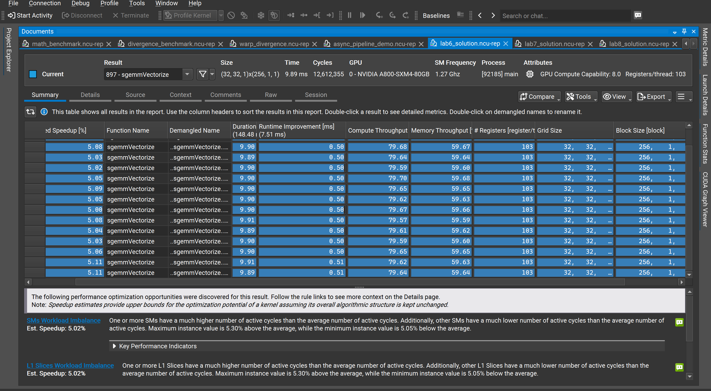
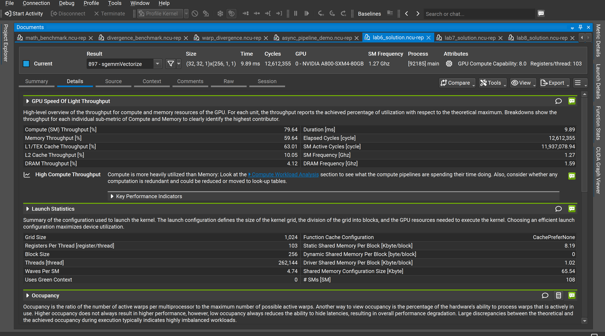
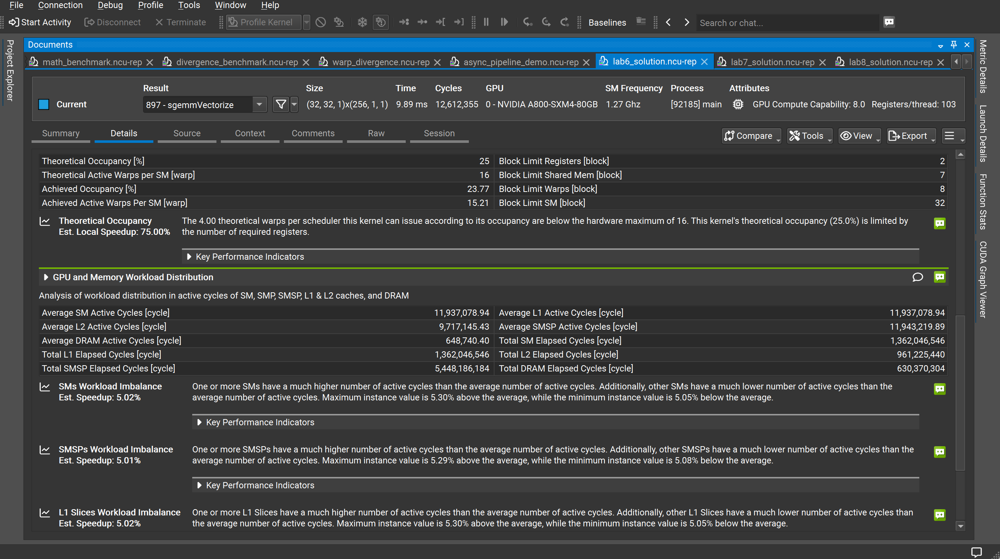

# Lab6：SGEMM 向量化访存（sgemmVectorize）性能分析

## 实验目标

在 Lab5（2D Block Tiling）的基础上，对全局内存到共享内存的搬运阶段引入 **float4 向量化加载**——每条指令一次搬运 128 位（4 个 float），减少加载指令数量并降低每线程寄存器压力，从而在不改变 Tiling 结构的前提下进一步提升执行效率。

---

<strong>1. Kernel 启动配置</strong>

本次实验 Kernel 为 `sgemmVectorize`，启动参数与 Lab5 相同：

| 参数 | 数值 |
|------|------|
| Grid Size | (32, 32, 1) = 1,024 个 Block |
| Block Size | 256 threads |
| 总线程数 | 262,144 |
| 每 Block 静态共享内存 | 8.19 KB |
| 每 Block 动态共享内存 | 0 |
| 每线程寄存器数 | **103**（Lab5 为 123，↓ 16%）|
| Waves Per SM | 4.74 |
| # SMs | 108 |

向量化加载将每线程寄存器数从 Lab5 的 123 降至 **103**，但 Block Limit Registers 仍为 2，Occupancy 依然受寄存器约束，维持在 25%。

<!-- 📌 插图1：Nsight Summary 页
     展示内容：所有重复运行的 Duration（~9.89 ms）/ Compute Throughput（~79.64%）/ Memory Throughput（~59.64%）/ 每线程 103 寄存器 / Grid(32,32)/Block(256)；底部出现两条新警告：SMs Workload Imbalance（Est. Speedup 5.02%）和 L1 Slices Workload Imbalance（Est. Speedup 5.02%），与 Lab5 的 Theoretical Occupancy 警告形成对比。
     建议放置：紧接本节参数表之后，作为整体概览截图。 -->

[图1：Nsight Compute Summary —— 多次运行概览与负载不均衡警告](image1.png)

---

<strong>2. 核心性能指标</strong>

| 指标 | 数值 |
|------|------|
| 执行时间（单次）| 9.89 ms |
| SM 频率 | 1.27 GHz |
| 总 Elapsed Cycles | 12,612,355 |
| SM Active Cycles | 11,937,078.94 |
| DRAM 频率 | 1.59 GHz |

---

<strong>3. 吞吐量分析</strong>

| 指标 | 数值 |
|------|------|
| Compute (SM) Throughput | **79.64%** |
| Memory Throughput | 59.64% |
| L1/TEX Cache Throughput | 63.01% |
| L2 Cache Throughput | 10.05% |
| DRAM Throughput | 4.12% |

Kernel 继续保持**计算瓶颈**状态（Compute > Memory），Nsight 再次给出 "High Compute Throughput" 警告。

与 Lab5 相比，Compute Throughput 从 74.99% 提升至 **79.64%**（+4.65%），说明向量化加载减少了加载指令数，让计算管线更加饱和。DRAM Throughput（4.12%）与 Lab5（3.84%）基本持平，全局内存访问仍被有效缓存。

<!-- 📌 插图2：Nsight Details 页上半部分
     展示内容：GPU Speed of Light 吞吐量数据（Compute 79.64% > Memory 59.64%）、"High Compute Throughput"警告文字、Launch Statistics（Grid 1,024 / Block 256 / 103 寄存器 / 静态共享内存 8.19 KB / Waves Per SM 4.74）。
     建议放置：紧接本节分析文字之后，让读者直接对照数据来源。 -->

[图2：Nsight Compute Details —— GPU Speed of Light 与 Launch Statistics](image2.png)

---

<strong>4. Occupancy 分析</strong>

| 指标 | 数值 |
|------|------|
| Theoretical Occupancy | 25% |
| Achieved Occupancy | 23.77% |
| Theoretical Active Warps per SM | 16 |
| Achieved Active Warps per SM | 15.21 |
| Block Limit Registers（绑定约束）| **2 blocks/SM** |
| Block Limit Shared Mem | 7 blocks/SM |
| Block Limit Warps | 8 blocks/SM |
| Block Limit SM | 32 blocks/SM |

每线程 103 个寄存器 × 256 threads = 26,368 寄存器/Block，65536 ÷ 26,368 ≈ 2.48，向下取整仍为 **Block Limit Registers = 2**，因此 Occupancy 维持在与 Lab5 相同的 **25%**。

尽管寄存器从 123 降至 103，但尚未跨越"从 2 Block/SM 到 3 Block/SM"的阈值（需降至 ≤85 寄存器/线程），Occupancy 瓶颈暂未解除。

---

<strong>5. 新瓶颈：SM 负载不均衡</strong>

<!-- 📌 插图3：Nsight Details 页下半部分
     展示内容：Occupancy 详细数值（Theoretical 25% / Achieved 23.77% / Block Limit Registers=2 / Block Limit Warps=8）、75% Est. Local Speedup 提示；GPU and Memory Workload Distribution 的各层 Cycles；以及三条新警告：SMs Workload Imbalance（5.02%）、SMSPs Workload Imbalance（5.01%）、L1 Slices Workload Imbalance（5.02%）。
     建议放置：紧接本节负载不均衡分析之前，作为数据来源截图。 -->

[图3：Nsight Compute Details —— Occupancy 分析、工作负载分布与负载不均衡警告](image3.png)

Lab6 首次出现了 Lab4/5 中没有的负载不均衡警告：

| 警告 | Est. Speedup |
|------|-------------|
| SMs Workload Imbalance | 5.02% |
| SMSPs Workload Imbalance | 5.01% |
| L1 Slices Workload Imbalance | 5.02% |

Nsight 描述：部分 SM 的 Active Cycles 远高于平均值，最大偏差为均值的 +5.30%，最小偏差为 −5.05%。

**根本原因：Wave 尾效应（Tail Effect）**

- A800 共 108 个 SM，每 SM 最多 2 个 Block（寄存器限制），每波最多消化 216 个 Block
- Grid 共 1,024 个 Block，需要 ⌈1024 ÷ 216⌉ = **5 波**（Waves Per SM = 4.74）
- 前 4 波：864 个 Block，每 SM 均获得 8 个 Block（均匀）
- 第 5 波（尾波）：仅剩 **160 个 Block**，分配到 108 个 SM 中
  - 80 个 SM 获得 2 个 Block（满载）
  - 28 个 SM 获得 0 个 Block（空转等待）
- 满载 SM 与空载 SM 并存，造成约 **5% 的执行时间浪费**

---

<strong>6. GPU 与内存工作负载分布</strong>

| 指标 | 数值 |
|------|------|
| Average SM Active Cycles | 11,937,078.94 |
| Average L1 Active Cycles | 11,937,078.94 |
| Average L2 Active Cycles | 9,717,145.43 |
| Average DRAM Active Cycles | 648,740.40 |
| Total SM Elapsed Cycles | 1,362,046,546 |
| Total L2 Elapsed Cycles | 961,225,440 |
| Total SMSP Elapsed Cycles | 5,448,186,184 |
| Total DRAM Elapsed Cycles | 630,370,304 |

DRAM Active Cycles（648,740）与 Lab5（649,232）几乎相同，说明向量化并未改变全局内存的访问总量，只是减少了指令数与寄存器占用。

---

<strong>7. 与 Lab5 对比</strong>

| 指标 | Lab5（2D Block Tiling）| Lab6（向量化访存）| 变化 |
|------|----------------------|-----------------|------|
| Compute (SM) Throughput | 74.99% | **79.64%** | ↑ 4.65% |
| Memory Throughput | 59.39% | 59.64% | ≈ 不变 |
| L1/TEX Throughput | 62.64% | 63.01% | ≈ 不变 |
| DRAM Throughput | 3.84% | 4.12% | ≈ 不变 |
| 每线程寄存器数 | 123 | **103** | ↓ 16% |
| Theoretical Occupancy | 25% | 25% | 不变 |
| Achieved Occupancy | 23.76% | 23.77% | ≈ 不变 |
| 主要警告 | Theoretical Occupancy | **SM Workload Imbalance** | 瓶颈转移 |
| 执行时间（单次）| 10.61 ms | **9.89 ms** | **↓ 6.8%** |

核心结论：向量化访存通过减少加载指令数，使 Compute Throughput 提升了约 5%，执行时间缩短 **6.8%**。占用率瓶颈未变，但原有的 Theoretical Occupancy 警告消退，新的主要优化点变为 **SM 负载不均衡**（尾波效应）。

---

<strong>8. 下一步优化方向</strong>

<strong>8.1 消除 Wave 尾效应 → 调整 Grid 为 108 的倍数</strong>

使 Grid 大小为 `(108 × 2) = 216` 的整数倍，消除不完整的尾波：

```cpp
// 当前：grid = (N/BN) × (M/BM) = 32×32 = 1024（非 216 的整数倍）
// 优化：若矩阵规模允许，调整为 1080（216×5）或使用 Persistent Kernel
dim3 grid(ceil(N / BN), ceil(M / BM));
```

<strong>8.2 继续降低寄存器压力 → 突破 Block Limit 阈值</strong>

当前 103 寄存器/线程距离"3 Block/SM"阈值（≤85）仍有差距。可尝试：

- 使用 `__launch_bounds__(256, 3)` 强制编译器将目标占用率提升至 75%
- 减小 TM 或 TN，降低累加寄存器数量

<strong>8.3 异步流水线 → `cp.async` 双缓冲（Double Buffering）</strong>

利用 A800（Ampere 架构）的 `cp.async` 指令，将当前 tile 的计算与下一个 tile 的数据预取重叠，将剩余的内存延迟彻底隐藏：

```cpp
// 使用 __pipeline_memcpy_async 将全局→共享内存的拷贝异步化
__pipeline_memcpy_async(&smemA[...], &A[...], sizeof(float4));
__pipeline_commit();
// 计算当前 tile ...
__pipeline_wait_prior(0);  // 等待下一 tile 数据就绪
```
