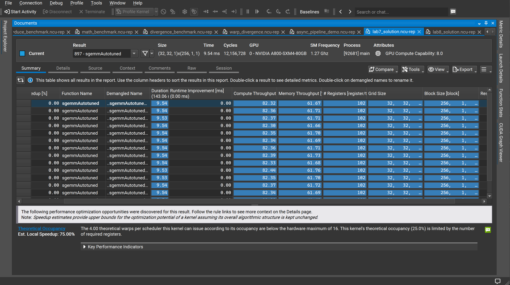
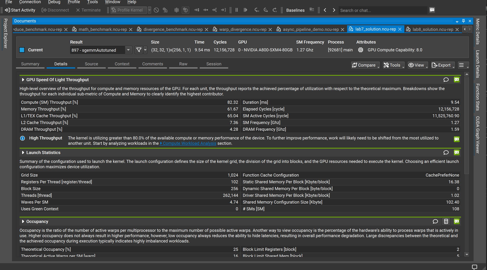
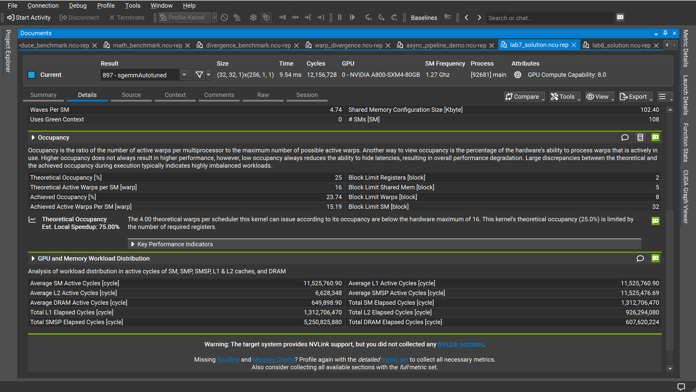

# Lab7：SGEMM 自动调优（sgemmAutotuned）性能分析

## 实验目标

在 Lab6（向量化访存）的基础上，通过**自动调优（Autotuning）**对 Tiling 参数（BK、BM、BN、TM、TN）进行搜索，找到在当前 GPU 硬件上共享内存利用率与寄存器压力最优的配置组合，突破之前版本的性能瓶颈。

---

<strong>1. Kernel 启动配置</strong>

本次实验 Kernel 为 `sgemmAutotuned`，核心变化是**共享内存用量翻倍**：

| 参数 | Lab6（向量化）| Lab7（自动调优）| 变化 |
|------|-------------|--------------|------|
| Grid Size | (32, 32, 1) | (32, 32, 1) | 不变 |
| Block Size | 256 | 256 | 不变 |
| 总线程数 | 262,144 | 262,144 | 不变 |
| 每 Block 静态共享内存 | 8.19 KB | **16.38 KB** | ↑ 2× |
| 每线程寄存器数 | 103 | **102** | ↓ 1 |
| Waves Per SM | 4.74 | 4.74 | 不变 |
| # SMs | 108 | 108 | 不变 |
| 共享内存配置总量/SM | 65.54 KB | **102.40 KB** | ↑ 56% |

自动调优将 BK（K 方向分块大小）翻倍，使每次 tile 迭代能加载更多数据到共享内存，显著提升每次访存的**计算复用率**。

<!-- 📌 插图1：Nsight Summary 页
     展示内容：所有重复运行的 Duration（~9.54 ms）/ Compute Throughput（~82.32%）/ Memory Throughput（~61.67%）/ 每线程 102 寄存器 / Grid(32,32)/Block(256)；
     重点对比 Lab6：Estimated Speedup 一列全部为 0.00%（Lab6 为 5.02%），说明 SM 负载不均衡警告已消失；底部仅剩 Theoretical Occupancy 75% Est. Local Speedup 警告。
     建议放置：紧接本节参数表之后。 -->

[图1：Nsight Compute Summary —— 多次运行概览，SM 负载不均衡警告消失](image1.png)

---

<strong>2. 核心性能指标</strong>

| 指标 | 数值 |
|------|------|
| 执行时间（单次）| 9.54 ms |
| SM 频率 | 1.27 GHz |
| 总 Elapsed Cycles | 12,156,728 |
| SM Active Cycles | 11,525,760.90 |
| DRAM 频率 | 1.59 GHz |

---

<strong>3. 吞吐量分析</strong>

| 指标 | 数值 |
|------|------|
| Compute (SM) Throughput | **82.32%** |
| Memory Throughput | 61.67% |
| L1/TEX Cache Throughput | 65.04% |
| L2 Cache Throughput | 7.36% |
| DRAM Throughput | 4.28% |

**里程碑：Compute Throughput 首次突破 80%。**

Nsight 的警告由 Lab6 的 "High Compute Throughput" 升级为更严格的 **"High Throughput"**：

> The kernel is utilizing greater than 80.0% of the available compute or memory performance of the device. To further improve performance, work will likely need to be shifted from the most utilized to another unit.

这意味着 Kernel 已逼近 A800 的硬件峰值，单纯在当前算法结构内优化空间已十分有限，后续提升需要从计算管线结构本身入手。

与 Lab6 对比：
- Compute 从 79.64% 提升至 **82.32%**（+2.68%）
- DRAM 从 4.12% 略升至 4.28%，全局内存仍被高效缓存

<!-- 📌 插图2：Nsight Details 页上半部分
     展示内容：GPU Speed of Light 吞吐量数据（Compute 82.32% > Memory 61.67%）、新出现的蓝色 "High Throughput" >80% 警告（与 Lab6 的橙色 "High Compute Throughput" 形成对比）、Launch Statistics（静态共享内存 16.38 KB/block —— 是 Lab6 的 2 倍、Shared Memory Config 102.40 KB、102 寄存器）、Occupancy 上半（Theoretical 25%，Block Limit Registers=2，Block Limit Shared Mem=5）。
     建议放置：紧接本节分析文字之后。 -->

[图2：Nsight Compute Details —— GPU Speed of Light 与 Launch Statistics](image2.png)

---

<strong>4. Occupancy 分析</strong>

| 指标 | 数值 |
|------|------|
| Theoretical Occupancy | 25% |
| Achieved Occupancy | 23.74% |
| Theoretical Active Warps per SM | 16 |
| Achieved Active Warps per SM | 15.21 |
| Block Limit Registers（绑定约束）| **2 blocks/SM** |
| Block Limit Shared Mem | **5 blocks/SM**（Lab6 为 7）|
| Block Limit Warps | 8 blocks/SM |
| Block Limit SM | 32 blocks/SM |

共享内存从 8.19 KB 翻倍至 16.38 KB 后，Block Limit Shared Mem 从 7 降至 **5**：

- A800 每 SM 共享内存为 164 KB（含驱动保留）
- 可用共享内存 ≈ 102.40 KB（配置值），16.38 KB × 5 = 81.9 KB ≈ 可用量上限
- 但寄存器约束（Block Limit Registers = 2）仍更严格，依旧是**绑定约束**

因此 Occupancy 维持在 25%，自动调优的提升来自**提高每个 Block 内的计算密度**，而非增加并发 Block 数。

---

<strong>5. SM 负载不均衡问题的消除</strong>

Lab6 中 SM Workload Imbalance 估计可带来 5.02% 加速，而 Lab7 中该警告**完全消失**（Summary 页所有行的 Estimated Speedup 均为 0.00%）。

Waves Per SM 仍为 4.74（Grid 仍为 1024 blocks，每 SM 仍限 2 blocks），理论上尾波仍然存在。不均衡消失的原因在于：共享内存翻倍后每个 Block 的**计算量增加**，尾波中负载较少的 SM 处理 4 个 Block 所用时间与满载 SM 处理 5 个 Block 的时间差缩小，不均衡程度降至 Nsight 警告阈值以下。

<!-- 📌 插图3：Nsight Details 页下半部分
     展示内容：Launch Statistics 下半（Block Size 256 / Waves Per SM 4.74 / 共享内存 16.38 KB）、Occupancy 完整数值（Theoretical 25% / Achieved 23.74% / Block Limit Registers=2 / Block Limit Shared Mem=5 / Block Limit Warps=8）、75% Est. Local Speedup 提示、GPU and Memory Workload Distribution（SM Active 11,525,760 / L2 Active 6,628,348 / DRAM Active 仅 649,898）；画面中还有一个 L2 Cache Throughput 指标弹窗（7.36%）。
     建议放置：紧接本节分析文字之后，作为 Occupancy + Workload 数据来源截图。 -->

[图3：Nsight Compute Details —— Occupancy 分析与 GPU/内存工作负载分布](image3.png)

---

<strong>6. GPU 与内存工作负载分布</strong>

| 指标 | 数值 |
|------|------|
| Average SM Active Cycles | 11,525,760.90 |
| Average L1 Active Cycles | 11,525,760.90 |
| Average L2 Active Cycles | 6,628,348 |
| Average DRAM Active Cycles | 649,898.90 |
| Total SM Elapsed Cycles | 1,312,706,470 |
| Total L2 Elapsed Cycles | 926,294,080 |
| Total SMSP Elapsed Cycles | 5,250,825,880 |
| Total DRAM Elapsed Cycles | 607,620,224 |

Average L2 Active Cycles（6,628,348）比 Lab6（9,717,145）下降约 **32%**，说明更大的共享内存 tile 进一步减少了 L2 的访问频率，数据复用率更高。DRAM Active Cycles 与 Lab6 几乎相同，全局内存瓶颈已被彻底消除。

---

<strong>7. 与 Lab6 对比</strong>

| 指标 | Lab6（向量化）| Lab7（自动调优）| 变化 |
|------|-------------|--------------|------|
| Compute (SM) Throughput | 79.64% | **82.32%** | ↑ 2.68% |
| Memory Throughput | 59.64% | 61.67% | ↑ 2.0% |
| L1/TEX Throughput | 63.01% | 65.04% | ↑ 2.0% |
| L2 Throughput | 10.05% | **7.36%** | ↓ 2.7% |
| DRAM Throughput | 4.12% | 4.28% | ≈ 不变 |
| 静态共享内存/Block | 8.19 KB | **16.38 KB** | ↑ 2× |
| 每线程寄存器数 | 103 | 102 | ↓ 1 |
| Theoretical Occupancy | 25% | 25% | 不变 |
| Achieved Occupancy | 23.77% | 23.74% | ≈ 不变 |
| Block Limit Shared Mem | 7 | 5 | ↓ 2 |
| SM 负载不均衡警告 | **有（5.02%）** | **无（0.00%）** | 消除 |
| Nsight 性能警告等级 | High Compute Throughput | **High Throughput (>80%)** | 升级 |
| 执行时间（单次）| 9.89 ms | **9.54 ms** | **↓ 3.5%** |

核心结论：自动调优通过将共享内存 tile 翻倍，消除了 SM 负载不均衡，将 Compute Throughput 推过 **80% 大关**，执行时间再缩短 3.5%。当前版本已接近 A800 的硬件峰值，寄存器约束（Occupancy 25%）是唯一剩余的结构性瓶颈。

---

<strong>8. 当前瓶颈与下一步优化方向</strong>

<strong>8.1 当前瓶颈：寄存器限制的低 Occupancy</strong>

Nsight 提示 Theoretical Occupancy 仍仅 25%，Est. Local Speedup 达 **75%**——这是当前最大的单项潜在收益。根本原因是每线程 102 个寄存器，使每 SM 最多只能运行 2 个 Block。

<strong>8.2 异步流水线 → `cp.async` 双缓冲</strong>

利用 Ampere 架构的 `cp.async` 指令实现 Software Pipelining：在计算当前 tile 的同时，异步预取下一个 tile 到备用共享内存缓冲区，将剩余的内存延迟与计算完全重叠：

```cpp
// 双缓冲：ping-pong 两组共享内存
__shared__ float smemA[2][BK][BM];
__shared__ float smemB[2][BK][BN];

// 预取第一个 tile
__pipeline_memcpy_async(&smemA[0][...], &A[...], sizeof(float4));
__pipeline_commit();

for (int tile = 0; tile < K / BK; ++tile) {
    __pipeline_wait_prior(0);      // 等待当前 tile 就绪
    __syncthreads();
    // 异步预取下一个 tile 到另一缓冲
    __pipeline_memcpy_async(&smemA[(tile+1)%2][...], ...);
    __pipeline_commit();
    // 计算当前 tile ...
    __syncthreads();
}
```

<strong>8.3 寄存器压力 → `__launch_bounds__` 或减小 TM/TN</strong>

若能将每线程寄存器降至 ≤85，Block Limit Registers 将从 2 提升至 3，Occupancy 从 25% 跃升至 ~37.5%，理论上可再带来约 50% 的延迟隐藏改善。
