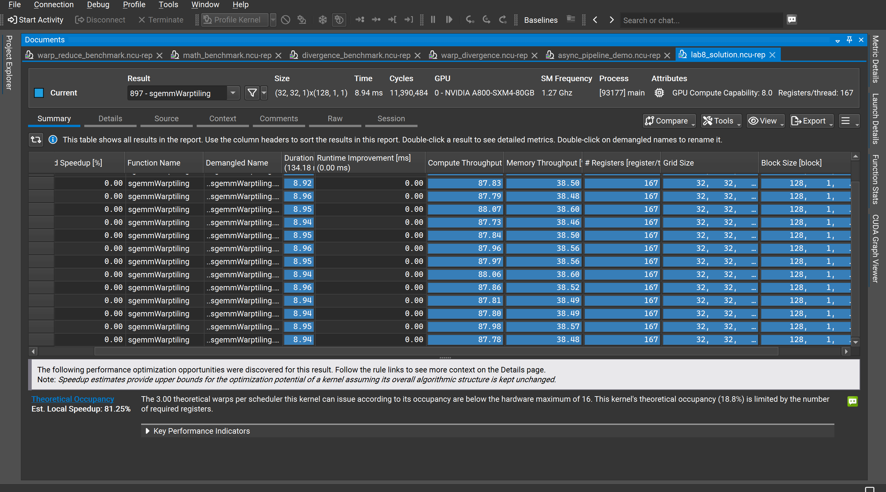
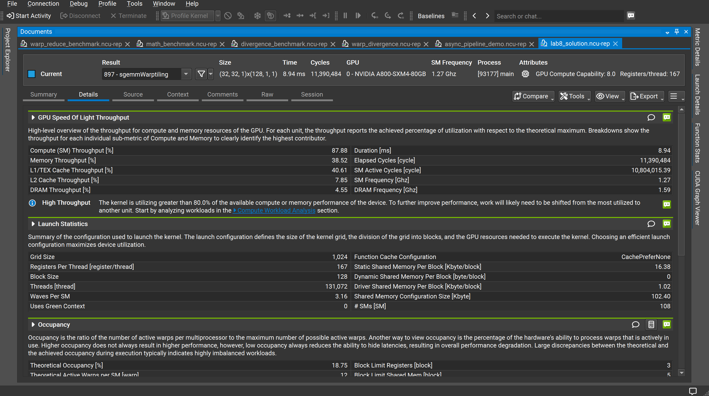
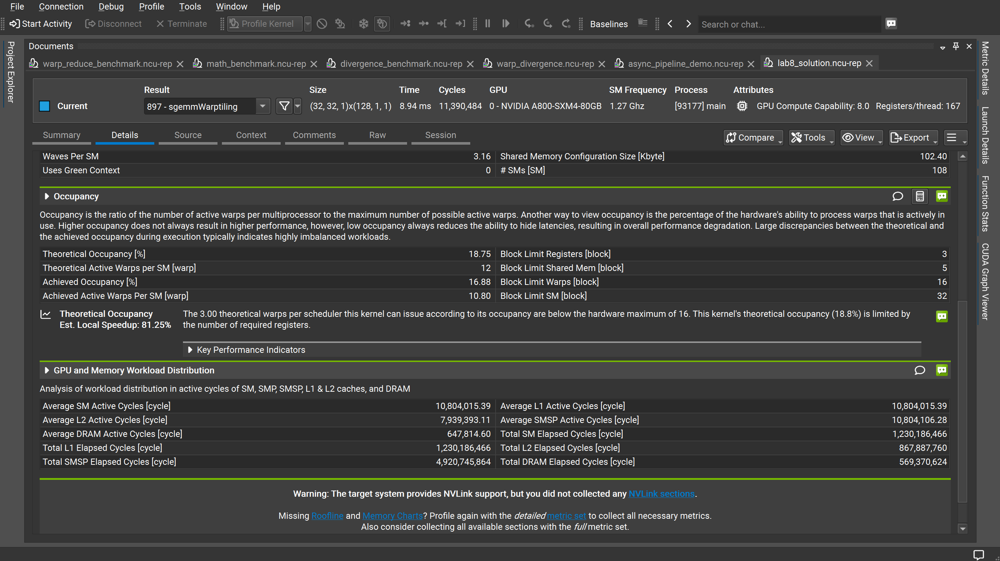

# Lab8：SGEMM Warp Tiling 性能分析

## 实验目标

在 Lab7（自动调优 2D Block Tiling）的基础上，引入 **Warp-level Tiling**——将 Block 内的线程按 Warp 划分子任务，每个 Warp（32 个线程）独立负责输出矩阵中一个更小的子块，使得同一 Warp 内的线程共享寄存器中的数据，减少共享内存访问次数，进一步提升计算密度。

---

<strong>1. Kernel 启动配置</strong>

本次实验 Kernel 为 `sgemmWarptiling`，Block Size 从 256 减半至 128，但每线程寄存器数大幅增加：

| 参数 | Lab7（自动调优）| Lab8（Warp Tiling）| 变化 |
|------|--------------|------------------|------|
| Grid Size | (32, 32, 1) | (32, 32, 1) | 不变 |
| Block Size | 256 | **128** | ↓ 50% |
| 总线程数 | 262,144 | 131,072 | ↓ 50% |
| 每 Block 静态共享内存 | 16.38 KB | 16.38 KB | 不变 |
| 每线程寄存器数 | 102 | **167** | ↑ 64% |
| Waves Per SM | 4.74 | **3.16** | ↓ 33% |
| 每 Block Warp 数 | 8 warps | **4 warps** | ↓ 50% |
| # SMs | 108 | 108 | 不变 |

Block Size 减半使每 Block 总寄存器需求从 26,112（102×256）降至 21,376（167×128），即便每线程寄存器大幅增加，每 Block 的寄存器占用反而**减少了 18%**，这是突破寄存器限制的关键。

<!-- 📌 插图1：Nsight Summary 页
     展示内容：所有重复运行的 Duration（~8.94 ms）/ Compute Throughput（~87.88%）/ Memory Throughput（~38.52%，与前几版相比大幅下降）/ 每线程 167 寄存器 / Block Size 128（Header 处显示）；
     底部警告变为 Theoretical Occupancy（18.8%），Est. Local Speedup 81.25%；所有行 Estimated Speedup 均为 0.00%。
     建议放置：紧接本节参数对比表之后。 -->

[图1：Nsight Compute Summary —— 多次运行概览，Compute Throughput 突破 87%](image1.png)

---

<strong>2. 核心性能指标</strong>

| 指标 | 数值 |
|------|------|
| 执行时间（单次）| 8.94 ms |
| SM 频率 | 1.27 GHz |
| 总 Elapsed Cycles | 11,390,484 |
| SM Active Cycles | 10,804,015.39 |
| DRAM 频率 | 1.59 GHz |

---

<strong>3. 吞吐量分析</strong>

| 指标 | 数值 |
|------|------|
| Compute (SM) Throughput | **87.88%** |
| Memory Throughput | **38.52%** |
| L1/TEX Cache Throughput | 40.61% |
| L2 Cache Throughput | 7.85% |
| DRAM Throughput | 4.55% |

两个最显著的变化：

**① Compute Throughput 达到历史最高 87.88%**，仍为 "High Throughput (>80%)" 状态，距离硬件峰值仅剩约 12%。

**② Memory Throughput 骤降至 38.52%**（Lab7 为 61.67%，**↓ 23 个百分点**）。L1/TEX 从 65.04% 降至 40.61%，降幅同样显著。这表明 Warp Tiling 通过让 Warp 内线程在**寄存器层**复用数据，大幅减少了对共享内存的访问次数，共享内存不再是主要压力源。

Compute/Memory 吞吐量之比（87.88% / 38.52% ≈ **2.28**）是历次实验中最高，说明每单位内存访问对应的计算量是所有版本中最多的。

<!-- 📌 插图2：Nsight Details 页上半部分
     展示内容：GPU Speed of Light 数据（Compute 87.88% 创历史新高 / Memory 38.52% 大幅下降 / L1/TEX 40.61%）、"High Throughput (>80%)" 蓝色警告、Launch Statistics（Block Size 128 / 167 寄存器 / 共享内存 16.38 KB / Waves Per SM 3.16）、Occupancy 上半（Theoretical 18.75% / Block Limit Registers=3）。
     建议放置：紧接本节分析文字之后。 -->

[图2：Nsight Compute Details —— GPU Speed of Light 与 Launch Statistics](image2.png)

---

<strong>4. Occupancy 分析</strong>

| 指标 | 数值 |
|------|------|
| Theoretical Occupancy | **18.75%** |
| Achieved Occupancy | 16.88% |
| Theoretical Active Warps per SM | 12 |
| Achieved Active Warps per SM | 10.80 |
| Block Limit Registers（绑定约束）| **3 blocks/SM** |
| Block Limit Shared Mem | 5 blocks/SM |
| Block Limit Warps | 16 blocks/SM |
| Block Limit SM | 32 blocks/SM |

<strong>Block Limit Registers 从 2 提升至 3</strong>，是本实验最关键的结构性变化：

- 每 Block 寄存器需求：167 × 128 = **21,376**
- 65,536 ÷ 21,376 ≈ **3.06**，向下取整得 Block Limit Registers = **3**
- 每 SM 可同时运行 3 个 Block = 3 × 4 warps = **12 active warps**
- 理论占用率：12 / 64 = **18.75%**

看似 Occupancy 从 Lab7 的 25% 反而降低至 18.75%，实为**以更少 Warp 承载更多计算**的权衡：
- Lab7：每 SM 2 Block × 8 warps = 16 warps，每 warp 计算量较小
- Lab8：每 SM 3 Block × 4 warps = 12 warps，每 warp 独立完成更大子块的计算

Warp 数虽减少，但每个 Warp 通过寄存器内的 TM×TN 累加阵列完成更多乘加运算，**算术强度提升抵消了并行度下降**，执行时间依然缩短。

Nsight 指出 Theoretical Occupancy 的潜在加速高达 **81.25%**，但这一数字仅为上界估计，实际中寄存器限制与指令级并行的权衡使之难以完全兑现。

<!-- 📌 插图3：Nsight Details 页下半部分
     展示内容：Launch Statistics 下半（Block 128 / Waves Per SM 3.16 / 共享内存配置 102.40 KB）、Occupancy 完整数值（Theoretical 18.75% / Achieved 16.88% / Block Limit Registers=3 / Block Limit Warps=16）、81.25% Est. Local Speedup 提示、GPU and Memory Workload Distribution（SM Active 10,804,015 / L2 Active 7,939,393 / DRAM Active 仅 647,814）。
     建议放置：紧接本节 Occupancy 分析结论之后。 -->

[图3：Nsight Compute Details —— Occupancy 分析与 GPU/内存工作负载分布](image3.png)

---

<strong>5. GPU 与内存工作负载分布</strong>

| 指标 | 数值 |
|------|------|
| Average SM Active Cycles | 10,804,015.39 |
| Average L1 Active Cycles | 10,804,015.39 |
| Average L2 Active Cycles | 7,939,393.11 |
| Average DRAM Active Cycles | 647,814.60 |
| Total SM Elapsed Cycles | 1,230,186,466 |
| Total L2 Elapsed Cycles | 867,887,760 |
| Total SMSP Elapsed Cycles | 4,920,745,864 |
| Total DRAM Elapsed Cycles | 569,370,624 |

DRAM Active Cycles（647,814）与前几版基本持平，全局内存访问总量不变，说明优化均发生在**计算侧**，而非进一步减少全局内存访问。

---

<strong>6. 与 Lab7 对比</strong>

| 指标 | Lab7（自动调优）| Lab8（Warp Tiling）| 变化 |
|------|--------------|------------------|------|
| Compute (SM) Throughput | 82.32% | **87.88%** | ↑ 5.56% |
| Memory Throughput | 61.67% | **38.52%** | ↓ 23.2% |
| L1/TEX Throughput | 65.04% | **40.61%** | ↓ 24.4% |
| L2 Throughput | 7.36% | 7.85% | ≈ 不变 |
| DRAM Throughput | 4.28% | 4.55% | ≈ 不变 |
| 每线程寄存器数 | 102 | 167 | ↑ 64% |
| Block Size | 256 | **128** | ↓ 50% |
| Block Limit Registers | 2 | **3** | ↑ 1 |
| Theoretical Occupancy | 25% | 18.75% | ↓ 6.25% |
| Achieved Occupancy | 23.74% | 16.88% | ↓ 6.86% |
| Waves Per SM | 4.74 | **3.16** | ↓ 33% |
| 执行时间（单次）| 9.54 ms | **8.94 ms** | **↓ 6.3%** |

核心结论：Warp Tiling 通过将 Block Size 减半并大幅增加每线程寄存器（102→167），使 Block Limit Registers 从 2 提升至 3，打破了连续多版实验中"每 SM 最多 2 个 Block"的瓶颈。Memory Throughput 下降 23 个百分点，说明 Warp 内的寄存器级数据复用已极大减少了共享内存压力，执行时间再缩短 **6.3%**。

---

<strong>7. 当前瓶颈与下一步优化方向</strong>

<strong>7.1 当前瓶颈：Occupancy 降至历史最低（18.75%）</strong>

每 SM 仅 12 个 active warps，隐藏内存/指令延迟的能力继续下降。Nsight 的 81.25% Est. Local Speedup 是历次实验中最高的警告值，但这是硬件结构上的根本限制，需要在算法层面引入流水线才能绕过。

<strong>7.2 异步流水线 → `cp.async` 双缓冲</strong>

在 Warp Tiling 的基础上引入双缓冲，让每个 Warp 在计算当前 tile 时，异步预取下一个 tile 数据，彻底隐藏共享内存填充延迟：

```cpp
// 双缓冲 ping-pong
__shared__ float smemA[2][BK * BM];
__shared__ float smemB[2][BK * BN];

int buf = 0;
// 预取第一个 tile（异步）
__pipeline_memcpy_async(&smemA[buf][...], &A[...], sizeof(float4));
__pipeline_commit();

for (int tile = 0; tile < K / BK; ++tile) {
    int next = 1 - buf;
    // 异步预取下一 tile
    __pipeline_memcpy_async(&smemA[next][...], &A[next_tile_offset], sizeof(float4));
    __pipeline_commit();
    __pipeline_wait_prior(1);   // 等待当前 tile 就绪
    __syncthreads();
    // 用 smemA[buf] / smemB[buf] 计算当前 tile
    warp_level_mma(...);
    buf = next;
    __syncthreads();
}
```

<strong>7.3 Tensor Core → `wmma` / `mma` PTX 指令</strong>

A800 支持 Tensor Core（Ampere 架构 tf32/fp16 MMA），每个 Tensor Core 时钟周期可完成 16×16×16 矩阵乘加，吞吐量是普通 CUDA Core 的 8× 以上。切换至 Tensor Core 可在不改变内存访问结构的情况下，将 Compute Throughput 的利用率大幅提升。
