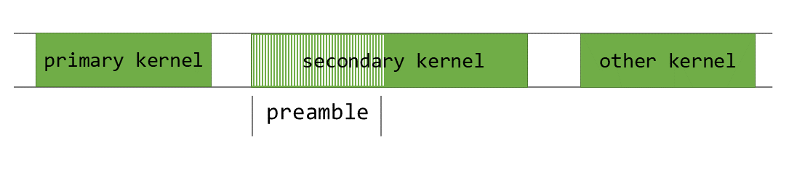
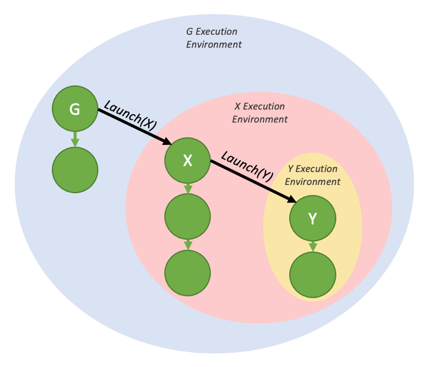
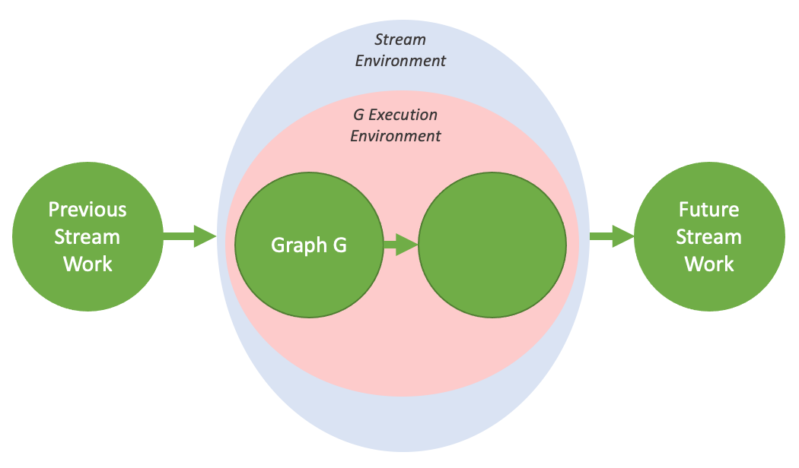
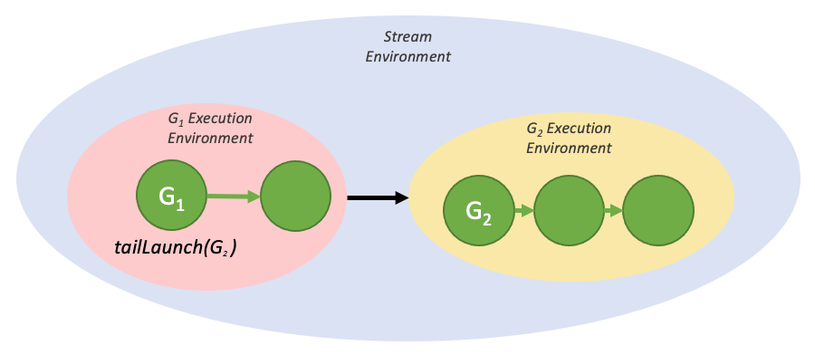
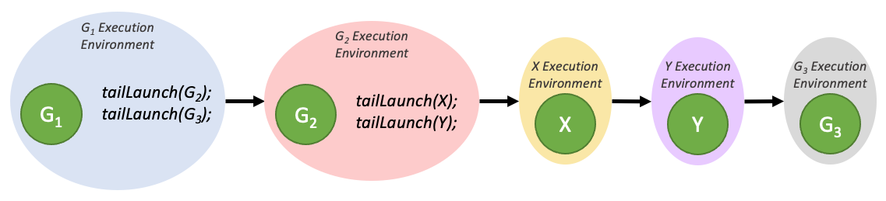
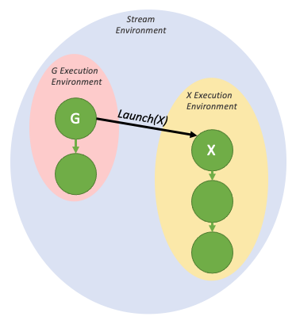
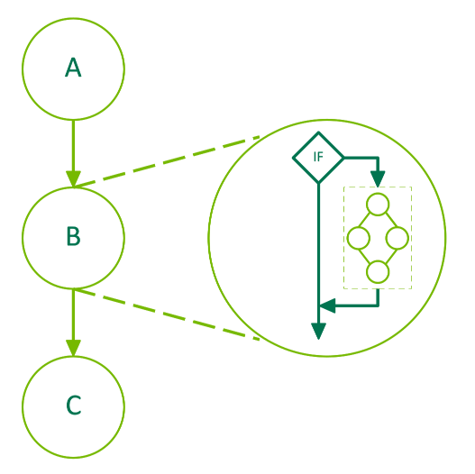
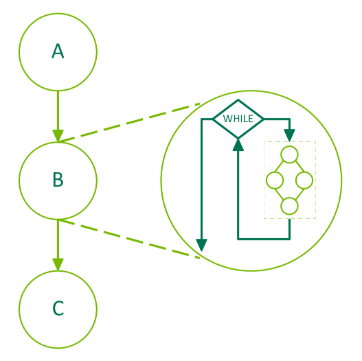

# 第15章 CUDA Graphs高级特性

<strong>硬件要求</strong>：CC 7.0+（基础Graphs功能），CC 9.0+（Device Graph Launch、Programmatic Dependent Launch），CC 8.0+（Conditional Graph Nodes）

> "CUDA Graphs present a new model for work submission in CUDA. A graph is a series of operations, such as kernel launches, connected by dependencies, which is defined separately from its execution."
> -- CUDA C++ Programming Guide 13.0

---

## 15.1 引言与回顾

在前面的课程中，我们已经学习了CUDA Graphs的基本概念。CUDA Graphs将GPU工作的提交方式从传统的流式（Stream）模型提升为图式（Graph）模型。在流模型中，每次kernel启动都需要主机端驱动程序执行一系列准备操作；而在图模型中，图可以定义一次，然后重复启动多次，大大降低了主机端CPU的启动开销。

CUDA Graphs的工作流程分为三个独立的阶段：

1. <strong>定义阶段（Definition）</strong>：程序创建图中操作的描述以及它们之间的依赖关系。
2. <strong>实例化阶段（Instantiation）</strong>：对图模板进行快照、验证，并执行大部分设置和初始化工作，以最小化启动时的开销。结果称为<strong>可执行图（executable graph）</strong>。
3. <strong>执行阶段（Execution）</strong>：可执行图可以像其他CUDA工作一样被启动到流中，可以重复启动任意多次而不需要重复实例化。

在基础课程中，你已经掌握了图的创建（通过Graph API或Stream Capture）、节点类型（kernel、memcpy、memset、event等）以及基本的图启动。本章将深入探讨CUDA Graphs的高级特性，这些特性使得在GPU端实现动态控制流和执行复杂工作流成为可能。

### 15.1.1 本章学习目标

- 理解编程式依赖启动（Programmatic Dependent Launch，PDL）如何实现前后kernel的并发执行
- 掌握设备端图启动（Device Graph Launch），在GPU端进行动态控制流
- 掌握条件图节点（IF / WHILE / SWITCH），在图中表达条件和循环逻辑
- 了解Graph Memory Nodes的内存重用与优化机制
- 理解图的更新机制 `cudaGraphExecUpdate`
- 理解这些高级特性如何减少CPU-GPU往返并提高效率

---

## 15.2 Stream Capture vs 显式Graph API

CUDA提供了两种主要的图创建方式，让我们先简要回顾它们的区别和使用场景。

### 15.2.1 显式Graph API方法

通过显式API创建图，你需要逐步构建图中的每个节点和每条依赖边：

```cuda
cudaGraph_t graph;
cudaGraphCreate(&graph, 0);

// 添加节点A
cudaGraphAddKernelNode(&nodeA, graph, NULL, 0, &kernelNodeParams);
// 添加节点B，依赖节点A
cudaGraphAddKernelNode(&nodeB, graph, &nodeA, 1, &kernelNodeParams);
// 添加节点C，依赖节点A
cudaGraphAddKernelNode(&nodeC, graph, &nodeA, 1, &kernelNodeParams);
// 添加节点D，依赖节点B和C
cudaGraphNode_t deps[2] = {nodeB, nodeC};
cudaGraphAddKernelNode(&nodeD, graph, deps, 2, &kernelNodeParams);
```

这种方法的优势在于你可以精确控制图的结构和依赖关系，适合需要高度定制化和可重复使用的场景。

### 15.2.2 Stream Capture方法

Stream Capture方法允许你将现有的流式CUDA代码"捕获"到一个图中：

```cuda
cudaStreamBeginCapture(stream, cudaStreamCaptureModeGlobal);

// 正常的CUDA操作被捕获到图中
kernelA<<<grid, block, 0, stream>>>();
cudaMemcpyAsync(dst, src, size, cudaMemcpyDeviceToDevice, stream);
kernelB<<<grid, block, 0, stream>>>();

cudaStreamEndCapture(stream, &graph);
```

Stream Capture的优势在于它允许你重用已有的流式代码，将它们的执行逻辑"记录"下来形成图。这对于快速迁移现有代码到Graphs模型非常有用。

### 15.2.3 两种方式的对比

| 特性 | 显式API | Stream Capture |
|------|---------|---------------|
| 控制精度 | 精确控制每个节点和边 | 由流中的操作顺序决定 |
| 代码侵入性 | 需要重构代码以使用Graph API | 对现有代码侵入性小 |
| 动态性 | 适合静态工作流 | 可以捕获动态行为 |
| 学习成本 | 较高 | 较低（对已有流式代码而言） |
| 图更新支持 | 完整支持 | 支持 |

在实际开发中，两种方式常结合使用：用Stream Capture捕获主体结构，再通过显式API对图的局部细节进行调整。

### 15.2.4 Edge Data（CUDA 12.3新增）

CUDA 12.3引入了Edge Data概念，允许在图的依赖边上附加额外信息。一条边上的数据由三部分组成：

- <strong>出端口（outgoing port）</strong>：指定依赖边何时被触发
- <strong>入端口（incoming port）</strong>：指定节点的哪一部分依赖该边
- <strong>类型（type）</strong>：修改端点间的关系

目前，非默认的依赖类型只有一种：<strong>`cudaGraphDependencyTypeProgrammatic`</strong>，它启用了编程式依赖启动机制。这引出了我们接下来要讨论的PDL。

---

## 15.3 编程式依赖启动（Programmatic Dependent Launch — PDL）

> "The Programmatic Dependent Launch mechanism allows for a dependent secondary kernel to launch before the primary kernel it depends on in the same CUDA stream has finished executing."
> -- CUDA C++ Programming Guide 13.0

PDL是Compute Capability 9.0+（Hopper H100及更新架构）引入的一项重要特性。它打破了传统流模型中"前一个kernel完全执行完毕才能启动后一个kernel"的限制。

### 15.3.1 背景与动机

在传统的CUDA Stream模型中，当你在同一个stream中依次启动两个kernel时，后一个kernel必须等待前一个kernel完全执行完毕才能开始：

<div align="center"><p>图 15.1 GPU活动时间线——传统串行执行</p></div>

这种串行执行通常是必要的，因为 `secondary_kernel` 可能依赖于 `primary_kernel` 产生的结果数据。但是，如果仔细观察，你会发现大多数kernel都有一个所谓的<strong>"preamble"（前导）</strong>阶段——在这个阶段中，kernel执行一些不依赖前序kernel结果的工作，比如清零缓冲区或加载常量值。

<div align="center"><p>图 15.2 secondary_kernel的前导部分——可以并发执行的部分</p></div>

PDL的核心理念是：让 `secondary_kernel` 在 `primary_kernel` 还在执行的时候就提前启动，让 `secondary_kernel` 的前导阶段与 `primary_kernel` 的尾部阶段并发执行：

<div align="center"><p>图 15.3 通过PDL实现的primary_kernel和secondary_kernel并发执行</p></div>

### 15.3.2 PDL的API与工作原理

PDL引入了三个关键的API和概念：

1. <strong>`cudaTriggerProgrammaticLaunchCompletion()`</strong>：在 `primary_kernel` 中调用，表示主kernel已经准备好让次kernel启动（在设备端调用）。
2. <strong>`cudaGridDependencySynchronize()`</strong>：在 `secondary_kernel` 中调用，阻塞直到所有依赖的主kernel完成并将结果刷新到全局内存。
3. <strong>`cudaLaunchAttributeProgrammaticStreamSerialization`</strong>：次kernel的启动属性，告诉CUDA驱动可以提前启动该kernel。

下面是一个完整的PDL使用示例：

```cuda
__global__ void primary_kernel() {
   // 初始工作——这些必须在secondary kernel启动前完成

   // 触发secondary kernel的启动
   cudaTriggerProgrammaticLaunchCompletion();

   // 可以与secondary kernel并发执行的工作
}

__global__ void secondary_kernel()
{
   // 独立工作——不依赖primary kernel的结果

   // 阻塞直到所有依赖的primary kernel完成并将结果刷新到全局内存
   cudaGridDependencySynchronize();

   // 依赖的工作——使用primary kernel产生的结果
}

// 主机端启动配置
cudaLaunchAttribute attribute[1];
attribute[0].id = cudaLaunchAttributeProgrammaticStreamSerialization;
attribute[0].val.programmaticStreamSerializationAllowed = 1;
configSecondary.attrs = attribute;
configSecondary.numAttrs = 1;

primary_kernel<<<grid_dim, block_dim, 0, stream>>>();
cudaLaunchKernelEx(&configSecondary, secondary_kernel);
```

<strong>关键语义</strong>：

- 当 `secondary_kernel` 使用 `cudaLaunchAttributeProgrammaticStreamSerialization` 属性启动时，CUDA驱动可以安全地提前启动该kernel，不需要等待主kernel的完成和内存刷新。
- 当所有主kernel的线程块都已启动并执行了 `cudaTriggerProgrammaticLaunchCompletion` 时，驱动就可以启动次kernel。如果主kernel没有显式调用该触发函数，它会隐式地在主kernel的所有线程块退出后发生。
- <strong>重要提示</strong>：PDL只是提供了主kernel和次kernel<strong>可能</strong>并发执行的机会，这种并发行为是<strong>投机性的</strong>（opportunistic），并不保证一定会并发。依赖这种并发执行是不安全的，可能导致死锁。

### 15.3.3 PDL在CUDA Graph中的应用

PDL也可以在CUDA Graph中使用。在图中，PDL通过两种方式实现：

#### 通过Stream Capture

当使用Stream Capture捕获PDL模式的stream代码时，相关的启动属性会被自动转换为图中的对应设置。

#### 通过Edge Data

在显式Graph API中，PDL通过指定边的依赖类型为 `cudaGraphDependencyTypeProgrammatic` 来实现：

```cuda
cudaGraphEdgeData edgeData;
edgeData.type = cudaGraphDependencyTypeProgrammatic;
edgeData.from_port = cudaGraphKernelNodePortProgrammatic;
```

以下是Stream Capture代码与图边设置的对应关系：

| Stream代码（简化） | 对应的图边设置 |
|---|---|
| `cudaLaunchAttributeProgrammaticStreamSerialization` 设为 1 | `edgeData.type = cudaGraphDependencyTypeProgrammatic`<br>`edgeData.from_port = cudaGraphKernelNodePortProgrammatic` |
| `cudaLaunchAttributeProgrammaticEvent` 且 `triggerAtBlockStart = 0` | 同上 |
| `cudaLaunchAttributeProgrammaticEvent` 且 `triggerAtBlockStart = 1` | `edgeData.type = cudaGraphDependencyTypeProgrammatic`<br>`edgeData.from_port = cudaGraphKernelNodePortLaunchCompletion` |

### 15.3.4 PDL的典型应用场景

PDL特别适用于以下场景：

1. <strong>预处理与计算分离</strong>：前一个kernel负责数据准备（如格式转换），后一个kernel可以在前一个还在进行时开始自己的初始化工作。
2. <strong>多阶段流水线</strong>：在一系列连续kernel中，每个kernel的"清理"阶段可以与下一个kernel的"设置"阶段重叠。
3. <strong>异步数据拷贝与计算重叠</strong>：将PDL与 `cuda::memcpy_async` 结合，可以实现数据传输与kernel执行的进一步重叠。

---

## 15.4 设备端图启动（Device Graph Launch）

> "Device graph launch provides a convenient way to perform dynamic control flow from the device, be it something as simple as a loop or as complex as a device-side work scheduler."
> -- CUDA C++ Programming Guide 13.0

Device Graph Launch允许从GPU设备端启动CUDA Graph。这打破了传统模型中"只有主机可以提交工作给GPU"的限制，使得GPU可以自主决策并启动新的工作。

<strong>前提条件</strong>：Device Graph Launch仅在支持统一地址空间（Unified Addressing）的系统上可用。

### 15.4.1 Device Graph的创建与上传

#### 创建设备图

要创建一个可以从设备端启动的图（称为<strong>设备图</strong>，device graph），你需要在实例化时传递 `cudaGraphInstantiateFlagDeviceLaunch` 标志：

```cuda
cudaGraphInstantiate(&deviceGraphExec, deviceGraph,
                     cudaGraphInstantiateFlagDeviceLaunch);
```

#### 设备图的要求

并非所有图都可以成为设备图。设备图必须满足以下条件：

- 图的所有节点必须位于<strong>同一个设备</strong>上。
- 图只能包含以下类型的节点：<strong>kernel节点、memcpy节点、memset节点和子图节点</strong>。
- Kernel节点不能使用CUDA Dynamic Parallelism，但可以使用协同启动（cooperative launch，前提是不使用MPS）。
- Memcpy节点只能涉及设备内存和/或固定的设备映射的主机内存。

#### 上图到设备

在设备端启动图之前，图需要先被<strong>上传</strong>到设备以填充必要的设备端资源。有三种上传方式：

```cuda
// 方式1：实例化后显式上传
cudaGraphInstantiate(&deviceGraphExec1, deviceGraph1,
                     cudaGraphInstantiateFlagDeviceLaunch);
cudaGraphUpload(deviceGraphExec1, stream);

// 方式2：作为实例化的一部分上传
cudaGraphInstantiateParams instantiateParams = {0};
instantiateParams.flags = cudaGraphInstantiateFlagDeviceLaunch
                         | cudaGraphInstantiateFlagUpload;
instantiateParams.uploadStream = stream;
cudaGraphInstantiateWithParams(&deviceGraphExec2, deviceGraph2,
                               &instantiateParams);

// 方式3：通过主机端首次启动隐式上传
cudaGraphInstantiate(&deviceGraphExec3, deviceGraph3,
                     cudaGraphInstantiateFlagDeviceLaunch);
cudaGraphLaunch(deviceGraphExec3, stream);  // 隐式上传
```

### 15.4.2 设备端启动模式

设备图的设备端启动有三种模式，它们通过特殊的命名stream来区分：

| Stream | 启动模式 | 说明 |
|--------|---------|------|
| `cudaStreamGraphFireAndForget` | 发射后不管（Fire and Forget） | 作为父图的子环境独立运行 |
| `cudaStreamGraphTailLaunch` | 尾部启动（Tail Launch） | 在当前图完成后按顺序执行 |
| `cudaStreamGraphFireAndForgetAsSibling` | 兄弟启动（Sibling Launch） | 在当前图的父环境中运行 |

<strong>重要限制</strong>：

- 设备端图的启动必须是<strong>每线程</strong>的，多个线程可能同时启动不同的图，用户需要选择一个线程来启动给定的图。
- 同一个设备图不能同时在设备端被启动两次（返回 `cudaErrorInvalidValue`）。
- 从主机和设备同时启动同一个设备图将导致未定义行为。
- 设备图<strong>只能从另一个图的内部</strong>启动。

#### 模式一：Fire and Forget Launch

顾名思义，Fire and Forget模式将图立即提交给GPU，新图独立于启动它的父图运行：

<div align="center"><p>图 15.4 Fire and Forget启动模式</p></div>

```cuda
__global__ void launchFireAndForgetGraph(cudaGraphExec_t graph) {
    cudaGraphLaunch(graph, cudaStreamGraphFireAndForget);
}

void graphSetup() {
    cudaGraphExec_t gExec1, gExec2;
    cudaGraph_t g1, g2;

    // 创建、实例化并上传设备图
    create_graph(&g2);
    cudaGraphInstantiate(&gExec2, g2, cudaGraphInstantiateFlagDeviceLaunch);
    cudaGraphUpload(gExec2, stream);

    // 创建并实例化启动图
    cudaStreamBeginCapture(stream, cudaStreamCaptureModeGlobal);
    launchFireAndForgetGraph<<<1, 1, 0, stream>>>(gExec2);
    cudaStreamEndCapture(stream, &g1);
    cudaGraphInstantiate(&gExec1, g1);

    // 启动主机图，它将在内部启动设备图
    cudaGraphLaunch(gExec1, stream);
}
```

每个父图在执行期间最多可以有<strong>120个</strong>Fire and Forget子图。这个计数在父图的每次启动之间重置。

#### 执行环境（Execution Environment）概念

在深入理解Tail Launch和Sibling Launch之前，需要先理解<strong>执行环境（Execution Environment）</strong>的概念。

当一个图从设备端启动时，它会被放入自己的执行环境。一个图的执行环境封装了图中的所有工作以及所有生成的Fire and Forget子工作。该图可以认为在其执行完成且所有生成的子工作都完成时才算真正完成。

<div align="center"><p>图 15.5 Fire and Forget启动下的执行环境</p></div>

这些执行环境是<strong>层次化</strong>的，一个图环境可以包含多级来自Fire and Forget启动的子环境：

<div align="center"><p>图 15.6 嵌套的Fire and Forget执行环境</p></div>

当图从主机端启动时，存在一个<strong>流环境（stream environment）</strong>作为该图执行环境的父环境：

<div align="center"><p>图 15.7 流环境的可视化</p></div>

#### 模式二：Tail Launch

在设备端，无法通过传统的 `cudaDeviceSynchronize()` 或 `cudaStreamSynchronize()` 来与设备图同步。为了支持串行工作依赖，Tail Launch模式被引入。

Tail Launch在一个图的环境被认为"完成"时执行——即当该图及其所有子图都完成时。当图完成时，Tail Launch列表中的下一个图的环境将替换已完成的环境作为父环境的子环境。

<div align="center"><p>图 15.8 简单的Tail Launch</p></div>

```cuda
__global__ void launchTailGraph(cudaGraphExec_t graph) {
    cudaGraphLaunch(graph, cudaStreamGraphTailLaunch);
}
```

Tail Launch的排序规则：

1. 由给定图排队的Tail Launch将<strong>按入队顺序</strong>逐个执行。

<div align="center"><p>图 15.9 Tail Launch的排序</p></div>

2. 由Tail Launch子图排队的Tail Launch将在<strong>之前排队的图的Tail Launch之前</strong>执行。

<div align="center"><p>图 15.10 多个图排队的Tail Launch排序</p></div>

一个图最多可以有<strong>255个</strong>待处理的Tail Launch。

##### Tail Self-launch（尾部自启动）

设备图可以将自身排入Tail Launch队列，从而实现循环：

```cuda
__device__ int relaunchCount = 0;

__global__ void relaunchSelf() {
    int relaunchMax = 100;

    if (threadIdx.x == 0) {
        if (relaunchCount < relaunchMax) {
            cudaGraphLaunch(cudaGetCurrentGraphExec(),
                           cudaStreamGraphTailLaunch);
        }
        relaunchCount++;
    }
}
```

新的设备端函数 `cudaGetCurrentGraphExec()` 返回当前正在运行的设备图的句柄。如果当前执行的内核不是设备图的节点，该函数返回NULL。

#### 模式三：Sibling Launch

Sibling Launch是Fire and Forget的一种变体，图不是作为启动图的执行环境的子环境启动，而是作为<strong>启动图的父环境</strong>的子环境启动。换句话说，Sibling Launch等同于从启动图的父环境发起的Fire and Forget启动。

<div align="center"><p>图 15.11 简单的Sibling Launch</p></div>

```cuda
__global__ void launchSiblingGraph(cudaGraphExec_t graph) {
    cudaGraphLaunch(graph, cudaStreamGraphFireAndForgetAsSibling);
}
```

由于Sibling Launch不是在启动图的执行环境中启动的，它们不会阻塞启动图排队的Tail Launch。

### 15.4.3 设备图的更新

设备图只能从<strong>主机端</strong>更新，并且在可执行图更新后必须<strong>重新上传</strong>到设备才能使更改生效。在更新期间从设备端启动设备图将导致未定义行为。

---

## 15.5 条件图节点（Conditional Graph Nodes）

> "Conditional nodes allow conditional execution and looping of a graph contained within the conditional node. This allows dynamic and iterative workflows to be represented completely within a graph and frees up the host CPU to perform other work in parallel."
> -- CUDA C++ Programming Guide 13.0

条件图节点是CUDA Graphs的另一个重要高级特性，它允许在图中表达条件执行和循环逻辑。条件的求值在<strong>设备端</strong>进行，当条件节点的所有依赖被满足时触发求值。

条件节点有三种类型：

| 类型 | 行为 | 可用版本 |
|------|------|---------|
| IF节点 | 条件非零时执行body图一次 | 初始版本；CUDA 12.8+支持else分支 |
| WHILE节点 | 条件非零时循环执行body图 | 初始版本 |
| SWITCH节点 | 对应条件值执行第n个body图 | CUDA 12.8+ |

### 15.5.1 条件句柄（Conditional Handles）

条件值通过 `cudaGraphConditionalHandle` 表示，由 `cudaGraphConditionalHandleCreate()` 创建。每个句柄必须与<strong>一个</strong>条件节点关联。

条件句柄的重要属性：

- 如果创建时指定了 `cudaGraphCondAssignDefault` 标志，条件值会在每次图执行开始时被初始化为指定的默认值。
- 如果不指定该标志，条件值在每次图执行开始时的状态是<strong>未定义的</strong>。
- 默认值和标志会在<strong>整图更新</strong>期间被更新。

条件值由设备代码通过 `cudaGraphSetConditional()` 设置：

```cuda
__global__ void setHandle(cudaGraphConditionalHandle handle) {
    // ...
    cudaGraphSetConditional(handle, value);
    // ...
}
```

### 15.5.2 Body Graph的要求

条件节点的body graph必须满足以下要求：

- 所有节点必须位于<strong>同一个设备</strong>上。
- 只能包含：kernel节点、空节点、memcpy节点、memset节点、子图节点和条件节点。
- Kernel节点不能使用CUDA Dynamic Parallelism或Device Graph Launch。
- Memcpy/Memset只能涉及设备内存和/或固定的设备映射的主机内存。

### 15.5.3 IF节点

IF节点在条件值为非零时执行其body图一次。CUDA 12.8开始支持可选的<strong>else分支</strong>（第二个body图）。

<div align="center"><p>图 15.12 条件IF节点</p></div>

<strong>创建IF节点（带else分支，CUDA 12.8+）</strong>：

```cuda
void graphSetup() {
    cudaGraph_t graph;
    cudaGraphExec_t graphExec;
    cudaGraphNode_t node;
    void *kernelArgs[1];
    int value = 1;

    cudaGraphCreate(&graph, 0);

    cudaGraphConditionalHandle handle;
    cudaGraphConditionalHandleCreate(&handle, graph);

    // 使用上游kernel设置条件值
    cudaGraphNodeParams params = { cudaGraphNodeTypeKernel };
    params.kernel.func = (void *)setHandle;
    params.kernel.gridDim.x = params.kernel.gridDim.y = params.kernel.gridDim.z = 1;
    params.kernel.blockDim.x = params.kernel.blockDim.y = params.kernel.blockDim.z = 1;
    params.kernel.kernelParams = kernelArgs;
    kernelArgs[0] = &handle;
    cudaGraphAddNode(&node, graph, NULL, NULL, 0, &params);

    cudaGraphNodeParams cParams = { cudaGraphNodeTypeConditional };
    cParams.conditional.handle = handle;
    cParams.conditional.type   = cudaGraphCondTypeIf;
    cParams.conditional.size   = 2;  // size=2 表示if+else两个分支
    cudaGraphAddNode(&node, graph, &node, NULL, 1, &cParams);

    cudaGraph_t ifBodyGraph = cParams.conditional.phGraph_out[0];
    cudaGraph_t elseBodyGraph = cParams.conditional.phGraph_out[1];

    // 填充条件节点的body图
    // ...
    cudaGraphAddNode(&node, ifBodyGraph, NULL, NULL, 0, &params);
    // ...
    cudaGraphAddNode(&node, elseBodyGraph, NULL, NULL, 0, &params);

    cudaGraphInstantiate(&graphExec, graph, NULL, NULL, 0);
    cudaGraphLaunch(graphExec, 0);
    cudaDeviceSynchronize();

    cudaGraphExecDestroy(graphExec);
    cudaGraphDestroy(graph);
}
```

### 15.5.4 WHILE节点

WHILE节点的body图会在条件为<strong>非零</strong>时持续执行。条件在节点执行时和每次body图完成后都会被重新求值。

<div align="center"><p>图 15.13 条件WHILE节点</p></div>

```cuda
__global__ void loopKernel(cudaGraphConditionalHandle handle)
{
    static int count = 10;
    cudaGraphSetConditional(handle, --count ? 1 : 0);
}

void graphSetup() {
    cudaGraph_t graph;
    cudaGraphExec_t graphExec;
    cudaGraphNode_t node;
    void *kernelArgs[1];

    cuGraphCreate(&graph, 0);

    cudaGraphConditionalHandle handle;
    // 使用默认值1，避免需要上游kernel来设置初始条件
    cudaGraphConditionalHandleCreate(&handle, graph, 1,
                                     cudaGraphCondAssignDefault);

    cudaGraphNodeParams cParams = { cudaGraphNodeTypeConditional };
    cParams.conditional.handle = handle;
    cParams.conditional.type   = cudaGraphCondTypeWhile;
    cParams.conditional.size   = 1;
    cudaGraphAddNode(&node, graph, NULL, NULL, 0, &cParams);

    cudaGraph_t bodyGraph = cParams.conditional.phGraph_out[0];

    cudaGraphNodeParams params = { cudaGraphNodeTypeKernel };
    params.kernel.func = (void *)loopKernel;
    params.kernel.gridDim.x = params.kernel.gridDim.y = params.kernel.gridDim.z = 1;
    params.kernel.blockDim.x = params.kernel.blockDim.y = params.kernel.blockDim.z = 1;
    params.kernel.kernelParams = kernelArgs;
    kernelArgs[0] = &handle;
    cudaGraphAddNode(&node, bodyGraph, NULL, NULL, 0, &params);

    cudaGraphInstantiate(&graphExec, graph, NULL, NULL, 0);
    cudaGraphLaunch(graphExec, 0);
    cudaDeviceSynchronize();

    cudaGraphExecDestroy(graphExec);
    cudaGraphDestroy(graph);
}
```

<strong>注意</strong>：上面的示例中 `loopKernel` 使用了 `static int count` 来跟踪循环计数。在实际应用中，条件值的更新通常基于计算结果（如收敛判断）。

### 15.5.5 SWITCH节点（CUDA 12.8+）

SWITCH节点是CUDA 12.8新增的条件节点类型，它根据条件值选择执行n个body图中的第n个。如果条件值超出范围（大于等于n），则不执行任何body图。

<div align="center"><p>图 15.14 条件SWITCH节点</p></div>

```cuda
void graphSetup() {
    cudaGraph_t graph;
    // ... (与IF节点类似的设置)

    cudaGraphNodeParams cParams = { cudaGraphNodeTypeConditional };
    cParams.conditional.handle = handle;
    cParams.conditional.type   = cudaGraphCondTypeSwitch;
    cParams.conditional.size   = 5;  // 5个分支
    cudaGraphAddNode(&node, graph, &node, NULL, 1, &cParams);

    cudaGraph_t *bodyGraphs = cParams.conditional.phGraph_out;

    // 填充第一个分支
    cudaGraphAddNode(&node, bodyGraphs[0], NULL, NULL, 0, &params);
    // ...
    // 填充最后一个分支
    cudaGraphAddNode(&node, bodyGraphs[4], NULL, NULL, 0, &params);

    cudaGraphInstantiate(&graphExec, graph, NULL, NULL, 0);
    cudaGraphLaunch(graphExec, 0);
    cudaDeviceSynchronize();
}
```

SWITCH节点非常适合实现<strong>任务分发</strong>模式——例如在设备端工作调度器中，根据工作类型选择不同的处理图。

### 15.5.6 条件节点的嵌套

条件节点<strong>可以嵌套</strong>使用，这意味着你可以在IF节点的body中再包含WHILE节点，或者在WHILE节点中使用SWITCH节点。这为构建复杂的GPU端动态工作流提供了极大的灵活性。

---

## 15.6 Graph Memory Nodes（图内存节点）

Graph Memory Nodes是CUDA Graphs的一项独立但重要特性（在Programming Guide中独占第16章）。它们允许图创建和管理自己的内存分配，具有<strong>GPU有序生命周期</strong>语义。

### 15.6.1 核心概念

Graph Memory Nodes是表示内存分配或释放操作的图节点：

- <strong>分配节点</strong>：通过 `cudaGraphAddMemAllocNode` 创建，分配的内存称为<strong>图分配（graph allocation）</strong>。
- <strong>释放节点</strong>：通过 `cudaGraphAddMemFreeNode` 创建。

图分配的关键特性：

- <strong>固定虚拟地址</strong>：图分配在整个图的执行生命周期内（包括重复的实例化和启动）具有固定的虚拟地址。这意味着图中的其他操作可以直接引用这些地址，无需图更新。
- <strong>物理内存复用</strong>：CUDA驱动可以在GPU有序生命周期不重叠的分配之间复用相同的物理内存。
- <strong>跨图复用</strong>：CUDA甚至可以在不同图之间复用物理内存。

### 15.6.2 内存生命周期

图分配的生命周期从GPU执行到达分配节点开始，到以下任一情况发生时结束：

1. GPU执行到达释放节点
2. GPU执行到达释放的 `cudaFreeAsync()` 流调用
3. 主机端发起的 `cudaFree()` 调用

<strong>重要</strong>：图的销毁不会自动释放任何活跃的图分配内存。

### 15.6.3 使用示例

```cuda
// 创建图
cudaGraphCreate(&graph, 0);

// 分配节点参数
cudaMemAllocNodeParams params = {};
params.poolProps.allocType = cudaMemAllocationTypePinned;
params.poolProps.location.type = cudaMemLocationTypeDevice;
params.poolProps.location.id = 0;  // 设备0
params.bytesize = size;

// 添加分配节点
cudaGraphAddMemAllocNode(&allocNode, graph, NULL, 0, &params);

// 在分配之后使用内存的kernel节点
nodeParams->kernelParams[0] = params.dptr;
cudaGraphAddKernelNode(&a, graph, &allocNode, 1, &nodeParams);
cudaGraphAddKernelNode(&b, graph, &a, 1, &nodeParams);
cudaGraphAddKernelNode(&c, graph, &a, 1, &nodeParams);

// 释放节点——必须依赖所有使用该内存的节点
cudaGraphNode_t dependencies[2];
dependencies[0] = b;
dependencies[1] = c;
cudaGraphAddMemFreeNode(&freeNode, graph, dependencies, 2, params.dptr);
```

### 15.6.4 支持与兼容性

Graph Memory Nodes需要：
- CUDA驱动版本 11.4 或更高
- GPU支持流有序分配器（stream ordered allocator）

检查支持的方法：

```cuda
int driverVersion = 0;
int deviceSupportsMemoryPools = 0;
int deviceSupportsMemoryNodes = 0;
cudaDriverGetVersion(&driverVersion);
if (driverVersion >= 11020) {
    cudaDeviceGetAttribute(&deviceSupportsMemoryPools,
                          cudaDevAttrMemoryPoolsSupported, device);
}
deviceSupportsMemoryNodes = (driverVersion >= 11040) &&
                            (deviceSupportsMemoryPools != 0);
```

---

## 15.7 图更新机制：`cudaGraphExecUpdate`

图的更新是CUDA Graphs的一个重要功能。当你需要修改已实例化图的一些参数（如kernel参数、内存地址等）而不需要重新创建整个图时，可以使用 `cudaGraphExecUpdate`。

### 15.7.1 基本用法

```cuda
cudaGraphExec_t graphExec;
cudaGraph_t originalGraph, updatedGraph;

// 创建并实例化原始图
createGraph(&originalGraph);
cudaGraphInstantiate(&graphExec, originalGraph);

// 多次启动...
for (int i = 0; i < numIterations; i++) {
    cudaGraphLaunch(graphExec, stream);
}

// 当需要更新时——创建一个结构相同但参数不同的图
createUpdatedGraph(&updatedGraph);

// 尝试更新可执行图
cudaGraphExecUpdateResult updateResult;
cudaGraphNode_t errorNode;
cudaGraphExecUpdate(graphExec, updatedGraph, &errorNode, &updateResult);

if (updateResult == cudaGraphExecUpdateSuccess) {
    // 更新成功，继续使用更新后的可执行图
}
```

### 15.7.2 更新限制

更新操作有一定的限制。如果更新后的图与原图在<strong>结构</strong>上有差异（如节点数量不同、依赖关系不同等），更新可能会失败并返回相应的错误码。常见的更新结果包括：

- `cudaGraphExecUpdateSuccess`：更新成功
- `cudaGraphExecUpdateError`：更新因错误而失败
- `cudaGraphExecUpdateErrorTopologyChanged`：图拓扑发生变化
- `cudaGraphExecUpdateErrorNodeTypeChanged`：节点类型发生变化
- `cudaGraphExecUpdateErrorFunctionChanged`：kernel函数发生变化
- `cudaGraphExecUpdateErrorUnsupported`：更新操作不被支持

---

## 15.8 实战案例：迭代求解器 with CUDA Graphs

让我们通过一个完整的例子来展示CUDA Graphs高级特性的综合应用。我们将实现一个<strong>迭代求解器</strong>，它使用WHILE条件节点在GPU端实现收敛判断，避免每次迭代都需要CPU-GPU往返。

### 15.8.1 场景描述

考虑一个简单的Jacobi迭代求解器（求解拉普拉斯方程 `f(x,y) = 0`）。传统的实现需要在每次迭代后：

1. 计算残差
2. 将残差复制回主机
3. CPU判断是否收敛
4. 如果未收敛，启动下一次迭代

这个过程中的CPU-GPU同步是主要的性能瓶颈。使用CUDA Graphs的条件节点，我们可以将整个迭代过程表达为一个图，让收敛判断在GPU端完成。

### 15.8.2 代码实现

```cuda
#include <cuda_runtime.h>
#include <stdio.h>

const int N = 1024;
const int BLOCK_SIZE = 16;
const int MAX_ITERS = 10000;
const float TOLERANCE = 1e-6f;

// 条件句柄——设备端全局
__device__ cudaGraphConditionalHandle convergenceHandle;

// Jacobi一步迭代kernel
__global__ void jacobiStep(float *u_new, const float *u_old,
                           const float *f, int n,
                           float *maxDiff) {
    int i = blockIdx.x * blockDim.x + threadIdx.x;
    int j = blockIdx.y * blockDim.y + threadIdx.y;

    __shared__ float s_diff[BLOCK_SIZE * BLOCK_SIZE];

    if (i > 0 && i < n - 1 && j > 0 && j < n - 1) {
        int idx = j * n + i;

        float u_new_val = 0.25f * (
            u_old[(j-1)*n + i] + u_old[(j+1)*n + i] +
            u_old[j*n + (i-1)] + u_old[j*n + (i+1)] -
            f[idx]
        );

        u_new[idx] = u_new_val;

        float diff = fabsf(u_new_val - u_old[idx]);
        int tid = threadIdx.y * blockDim.x + threadIdx.x;
        s_diff[tid] = diff;
        __syncthreads();

        // Block-level reduction for max diff
        for (int s = blockDim.x * blockDim.y / 2; s > 0; s >>= 1) {
            if (tid < s) {
                s_diff[tid] = fmaxf(s_diff[tid], s_diff[tid + s]);
            }
            __syncthreads();
        }
        if (tid == 0) {
            atomicMax((int*)maxDiff, __float_as_int(s_diff[0]));
        }
    }
}

// WHILE条件kernel——检查收敛并更新条件句柄
__global__ void convergenceCheck(cudaGraphConditionalHandle handle,
                                 float *maxDiff,
                                 int *iterCount) {
    if (threadIdx.x == 0 && blockIdx.x == 0) {
        int iter = atomicAdd(iterCount, 1);

        float diff;
        cudaMemcpyAsync(&diff, maxDiff, sizeof(float),
                        cudaMemcpyDeviceToHost,
                        cudaStreamPerThread);

        // 简化处理：直接使用设备端值判断
        // 实际应用中应使用设备端的maxDiff值
        if (iter >= MAX_ITERS) {
            cudaGraphSetConditional(handle, 0);  // 停止循环
        } else {
            cudaGraphSetConditional(handle, 1);  // 继续循环
        }
    }
}

// 重置maxDiff的kernel
__global__ void resetMaxDiff(float *maxDiff) {
    if (threadIdx.x == 0 && blockIdx.x == 0) {
        *maxDiff = 0.0f;
    }
}

void setupIterativeGraph(cudaGraph_t *graphOut,
                         cudaGraphExec_t *graphExecOut,
                         float *d_u[2], float *d_f,
                         float *d_maxDiff, int *d_iterCount) {
    cudaGraph_t graph;
    cudaGraphNode_t node, prevNode = NULL;
    cudaGraphNodeParams params;
    void *kernelArgs[4];
    dim3 grid(N / BLOCK_SIZE, N / BLOCK_SIZE);
    dim3 block(BLOCK_SIZE, BLOCK_SIZE);

    cudaGraphCreate(&graph, 0);

    // 初始化maxDiff和iterCount
    params = { cudaGraphNodeTypeKernel };
    params.kernel.func = (void *)resetMaxDiff;
    params.kernel.gridDim = {1, 1, 1};
    params.kernel.blockDim = {1, 1, 1};
    kernelArgs[0] = (void *)&d_maxDiff;
    params.kernel.kernelParams = kernelArgs;
    cudaGraphAddNode(&prevNode, graph, NULL, NULL, 0, &params);

    // 创建条件句柄
    cudaGraphConditionalHandle handle;
    cudaGraphConditionalHandleCreate(&handle, graph, 1,
                                     cudaGraphCondAssignDefault);

    // 创建WHILE条件节点
    cudaGraphNodeParams cParams = { cudaGraphNodeTypeConditional };
    cParams.conditional.handle = handle;
    cParams.conditional.type = cudaGraphCondTypeWhile;
    cParams.conditional.size = 1;
    cudaGraphAddNode(&node, graph, &prevNode, NULL, 1, &cParams);

    cudaGraph_t whileBody = cParams.conditional.phGraph_out[0];

    // WHILE body: Jacobi步
    int currentBuffer = 0;
    params = { cudaGraphNodeTypeKernel };
    params.kernel.func = (void *)jacobiStep;
    params.kernel.gridDim = grid;
    params.kernel.blockDim = block;
    kernelArgs[0] = (void *)&d_u[1 - currentBuffer];
    kernelArgs[1] = (void *)&d_u[currentBuffer];
    kernelArgs[2] = (void *)&d_f;
    kernelArgs[3] = (void *)&d_maxDiff;
    params.kernel.kernelParams = kernelArgs;
    cudaGraphAddNode(&prevNode, whileBody, NULL, NULL, 0, &params);

    // WHILE body: 收敛检查
    params = { cudaGraphNodeTypeKernel };
    params.kernel.func = (void *)convergenceCheck;
    params.kernel.gridDim = {1, 1, 1};
    params.kernel.blockDim = {1, 1, 1};
    kernelArgs[0] = (void *)&d_convergenceHandle;  // 设备端全局句柄
    kernelArgs[1] = (void *)&d_maxDiff;
    kernelArgs[2] = (void *)&d_iterCount;
    params.kernel.kernelParams = kernelArgs;
    cudaGraphAddNode(&prevNode, whileBody, &prevNode, 1, &params);

    // 实例化图
    cudaGraphInstantiate(graphExecOut, graph, NULL, NULL, 0);
    *graphOut = graph;
}

int main() {
    // 分配设备内存
    float *d_u[2], *d_f, *d_maxDiff;
    int *d_iterCount, h_iterCount = 0;

    cudaMalloc(&d_u[0], N * N * sizeof(float));
    cudaMalloc(&d_u[1], N * N * sizeof(float));
    cudaMalloc(&d_f, N * N * sizeof(float));
    cudaMalloc(&d_maxDiff, sizeof(float));
    cudaMalloc(&d_iterCount, sizeof(int));
    cudaMemcpy(d_iterCount, &h_iterCount, sizeof(int), cudaMemcpyHostToDevice);

    // 初始化边界条件（省略...）

    // 创建迭代图
    cudaGraph_t graph;
    cudaGraphExec_t graphExec;
    setupIterativeGraph(&graph, &graphExec, d_u, d_f,
                        d_maxDiff, d_iterCount);

    // 启动图——所有迭代在GPU端完成
    cudaGraphLaunch(graphExec, 0);
    cudaDeviceSynchronize();

    printf("Solver completed.\n");

    // 清理
    cudaGraphExecDestroy(graphExec);
    cudaGraphDestroy(graph);
    cudaFree(d_u[0]); cudaFree(d_u[1]);
    cudaFree(d_f); cudaFree(d_maxDiff); cudaFree(d_iterCount);

    return 0;
}
```

### 15.8.3 关键要点分析

1. <strong>WHILE节点作为迭代控制器</strong>：整个Jacobi迭代被封装在一个WHILE条件节点的body中。每次迭代后，`convergenceCheck` kernel更新条件句柄的值，决定是否继续迭代。

2. <strong>GPU端收敛判断</strong>：传统方法需要将残差数据传回CPU进行判断，使用WHILE节点后，收敛逻辑完全在GPU端进行，消除了CPU-GPU往返。

3. <strong>图的一次定义、多次迭代</strong>：整个迭代过程的图结构只定义一次，图在执行过程中通过WHILE节点反复执行body部分——这正是图模型相对于流模型的优势所在。

---

## 15.9 本章小结

本章深入介绍了CUDA Graphs的高级特性。我们首先回顾了Graphs的基本概念和两种创建方法（显式API和Stream Capture）。随后重点讲解了三个核心高级特性：

1. <strong>编程式依赖启动（PDL）</strong>：允许次kernel在主kernel完成之前启动，通过 `cudaTriggerProgrammaticLaunchCompletion` 和 `cudaGridDependencySynchronize` 实现前后kernel的并发执行，有效隐藏kernel启动延迟和前导开销。

2. <strong>设备端图启动（Device Graph Launch）</strong>：使得GPU可以自主启动图，实现了真正的设备端动态控制流。三种启动模式（Fire and Forget、Tail Launch、Sibling Launch）和执行环境概念提供了灵活的工作组织方式。

3. <strong>条件图节点（Conditional Graph Nodes）</strong>：IF、WHILE和SWITCH节点允许在图中表达条件分支、循环和多路选择，使得完整的动态工作流可以完全在GPU端表达，解放CPU。

此外，我们还讨论了Graph Memory Nodes的内存管理机制和图更新API。最后的迭代求解器实战案例展示了这些特性的综合应用。

随着CUDA的不断发展，CUDA Graphs已成为现代GPU编程中不可或缺的工具。掌握这些高级特性将帮助你编写更高效、更灵活、减少CPU-GPU往返开销的GPU程序。

---

## 15.10 习题

1. 编程式依赖启动（PDL）和传统的Stream模型有何本质区别？什么情况下使用PDL可能不会带来性能提升？

2. 编写一个使用Device Graph Launch的Fire and Forget模式的程序，父图启动一个子图，子图中包含一个简单的向量加法kernel。

3. 如何使用Tail Launch实现设备端图的有序执行链？Tail Launch和Fire and Forget的执行环境有何不同？

4. 尝试将第15.8节的迭代求解器示例扩展为：
   - 在收敛后使用SWITCH节点根据最终残差大小选择不同的后处理图
   - 使用Graph Memory Nodes管理计算过程中的临时缓冲区

5. 比较使用Conditional Graph Nodes实现的GPU端循环与传统的CPU端 `for` 循环控制kernel启动的方案，分析各自的优缺点。

---

## 15.11 参考文献

1. NVIDIA CUDA C++ Programming Guide 13.0, Chapter 6.2.8 — CUDA Graphs
   - 6.2.8.6 — Programmatic Dependent Launch and Synchronization
   - 6.2.8.7.7 — Device Graph Launch
   - 6.2.8.7.8 — Conditional Graph Nodes
2. NVIDIA CUDA C++ Programming Guide 13.0, Chapter 16 — Graph Memory Nodes
3. NVIDIA CUDA Samples — `simpleCudaGraphs`
4. NVIDIA Developer Blog — "CUDA Graphs" series
