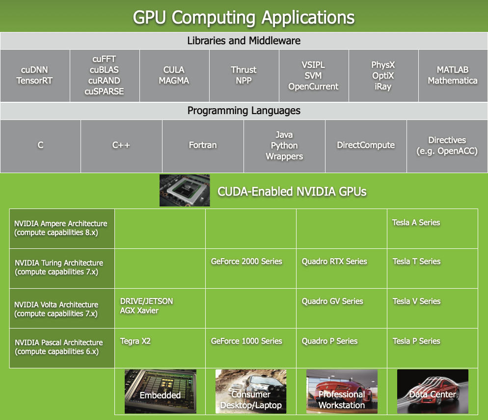

# 第1章 GPU计算与CUDA入门

欢迎来到GPU编程的世界！如果你正在阅读这份教程，相信你已经对程序性能有所追求，或者对并行计算充满好奇。在现代计算领域，<strong>图形处理单元（Graphics Processing Unit, GPU）</strong>已经从一个单纯的图形渲染设备，演变为强大的通用并行计算引擎。正如NVIDIA CUDA Programming Guide开篇所说：

> "The Graphics Processing Unit (GPU) provides much higher instruction throughput and memory bandwidth than the CPU within a similar price and power envelope."
>
> （在相近的价格和功耗范围内，GPU能提供远超CPU的指令吞吐量和内存带宽。）

在你学习GPU编程的旅程开始之际，你可能会好奇：GPU为什么如此强大？它是如何从游戏显卡演变为科学计算的主力设备的？CUDA是什么？编写GPU程序是否很困难？

在本章中，我们将回答这些问题。我们将从GPU与CPU的架构差异出发，理解为什么GPU适合大规模并行计算；然后介绍CUDA这一通用并行计算平台的历史和面貌；最后探讨CUDA可扩展编程模型背后的核心抽象。本章还将通过两个简单的程序——设备查询和Hello CUDA——让你亲手体验CUDA编程。

让我们开始这段旅程。

## 1.1 GPU与CPU的架构差异

### 1.1.1 设计目标的根本分歧

要理解为什么GPU擅长并行计算，我们首先需要理解GPU与CPU在设计理念上的根本差异。这两种处理器从诞生起就被赋予了不同的使命。

<strong>中央处理器（Central Processing Unit, CPU）</strong>的设计目标是<strong>尽可能减少单个顺序执行线程的执行延迟（Latency）</strong>。为了实现"跑得快"这一目标，CPU芯片上将大量晶体管资源用于：
- <strong>复杂的控制逻辑</strong>：分支预测（Branch Prediction）、乱序执行（Out-of-Order Execution）、超标量流水线（Superscalar Pipeline）等
- <strong>大型缓存层次结构</strong>：L1、L2、L3缓存，以减少指令和数据访问的平均延迟

这种设计使得 CPU 能够高效处理具有复杂控制流、大量分支及不可预测内存访问模式的程序。现代多核 CPU 通常支持同时执行数十个硬件线程，一般每个物理核心具备维护 1 至 2 个独立线程上下文的能力。

而<strong>图形处理单元（GPU）</strong>的设计目标截然不同。GPU被设计为能够在同一时刻执行数千个线程，以<strong>最大化整体吞吐量（Throughput）</strong>。为了达成这一目标，GPU将更多晶体管用于<strong>数据计算</strong>（如浮点运算单元ALU），而非数据缓存和流控制。

CUDA Programming Guide对这两种设计理念给出了权威的阐述：

> "This difference in capabilities between the GPU and the CPU exists because they are designed with different goals in mind. While the CPU is designed to excel at executing a sequence of operations, called a thread, as fast as possible and can execute a few tens of these threads in parallel, the GPU is designed to excel at executing thousands of them in parallel (amortizing the slower single-thread performance to achieve greater throughput)."
>
> （GPU和CPU在能力上的这种差异源于它们不同的设计目标。CPU被设计为尽可能快地执行称为"线程"的操作序列，可以同时执行几十个这样的线程；而GPU被设计为擅长同时执行数千个线程——通过摊平较慢的单线程性能来实现更高的吞吐量。）

下表概括了CPU和GPU在设计目标上的核心差异：

| 维度             | CPU                            | GPU                            |
| :--------------- | :----------------------------- | :----------------------------- |
| <strong>设计目标</strong> | 最小化单个线程的延迟           | 最大化整体吞吐量               |
| <strong>并发线程数</strong> | 几十个       | 数千至数万个                   |
| <strong>晶体管分配</strong> | 大型缓存 + 复杂控制逻辑        | 大量ALU + 精简控制             |
| <strong>内存延迟处理</strong> | 大缓存 + 预取                  | 线程切换掩藏延迟               |
| <strong>时钟频率</strong>    | 更高（~3-5 GHz）               | 相对较低（~1-2 GHz）           |
| <strong>单线程性能</strong>  | 极强                            | 较弱                           |
| <strong>总吞吐量</strong>    | 中等                            | 极高                           |

### 1.1.2 晶体管分配——一张图胜过千言

CUDA Programming Guide用了一幅非常经典的示意图（见下文图1.1）来说明CPU与GPU在芯片资源分配上的差异。原文对此图的描述是：

> "The GPU is specialized for highly parallel computations and therefore designed such that more transistors are devoted to data processing rather than data caching and flow control. The schematic Figure 1 shows an example distribution of chip resources for a CPU versus a GPU."
>
> （GPU专为高度并行计算而设计，因此更多晶体管被用于数据处理，而非数据缓存和流控制。示意图图1展示了CPU与GPU芯片资源分配的示例对比。）

<div align="center">
  
  <p>图 1.1 GPU将更多晶体管用于数据处理（来源：NVIDIA CUDA Programming Guide Figure 1）</p>
</div>

从图1.1中可以清楚地看到：
- CPU中，绿色的<strong>ALU（算术逻辑单元）</strong>只占芯片面积的一小部分，而橙色的<strong>控制单元（Control）</strong>和蓝色的大块<strong>缓存（Cache）</strong>占据了主导地位
- GPU中，绿色的ALU占据绝对主导地位，几乎铺满了整个芯片，而控制和缓存非常精简

这张图是理解GPU架构优势的"第一原理"。它解释了为什么GPU能够以远高于CPU的浮点运算吞吐量处理计算密集型任务——因为大部分芯片面积都用于真正的"计算"。

### 1.1.3 通过计算隐藏内存延迟

GPU采用"晶体管换ALU"策略的一个核心动机，来源于它们在处理内存访问延迟时采用的截然不同的策略。

CPU<strong>通过缓存来避免内存延迟</strong>：大容量的L1/L2/L3缓存层次结构使得CPU可以在大部分时间从高速缓存而非慢速主存获取数据，从而避免长时间的DRAM访问等待。

GPU则<strong>通过计算来隐藏内存延迟</strong>：当一个线程发起内存请求并等待数据返回时（这可能需要数百个时钟周期），GPU的调度器可以立即切换到另一个就绪的线程（称为<strong>warp</strong>）继续执行。只要任何时候都有足够的可执行线程，GPU的计算单元就不会空闲。

CUDA Programming Guide对这个关键机制做了精确描述：

> "Devoting more transistors to data processing, e.g., floating-point computations, is beneficial for highly parallel computations; the GPU can hide memory access latencies with computation, instead of relying on large data caches and complex flow control to avoid long memory access latencies, both of which are expensive in terms of transistors."
>
> （将更多晶体管用于数据处理（如浮点计算）有利于高度并行计算；GPU可以通过计算来隐藏内存访问延迟，而不是依赖昂贵的大型数据缓存和复杂流控制来避免长时间的内存访问延迟。）

用一句话来概括这个策略：<strong>CPU用空间（大缓存）换时间，GPU用并行度（多线程）换时间。</strong>

### 1.1.4 协作而非替代——异构计算的必然性

一个常见的误解是"GPU可以替代CPU"。实际上，GPU并不是CPU的替代品，而是它的<strong>协处理器（Coprocessor）</strong>。任何实际应用都同时包含并行部分和串行部分。

CUDA Programming Guide明确指出：

> "In general, an application has a mix of parallel parts and sequential parts, so systems are designed with a mix of GPUs and CPUs in order to maximize overall performance. Applications with a high degree of parallelism can exploit this massively parallel nature of the GPU to achieve higher performance than on the CPU."
>
> （一般来说，一个应用程序既有并行部分也有串行部分，因此系统设计中同时包含GPU和CPU以最大化整体性能。具有高度并行性的应用可以利用GPU的大规模并行特性来实现比CPU更高的性能。）

这种CPU+GPU的协作模式被称为<strong>异构计算（Heterogeneous Computing）</strong>，是CUDA编程模型的基石：
- <strong>CPU</strong>负责：复杂控制流、串行逻辑、操作系统交互、I/O操作、数据准备
- <strong>GPU</strong>负责：高度并行的数据密集型计算

> <strong>提示</strong>：CUDA Programming Guide还提到了另一种计算设备——<strong>现场可编程门阵列（Field-Programmable Gate Array, FPGA）</strong>。FPGA也非常节能高效，但提供的编程灵活性远不如GPU。原文是："Other computing devices, like FPGAs, are also very energy efficient, but offer much less programming flexibility than GPUs."

### 1.1.5 GPU应用的成功案例

许多应用领域已经通过利用GPU的大规模并行特性获得了显著的性能提升。NVIDIA维护了一个GPU应用目录（GPU Applications），涵盖了以下领域：

- <strong>科学计算</strong>：分子动力学模拟、气候建模、计算化学
- <strong>深度学习与AI</strong>：神经网络训练与推理
- <strong>金融</strong>：蒙特卡洛模拟、风险分析
- <strong>医学成像</strong>：CT/MRI重建、图像分割
- <strong>计算机视觉</strong>：目标检测、图像处理
- <strong>物理模拟</strong>：流体力学、结构力学

这些应用的共同特点是：都包含大量可以独立计算的数据元素，天然适合GPU的"单指令多线程（SIMT）"执行模式。

## 1.2 CUDA平台概述

### 1.2.1 CUDA的诞生——2006年开启的并行计算革命

<strong>CUDA</strong>是<strong>Compute Unified Device Architecture</strong>（统一计算设备架构）的缩写。2006年11月，NVIDIA正式推出了CUDA——一个通用并行计算平台和编程模型。

CUDA Programming Guide以这样的方式介绍了CUDA：

> "In November 2006, NVIDIA introduced CUDA, a general purpose parallel computing platform and programming model that leverages the parallel compute engine in NVIDIA GPUs to solve many complex computational problems in a more efficient way than on a CPU."
>
> （2006年11月，NVIDIA推出了CUDA——一个通用并行计算平台和编程模型，它利用NVIDIA GPU中的并行计算引擎，以比CPU更高效的方式解决许多复杂计算问题。）

在CUDA出现之前，利用GPU进行计算需要将问题伪装成图形渲染任务——程序员必须使用OpenGL或Direct3D等图形API来操作着色器（Shader）。这不仅门槛极高，而且表达能力有限。

CUDA的革命性在于：它将GPU并行计算的能力直接暴露给了程序员，无需经过图形API。程序员可以用熟悉的C/C++语言编写GPU上执行的代码，大大降低了GPU编程的门槛。

在CUDA诞生之后的这些年里，它已经深刻地改变了多个计算领域：
- <strong>2006年</strong>：首款支持 CUDA 的 GPU（G80 架构，GeForce 8800）发布
- <strong>2012年</strong>：AlexNet使用CUDA训练，开启了深度学习时代
- <strong>2016年</strong>：Pascal架构P100 GPU将混合精度计算带入数据中心
- <strong>2017年</strong>：Volta架构引入Tensor Core，深度学习训练大幅加速
- <strong>2020年</strong>：Ampere架构A100 GPU将AI训练性能推向新高
- <strong>至今</strong>：CUDA仍然是深度学习和GPU计算的事实标准

### 1.2.2 CUDA软件生态系统的组成

CUDA不仅是一套硬件指令集，更是一个完整的软件生态系统。该系统由以下层次构成：

<strong>第一层：设备驱动程序（Device Driver）</strong>
- 操作系统层面的驱动，负责与GPU硬件的直接交互
- 提供一个底层<strong>驱动API（Driver API）</strong>，以C语言接口暴露更精细的控制能力（如CUDA上下文管理、模块加载）
- 驱动API比运行时API更底层，通常只在需要精细控制时使用

<strong>第二层：CUDA运行时（CUDA Runtime）</strong>
- 构建在驱动API之上的更高级C/C++接口
- 提供设备内存分配（`cudaMalloc`）、数据传输（`cudaMemcpy`）、内核启动（`<<<...>>>`）、设备管理等功能
- 这是本教程中使用的主要API层面
- 运行时库的核心是`cudart`库

<strong>第三层：CUDA核心库</strong>
NVIDIA提供了一系列高度优化的领域专用库：
- <strong>cuBLAS</strong>：基本线性代数子程序（矩阵乘法、矩阵分解等）
- <strong>cuFFT</strong>：快速傅里叶变换
- <strong>cuDNN</strong>：深度神经网络原语（卷积、池化、激活函数等）
- <strong>cuSPARSE</strong>：稀疏矩阵运算
- <strong>cuRAND</strong>：随机数生成
- <strong>Thrust</strong>：类似C++ STL的并行算法库
- <strong>NCCL</strong>：多GPU通信库

<strong>第四层：NVCC编译器</strong>
NVIDIA CUDA编译器是整个工具链的核心。它将包含CUDA扩展的`.cu`源文件编译为可执行程序。NVCC的工作流程包括：
1. 分离源文件中的主机代码（C++）和设备代码（CUDA C++）
2. 将主机代码交给主机C++编译器（如gcc、cl.exe）处理
3. 将设备代码编译为<strong>PTX（Parallel Thread Execution）</strong>中间表示，或直接编译为目标GPU架构的二进制代码（称为<strong>cubin</strong>）

CUDA Programming Guide提到：
> "Any source file that contains some of these extensions must be compiled with nvcc."
>
> （任何包含这些扩展的源文件都必须使用nvcc编译。）

### 1.2.3 支持的语言和编程接口

CUDA的核心编程语言是C++的扩展，但这并不是唯一的选择。CUDA平台设计为一套支持多种语言和应用编程接口的多层次生态系统。

> "CUDA comes with a software environment that allows developers to use C++ as a high-level programming language. As illustrated by Figure 2, other languages, application programming interfaces, or directives-based approaches are supported, such as FORTRAN, DirectCompute, OpenACC."
>
> （CUDA附带了一个软件环境，允许开发者使用C++作为高级编程语言。如图2所示，其他语言、应用编程接口或基于指令的方法也得到了支持，如FORTRAN、DirectCompute、OpenACC。）

<div align="center">
  
  <p>图 1.2 GPU计算应用架构——CUDA支持多种语言和编程接口（来源：NVIDIA CUDA Programming Guide Figure 2）</p>
</div>

图1.2展示了CUDA的多层次、多语言架构：

- <strong>最底层：CUDA C/C++</strong>。提供最直接、最精细的GPU控制。这是本教程的重点。
- <strong>中间层：指令式编程</strong>。通过编译器指令（如`#pragma acc`）标记可并行化代码区域，编译器自动生成GPU代码。OpenACC是主要代表。
- <strong>上层：高级库</strong>。如cuBLAS、cuFFT、cuDNN等，封装了常见计算模式，使用简单但灵活性最低。
- <strong>其他语言绑定</strong>：
  - <strong>FORTRAN</strong>：通过CUDA Fortran编译器支持
  - <strong>Python</strong>：通过PyCUDA、CuPy、Numba等第三方库支持
  - <strong>Java</strong>：通过JCuda等绑定支持
  - <strong>DirectCompute</strong>：微软的GPU计算API

> <strong>提示</strong>：对于初学者，建议从CUDA C/C++开始学习，因为它暴露了所有核心概念，让你理解GPU编程的"底层真相"。掌握CUDA C/C++后，使用高级库会更加得心应手。

### 1.2.4 CUDA程序的基本结构

一个典型的CUDA程序由以下部分组成，这种结构贯穿本教程的所有示例：

```
1. 主机端代码（运行在CPU上）：
   - 数据准备和初始化
   - 设备内存分配（cudaMalloc）
   - 数据从主机传输到设备（cudaMemcpy HostToDevice）
   - 内核函数启动配置和调用（kernel<<<grid, block>>>）
   - 数据从设备传输回主机（cudaMemcpy DeviceToHost）
   - 结果验证和资源释放

2. 设备端代码（运行在GPU上）：
   - 内核函数定义（__global__）
   - 设备端辅助函数（__device__）
   - 使用内置变量（threadIdx, blockIdx等）进行线程索引计算
   - 实际的数据并行计算
```

## 1.3 可扩展编程模型

### 1.3.1 并行时代的核心挑战

多核CPU和众核GPU的出现，标志着主流处理器芯片进入了并行计算时代。这对软件开发者提出了一个根本性的挑战：如何编写能够<strong>透明地</strong>扩展到不同数量处理器核心上的应用程序？

CUDA Programming Guide用一个非常贴切的类比来解释这个挑战：

> "The advent of multicore CPUs and manycore GPUs means that mainstream processor chips are now parallel systems. The challenge is to develop application software that transparently scales its parallelism to leverage the increasing number of processor cores, much as 3D graphics applications transparently scale their parallelism to manycore GPUs with widely varying numbers of cores."
>
> （多核CPU和众核GPU的出现意味着主流处理器芯片现在已经是并行系统。挑战在于开发能够透明地扩展其并行度的应用软件，以利用日益增长的处理器核心数，就像3D图形应用能够透明地将并行度扩展到具有不同核心数的众核GPU上一样。）

想象一下：一个3D游戏可以在入门级的GTX显卡上运行，也能在旗舰级的RTX显卡上运行，不需要开发者针对每一种显卡写不同版本的代码。CUDA的设计目标就是让通用计算程序也拥有同样的自动可扩展性。

### 1.3.2 三大核心抽象

CUDA并行编程模型的核心是三个关键抽象。CUDA Programming Guide描述道：

> "At its core are three key abstractions - a hierarchy of thread groups, shared memories, and barrier synchronization - that are simply exposed to the programmer as a minimal set of language extensions."
>
> （其核心是三个关键抽象——<strong>线程组层次结构、共享内存和屏障同步</strong>——它们被简单地暴露给程序员，构成一组最小化的语言扩展。）

这三个抽象的理解是学习CUDA编程的基础。让我们逐一深入理解它们。

### 1.3.3 第一抽象：线程组层次结构

<strong>线程组层次结构（Thread Hierarchy）</strong>是CUDA编程模型中最核心的组织原则。CUDA Programming Guide阐释了这一抽象如何引导问题分解：

> "These abstractions provide fine-grained data parallelism and thread parallelism, nested within coarse-grained data parallelism and task parallelism. They guide the programmer to partition the problem into coarse sub-problems that can be solved independently in parallel by blocks of threads, and each sub-problem into finer pieces that can be solved cooperatively in parallel by all threads within the block."
>
> （这些抽象提供了嵌套在粗粒度数据并行和任务并行中的细粒度数据并行和线程并行。它们引导程序员将问题划分为可以由线程块独立并行解决的粗粒度子问题，再将每个子问题划分为可以由块内所有线程协作并行解决的更细粒度部分。）

这个层次结构是一个<strong>两级分解</strong>：

1. <strong>粗粒度分解</strong>：将整个问题划分为若干<strong>线程块（Thread Block）</strong>。每个线程块独立解决一个子问题。线程块之间不能直接通信，但可以完全并行或串行地执行。

2. <strong>细粒度分解</strong>：在每个线程块内部，将子问题进一步划分为由单个线程处理的最小工作单元。线程块内的线程可以通过共享内存协作。

以一个矩阵乘法问题为例：
- <strong>粗粒度</strong>：每个线程块负责计算输出矩阵的一个子块（tile），比如16x16的子块
- <strong>细粒度</strong>：线程块内的每个线程负责计算子块中的<strong>一个元素</strong>

这种<strong>分而治之</strong>的分解策略，使得问题自然地匹配了GPU的硬件结构。

### 1.3.4 第二抽象：共享内存

<strong>共享内存（Shared Memory）</strong>是线程块内线程协作的关键机制。它位于GPU芯片上（靠近SM），访问速度极快，但容量有限。线程块内的所有线程都可以读写同一块共享内存区域。

共享内存的使用模式通常是：
1. 所有线程从全局内存加载数据到共享内存（协作加载）
2. `__syncthreads()`同步——确保所有线程都完成了加载
3. 线程从共享内存读取数据进行计算（多次重用数据）
4. 将结果写回全局内存

这种<strong>协作加载+数据重用</strong>的模式可以显著减少对全局内存（慢速DRAM）的访问次数，是实现高性能CUDA程序的常用技术。我们将在后续章节中深入探讨共享内存的使用。

### 1.3.5 第三抽象：屏障同步

<strong>屏障同步（Barrier Synchronization）</strong>确保线程块内所有线程在某个执行点上保持一致。最基本的屏障同步原语是 `__syncthreads()`。

`__syncthreads()` 的工作原理：
- 当一个线程调用 `__syncthreads()` 时，它会在该点等待
- 只有当线程块内的<strong>所有线程</strong>都到达这个同步点时，它们才被允许继续执行
- 类似于运动会上的起跑线——所有选手都就位后才能开跑

这个机制对于正确使用共享内存至关重要：你必须确保所有线程都完成了对共享内存的写入，然后才允许任何线程开始读取。

### 1.3.6 自动可扩展性——CUDA模型最优雅的设计

这三个抽象最巧妙的地方在于，它们共同自然地产生了<strong>自动可扩展性（Automatic Scalability）</strong>。CUDA Programming Guide对此做了清晰的说明：

> "This decomposition preserves language expressivity by allowing threads to cooperate when solving each sub-problem, and at the same time enables automatic scalability. Indeed, each block of threads can be scheduled on any of the available multiprocessors within a GPU, in any order, concurrently or sequentially, so that a compiled CUDA program can execute on any number of multiprocessors... and only the runtime system needs to know the physical multiprocessor count."
>
> （这种分解在允许线程协作解决每个子问题的同时，也实现了自动可扩展性。事实上，每个线程块可以被调度到GPU中任何可用的多处理器上，以任意顺序、并发或串行地执行，因此编译好的CUDA程序可以在任意数量的多处理器上执行……只有运行时系统需要知道物理多处理器的数量。）

下图（图1.3）直观地说明了这一原理：

<div align="center">
  
  <p>图 1.3 CUDA的自动可扩展性——相同程序在不同数量SM的GPU上自动扩展（来源：NVIDIA CUDA Programming Guide Figure 3）</p>
</div>

CUDA Programming Guide为图1.3提供了以下重要注释：

> "A GPU is built around an array of Streaming Multiprocessors (SMs). A multithreaded program is partitioned into blocks of threads that execute independently from each other, so that a GPU with more multiprocessors will automatically execute the program in less time than a GPU with fewer multiprocessors."
>
> （GPU围绕<strong>流多处理器（Streaming Multiprocessor, SM）</strong>阵列构建。多线程程序被划分为彼此独立执行的线程块，因此拥有更多SM的GPU将自动比拥有更少SM的GPU以更短的时间执行该程序。）

这个自动可扩展性的关键前提是：<strong>线程块必须能够独立执行</strong>。CUDA编程模型要求：
- 线程块之间不能有同步依赖
- 线程块可以以任意顺序被调度
- 线程块可以并发或串行地执行

只要满足了这个独立执行的要求，你的CUDA程序就能在任何规模的GPU上运行——从只有几个SM的入门级GPU，到拥有128个SM的旗舰级数据中心GPU。

### 1.3.7 从入门级到旗舰——CUDA的市场覆盖

CUDA Programming Guide明确指出，这种可扩展编程模型使得NVIDIA能够用单一架构覆盖整个市场范围：

> "This scalable programming model allows the GPU architecture to span a wide market range by simply scaling the number of multiprocessors and memory partitions: from the high-performance enthusiast GeForce GPUs and professional Quadro and Tesla computing products to a variety of inexpensive, mainstream GeForce GPUs."
>
> （这种可扩展编程模型允许GPU架构仅通过扩展多处理器数量和内存分区数量就能覆盖广泛的市场范围：从高性能发烧友级GeForce GPU和专业Quadro和Tesla计算产品，到各种价格亲民的主流GeForce GPU。）

| GPU类别       | 代表型号    | SM数量（示例） | 典型用途                 |
| :------------ | :---------- | :------------- | :----------------------- |
| 入门级        | GTX 1050    | 5-6            | 轻量游戏、学习           |
| 主流          | RTX 3060    | 28             | 游戏、中小规模计算       |
| 高性能        | RTX 4090    | 128            | 高端游戏、大规模推理     |
| 专业          | RTX A6000   | 84             | 专业可视化、推理         |
| 数据中心      | A100        | 108            | AI训练、科学计算         |
| 旗舰数据中心  | H100        | 132            | 大规模AI训练             |

所有这些GPU都运行相同的CUDA代码——可扩展性由硬件自动处理。

## 1.4 CUDA硬件实现简介

### 1.4.1 流多处理器（SM）——GPU的计算核心

GPU的架构是围绕<strong>流多处理器（Streaming Multiprocessor, SM）</strong>阵列构建的。SM是GPU的基本计算单元，相当于CPU的"核心"——但一个SM的能力远强于一个CPU核心。

每个SM包含：
- <strong>多个CUDA核心</strong>：执行浮点和整数运算的基本单元。一个SM可以包含64到128个CUDA核心
- <strong>共享内存/L1缓存</strong>：片上的高速缓存，可以被同一线程块的所有线程访问
- <strong>寄存器文件</strong>：为SM上所有活动线程提供私有寄存器存储
- <strong>Warp调度器</strong>：将线程以<strong>warp</strong>（32个线程一组）为单位调度到CUDA核心上执行
- <strong>特殊功能单元（SFU）</strong>：执行超越函数（sin, cos, exp等）
- <strong>加载/存储单元</strong>：处理内存读写操作
- <strong>Tensor Core</strong>（Volta+架构）：专用矩阵乘法加速器

一个GPU通常包含从几个到超过一百个SM，这就是其并行计算能力的来源。

### 1.4.2 Warp——GPU执行的原子单位

<strong>Warp</strong>是GPU执行的最基本单位。一个warp固定包含<strong>32个线程</strong>。理解warp的工作方式对编写高效CUDA代码非常重要：

- 一个SM上的warp调度器以warp为单位调度线程执行
- 一个warp内的所有线程以<strong>锁步（Lockstep）</strong>方式执行同一条指令
- 如果warp内的线程发生分支（if/else），不同分支路径将被<strong>串行执行</strong>（称为warp divergence，这会降低性能）

虽然我们在日常CUDA编程中很少直接操作warp，但理解了SM和warp的概念，有助于你理解后续章节中关于内存合并访问、warp divergence等性能优化话题。

## 1.5 动手体验：第一个CUDA程序

### 1.5.1 环境准备

在开始编写CUDA代码之前，确保你的开发环境已经配置正确：

<strong>硬件要求</strong>：
- 一块支持CUDA的NVIDIA GPU（计算能力2.0以上）
- 你可以通过Windows的设备管理器、Linux的`lspci`命令，或直接运行`nvidia-smi`来确认

<strong>软件要求</strong>：
- <strong>CUDA Toolkit</strong>：从 [NVIDIA Developer网站](https://developer.nvidia.com/cuda-downloads) 下载并安装。本教程基于CUDA 11.x编写，但绝大多数内容适用于更新的CUDA版本
- <strong>C/C++编译器</strong>：Windows上需要Visual Studio（2017或更新），Linux上需要GCC
- <strong>验证安装</strong>：在命令行中运行 `nvcc --version` 确认编译器可用

> <strong>注意</strong>：CUDA Toolkit的版本（如CUDA 11.5、CUDA 12.3）与GPU的<strong>计算能力（Compute Capability）</strong>是两个不同的概念。计算能力标识的是GPU硬件的特性支持级别（以X.Y格式表示，如8.6），而CUDA版本指的是软件平台的版本。我们将在第3章中详细讨论计算能力。

### 1.5.2 程序一：查询你的GPU

在正式编写并行计算代码之前，我们先来了解自己手中的GPU硬件。这个程序将查询并打印你系统中所有CUDA兼容设备的详细信息。

> <strong>提示</strong>：本章的完整可编译代码文件位于 `code/chapter1/` 目录下。你可以直接编译运行，也可以跟着教程手动输入来加深理解。

代码文件 `code/chapter1/device_query.cu` 的完整内容如下：

```cuda
/**
 * device_query.cu - Chapter 1: GPU Device Query Example
 * 查询并打印系统中所有CUDA兼容GPU的详细属性
 */
#include <cuda_runtime.h>
#include <stdio.h>

int main()
{
    int deviceCount;
    cudaError_t error;

    // 步骤1：获取系统中CUDA兼容设备的数量
    error = cudaGetDeviceCount(&deviceCount);
    if (error != cudaSuccess)
    {
        printf("获取设备数量时出错: %s\n", cudaGetErrorString(error));
        return 1;
    }

    if (deviceCount == 0)
    {
        printf("未找到CUDA兼容设备，程序退出。\n");
        printf("请确认：\n");
        printf("  1. 您的系统安装了NVIDIA GPU\n");
        printf("  2. 已安装正确的GPU驱动程序\n");
        printf("  3. 已安装CUDA Toolkit\n");
        return 0;
    }

    printf("找到 %d 个CUDA兼容设备\n\n", deviceCount);

    // 步骤2：遍历每个设备，查询并打印其属性
    for (int dev = 0; dev < deviceCount; dev++)
    {
        cudaDeviceProp deviceProp;

        // 获取设备属性
        error = cudaGetDeviceProperties(&deviceProp, dev);
        if (error != cudaSuccess)
        {
            printf("获取设备 %d 的属性时出错: %s\n",
                   dev, cudaGetErrorString(error));
            continue;
        }

        // 打印设备信息
        printf("========== 设备 %d: %s ==========\n", dev, deviceProp.name);
        printf("  计算能力 (Compute Capability):       %d.%d\n",
               deviceProp.major, deviceProp.minor);
        printf("  全局内存总量:                          %.2f GB\n",
               deviceProp.totalGlobalMem / (1024.0 * 1024.0 * 1024.0));
        printf("  SM数量 (多处理器数量):                 %d\n",
               deviceProp.multiProcessorCount);
        printf("  每个线程块的最大线程数:                 %d\n",
               deviceProp.maxThreadsPerBlock);
        printf("  线程块各维度的最大尺寸:                 (%d, %d, %d)\n",
               deviceProp.maxThreadsDim[0],
               deviceProp.maxThreadsDim[1],
               deviceProp.maxThreadsDim[2]);
        printf("  网格各维度的最大尺寸:                   (%d, %d, %d)\n",
               deviceProp.maxGridSize[0],
               deviceProp.maxGridSize[1],
               deviceProp.maxGridSize[2]);
        printf("  每个线程块的共享内存:                   %zu KB\n",
               deviceProp.sharedMemPerBlock / 1024);
        printf("  每个线程块的寄存器数:                   %d\n",
               deviceProp.regsPerBlock);
        printf("  Warp大小:                              %d\n",
               deviceProp.warpSize);
        printf("  每个SM的最大线程数:                     %d\n",
               deviceProp.maxThreadsPerMultiProcessor);
        printf("  时钟频率:                              %.2f GHz\n",
               deviceProp.clockRate / 1e6);
        printf("  内存总线宽度:                          %d bits\n",
               deviceProp.memoryBusWidth);
        printf("  内存时钟频率:                          %.2f GHz\n",
               deviceProp.memoryClockRate / 1e6);
        printf("  ECC支持:                               %s\n",
               deviceProp.ECCEnabled ? "是" : "否");
        printf("  统一寻址支持:                          %s\n",
               deviceProp.unifiedAddressing ? "是" : "否");
        printf("  托管内存支持:                          %s\n",
               deviceProp.managedMemory ? "是" : "否");
        printf("  并发内核执行:                          %s\n",
               deviceProp.concurrentKernels ? "是" : "否");
        printf("\n");
    }

    return 0;
}
```

编译并运行这个程序：

```bash
nvcc device_query.cu -o device_query
./device_query
```

<strong>预期输出示例</strong>（在一台配备RTX 3060的机器上）：

```
找到 1 个CUDA兼容设备

========== 设备 0: NVIDIA GeForce RTX 3060 ==========
  计算能力 (Compute Capability):       8.6
  全局内存总量:                          12.00 GB
  SM数量 (多处理器数量):                 28
  每个线程块的最大线程数:                 1024
  线程块各维度的最大尺寸:                 (1024, 1024, 64)
  网格各维度的最大尺寸:                   (2147483647, 65535, 65535)
  每个线程块的共享内存:                   48 KB
  每个线程块的寄存器数:                   65536
  Warp大小:                              32
  每个SM的最大线程数:                     1536
  时钟频率:                              1.78 GHz
  内存总线宽度:                          192 bits
  内存时钟频率:                          7.50 GHz
  ECC支持:                               否
  统一寻址支持:                          是
  托管内存支持:                          是
  并发内核执行:                          是
```

<strong>从这个输出中，你可以读取到以下关键信息：</strong>

- <strong>SM数量（28）</strong>：这就是图1.3中提到的"多处理器"数量。28个SM意味着GPU可以同时执行最多28个不同的线程块（实际上每个SM可以同时驻留多个线程块）
- <strong>计算能力（8.6）</strong>：表明这是一块Ampere架构的GPU
- <strong>每个线程块最大1024个线程</strong>：这是后续章节中设计线程块大小的硬性上限
- <strong>Warp大小（32）</strong>：执行的基本单位，32个线程一组以锁步方式执行
- <strong>每个SM最多1536个线程</strong>：这是一个SM可以同时管理的最大线程数；如果你启动的线程块每个有1024个线程，那么每个SM只能驻留<strong>1个</strong>这样的线程块（因为1024<1536但2*1024>1536）

> <strong>提示</strong>：不同GPU的这些参数差异可能很大。建议你在开始学习CUDA编程时就运行这个程序，了解你的GPU硬件能力，这有助于你后续选择合理的线程块大小和网格维度。

### 1.5.3 程序二：Hello CUDA——运行在GPU上的第一个内核

现在让我们编写第二个程序，体验CUDA编程的两个核心新语法：`__global__` 声明说明符和 `<<<...>>>` 执行配置语法。

代码文件 `code/chapter1/hello_cuda.cu` 的完整内容：

```cuda
/**
 * hello_cuda.cu - Chapter 1: First CUDA Kernel
 * 演示 __global__, threadIdx, blockIdx 和 <<<...>>> 启动语法
 */
#include <cuda_runtime.h>
#include <stdio.h>

/**
 * 内核函数：每个执行此函数的线程打印一条问候
 * 使用 __global__ 声明，从CPU端调用，在GPU上执行
 */
__global__ void helloFromGPU()
{
    // threadIdx.x: 当前线程在其线程块内的索引（从0开始）
    // blockIdx.x:  当前线程块在网格中的索引（从0开始）
    printf("来自GPU的问候! 我是线程块[%d]中的线程[%d]\n",
           blockIdx.x, threadIdx.x);
}

int main()
{
    // 步骤1：从CPU端打印（这是普通的C/C++代码）
    printf("来自CPU的问候!\n\n");

    // 步骤2：配置内核启动参数
    int numBlocks = 2;         // 启动2个线程块
    int threadsPerBlock = 4;   // 每个线程块包含4个线程
    // 总共 2 * 4 = 8 个CUDA线程

    printf("启动内核：%d个线程块 x %d个线程/块 = %d个线程\n\n",
           numBlocks, threadsPerBlock,
           numBlocks * threadsPerBlock);

    // 步骤3：使用 <<<numBlocks, threadsPerBlock>>> 语法启动内核
    // 注意：内核启动是异步的——CPU不会等待GPU完成就继续执行
    helloFromGPU<<<numBlocks, threadsPerBlock>>>();

    // 步骤4：等待GPU完成所有提交的工作
    cudaError_t error = cudaDeviceSynchronize();
    if (error != cudaSuccess)
    {
        printf("内核启动后出现CUDA错误: %s\n",
               cudaGetErrorString(error));
        return 1;
    }

    printf("\n内核执行成功完成!\n");

    return 0;
}
```

编译并运行：

```bash
nvcc hello_cuda.cu -o hello_cuda
./hello_cuda
```

<strong>预期输出示例</strong>：

```
来自CPU的问候!

启动内核：2个线程块 x 4个线程/块 = 8个线程

来自GPU的问候! 我是线程块[0]中的线程[0]
来自GPU的问候! 我是线程块[0]中的线程[1]
来自GPU的问候! 我是线程块[0]中的线程[2]
来自GPU的问候! 我是线程块[0]中的线程[3]
来自GPU的问候! 我是线程块[1]中的线程[0]
来自GPU的问候! 我是线程块[1]中的线程[1]
来自GPU的问候! 我是线程块[1]中的线程[2]
来自GPU的问候! 我是线程块[1]中的线程[3]

内核执行成功完成!
```

### 1.5.4 运行案例分析

让我们详细分析这个程序中的关键CUDA概念：

<strong>1. `__global__` 说明符</strong>

```cuda
__global__ void helloFromGPU()
```

- `__global__` 声明该函数是一个<strong>内核函数（Kernel Function）</strong>
- 内核函数的特点：在<strong>设备（GPU）</strong>上执行，但可以从<strong>主机（CPU）</strong>端调用
- 同一份内核代码会被N个CUDA线程"同时"并行执行

CUDA还提供了另外两个相关的函数说明符：
- `__device__`：在设备上执行，<strong>只能从设备端</strong>调用（类似于GPU上的"普通函数"）
- `__host__`：在主机上执行，只能从主机端调用（这是默认行为，通常省略）

<strong>2. `<<<...>>>` 执行配置语法</strong>

```cuda
helloFromGPU<<<numBlocks, threadsPerBlock>>>();
```

这个特殊的尖括号语法被称为<strong>执行配置（Execution Configuration）</strong>。它的完整形式是：

```cuda
kernel<<<gridDim, blockDim, sharedMemBytes, stream>>>(args...);
```

在Hello CUDA中我们使用了最简单的双参数形式：
- `gridDim = 2`：网格中有2个线程块
- `blockDim = 4`：每个线程块中有4个线程

<strong>3. 内置变量 `threadIdx` 和 `blockIdx`</strong>

在内核函数内部，这两个变量自动可用：
- `threadIdx.x`：当前线程在其线程块中的索引。在块0中，四个线程的索引分别为0、1、2、3；在块1中，四个线程的索引也分别为0、1、2、3（每个块的索引独立计算）
- `blockIdx.x`：当前线程块在网格中的索引（0或1）

这两个变量都有三个分量：`.x`、`.y`、`.z`，支持最多三维的线程块和网格组织。

<strong>4. `cudaDeviceSynchronize()`</strong>

```cuda
cudaDeviceSynchronize();
```

这个函数让CPU<strong>阻塞等待</strong>，直到GPU完成所有之前提交的工作（包括内核执行）。它是必要的，因为**内核启动是异步的**：`<<<...>>>`语法提交内核执行后，CPU立即继续执行下一条语句，不会等待GPU完成。

> <strong>注意</strong>：GPU上的线程执行顺序是不确定的。如果你多次运行这个程序，线程块的执行顺序和块内线程的打印顺序可能每次都不相同。这就是CUDA编程模型要求线程块必须能<strong>独立执行</strong>的原因——你不能依赖任何特定的块调度顺序。

## 1.6 本章小结

在本章中，我们迈出了GPU计算之旅的第一步。我们的旅程涵盖了从GPU硬件架构到CUDA编程模型的全景视角：

- <strong>GPU与CPU的架构差异</strong>：CPU将更多晶体管用于控制和缓存，面向低延迟优化；GPU将更多晶体管用于计算单元（ALU），面向高吞吐量优化。GPU通过大量线程的快速切换来隐藏内存访问延迟，而非依赖大型缓存。这种差异源于它们不同的设计目标——CPU追求单线程延迟最小化，GPU追求总吞吐量最大化。

- <strong>CUDA平台概述</strong>：CUDA是NVIDIA在2006年推出的通用并行计算平台和编程模型。它通过最小化的语言扩展（`__global__`等关键字、`<<<...>>>`语法）和丰富的运行时库，让C++程序员能够便捷地开发GPU并行程序。CUDA支持C++、Fortran、OpenACC、Python等多种语言和编程方式，并提供了cuBLAS、cuFFT、cuDNN等一系列高度优化的领域库。

- <strong>可扩展编程模型</strong>：CUDA的三大核心抽象——线程组层次结构、共享内存和屏障同步——共同实现了自动可扩展性。线程块可以独立地在任意数量的SM上以任意顺序调度执行，使得同一份编译好的程序能够自动利用更多SM来减少执行时间。这是CUDA最优雅的设计之一。

- <strong>硬件实现</strong>：GPU围绕SM阵列构建。SM是基本计算单元，包含CUDA核心、共享内存、寄存器和warp调度器。Warp是32个线程的执行组，以锁步方式执行同一指令。

- <strong>动手实践</strong>：我们编写并运行了两个程序——设备查询程序（了解GPU硬件规格）和Hello CUDA程序（体验`__global__`声明、`<<<...>>>`启动语法和内置变量`threadIdx`/`blockIdx`的使用），建立了对CUDA编程流程的初步认识。

通过本章的学习，我们建立了对GPU计算和CUDA编程模型的基础理解。在下一章中，我们将深入探讨CUDA编程模型的核心——<strong>内核函数和线程层次结构</strong>，学习如何编写多线程块的向量加法和矩阵加法并行程序！

## 习题

> <strong>提示</strong>：以下的部分习题没有标准答案，重点在于培养学习者对GPU架构和CUDA编程模型批判性的深入思考和动手实践能力。

1. <strong>架构对比分析</strong>：
   a. 请用自己的语言解释为什么GPU将更多晶体管用于数据计算（ALU）而非缓存和控制逻辑。
   b. 如果一个应用的计算密度很低（每个数据元素只需要很少的计算量——例如简单的向量加法），它在GPU上运行还会比CPU快吗？为什么？什么情况下GPU可能反而更慢？
   c. 以你在 `device_query` 中获得GPU参数为例，计算你的GPU上每个SM平均拥有多少个CUDA核心（提示：可以通过计算能力查找对应架构的CUDA核心数/SM）。

2. <strong>可扩展性分析</strong>：
   a. 什么是"自动可扩展性"？为什么线程块的独立执行要求是可扩展性的关键前提？
   b. 假设你有一个CUDA程序，其中每个线程块内的线程需要通过`__syncthreads()`进行同步。如果程序在只有2个SM的GPU上能正确运行，在拥有128个SM的GPU上是否也一定能正确运行？请解释你的判断。
   c. 如果CUDA不要求线程块独立执行（即允许线程块之间有依赖关系），对自动可扩展性会产生什么影响？

3. <strong>SM与Warp分析</strong>：
   a. 一个SM上的warp调度器"以warp为单位"调度线程是什么意思？为什么warp大小固定为32？
   b. 你的GPU上每个SM最多可以管理多少个warp？（提示：每SM最大线程数 / 32）
   c. 如果你启动的内核配置为每个线程块256个线程，每个SM最多可以同时驻留多少个这样的线程块？

4. <strong>场景分析</strong>：假设你正在运行一个包含100个线程块的CUDA程序，而GPU只有28个SM。请回答：
   a. 这100个线程块如何被分配到28个SM上执行？所有100个块会同时开始执行吗？
   b. 如果增加线程块的数量到280个，每个线程块的工作量不变，程序的执行时间会如何变化？为什么？
   c. CUDA编程指南提到线程块可以"在任意顺序下并发或串行地执行"——这个设计选择对程序员意味着什么？

5. <strong>动手扩展</strong>：
   > <strong>提示</strong>：这是一道动手实践题，建议实际编写代码
   
   修改 `hello_cuda.cu` 程序：
   a. 尝试使用不同数量的线程块和每个块的线程数（如1个块128个线程、16个块32个线程等）。观察输出和程序行为。记录下你认为有趣的观察。
   b. 修改内核函数，使其打印 `threadIdx` 的 y 和 z 分量。在启动配置中使用 `dim3` 类型指定二维（如 `dim3(4, 2)`）和三维（如 `dim3(4, 2, 2)`）的线程块大小。
   c. 添加 `blockDim` 内置变量的打印，验证它确实等于你指定的每个块的线程数。

6. <strong>综合设计</strong>：假设某游戏公司希望使用CUDA加速其物理引擎中的粒子系统模拟。该系统需要模拟N个粒子在三维空间中的运动，N可以从数千到数百万。请回答：
   a. 这个问题的并行度来源于哪里？（哪些计算可以同时进行而互不影响？）
   b. 哪些部分可能必须在CPU上串行执行？
   c. 你如何利用CUDA的三个核心抽象（线程组、共享内存、屏障同步）来设计并行方案？请描述你的线程块划分策略，以及哪些数据可以通过共享内存在线程间重用。

## 参考文献

[1] NVIDIA Corporation. CUDA C++ Programming Guide (Version 11.5.1), Chapter 1: Introduction[M/OL]. https://docs.nvidia.com/cuda/archive/11.5.1/cuda-c-programming-guide/index.html, 2021.

[2] NVIDIA Corporation. CUDA C++ Programming Guide (Version 13.0), Chapter 3: Introduction[M/OL]. https://docs.nvidia.com/cuda/archive/13.0.3/cuda-c-programming-guide/index.html, 2025.

[3] Kirk D B, Hwu W M. Programming Massively Parallel Processors: A Hands-on Approach[M]. 3rd ed. San Francisco: Morgan Kaufmann, 2016.

[4] Cook S. CUDA Programming: A Developer's Guide to Parallel Computing with GPUs[M]. Waltham: Morgan Kaufmann, 2012.

[5] NVIDIA Corporation. CUDA C++ Best Practices Guide[M/OL]. https://docs.nvidia.com/cuda/cuda-c-best-practices-guide/, 2021.

---

## 💬 讨论与交流

本章学习过程中遇到问题?想与其他学习者交流心得?

**📝 前往 GitHub Discussions 讨论区:**
- [💬 习题讨论与问答](https://github.com/open-rdma/gpu-programming-guide/discussions)
- 在这里你可以:
  - ✅ 提问习题相关问题
  - ✅ 分享你的解题思路
  - ✅ 与其他学习者交流经验
  - ✅ 获得社区的帮助和反馈

**💡 提示:** 每个页面底部也有评论区,可以直接在页面内讨论!

---
