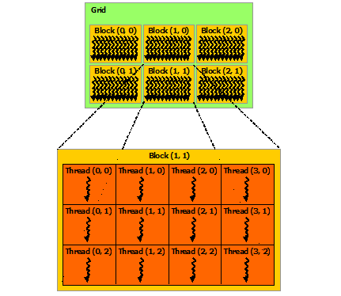

# 第2章 CUDA编程模型——内核函数与线程层次结构

在上一章中，我们了解了GPU与CPU的架构差异，认识了CUDA平台的基本面貌，并编写了我们的第一个CUDA内核函数。如果你对`__global__`和`<<<...>>>`这些关键字还感到些许陌生，不用担心——本章将系统地讲解这些核心概念。

在本章中，我们将深入CUDA编程模型的两个核心组件：<strong>内核函数（Kernel）</strong>和<strong>线程层次结构（Thread Hierarchy）</strong>。通过理解它们，你将掌握CUDA编程最基本也是最重要的技能——如何将一个问题分解为大量的线程来并行执行。CUDA Programming Guide在第二章开头给出了这样的概述：

> "This chapter introduces the main concepts behind the CUDA programming model by outlining how they are exposed in C++."
>
> （本章通过概述CUDA编程模型在C++中的暴露方式，介绍其背后的主要概念。）

> "Full code for the vector addition example used in this chapter and the next can be found in the vectorAdd CUDA sample."
>
> （本章和下一章中使用的向量加法示例的完整代码可以在vectorAdd CUDA示例中找到。）

本章将通过两个典型例子——一维的向量加法和二维的矩阵加法——来帮助你逐步掌握这些概念。我们将从最简单的单线程块版本开始，逐步演进到能够处理任意大小数据的多线程块版本。让我们开始吧！

## 2.1 内核函数

### 2.1.1 什么是内核函数

在CUDA C++中，<strong>内核函数（Kernel）</strong>是指一种特殊的C++函数，它被定义在GPU设备上执行，但由CPU主机端调用。普通C++函数被调用时只执行一次，而内核函数被调用时会由N个不同的<strong>CUDA线程（CUDA Thread）</strong>同时并行执行N次。

CUDA Programming Guide给出了内核函数的精确定义：

> "CUDA C++ extends C++ by allowing the programmer to define C++ functions, called kernels, that, when called, are executed N times in parallel by N different CUDA threads, as opposed to only once like regular C++ functions."
>
> （CUDA C++对C++进行了扩展，允许程序员定义称为"内核函数"的C++函数。当这些函数被调用时，由N个不同的CUDA线程并行执行N次，而不是像普通C++函数那样只执行一次。）

这个定义揭示了一个关键的思维转变：在CUDA编程中，你不是在编写"一个函数做什么"，而是在编写"一个线程做什么"。内核函数描述的是<strong>单个线程的行为</strong>，而通过启动成千上万个线程，你实现了大规模并行计算。

### 2.1.2 `__global__` 声明说明符

内核函数使用`__global__`声明说明符来定义。这个关键字告诉编译器：这是一个在设备（GPU）上执行的函数，但可以从主机（CPU）端调用。完整的语法格式如下：

```cuda
// 内核函数定义
__global__ void kernelName(parameters...)
{
    // 由所有线程并行执行的代码
    // 线程通过内置变量区分自己的工作
    // threadIdx: 线程在线程块内的索引
    // blockIdx:  线程块在网格中的索引
}
```

CUDA C++提供了三个函数声明说明符，用来指定函数的执行位置和调用方式：

| 说明符       | 执行位置   | 可从何处调用         | 典型用途                 |
| :----------- | :--------- | :------------------- | :----------------------- |
| `__global__` | 设备(GPU)  | 主机(CPU)或设备(GPU) | <strong>内核函数</strong>——并行计算的入口 |
| `__device__` | 设备(GPU)  | 仅设备(GPU)          | GPU上的辅助函数——被内核或其他`__device__`函数调用 |
| `__host__`   | 主机(CPU)  | 仅主机(CPU)          | 普通的CPU函数（默认行为，可省略） |

几个重要的补充说明：

- <strong>返回类型</strong>：`__global__` 函数必须返回 `void`。内核函数不能有返回值——结果通过写入设备内存指针（参数传入）来传递。
- <strong>递归</strong>：`__global__` 函数不支持递归。
- <strong>可变参数</strong>：`__global__` 函数不支持可变参数（如 `...`）。
- <strong>同时声明</strong>：一个函数可以同时使用 `__host__` 和 `__device__` 声明——这会让编译器为该函数同时生成CPU版本和GPU版本。这对编写可以在两种代码中复用的工具函数很有用。

```cuda
// 同时为主机和设备生成版本
__host__ __device__ int clamp(int val, int lo, int hi) {
    return (val < lo) ? lo : (val > hi) ? hi : val;
}
```

### 2.1.3 `<<<...>>>` 执行配置语法

内核函数通过一种特殊的`<<<...>>>`语法来启动。这个语法被称为<strong>执行配置（Execution Configuration）</strong>，它指定了执行该内核的线程数量和布局：

```cuda
kernelName<<<gridDim, blockDim, sharedMemBytes, stream>>>(args...);
```

各参数的含义：

| 参数             | 类型                | 必需/可选 | 说明                                                               |
| :--------------- | :------------------ | :-------- | :----------------------------------------------------------------- |
| `gridDim`        | `int` 或 `dim3`     | <strong>必需</strong> | 网格维度——指定网格中的线程块数量                                   |
| `blockDim`       | `int` 或 `dim3`     | <strong>必需</strong> | 线程块维度——指定每个线程块中的线程数量                             |
| `sharedMemBytes` | `int`               | 可选      | 动态共享内存大小——为每个线程块额外分配的共享内存字节数（默认0）    |
| `stream`         | `cudaStream_t`      | 可选      | CUDA流——指定内核在哪个流上异步执行（默认使用默认流，即stream 0）   |

<strong>最简单的例子</strong>：

```cuda
// 启动1个线程块，包含256个线程
myKernel<<<1, 256>>>(params);
```

<strong>使用 dim3 的二维例子</strong>：

```cuda
// 启动 4x3 = 12 个线程块，每个块 16x16 = 256 个线程
dim3 blocks(4, 3);
dim3 threads(16, 16);
myKernel<<<blocks, threads>>>(params);
```

在本章中我们主要使用前两个参数；动态共享内存和CUDA流将在后续章节中介绍。

### 2.1.4 理解执行配置——从"调用一次函数"到"启动N个线程"

普通函数调用和内核启动的根本区别可以通过以下对比来理解：

<strong>普通C++函数调用</strong>：函数体执行<strong>一次</strong>。你在调用时提供的参数在整个执行过程中保持不变。

```cpp
float result = add(3.0f, 4.0f);
// add() 函数体执行一次，result = 7.0f
```

<strong>CUDA内核启动</strong>：函数体被<strong>N个线程</strong>各自独立执行。但所有线程接收<strong>相同的参数</strong>。区分不同线程"应该做什么"的唯一方式是使用内置变量（`threadIdx`等）。

```cuda
__global__ void addVectors(float* A, float* B, float* C, int N) {
    int i = threadIdx.x;  // 每个线程有不同的 threadIdx.x
    if (i < N)
        C[i] = A[i] + B[i];  // 每个线程处理不同的 i
}

// 启动时，指定了执行配置：1个块，N个线程
addVectors<<<1, N>>>(d_A, d_B, d_C, N);
// addVectors() 的内核函数体被N个线程各自执行一次
```

这个例子中，虽然所有N个线程接收的参数 `d_A, d_B, d_C, N` 完全相同，但由于每个线程的 `threadIdx.x` 不同，它们各自操作数组中的不同位置，从而实现了并行加法。

### 2.1.5 第一个内核：单块向量加法

让我们从一个最简单的内核函数开始——向量加法（Vector Addition）的<strong>单线程块版本</strong>。CUDA Programming Guide中给出的示例如下：

```cuda
// 内核定义
__global__ void VecAdd(float* A, float* B, float* C)
{
    int i = threadIdx.x;
    C[i] = A[i] + B[i];
}

int main()
{
    ...
    // 内核启动：1个线程块，N个线程
    VecAdd<<<1, N>>>(A, B, C);
    ...
}
```

在CUDA Programming Guide的原文中，对这个示例的说明是：

> "Here, each of the N threads that execute VecAdd() performs one pair-wise addition."
>
> （这里，执行VecAdd()的N个线程各自执行一次成对加法。）

这个最简单的版本展示了CUDA编程的核心模式：<strong>线程索引 → 数据映射 → 并行计算</strong>。但这个版本有一个明显的限制：N不能超过一个线程块的最大线程数（当前GPU上是1024）。要处理更大的向量，我们需要<strong>多个线程块</strong>——这正是本章2.4节要讨论的内容。

## 2.2 线程层次结构

### 2.2.1 Thread → Block → Grid：三级层次结构

CUDA的线程层次结构是其可扩展性的基石。线程被组织为清晰的三级层次：

1. <strong>线程（Thread）</strong>：最细粒度的执行单元。每个线程有自己的寄存器和程序计数器。
2. <strong>线程块（Thread Block）</strong>：一组可以彼此同步和共享数据的线程。线程块内的线程通过共享内存和`__syncthreads()`协作。
3. <strong>网格（Grid）</strong>：组成一个内核启动的所有线程块。同一内核启动只能有一个网格。

CUDA Programming Guide对`threadIdx`使用三维向量的原因做了说明：

> "For convenience, threadIdx is a 3-component vector, so that threads can be identified using a one-dimensional, two-dimensional, or three-dimensional thread index, forming a one-dimensional, two-dimensional, or three-dimensional block of threads, called a thread block. This provides a natural way to invoke computation across the elements in a domain such as a vector, matrix, or volume."
>
> （为了方便，`threadIdx`是一个3分量的向量，因此线程可以使用一维、二维或三维的线程索引来标识，从而形成一维、二维或三维的线程块。这提供了一种自然的方式来对向量、矩阵或体量等域中的元素发起计算。）

### 2.2.2 一维、二维和三维组织方式——与问题结构匹配

CUDA使用`dim3`类型来指定线程块和网格的维度。`dim3`是一个包含三个无符号整数分量（x, y, z）的结构体。未指定的分量默认为1。

<strong>为什么需要多维组织？</strong>
组织方式的选择应该<strong>匹配问题的自然结构</strong>：
- 向量/列表/序列问题 → <strong>一维（1D）</strong>组织
- 矩阵/图像/表格问题 → <strong>二维（2D）</strong>组织
- 体数据/物理空间问题 → <strong>三维（3D）</strong>组织

<strong>（1）一维组织——适用于向量类问题</strong>：

```cuda
// 方式1：使用整数（等价于一维dim3）
int threadsPerBlock = 256;
kernel<<<1, threadsPerBlock>>>(args...);

// 方式2：使用dim3显式指定一维
dim3 threadsPerBlock(256);              // x=256, y=1, z=1
kernel<<<1, threadsPerBlock>>>(args...);

// 线程ID = threadIdx.x （范围：0 ~ 255）
```

<strong>（2）二维组织——适用于矩阵或图像类问题</strong>：

```cuda
// 16x16 = 256个线程的线程块
dim3 threadsPerBlock(16, 16);           // x=16, y=16, z=1

// 线程可以通过二维索引自然地访问矩阵元素
// threadIdx.x → 列索引
// threadIdx.y → 行索引
int col = threadIdx.x;
int row = threadIdx.y;
```

<strong>（3）三维组织——适用于体数据或物理模拟</strong>：

```cuda
// 8x8x4 = 256个线程的线程块
dim3 threadsPerBlock(8, 8, 4);          // x=8, y=8, z=4

// 线程可以通过三维索引访问3D体数据
int x = threadIdx.x;
int y = threadIdx.y;
int z = threadIdx.z;
```

### 2.2.3 线程块的大小限制——为什么不能无限大

由于一个线程块中的所有线程都预期驻留在同一个<strong>流多处理器（SM）</strong>上，需要共享该SM有限的寄存器、共享内存等硬件资源，每个线程块的大小存在严格的上限。

CUDA Programming Guide明确指出：

> "There is a limit to the number of threads per block, since all threads of a block are expected to reside on the same processor core and must share the limited memory resources of that core. On current GPUs, a thread block may contain up to 1024 threads."
>
> （每个线程块的线程数量存在限制，因为一个线程块的所有线程应该驻留在同一个处理器核心上，并且必须共享该核心有限的内存资源。在当前GPU上，一个线程块最多可以包含1024个线程。）

这意味着：

| 线程块形状            | 总线程数 | 是否合法          |
| :-------------------- | :------- | :---------------- |
| `dim3(1024, 1, 1)`   | 1024     | 合法              |
| `dim3(512, 2, 1)`    | 1024     | 合法              |
| `dim3(32, 32, 1)`    | 1024     | 合法              |
| `dim3(16, 16, 4)`    | 1024     | 合法              |
| `dim3(8, 8, 16)`     | 1024     | 合法              |
| `dim3(64, 32, 1)`    | 2048     | <strong>不合法</strong> |
| `dim3(1024, 2, 1)`   | 2048     | <strong>不合法</strong> |

除了总线程数上限外，每个维度也有独立的限制：

| 限制项                           | 上限（大多数GPU） |
| :------------------------------- | :---------------- |
| 每个线程块的最大线程数            | 1024              |
| threadIdx.x 最大维度              | 1024              |
| threadIdx.y 最大维度              | 1024              |
| threadIdx.z 最大维度              | 64                |

常见的线程块大小选择包括：
- <strong>256</strong>（16x16或1D的256）：通用选择
- <strong>128</strong>：适合寄存器密集型内核
- <strong>512</strong>：适合内存密集型内核
- <strong>1024</strong>：最大化占用率的前提是每个线程使用的资源较少

> <strong>提示</strong>：选择线程块大小是一个需要权衡的决策。太小会浪费SM的线程容量，太大则每个线程分配到的寄存器/共享内存减少。256（或16x16）在大多数情况下是一个合理的起点。

### 2.2.4 线程ID计算公式

CUDA Programming Guide提供了线程索引与线程ID之间的标准转换公式。当需要将多维线程索引映射到一维线性线程ID时，使用以下公式：

> "The index of a thread and its thread ID relate to each other in a straightforward way: For a one-dimensional block, they are the same; for a two-dimensional block of size (Dx, Dy), the thread ID of a thread of index (x, y) is (x + y Dx); for a three-dimensional block of size (Dx, Dy, Dz), the thread ID of a thread of index (x, y, z) is (x + y Dx + z Dx Dy)."
>
> （线程的索引与其线程ID之间的关系非常直接：对于一维线程块，它们是相同的；对于大小为(Dx, Dy)的二维线程块，索引为(x, y)的线程的线程ID为(x + y * Dx)；对于大小为(Dx, Dy, Dz)的三维线程块，索引为(x, y, z)的线程的线程ID为(x + y * Dx + z * Dx * Dy)。）

这些公式的推导逻辑：

- <strong>一维</strong>：`threadID = x`。索引和ID完全相同。
- <strong>二维</strong>：`threadID = x + y * Dx`。先遍历x方向（行内），再遍历y方向（换行）。这是一种"行优先（Row-Major）"的编号方式。例如在16x16的线程块中，线程(3, 2)的ID = 3 + 2 * 16 = 35。
- <strong>三维</strong>：`threadID = x + y * Dx + z * Dx * Dy`。先填满一个x-y平面，再增加z。例如在8x8x4的线程块中，线程(3, 2, 1)的ID = 3 + 2 * 8 + 1 * 8 * 8 = 3 + 16 + 64 = 83。

### 2.2.5 网格——将线程块扩展到数据规模

线程块的大小有上限（1024），但实际问题中的数据规模往往远大于此。解决方案是将线程块组织为一个<strong>网格（Grid）</strong>。CUDA Programming Guide解释道：

> "However, a kernel can be executed by multiple equally-shaped thread blocks, so that the total number of threads is equal to the number of threads per block times the number of blocks."
>
> （然而，一个内核可以由多个形状相同的线程块执行，因此总线程数等于每个块的线程数乘以块的数量。）

换句话说：

```
总线程数 = 每个线程块的线程数 × 线程块的数量
```

关于网格的更多细节：

> "Blocks are organized into a one-dimensional, two-dimensional, or three-dimensional grid of thread blocks as illustrated by Figure 4. The number of thread blocks in a grid is usually dictated by the size of the data being processed, which typically exceeds the number of processors in the system."
>
> （线程块被组织为一维、二维或三维的线程块网格，如图4所示。网格中线程块的数量通常由所处理数据的大小决定，这通常超过系统中的处理器数量。）

这意味着：
- 网格的大小（线程块数量）由<strong>数据规模</strong>决定，而非由处理器数量决定
- 即使你有10000个线程块但只有28个SM，程序也能正确运行——CUDA运行时会自动管理和调度这些块
- 这就是自动可扩展性的具体体现：更多SM时，更多线程块可以并行执行，程序更快

下图（图2.1）展示了线程块组成的网格：

<div align="center">
  
  <p>图 2.1 线程块网格——线程被组织为线程块，线程块被组织为网格（来源：NVIDIA CUDA Programming Guide Figure 4）</p>
</div>

## 2.3 内置变量详解

### 2.3.1 四个核心内置变量

在内核函数内部，以下四个内置变量会自动可用。它们都是`dim3`类型，具有 `.x`、`.y`、`.z` 三个分量：

| 内置变量    | 含义                                                   | 示例值范围（假设grid(8,4), block(16,16)） |
| :---------- | :----------------------------------------------------- | :---------------------------------------- |
| `threadIdx` | 当前线程在其<strong>线程块内</strong>的索引（从0开始）   | x: 0~15, y: 0~15                          |
| `blockIdx`  | 当前线程块在<strong>网格中</strong>的索引（从0开始）    | x: 0~7, y: 0~3                            |
| `blockDim`  | <strong>线程块的维度</strong>（每个块有多少线程）       | x: 16, y: 16（所有线程相同）              |
| `gridDim`   | <strong>网格的维度</strong>（网格有多少线程块）         | x: 8, y: 4（所有线程相同）                |

CUDA Programming Guide对`blockIdx`和`blockDim`做了以下描述：

> "Each block within the grid can be identified by a one-dimensional, two-dimensional, or three-dimensional unique index accessible within the kernel through the built-in blockIdx variable. The dimension of the thread block is accessible within the kernel through the built-in blockDim variable."
>
> （网格中的每个线程块可以通过内置的`blockIdx`变量在内核中获取其一维、二维或三维的唯一索引。线程块的维度可以通过内置的`blockDim`变量在内核中获取。）

### 2.3.2 全局索引计算——CUDA编程最核心的公式

当使用多个线程块处理大型数据集时，每个线程需要计算其<strong>全局线程索引</strong>——该线程在整个问题空间中的唯一位置。这是所有CUDA内核中最基础的公式。

<strong>一维全局索引</strong>：

```cuda
int globalIdx = blockIdx.x * blockDim.x + threadIdx.x;
```

这个公式的含义：
- `blockIdx.x * blockDim.x`：当前线程块之前的所有线程数量（偏移量）
- `+ threadIdx.x`：当前线程在线程块内的位置
- 举例：如果 `blockIdx.x = 3`，`blockDim.x = 256`，`threadIdx.x = 128`，则`globalIdx = 3*256 + 128 = 896`

<strong>二维全局索引</strong>：

```cuda
// 二维网格 + 二维线程块
int col = blockIdx.x * blockDim.x + threadIdx.x;  // 全局列索引
int row = blockIdx.y * blockDim.y + threadIdx.y;  // 全局行索引

// 如果需要一维线性索引（用于访问行主序线性存储的数组）
int globalIdx = row * totalWidth + col;
```

<strong>三维全局索引</strong>：

```cuda
// 三维网格 + 三维线程块
int x = blockIdx.x * blockDim.x + threadIdx.x;
int y = blockIdx.y * blockDim.y + threadIdx.y;
int z = blockIdx.z * blockDim.z + threadIdx.z;

// 三维到一维线性索引（行主序）
int globalIdx = z * (gridDim.y * blockDim.y) * (gridDim.x * blockDim.x)
              + y * (gridDim.x * blockDim.x)
              + x;
```

### 2.3.3 一个具体的数值示例

为了更好地理解这些变量在运行时如何取值，让我们通过一个具体的启动配置来演示：

```cuda
dim3 threadsPerBlock(16, 16);       // 16x16 = 256 线程/块
dim3 numBlocks(8, 4);               // 8x4 = 32 线程块
kernel<<<numBlocks, threadsPerBlock>>>();
```

在这个配置下，各内置变量的值范围如下：

| 变量         | x分量范围 | y分量范围 | z分量     |
| :----------- | :-------- | :-------- | :-------- |
| `threadIdx.x` | 0 ~ 15    | —         | —         |
| `threadIdx.y` | —         | 0 ~ 15    | —         |
| `blockIdx.x`  | 0 ~ 7     | —         | —         |
| `blockIdx.y`  | —         | 0 ~ 3     | —         |
| `blockDim.x`  | 16（所有线程相同） | —         | —         |
| `blockDim.y`  | —         | 16（所有线程相同） | —         |
| `gridDim.x`   | 8（所有线程相同）  | —         | —         |
| `gridDim.y`   | —         | 4（所有线程相同）  | —         |

全局线程总数：`8 × 4 × 16 × 16 = 8,192 个线程`

具体地，对于位于 `blockIdx = (5, 2)` 的线程块中 `threadIdx = (10, 7)` 的这个线程：
- 全局列索引 col = `5 × 16 + 10 = 90`
- 全局行索引 row = `2 × 16 + 7 = 39`
- 如果总列数为200，则该线程处理线性索引为 `39 × 200 + 90 = 7,890` 的元素

### 2.3.4 gridDim 和 blockDim 的特殊性

值得特别注意的是，`gridDim`和`blockDim`与`threadIdx`和`blockIdx`有一个本质区别：

- <strong>`threadIdx` 和 `blockIdx`</strong>：<strong>每个线程不同</strong>。不同线程访问这两个变量得到不同的值（这是并行性的来源）。
- <strong>`blockDim` 和 `gridDim`</strong>：<strong>所有线程相同</strong>。在内核的整个执行期间，这两个变量对网格中的所有线程保持不变。

你可以在代码中安全地假设`blockDim.x`对于所有线程都有相同的值——这在内核启动时就已确定，且在整个内核执行期间不会改变。

## 2.4 多块内核与边界检查

### 2.4.1 从单块到多块：矩阵加法示例

在2.1.5节中，我们看到了一个单线程块版本的向量加法。现在，让我们看看CUDA Programming Guide如何将这个模式扩展到多线程块的矩阵加法：

> "As an example, the following code adds two matrices A and B of size NxN and stores the result into matrix C."
>
> （作为示例，以下代码将两个NxN矩阵A和B相加，并将结果存入矩阵C。）

<strong>单块版本（仅限N不超过线程块大小）</strong>：

```cuda
__global__ void MatAdd(float A[N][N], float B[N][N], float C[N][N])
{
    int i = threadIdx.x;
    int j = threadIdx.y;
    C[i][j] = A[i][j] + B[i][j];
}

int main()
{
    ...
    // 使用一个 NxN 的线程块启动
    int numBlocks = 1;
    dim3 threadsPerBlock(N, N);
    MatAdd<<<numBlocks, threadsPerBlock>>>(A, B, C);
    ...
}
```

<strong>多块版本（适用于任意大小，使用16x16线程块）</strong>：

```cuda
__global__ void MatAdd(float A[N][N], float B[N][N], float C[N][N])
{
    int i = blockIdx.x * blockDim.x + threadIdx.x;
    int j = blockIdx.y * blockDim.y + threadIdx.y;
    if (i < N && j < N)
        C[i][j] = A[i][j] + B[i][j];
}

int main()
{
    ...
    // 使用 16x16 的线程块，计算所需的网格维度
    dim3 threadsPerBlock(16, 16);
    dim3 numBlocks(N / threadsPerBlock.x, N / threadsPerBlock.y);
    MatAdd<<<numBlocks, threadsPerBlock>>>(A, B, C);
    ...
}
```

CUDA Programming Guide对多块版本的补充说明：

> "A thread block size of 16x16 (256 threads), although arbitrary in this case, is a common choice. The grid is created with enough blocks to have one thread per matrix element as before. For simplicity, this example assumes that the number of threads per grid in each dimension is evenly divisible by the number of threads per block in that dimension, although that need not be the case."
>
> （16x16（256个线程）的线程块大小虽然在本题中是任意的，但这是一个常见的选择。网格被创建为具有足够的线程块，使得像前面一样每个矩阵元素对应一个线程。为简单起见，此示例假设每个维度上每个网格的线程数能够被该维度上每个线程块的线程数整除，尽管实际情况并非总是如此。）

### 2.4.2 边界检查——CUDA编程的基本安全实践

当数据大小不能被线程块大小整除时，一些额外的线程会被启动但没有对应的工作。这要求我们在内核中加入<strong>边界检查（Boundary Checking）</strong>。

CUDA Programming Guide中的多块矩阵加法内核已经包含了边界检查：`if (i < N && j < N)`。对于我们的通用向量加法，边界检查的形式是：

```cuda
__global__ void vectorAdd(const float *A, const float *B, float *C, int N)
{
    // 计算全局线程索引
    int i = blockIdx.x * blockDim.x + threadIdx.x;

    // 边界检查：只有索引在有效范围内的线程才执行计算
    if (i < N)
    {
        C[i] = A[i] + B[i];
    }
}
```

为什么边界检查如此重要？考虑这个场景：
- 数据大小 N = 1000
- 线程块大小 = 256
- 需要的线程块数 = ceil(1000 / 256) = 4

用4个线程块启动内核产生了 4 × 256 = 1024 个线程，但只有1000个数据元素。多余的24个线程（索引1000 ~ 1023）如果访问数组边界之外的内存，会导致<strong>未定义行为（Undefined Behavior）</strong>——程序可能正确运行，可能输出错误结果，可能崩溃，也可能（最糟糕的情况）似乎正确但在不同条件下出错。

> <strong>注意</strong>：忘记边界检查是CUDA编程中最常见的错误之一。不加边界检查的程序可能在特定数据大小下（恰好整除时）运行正常，但在其他数据大小下出现段错误或静默的数据损坏。始终记得加上边界检查！

### 2.4.3 网格大小的计算——向上取整除法

为了覆盖所有数据元素，我们需要计算网格的线程块数量。标准的做法是使用<strong>向上取整除法（Ceil Division）</strong>：

<strong>一维情况</strong>：

```cuda
int threadsPerBlock = 256;
int blocksPerGrid = (N + threadsPerBlock - 1) / threadsPerBlock;
// 等价于 ceil(N / 256)
```

验证：
- N = 1000, threadsPerBlock = 256：
  `blocksPerGrid = (1000 + 256 - 1) / 256 = 1255 / 256 = 4` ✓
- N = 1024, threadsPerBlock = 256：
  `blocksPerGrid = (1024 + 256 - 1) / 256 = 1279 / 256 = 4` ✓（恰好整除）

<strong>二维情况</strong>：

```cuda
dim3 threadsPerBlock(16, 16);
dim3 blocksPerGrid(
    (width  + threadsPerBlock.x - 1) / threadsPerBlock.x,
    (height + threadsPerBlock.y - 1) / threadsPerBlock.y
);
```

这种向上取整除法确保产生的线程总数 >= 数据元素总数。结合边界检查，就能正确处理任意大小的数据。

## 2.5 `__syncthreads()` —— 块内同步

### 2.5.1 为什么需要同步

当同一个线程块内的多个线程需要协作时——例如通过共享内存交换中间计算结果——我们需要一种机制来确保所有线程在某些执行点上"步调一致"。这就是`__syncthreads()`的作用。

CUDA Programming Guide对其功能做了如下说明：

> "Threads within a block can cooperate by sharing data through some shared memory and by synchronizing their execution to coordinate memory accesses. More precisely, one can specify synchronization points in the kernel by calling the __syncthreads() intrinsic function; __syncthreads() acts as a barrier at which all threads in the block must wait before any is allowed to proceed."
>
> （一个线程块内的线程可以通过共享内存共享数据，并通过同步它们的执行来协调内存访问。更准确地说，你可以在内核中通过调用`__syncthreads()`内建函数来指定同步点；`__syncthreads()`充当一个屏障，线程块中的所有线程都必须在此处等待，然后才允许任何线程继续执行。）

### 2.5.2 典型使用模式

`__syncthreads()`最常见的用法是配合共享内存的三阶段模式：

```cuda
__global__ void cooperativeKernel()
{
    // 阶段1：每个线程独立计算，将结果写入共享内存
    //        此时只有写入线程可以看到自己的数据
    sharedData[threadIdx.x] = computeValue(threadIdx.x);

    // 同步点：等待所有线程完成写入
    __syncthreads();

    // 阶段2：所有线程读取共享内存中的其他线程结果
    //        此时sharedData已包含所有线程的数据
    float sum = 0.0f;
    for (int i = 0; i < blockDim.x; i++)
        sum += sharedData[i];

    // 同步点：确保读取完成后再覆盖sharedData
    __syncthreads();

    // 阶段3：将协作计算结果写回全局内存
    if (threadIdx.x == 0)
        globalResult[blockIdx.x] = sum;
}
```

CUDA Programming Guide还补充了关于共享内存和`__syncthreads()`的性能特性：

> "For efficient cooperation, the shared memory is expected to be a low-latency memory near each processor core (much like an L1 cache) and __syncthreads() is expected to be lightweight."
>
> （为了高效协作，共享内存应该是靠近每个处理器核心的低延迟内存（很像L1缓存），而`__syncthreads()`应该是轻量级的。）

### 2.5.3 同步的两种作用域

CUDA Programming Guide还提到了除了`__syncthreads()`外，<strong>协作组（Cooperative Groups）API</strong>提供了更丰富的线程同步原语：

> "In addition to __syncthreads(), the Cooperative Groups API provides a rich set of thread-synchronization primitives."
>
> （除了`__syncthreads()`之外，协作组API还提供了丰富的线程同步原语集。）

协作组API允许在不同粒度级别同步线程，包括warp级、线程块级和网格级同步。这是CUDA较新版本引入的高级特性，我们将在后续章节中介绍。

### 2.5.4 同步陷阱与最佳实践

<strong>陷阱1：条件分支中的同步</strong>

最常见的同步错误是在条件分支内调用`__syncthreads()`：

```cuda
// 错误示例——可能导致死锁！
if (threadIdx.x < 16)
{
    // 只有前16个线程会到达这里
    __syncthreads();  // 危险！后16个线程永远不会到达这个同步点
    // ...
}
```

`__syncthreads()`要求线程块中的<strong>所有线程</strong>都到达同一点。如果同步调用位于条件分支内，而分支条件并非对所有线程都为真，则会导致永久悬挂。解决方法是将同步移到条件分支之外：

```cuda
// 正确做法
if (threadIdx.x < 16)
{
    sharedData[threadIdx.x] = computeValue();
}
__syncthreads();  // 所有线程都会到达这里
// 前16个位置有效，其他位置是未定义的
```

<strong>陷阱2：跨块同步的误解</strong>

`__syncthreads()`<strong>只能</strong>在同一个线程块内的所有线程之间同步。<strong>不同线程块之间不能通过`__syncthreads()`同步</strong>。这也是为什么CUDA编程模型要求线程块必须能够独立执行的原因——它们之间不存在任何同步依赖。

<strong>最佳实践总结</strong>：
1. 每个条件分支路径必须包含相同数量的`__syncthreads()`调用
2. 不要在嵌套于更深的控制流内的分支中使用`__syncthreads()`
3. 如果需要跨线程块通信，必须通过全局内存，并启动单独的内核或使用协作组API

## 2.6 线程块的独立执行要求

CUDA Programming Model强调了一个关键的设计约束——线程块必须能够独立执行：

> "Thread blocks are required to execute independently: It must be possible to execute them in any order, in parallel or in series. This independence requirement allows thread blocks to be scheduled in any order across any number of cores as illustrated by Figure 3, enabling programmers to write code that scales with the number of cores."
>
> （线程块被要求能够独立执行：必须能够以任意顺序、并行或串行地执行它们。这种独立性要求允许线程块以任意顺序在任意数量的核心上调度，如图3所示，使程序员能够编写随核心数量扩展的代码。）

这个独立执行要求意味着：
- 你不能假设线程块A会在线程块B之前完成
- 你不能在不同线程块之间使用`__syncthreads()`
- 你不能在不同线程块之间通过共享内存直接通信
- 如果你需要跨线程块的协调，必须通过启动多个内核（中间通过全局内存传递数据）来实现

这就是可扩展性的代价和保障。当你的代码严格遵守这个独立执行要求时，它就可以在任何规模的GPU上正确运行。

## 2.7 动手体验：向量加法与矩阵加法

### 2.7.1 准备工作

本章的代码文件位于 `code/chapter2/` 目录下，包含两个完整的、可独立编译运行的CUDA程序：

- `vector_add.cu` —— 一维向量加法（多线程块 + 边界检查）
- `matrix_add.cu` —— 二维矩阵加法（2D线程块和2D网格 + 边界检查）

> <strong>提示</strong>：这两个示例都遵循完整的CUDA编程流程：主机内存分配 → 数据初始化 → 设备内存分配 → 数据拷贝到设备 → 内核启动配置 → 内核启动 → 错误检查 → 同步 → 结果拷贝回主机 → 验证 → 资源释放。你可以将它们作为模板，替换内核部分来编写自己的CUDA程序。

### 2.7.2 向量加法（1D）——完整实现与运行

让我们详细分析`vector_add.cu`的每个部分。

<strong>内核函数</strong>——这段代码在GPU上执行：

```cuda
__global__ void vectorAdd(const float *A, const float *B, float *C, int N)
{
    // 计算全局线程索引
    int i = blockIdx.x * blockDim.x + threadIdx.x;

    // 边界检查：防止越界访问
    if (i < N)
    {
        C[i] = A[i] + B[i];
    }
}
```

这个内核展示了CUDA编程的经典模式：
1. 通过`blockIdx`、`blockDim`和`threadIdx`计算唯一全局索引
2. 通过边界检查确保安全
3. 执行实际的计算

编译并运行：

```bash
nvcc vector_add.cu -o vector_add
./vector_add
```

<strong>预期输出示例</strong>：

```
=== CUDA Vector Addition ===
Vector size: 1048576 elements (4.00 MB per vector)

Kernel configuration:
  Threads per block: 256
  Blocks per grid:   4096
  Total threads:     1048576

Verification:
  Max error: 0.000000e+00
  Result: PASSED

Sample values (first 5 elements):
  C[0] = A[0] + B[0] = 0.0000 + 0.0000 = 0.0000
  C[1] = A[1] + B[1] = 84.1471 + 84.1471 = 168.2942
  C[2] = A[2] + B[2] = 90.9297 + 90.9297 = 181.8595
  C[3] = A[3] + B[3] = 14.1120 + 14.1120 = 28.2240
  C[4] = A[4] + B[4] = -75.6802 + -75.6802 = -151.3605

Done!
```

<strong>设计分析</strong>：
- 使用<strong>256个线程/块</strong>：一个平衡的选择，既不过大（保证每个SM可以驻留多个块）也不过小（保证足够的并行度）
- 启动<strong>4096个线程块</strong>：`ceil(1,048,576 / 256) = 4,096`，覆盖所有104万个元素
- 内置验证：通过逐元素比较CPU计算结果和GPU结果来确认正确性

### 2.7.3 矩阵加法（2D）——完整实现与运行

让我们详细分析`matrix_add.cu`，它使用了二维的线程块和网格组织。

<strong>内核函数</strong>——使用二维索引：

```cuda
__global__ void matrixAdd(const float *A, const float *B, float *C,
                          int width, int height)
{
    // 计算全局二维索引
    int col = blockIdx.x * blockDim.x + threadIdx.x;  // 列
    int row = blockIdx.y * blockDim.y + threadIdx.y;  // 行

    // 边界检查：同时检查行和列
    if (row < height && col < width)
    {
        int idx = row * width + col;  // 行主序一维索引
        C[idx] = A[idx] + B[idx];
    }
}
```

<strong>主机端启动配置</strong>：

```cuda
dim3 threadsPerBlock(16, 16);  // 16x16 = 256 线程/块
dim3 blocksPerGrid(
    (width  + 15) / 16,         // 向上取整
    (height + 15) / 16
);
matrixAdd<<<blocksPerGrid, threadsPerBlock>>>(d_A, d_B, d_C, WIDTH, HEIGHT);
```

编译并运行：

```bash
nvcc matrix_add.cu -o matrix_add
./matrix_add
```

<strong>预期输出示例</strong>：

```
=== CUDA 2D Matrix Addition ===
Matrix dimensions: 1024 x 2048 (2097152 elements, 8.00 MB per matrix)

Kernel configuration:
  Thread block size:  (16, 16) = 256 threads
  Grid size:          (128, 64) = 8192 blocks
  Total threads:      2097152

Verification:
  Max error: 0.000000e+00
  Result: PASSED

Sample values:
  C[0][0] = A[0][0] + B[0][0] = 0.0000 + 0.0000 = 0.0000
  C[0][1] = A[0][1] + B[0][1] = 8.4147 + 8.4147 = 16.8294
  C[0][2] = A[0][2] + B[0][2] = 9.0930 + 9.0930 = 18.1859
  C[1][0] = A[1][0] + B[1][0] = 8.4147 + 8.4147 = 16.8294
  C[1][1] = A[1][1] + B[1][1] = 9.0930 + 9.0930 = 18.1859
  C[1][2] = A[1][2] + B[1][2] = 1.4112 + 1.4112 = 2.8224
  C[2][0] = A[2][0] + B[2][0] = 9.0930 + 9.0930 = 18.1859
  C[2][1] = A[2][1] + B[2][1] = 1.4112 + 1.4112 = 2.8224
  C[2][2] = A[2][2] + B[2][2] = -7.5680 + -7.5680 = -15.1361

Done!
```

<strong>二维组织方式的优势</strong>：
1. <strong>自然映射</strong>：`threadIdx.y`对应行，`threadIdx.x`对应列——读代码的人一看就懂
2. <strong>简洁的索引计算</strong>：不需要手动计算`row * width + col`就能得到二维位置
3. <strong>更好的调试体验</strong>：行列分开计算，出问题时更容易定位

### 2.7.4 完整CUDA程序流程总结

回顾本章的两个完整程序，它们都遵循一个标准化的CUDA编程流程。这个流程值得牢记，因为它适用于你将来编写的几乎所有CUDA程序：

```
步骤1:  主机内存分配              → malloc()
步骤2:  数据初始化                 → 在CPU上填充输入数组
步骤3:  设备内存分配              → cudaMalloc()
步骤4:  数据拷贝到设备            → cudaMemcpy(HostToDevice)
步骤5:  内核启动配置计算          → 计算gridDim和blockDim
步骤6:  内核启动                  → kernel<<<grid, block>>>()
步骤7:  内核启动错误检查          → cudaGetLastError()
步骤8:  等待GPU完成               → cudaDeviceSynchronize()
步骤9:  数据拷贝回主机            → cudaMemcpy(DeviceToHost)
步骤10: 结果验证                  → 在CPU上逐元素比较
步骤11: 资源释放                  → free() + cudaFree()
```

每个步骤都是必要且不可跳过的。特别是步骤7（错误检查）和步骤8（同步），初学者经常会忘记，导致难以调试的错误。

> <strong>提示</strong>：建议你为每次CUDA API调用都加上错误检查。在开发阶段，可以使用`cudaGetErrorString()`来获取描述性的错误信息。这样可以快速定位内存分配失败、内核启动参数错误等问题。

## 2.8 本章小结

在本章中，我们深入探讨了CUDA编程模型的起两个支柱概念——内核函数和线程层次结构。我们的旅程涵盖了以下核心内容：

- <strong>内核函数（Kernel）</strong>：使用`__global__`声明说明符定义的函数，由N个CUDA线程并行执行N次。与普通函数"执行一次"的语义完全不同。通过`<<<gridDim, blockDim>>>`执行配置语法指定线程的布局和数量。每个线程通过内置变量获取自己的唯一线程ID，从而知道"我负责处理哪个数据元素"。

- <strong>线程层次结构</strong>：线程组织为三级层次——线程（Thread）、线程块（Thread Block）、网格（Grid）。`threadIdx`是一个三维向量，使得线程可以自然地映射到1D/2D/3D的问题域。同一个线程块内的线程可以通过共享内存和`__syncthreads()`相互协作，但不同线程块必须能够独立执行，这是CUDA自动可扩展性的关键前提。

- <strong>内置变量详解</strong>：`threadIdx`（块内线程索引）、`blockIdx`（网格内块索引）在每个线程中是唯一的；`blockDim`（线程块维度）和`gridDim`（网格维度）对所有线程相同。通过这些变量计算全局线程索引的公式是所有CUDA内核的基础。

- <strong>多块内核与边界检查</strong>：为了处理超过1024个元素的数据，必须启动多个线程块。网格大小通过向上取整除法计算，确保线程总数覆盖数据总数。边界检查（`if (i < N)`）是CUDA编程的基本安全实践——在多出额外线程时防止越界访问。

- <strong>`__syncthreads()` 块内同步</strong>：提供线程块内所有线程的障碍同步。配合共享内存使用三阶段模式（写入→同步→读取）。不能在条件分支内使用，否则会导致死锁。不能用于跨块同步。

- <strong>动手实践</strong>：我们实现了完整的向量加法（1D多块 + 边界检查）和矩阵加法（2D线程块和2D网格 + 边界检查）程序，体验了从内存分配到结果验证的完整CUDA编程流程。

通过本章的学习，我们建立了CUDA编程的基本技能框架。在下一章中，我们将探讨CUDA的内存层次结构和异构编程模型——了解全局内存、共享内存、统一内存等概念，是编写高效GPU程序的关键！

## 习题

> <strong>提示</strong>：以下的部分习题没有标准答案，重点在于培养学习者对CUDA线程架构和内核设计批判性的深入思考和动手实践能力。

1. <strong>内核函数基础</strong>：
   a. 请用自己的语言解释`__global__`、`__device__`和`__host__`三个函数说明符的区别。每个说明符声明的函数在哪里执行？可以从哪里被调用？
   b. 如果一个函数需要同时从主机和设备端被调用（例如一个通用的数学工具函数`clamp()`），应该如何声明？
   c. 为什么`__global__`函数必须返回`void`？内核函数的结果通常如何传递给主机？

2. <strong>线程索引分析</strong>：假设一个内核的启动配置为 `kernel<<<dim3(4, 3, 2), dim3(8, 4, 2)>>>()`。请回答：
   a. 总共有多少个线程块？总共启动了多少个线程？
   b. 对于位于 `blockIdx = (2, 1, 1)` 的线程块，其块内 `threadIdx = (3, 2, 1)` 的线程的全局 x、y、z 索引是多少？
   c. 使用三维线程ID公式 `x + y*Dx + z*Dx*Dy` 计算这个线程的全局一维ID。
   d. 如果改用一维组织（`kernel<<<N, 256>>>`），如何计算N使得总线程数相同？

3. <strong>边界检查深度分析</strong>：研究以下内核函数：

   ```cuda
   __global__ void process(float* data, int N) {
       int i = blockIdx.x * blockDim.x + threadIdx.x;
       data[i] = data[i] * 2.0f;
   }
   ```

   假设启动配置为256线程/块，`(N + 255) / 256`个块。请回答：
   a. 这个内核有什么问题？在N的什么取值下会出问题？
   b. 修复这个问题需要添加什么代码？请写出修复后的完整内核。
   c. 当 `N = 1000` 时，有多少个线程块被启动？最后一个块中有多少个线程会执行实际的计算工作？多少个线程会被边界检查跳过？
   d. 假设N非常大（如10亿），是否有其他限制使得无法使用当前的启动方式？如果有，是什么？

4. <strong>同步陷阱分析</strong>：分析以下代码段，识别其中的问题并提供修正方案：

   ```cuda
   // 代码段 A
   __global__ void syncTest_A() {
       if (threadIdx.x % 2 == 0) {
           doEvenWork();
           __syncthreads();
           doMoreEvenWork();
       } else {
           doOddWork();
           __syncthreads();
           doMoreOddWork();
       }
   }

   // 代码段 B
   __global__ void syncTest_B() {
       for (int i = 0; i < 10; i++) {
           if (threadIdx.x == i) {
               sharedData[threadIdx.x] = i * 2;
               __syncthreads();
           }
       }
   }
   ```

   a. 代码段A有什么潜在问题？会导致什么后果？
   b. 代码段B有什么潜在问题？会导致什么后果？
   c. 如何修正这两个代码段？请写出修正后的代码。

5. <strong>动手扩展——矩阵运算</strong>：
   > <strong>提示</strong>：这是一道动手实践题，建议实际编写代码
   
   基于本章的 `matrix_add.cu` 代码，完成以下扩展：
   a. 修改内核函数，计算矩阵的<strong>Hadamard积（逐元素乘法）</strong>：`C[i][j] = A[i][j] * B[i][j]`。仅需修改一行代码。
   b. 修改内核函数，计算矩阵的<strong>转置加法</strong>：`C[i][j] = A[i][j] + B[j][i]`（B按转置方式访问）。注意——这种方式下对B的访问是否还是合并内存访问？为什么？
   c. 修改程序使其处理不能整除的情况（例如矩阵尺寸为1000×1000，线程块为16×16）。验证边界检查是否正确地跳过了多余的线程。
   d. 使用 `cudaEvent_t` 计时不同线程块大小（4×4、8×8、16×16、32×32）下的执行时间。你观察到了什么模式？哪种配置在你的GPU上最快？尝试结合SM数量、每SM最大线程数等来分析原因。

6. <strong>综合设计——灰度图像直方图</strong>：某图像处理团队需要为一张灰度图像（4096×4096像素）计算0-255各灰度值的像素个数（直方图）。请回答：
   a. 你如何将这个问题映射到CUDA的线程层次结构上？（选择几维的线程块和网格？每个块多少线程？为什么？）
   b. 在这个问题中，多个线程可能需要更新同一个计数器（例如很多像素的灰度值都是128）。这可能导致什么并发问题？你如何解决？
   c. 你是否需要使用`__syncthreads()`？如果需要，在哪些地方使用？为什么？
   d. 如果图像尺寸变为5000×5000像素，你如何处理边界对齐的问题？

## 参考文献

[1] NVIDIA Corporation. CUDA C++ Programming Guide (Version 11.5.1), Chapter 2: Programming Model (Sections 2.1-2.2)[M/OL]. https://docs.nvidia.com/cuda/archive/11.5.1/cuda-c-programming-guide/index.html, 2021.

[2] NVIDIA Corporation. CUDA C++ Programming Guide (Version 13.0), Chapter 5: Programming Model (Sections 5.1-5.2)[M/OL]. https://docs.nvidia.com/cuda/archive/13.0.3/cuda-c-programming-guide/index.html, 2025.

[3] Cook S. CUDA Programming: A Developer's Guide to Parallel Computing with GPUs[M]. Waltham: Morgan Kaufmann, 2012.

[4] Sanders J, Kandrot E. CUDA by Example: An Introduction to General-Purpose GPU Programming[M]. Boston: Addison-Wesley, 2010.

---

## 💬 讨论与交流

本章学习过程中遇到问题?想与其他学习者交流心得?

**📝 前往 GitHub Discussions 讨论区:**
- [💬 习题讨论与问答](https://github.com/open-rdma/gpu-programming-guide/discussions)
- 在这里你可以:
  - ✅ 提问习题相关问题
  - ✅ 分享你的解题思路
  - ✅ 与其他学习者交流经验
  - ✅ 获得社区的帮助和反馈

**💡 提示:** 每个页面底部也有评论区,可以直接在页面内讨论!

---
