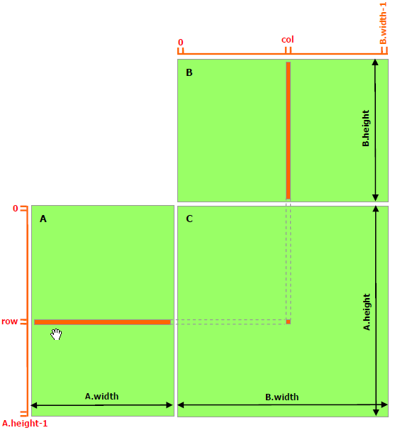

# 第6章 共享内存与页锁定主机内存

恭喜你来到了 CUDA 性能优化的入门篇章！在第 5 章中，我们掌握了设备内存管理的基本操作——分配、拷贝、释放。现在，是时候深入两种对 CUDA 程序性能至关重要的内存技术了：<strong>共享内存（Shared Memory）</strong>和<strong>页锁定主机内存（Page-Locked Host Memory）</strong>。前者是 GPU 芯片上的高速暂存器，可以大幅减少对全局内存的访问次数；后者则通过锁定物理内存页来显著提升主机与设备间的数据传输带宽。这两种技术看似独立，却都围绕着同一个目标——让数据以最快的速度到达计算单元。让我们开始探索吧！

## 6.1 共享内存基础

### 6.1.1 什么是共享内存？

<strong>共享内存（Shared Memory）</strong> 是 GPU 芯片上的一种高速内存，位于每个<strong>流多处理器（Streaming Multiprocessor, SM）</strong>内部。使用 `__shared__` 内存空间说明符来声明。共享内存与全局内存（Global Memory）相比具有以下显著特点：

| 特性 | 共享内存（Shared Memory） | 全局内存（Global Memory） |
| :--- | :--- | :--- |
| <strong>物理位置</strong> | GPU 芯片上（on-chip SRAM） | GPU 显存颗粒（off-chip DRAM / HBM） |
| <strong>访问延迟</strong> | 极低（约 20-30 个时钟周期） | 高（约 200-800 个时钟周期） |
| <strong>带宽</strong> | 极高（~1 TB/s 级别，SM 内） | 较低（~数百 GB/s，GDDR6/HBM2e） |
| <strong>作用域</strong> | 单个线程块（block）内可见 | 所有线程可见 |
| <strong>生命周期</strong> | 与线程块同生命周期 | 整个应用程序（跨内核启动） |
| <strong>容量</strong> | 较小（16-164 KB/SM，视架构） | 大（数 GB 到数十 GB） |
| <strong>管理方式</strong> | 程序员显式管理 | 运行时管理 + L2 缓存辅助 |

共享内存的定位是<strong>程序员管理的暂存器（scratchpad memory）或软件管理的缓存（software-managed cache）</strong>。与 CPU 中由硬件自动管理的 L1/L2 缓存不同，共享内存中的数据加载和存储完全由程序员在代码中显式控制。这给了我们极大的灵活性——我们可以根据算法需求精确地决定哪些数据驻留在共享内存中、何时加载、何时使用、何时写回全局内存。

共享内存的典型使用场景包括：
- 线程块内线程间的数据共享和协作
- 减少对全局内存的冗余访问（数据重用）
- 实现高效的数据归约（reduction）
- 改善非合并访问模式（如矩阵转置）

### 6.1.2 静态共享内存

<strong>静态共享内存</strong>在编译时声明，大小是固定的编译期常量。声明方式为在变量声明前添加 `__shared__` 修饰符：

```cuda
// 一维静态共享内存数组
__shared__ float sharedData[256];
__shared__ int   hist[1024];

// 二维静态共享内存——分块操作中最常用
__shared__ float tile[16][16];
__shared__ double As[32][32];

// 单个共享变量（所有线程共享）
__shared__ int blockCounter;
```

静态共享内存的大小必须在编译时确定。数组边界必须是常量表达式（constexpr 或字面量）。这意味着你无法根据内核启动参数动态调整静态共享内存的大小。

### 6.1.3 动态共享内存

当共享内存的大小在编译时无法确定时（例如，它取决于内核启动参数），需要使用<strong>动态共享内存</strong>（也称为 <strong>extern shared memory</strong>）。

<strong>声明方式</strong>：

```cuda
// 声明动态共享内存 —— 只声明一次
extern __shared__ float sharedData[];
```

注意以下几点：
- 使用 `extern` 关键字。
- 数组大小留空（`[]`）。
- <strong>每个内核只能有一个 `extern __shared__` 声明</strong>。

<strong>内核启动时指定大小</strong>：

动态共享内存的大小在内核启动时通过第三个执行配置参数指定（单位是字节）：

```cuda
size_t sharedMemSize = blockDim.x * sizeof(float);
MyKernel<<<gridDim, blockDim, sharedMemSize>>>(...);
//                              ^^^^^^^^^^^^^^^^
//                              每块的动态共享内存字节数
```

<strong>多个动态共享数组</strong>：

如果需要在同一个内核中使用多个动态共享数组，需要手动管理它们的内存偏移：

```cuda
extern __shared__ char sMem[];  // 原始字节数组

// 手动分区
float *sFloats = (float *)sMem;                        // 从偏移 0 开始
int   *sInts   = (int *)(sMem + numFloats * sizeof(float)); // 紧随其后
short *sShorts = (short *)(sMem + numFloats * sizeof(float)
                                   + numInts * sizeof(int));

// 确保总大小不超过 sharedMemSize
```

> <strong>注意</strong>：动态共享内存的指针管理需要手动计算偏移量。如果偏移量计算错误，可能导致两个数组重叠或访问越界，且不会触发任何运行时错误——这会导致难以调试的数据损坏。

### 6.1.4 共享内存的使用模式

无论是静态还是动态共享内存，典型的使用遵循类似的<strong>三步循环模式</strong>：

```
循环（对于每个数据分块）：
  1. 加载：所有线程协作将数据从全局内存加载到共享内存
  2. 同步：__syncthreads() 确保所有线程加载完毕
  3. 计算：在共享内存中的数据上进行高效计算
  4. 同步：__syncthreads() 确保计算完毕，准备加载下一批数据
```

`__syncthreads()` 是一个<strong>块内屏障（barrier）</strong>，确保块内所有线程都到达该同步点后才能继续执行。在共享内存编程中，`__syncthreads()` 的使用是<strong>不可或缺的</strong>——如果一些线程开始计算而另一些线程还未将数据加载到共享内存，使用的将是未初始化（垃圾）的数据。

## 6.2 矩阵乘法——无共享内存版本

### 6.2.1 朴素实现的性能分析

在展示共享内存如何优化性能之前，让我们先实现一个朴素的矩阵乘法，作为性能基线（baseline）。矩阵乘法 $C = A \times B$（其中 A 是 $M \times K$，B 是 $K \times N$）的每个元素计算如下：

$$C_{ij} = \sum_{k=0}^{K-1} A_{ik} \cdot B_{kj}$$

朴素实现中，矩阵以<strong>行主序（row-major order）</strong>存储：

```
M(row, col) = *(M.elements + row * M.width + col)
```

```cuda
// 矩阵数据结构（行主序）
typedef struct {
    int width;
    int height;
    float *elements;
} Matrix;

#define BLOCK_SIZE 16

// 朴素矩阵乘法内核——每个线程读取 A 的一整行和 B 的一整列
__global__ void MatMulKernel(Matrix A, Matrix B, Matrix C)
{
    // 每个线程计算 C 的一个元素
    float Cvalue = 0;
    int row = blockIdx.y * blockDim.y + threadIdx.y;
    int col = blockIdx.x * blockDim.x + threadIdx.x;

    for (int e = 0; e < A.width; ++e)
    {
        Cvalue += A.elements[row * A.width + e]
                * B.elements[e * B.width + col];
    }
    C.elements[row * C.width + col] = Cvalue;
}
```

<div align="center">
  
  <p>图 6.1 无共享内存的矩阵乘法：每个线程读取 A 的一整行和 B 的一整列。每个 A 的元素被 B.width 个不同的线程重复读取，每个 B 的元素被 A.height 个不同的线程重复读取</p>
</div>

### 6.2.2 全局内存带宽分析

这个朴素实现存在严重的<strong>全局内存带宽浪费</strong>：

- A 的每个元素被 $B.width$ 个不同的线程重复读取。
- B 的每个元素被 $A.height$ 个不同的线程重复读取。

对于 $1024 \times 1024$ 的矩阵乘法：
- A 的读取总量：$1024^2 \times 1024 = 1024^3 = 2^{30}$ 次 float 读取（4 GB 的读取数据量）
- B 的读取总量：同样 $2^{30}$ 次 float 读取
- 每个元素平均被读取了 1024 次

虽然 L2 缓存可以缓解部分冗余读取，但 L2 的容量（通常 1-6 MB）远不足以容纳整个矩阵（1024x1024x4 = 4 MB 每个矩阵）。大多数读取仍然会穿透缓存，直接访问全局内存。结果是：内核的执行时间几乎完全受限于全局内存带宽，GPU 的计算能力远未充分利用。

<strong>算术强度分析</strong>（Arithmetic Intensity）：

朴素矩阵乘法的算术强度（FLOP / Byte）为：
- 每个输出元素需要 $2 \times K$ 次 FLOP（K 次乘法 + K 次加法），但需要 $2 \times K$ 次全局内存读取（K 次从 A，K 次从 B）
- FLOP/Byte = $(2K) / (2K \times 4) = 1 / 4 = 0.25$ FLOP/B

这只是理论算术强度的下限。实际算术强度更低，因为还有写入 C 的开销。0.25 FLOP/B 意味着这个内核是<strong>严重内存瓶颈</strong>的——在大多数 GPU 上，它只能利用不到 10% 的峰值计算吞吐量。

## 6.3 矩阵乘法——共享内存优化

### 6.3.1 分块算法（Tiling）的原理

<strong>分块（Tiling / Blocking）</strong>是解决上述带宽浪费问题的核心技术。其核心思想是：

1. 将输出矩阵 C 划分为多个 $BLOCK\_SIZE \times BLOCK\_SIZE$ 的<strong>子矩阵（tile）</strong>。
2. 每个线程块（thread block）负责计算一个 C 的子矩阵。
3. 为了计算这个子矩阵，需要 A 和 B 中对应的"条带"。
4. 将这些"条带"一次一个子块地<strong>加载到共享内存</strong>中。
5. 在共享内存中完成这个子块的全部乘加运算。
6. 移动到下一个子块，重复上述过程。

通过这种方式：
- A 的每个元素只被读取 $(B.width / BLOCK\_SIZE)$ 次（而非 $B.width$ 次）。
- B 的每个元素只被读取 $(A.height / BLOCK\_SIZE)$ 次（而非 $A.height$ 次）。

对于 $BLOCK\_SIZE = 16$ 和 $1024 \times 1024$ 矩阵：全局内存读取次数减少到 $1/16$，即<strong>减少了 93.75%</strong>。

算术强度提升到：$(2K) / (2K \times 4 / 16) = 4$ FLOP/B（提升了 16 倍）。

<div align="center">
  
  <p>图 6.2 使用共享内存的分块矩阵乘法：每个线程块（16×16）将 A 和 B 的对应分块加载到共享内存中（一次一个子块），在高速共享内存中完成乘加操作，大幅减少全局内存访问</p>
</div>

### 6.3.2 分块矩阵乘法的完整实现

以下是使用共享内存的完整矩阵乘法实现。为了支持子矩阵的灵活表示，我们在 Matrix 结构体中添加了 `stride` 字段：

```cuda
// 增强的矩阵结构体（支持子矩阵）
typedef struct {
    int width;
    int height;
    int stride;     // 行步长——使子矩阵表示成为可能
    float *elements;
} Matrix;

// ========== 辅助设备函数 ==========

// 获取矩阵元素（通过 stride 而非 width 计算行偏移）
__device__ float GetElement(const Matrix A, int row, int col)
{
    return A.elements[row * A.stride + col];
}

// 设置矩阵元素
__device__ void SetElement(Matrix A, int row, int col, float value)
{
    A.elements[row * A.stride + col] = value;
}

// 获取 BLOCK_SIZE x BLOCK_SIZE 的子矩阵
// row 和 col 是"子矩阵坐标"（以 BLOCK_SIZE 为单位）
__device__ Matrix GetSubMatrix(Matrix A, int row, int col)
{
    Matrix Asub;
    Asub.width    = BLOCK_SIZE;
    Asub.height   = BLOCK_SIZE;
    Asub.stride   = A.stride;
    // 关键：子矩阵的 elements 指针指向原始矩阵中的偏移位置
    Asub.elements = &A.elements[A.stride * BLOCK_SIZE * row
                                         + BLOCK_SIZE * col];
    return Asub;
}

#define BLOCK_SIZE 16

// ========== 使用共享内存的分块矩阵乘法内核 ==========
__global__ void MatMulKernel(Matrix A, Matrix B, Matrix C)
{
    // 线程块的行索引和列索引（在"子矩阵网格"中）
    int blockRow = blockIdx.y;
    int blockCol = blockIdx.x;

    // 获取该线程块负责计算的 C 子矩阵
    Matrix Csub = GetSubMatrix(C, blockRow, blockCol);

    // 每个线程计算 Csub 的一个元素，累积到寄存器中的 Cvalue
    float Cvalue = 0;

    // 线程在块内的行列坐标
    int row = threadIdx.y;
    int col = threadIdx.x;

    // 遍历计算 Csub 所需的所有 A 和 B 的分块对（沿共享维度 K）
    for (int m = 0; m < (A.width / BLOCK_SIZE); ++m)
    {
        // 获取当前分块的 A 和 B 子矩阵
        Matrix Asub = GetSubMatrix(A, blockRow, m);
        Matrix Bsub = GetSubMatrix(B, m, blockCol);

        // 声明共享内存——存储 Asub 和 Bsub 的本地副本
        __shared__ float As[BLOCK_SIZE][BLOCK_SIZE];
        __shared__ float Bs[BLOCK_SIZE][BLOCK_SIZE];

        // 步骤 1：加载——每个线程从全局内存加载一个元素到共享内存
        As[row][col] = GetElement(Asub, row, col);
        Bs[row][col] = GetElement(Bsub, row, col);

        // 步骤 2：屏障同步——确保整个分块加载完毕
        __syncthreads();

        // 步骤 3：计算——在共享内存中执行分块的乘加操作
        for (int e = 0; e < BLOCK_SIZE; ++e)
        {
            Cvalue += As[row][e] * Bs[e][col];
        }

        // 步骤 4：屏障同步——确保计算完毕后，再加载下一个分块
        // （防止下一次迭代的加载覆盖正在被其他线程使用的共享内存）
        __syncthreads();
    }

    // 所有分块处理完毕，将累积结果写回全局内存
    SetElement(Csub, row, col, Cvalue);
}
```

### 6.3.3 代码深度解析

<strong>1. stride 字段的作用</strong>：

在标准矩阵中，`stride = width`。但在子矩阵表示中，`stride` 保持为原始矩阵的 stride，而 `elements` 指针指向子矩阵的起始位置。这使得子矩阵中的行偏移计算仍然是正确的——`(row * stride + col)` 指向的是原始矩阵中正确的全局位置。

<strong>2. 共享内存的加载策略</strong>：

每个线程负责加载一个元素。对于 16x16 = 256 线程的块，正好覆盖 256 个元素的子块。加载是<strong>合并的</strong>（连续的 `threadIdx.x` 读取连续的内存地址）。

<strong>3. 双重 __syncthreads() 的必要性</strong>：

- <strong>第一个屏障</strong>：确保所有线程都将数据加载到共享内存后才开始计算。如果没有这个屏障，某些线程可能在数据还未加载完时就开始读取共享内存。
- <strong>第二个屏障</strong>：确保所有线程都完成了当前分块的计算后，才加载下一个分块。如果没有这个屏障，一个线程在加载新数据时，另一个线程可能还在使用旧数据进行计算。

<strong>4. 累积到寄存器</strong>：

`Cvalue` 是一个自动变量（分配在寄存器中）。分块矩阵乘法的关键优势在于：<strong>A 和 B 的分块在共享内存中复用了 16 次</strong>（每个线程使用 As 的一行和 Bs 的一列，共 16x16 种组合），而中间结果一直保持在超高速的寄存器中，只在最后才写回全局内存一次。

### 6.3.4 主机端代码

对应的主机端代码：

```cuda
void MatMul(const Matrix A, const Matrix B, Matrix C)
{
    // 加载 A 到设备内存
    Matrix d_A;
    d_A.width = d_A.stride = A.width;
    d_A.height = A.height;
    size_t size = (size_t)A.width * A.height * sizeof(float);
    cudaMalloc(&d_A.elements, size);
    cudaMemcpy(d_A.elements, A.elements, size,
               cudaMemcpyHostToDevice);

    // 加载 B 到设备内存
    Matrix d_B;
    d_B.width = d_B.stride = B.width;
    d_B.height = B.height;
    size = (size_t)B.width * B.height * sizeof(float);
    cudaMalloc(&d_B.elements, size);
    cudaMemcpy(d_B.elements, B.elements, size,
               cudaMemcpyHostToDevice);

    // 在设备内存中分配 C
    Matrix d_C;
    d_C.width = d_C.stride = C.width;
    d_C.height = C.height;
    size = (size_t)C.width * C.height * sizeof(float);
    cudaMalloc(&d_C.elements, size);

    // 启动内核
    dim3 dimBlock(BLOCK_SIZE, BLOCK_SIZE);
    dim3 dimGrid(B.width / dimBlock.x, A.height / dimBlock.y);
    MatMulKernel<<<dimGrid, dimBlock>>>(d_A, d_B, d_C);

    // 从设备内存读取 C
    cudaMemcpy(C.elements, d_C.elements, size,
               cudaMemcpyDeviceToHost);

    // 释放设备内存
    cudaFree(d_A.elements);
    cudaFree(d_B.elements);
    cudaFree(d_C.elements);
}
```

<strong>重要前提</strong>：矩阵维度必须是 BLOCK_SIZE 的整数倍。在实际应用中，可以通过 padding（添加额外的零行/列）或处理边界条件（在内核中添加 `if` 检查）来处理非整数倍维度。

### 6.3.5 性能提升对比

对于一个典型的 1024x1024 矩阵乘法（float），通常在 RTX 3060 上可以获得：

| 实现 | 执行时间 | 有效带宽 | 相对朴素速度 |
| :--- | :---: | :---: | :---: |
| 朴素（无共享内存） | ~12 ms | ~50 GB/s | 1x |
| 分块共享内存（16x16） | ~0.8 ms | ~750 GB/s | ~15x |

这种量级的提升（一个数量级以上）清楚展示了共享内存在内存密集型计算中的巨大威力。

## 6.4 共享内存 Bank 架构与 Bank Conflict

### 6.4.1 共享内存的 Bank 组织

共享内存为了达到高并行带宽，被划分为<strong>等大小的内存模块（memory modules），称为 Bank（存储体）</strong>。这些 Bank 可以同时被访问，是实现高带宽的基础。

<strong>Bank 访问的并行规则</strong>：

任何涉及 $n$ 个地址、且这些地址恰好落在 $n$ 个不同 Bank 中的内存读取或写入请求，都可以被<strong>同时服务</strong>，从而获得相当于单个 Bank $n$ 倍的总体带宽。

<strong>Bank 分配规则</strong>（大多数架构）：

- 共享内存被分为 <strong>32 个 Bank</strong>（与 warp 大小 32 匹配，不是巧合）。
- 连续的 <strong>4 字节</strong>（32 位）字被分配到连续的 Bank 中，循环往复。
- 具体映射公式：
  ```
  Bank编号 = (字节地址 / 4) % 32
  ```
- 如果一个数据类型大于 4 字节（如 `double` 8 字节、`float4` 16 字节），一个元素跨越多个 Bank。

下面用一个实例来说明 Bank 分配：

```text
共享内存中的地址布局（字节地址 → Bank编号）：
字节 0..3    → Bank 0
字节 4..7    → Bank 1
字节 8..11   → Bank 2
...
字节 124..127 → Bank 31
字节 128..131 → Bank 0  (循环)
字节 132..135 → Bank 1
...
```

这意味着 `float array[32]` 的 32 个元素恰好各占一个不同的 Bank。

### 6.4.2 Bank Conflict 的概念

如果一次内存请求中有两个（或更多）地址落在<strong>同一个 Bank 的不同地址</strong>上，就会发生 <strong>Bank Conflict（存储体冲突）</strong>。此时这些访问无法同时进行，必须被<strong>串行化</strong>。

硬件将带有 Bank Conflict 的内存请求拆分为尽可能多的独立无冲突请求。吞吐量将按所需独立请求次数成比例降低。如果独立请求次数为 $n$，则初始请求被称为造成了<strong>$n$-way Bank Conflict</strong>。

<strong>特殊情况——广播（Broadcast）</strong>：

如果一次请求中的所有地址落在<strong>同一个 Bank 的同一个地址</strong>上（即所有线程读取完全相同的共享内存位置），硬件会执行一次<strong>广播</strong>——同一个值被发送给所有线程。这<strong>不会造成 Bank Conflict</strong>。

下面通过具体示例来理解各种访问模式的 Bank Conflict 情况：

```cuda
__shared__ float data[64];  // 64 floats, Bank 0..31, Bank 0..31

// 示例 1：连续访问（无冲突）
float val = data[tid];      // 线程 tid 访问 data[tid]
// Bank[tid] = tid % 32 —— 每个线程访问不同的 Bank（tid=0→Bank0, tid=1→Bank1, ...）
// 无冲突！

// 示例 2：步长为 2 的访问（2-way Bank Conflict）
float val = data[tid * 2];  // 线程 tid 访问 data[tid * 2]
// Bank[tid*2] = (tid*2) % 32
// 线程 0→Bank 0, 线程 1→Bank 2, ..., 线程 16→Bank 0 (重复!)
// 2-way Bank Conflict

// 示例 3：步长为 32 的访问（32-way Bank Conflict——最坏情况！）
float val = data[tid * 32]; // 线程 tid 访问 data[tid * 32]
// Bank[tid*32] = (tid*32) % 32 = 0 —— 所有线程都访问 Bank 0!
// 32-way Bank Conflict —— 访问被完全串行化（32 倍减速）

// 示例 4：相同地址的广播（无冲突）
float val = data[10];       // 所有线程都访问 data[10] = Bank 10 的同一地址
// 硬件广播 —— 无冲突！
```

### 6.4.3 不同计算能力的 Bank 组织差异

Bank 的组织方式在不同计算能力下有一些细微但重要的差异：

<strong>计算能力 3.x（Kepler）</strong>：
- 32 个 Bank，4 字节字顺序分配。
- 同一 warp 的两个线程访问同一 Bank 的<strong>不同</strong> 4 字节字时产生 Bank Conflict。

<strong>计算能力 5.x / 6.x（Maxwell / Pascal）</strong>：
- 同样是 32 个 Bank，4 字节顺序分配。
- 硬件具有更好的并行 Bank 解析能力。

<strong>计算能力 7.x / 8.x（Volta / Ampere）</strong>：
- 32 个 Bank，4 字节顺序分配。但硬件可以处理更复杂的访问模式。
- 对 `double`（8 字节）类型的访问可能会产生不同的 Bank 行为（因为一个 double 跨越 2 个 Bank）。

> <strong>提示</strong>：在你的设备上，可以通过 `cudaDeviceGetAttribute()` 查询 Bank 相关信息。例如，`cudaDevAttrSharedMemBankSizeFourBytes` 属性确认 Bank 大小是否为 4 字节。

### 6.4.4 避免 Bank Conflict 的常用策略

<strong>策略 1：Padding（填充列）</strong>

这是最简单有效的策略——在共享内存数组中添加一个额外的列，改变元素在 Bank 中的映射关系：

```cuda
// 潜在冲突：当访问 tile[threadIdx.x][threadIdx.x * 2] 时
// __shared__ float tile[32][32];

// 修复：padding 一列
__shared__ float tile[32][33];  // 33 = 32 + 1 (padding)
```

为什么能解决？因为每行多了一列（4 字节），行宽从 128 字节变为 132 字节。Bank 分配的计算变为：
- 原方案：`tile[0][0]` = Bank 0, `tile[0][32]` = Bank 0（重复！）
- Padding 方案：`tile[0][0]` = Bank 0, `tile[1][0]` = Bank 1（不同！）

<strong>策略 2：改变访问模式</strong>

如果算法允许，可以调整数据加载或存储的顺序，使同一 warp 中的线程访问不同的 Bank。例如，将"按列访问"改为"按行访问"，或将数据先在共享内存中重排。

<strong>策略 3：利用 8 字节 Bank 模式</strong>

在某些架构上（如 CC 8.0+），可以配置共享内存为 8 字节 Bank 模式。对于 `double` 类型数据，这意味着一个 double 恰好在一个 Bank 中，避免了 4 字节模式下的跨 Bank 问题。

### 6.4.5 动态共享内存的完整示例

本节给出一个使用动态共享内存的完整且实用的例子。考虑一个需要处理不同大小分块的一维归约（reduction）操作：

```cuda
/**
 * 动态共享内存归约内核
 *
 * 使用动态共享内存，使得分块大小可以在运行时决定
 * 而不需要在编译时写死
 */
__global__ void DynamicReduction(const float *input, float *output, int N)
{
    // 动态共享内存声明
    extern __shared__ float sdata[];

    unsigned int tid = threadIdx.x;
    unsigned int i = blockIdx.x * (blockDim.x * 2) + tid;

    // 每个线程加载两个元素（减少线程数，提高每线程工作量）
    float mySum = 0.0f;
    if (i < N) mySum += input[i];
    if (i + blockDim.x < N) mySum += input[i + blockDim.x];

    sdata[tid] = mySum;
    __syncthreads();

    // 标准归约循环（在共享内存中进行）
    for (unsigned int s = blockDim.x / 2; s > 0; s >>= 1)
    {
        if (tid < s)
        {
            sdata[tid] += sdata[tid + s];
        }
        __syncthreads();
    }

    // 线程 0 写入本块的结果
    if (tid == 0)
    {
        output[blockIdx.x] = sdata[0];
    }
}

// 主机端调用
void launchDynamicReduction(const float *d_input, float *d_output, int N)
{
    // 根据问题大小动态选择分块大小
    int threads;
    if (N < 256)       threads = 64;
    else if (N < 1024) threads = 128;
    else if (N < 4096) threads = 256;
    else               threads = 512;

    int blocks = (N + threads * 2 - 1) / (threads * 2);
    size_t sharedMemSize = threads * sizeof(float);  // 动态共享内存大小

    printf("Launching reduction: %d blocks x %d threads, "
           "%zu bytes shared memory per block\n",
           blocks, threads, sharedMemSize);

    DynamicReduction<<<blocks, threads, sharedMemSize>>>(
        d_input, d_output, N);
}
```

这个例子展示了动态共享内存的核心价值：分块大小（及相应的共享内存使用量）可以在运行时根据问题规模灵活调整，而不需要在编译时为每种可能的大小写单独的静态内核。

### 6.4.6 共享内存与 L1 缓存的配置

在 **Maxwell 到 Turing（CC 5.x ~ 7.5）** 架构中，共享内存和 L1 数据缓存共享同一片片上 SRAM，你可以配置每个 SM 上分配给两者的比例。

在 **Ampere 及更新架构（CC 8.x+）** 中，两者已物理分离，共享内存的容量是独立且固定的（可配置为不同大小档位），`cudaDeviceSetCacheConfig` 不再影响共享内存容量，仅作用于 L1 缓存策略。

你可以通过以下 API 查询和设置缓存偏好：

```cuda
// 查询当前配置
cudaFuncCache cacheConfig;
cudaDeviceGetCacheConfig(&cacheConfig);

// 设置后续内核的缓存偏好
// - cudaFuncCachePreferNone:    默认配置
// - cudaFuncCachePreferShared:  优先共享内存（旧架构中会减少 L1）
// - cudaFuncCachePreferL1:      优先 L1 缓存（旧架构中会减少共享内存）
cudaDeviceSetCacheConfig(cudaFuncCachePreferShared);
```

不同架构的默认配置和可用选项不同。具体每个 SM 上有多少 KB 可以分配给共享内存，可以通过 `cudaGetDeviceProperties()` 获取。

## 6.5 页锁定主机内存

### 6.5.1 从可分页内存的问题说起

在标准操作系统中，`malloc()` 分配的主机内存是<strong>可分页的（pageable）</strong>。操作系统的虚拟内存管理器可以随时将这些内存页换出（swap out）到磁盘，以释放物理内存给其他进程使用。这种灵活性对普通应用是好事，但对需要在 CPU 和 GPU 之间传输大量数据的 CUDA 程序来说，却是一个严重的性能问题。

<strong>为什么可分页内存影响 CUDA 传输性能？</strong>

GPU 的 DMA（Direct Memory Access）引擎通过<strong>物理地址</strong>访问主机内存。对于可分页内存：
1. 操作系统可能在任何时刻将内存页换出或重定位。
2. CUDA 驱动程序无法信任可分页内存的虚拟地址直接对应稳定的物理地址。
3. 因此，驱动程序必须先将数据从可分页缓冲区<strong>拷贝到</strong>一个临时的、操作系统保证不会移动的<strong>页锁定缓冲区</strong>（通常称为 staging buffer）。
4. 然后 DMA 引擎从这个 staging buffer 中进行真正的 PCIe 传输。

这导致了<strong>两次拷贝</strong>——一次从应用缓冲区到 staging buffer，一次从 staging buffer 到 GPU。这大约使有效带宽<strong>减半</strong>。

<strong>页锁定（Pinned）内存的解决方案</strong>：

通过调用 CUDA API，应用程序可以显式地<strong>锁定（pin）</strong>主机内存页，确保它们不会被操作系统换出或移动。这样 DMA 引擎就可以直接使用这些物理页，避免了 staging buffer 的额外拷贝。

### 6.5.2 cudaHostAlloc / cudaMallocHost / cudaHostRegister

CUDA 运行时提供了以下几种页锁定内存的管理函数：

```cuda
// 1. 分配页锁定内存（推荐方式——提供更多选项）
cudaError_t cudaHostAlloc(void **ptr, size_t size, unsigned int flags);
cudaError_t cudaFreeHost(void *ptr);

// 2. cudaMallocHost —— cudaHostAlloc 的简化版（flags = 0）
cudaError_t cudaMallocHost(void **ptr, size_t size);

// 3. 将已有 malloc 分配的内存注册为页锁定
cudaError_t cudaHostRegister(void *ptr, size_t size, unsigned int flags);
cudaError_t cudaHostUnregister(void *ptr);
```

<strong>使用示例</strong>：

```cuda
float *h_pinned;
// 分配页锁定内存
cudaMallocHost(&h_pinned, N * sizeof(float));
// ... 像普通内存一样使用 ...
cudaFreeHost(h_pinned);

// 或者：将已有的 malloc 内存注册为页锁定
float *h_data = (float *)malloc(size);
cudaHostRegister(h_data, size, cudaHostRegisterDefault);
// ... 使用 h_data 进行高效的 DMA 传输 ...
cudaHostUnregister(h_data);
free(h_data);
```

### 6.5.3 页锁定内存的优势和代价

<strong>优势</strong>：

1. <strong>更高的传输带宽</strong>：由于避免了 staging buffer 的额外拷贝，HtoD 和 DtoH 传输的带宽通常可以提升 2-5 倍。

2. <strong>支持异步拷贝</strong>：只有在页锁定内存上，`cudaMemcpyAsync()` 才能实现真正的异步传输。可分页内存上的异步拷贝会被驱动程序降级为同步拷贝。

3. <strong>支持流并发</strong>：页锁定内存是使用 CUDA 流（Streams）实现数据传输与内核执行并发重叠的<strong>必要条件</strong>（详见第 7 章）。

4. <strong>可映射到设备地址空间</strong>：页锁定内存可以被映射到 GPU 的地址空间，实现零拷贝（Zero-Copy）访问。

<strong>代价与注意事项</strong>：

1. <strong>稀缺资源</strong>：页锁定内存是稀缺的系统资源。它的分配会在可分页内存分配很早就开始失败（因为锁定物理页减少了操作系统可用的内存管理灵活性）。

2. <strong>系统性能影响</strong>：消耗过多的页锁定内存会<strong>减少操作系统可用于分页的物理内存总量</strong>，降低整个系统的性能。因此，只在确实需要时使用页锁定内存，并尽快释放。

3. <strong>分配开销较大</strong>：`cudaHostAlloc()` 的分配时间比 `malloc()` 长得多（涉及操作系统级的页面锁定操作）。不适合频繁的分配/释放。

> <strong>最佳实践</strong>：在程序初始化阶段一次性分配所需的页锁定内存，在程序运行期间重复使用，在程序结束时统一释放。

## 6.6 页锁定内存的高级特性

### 6.6.1 便携内存（Portable Memory）

一块页锁定内存默认情况下，其性能优势（更高的 DMA 带宽、异步能力）仅对<strong>分配时作为当前设备</strong>的那个 GPU 有效。在其他 GPU 上访问这块内存时，性能可能下降。

要使这些优势对所有 GPU 都可用，需要传入 `cudaHostAllocPortable` 标志：

```cuda
cudaHostAlloc(&ptr, size, cudaHostAllocPortable);
```

或在注册时：

```cuda
cudaHostRegister(ptr, size, cudaHostRegisterPortable);
```

这对于多 GPU 应用尤为重要——确保每个 GPU 都能以最高带宽访问共享的主机内存缓冲区。

### 6.6.2 写结合内存（Write-Combining Memory）

默认情况下，页锁定主机内存被分配为<strong>可缓存（cacheable）</strong>的。这意味着 CPU 访问这块内存时会经过 L1 和 L2 缓存。这在主机需要频繁读取这块内存时是好事，但如果主机<strong>只写入不读取</strong>（这是 GPU 输入数据的典型场景），缓存反而是一种浪费。

可以通过传入 `cudaHostAllocWriteCombined` 标志来分配<strong>写结合（write-combining）</strong>内存：

```cuda
cudaHostAlloc(&ptr, size, cudaHostAllocWriteCombined);
```

写结合内存的特性：

1. <strong>不占用 CPU 缓存</strong>：写操作不经过 L1/L2 缓存，释放了更多缓存给应用程序的其他部分。
2. <strong>PCIe 传输更快</strong>：写结合内存在 PCIe 总线传输期间<strong>不被 snoop（总线监听）</strong>，可以提升传输性能高达<strong> 40%</strong>。
3. <strong>主机端读取极慢</strong>：从写结合内存中读取数据（通过 CPU）是非常缓慢的，因为读取不会经过缓存且硬件针对写入合并而非读取优化。

> <strong>注意</strong>：写结合内存<strong>只应用于主机只写入、不读取的缓冲区</strong>。典型场景：在主机上构造输入数据，然后通过 DMA 发送到 GPU。绝不要将计算结果也放到写结合内存中再让 CPU 读取。

### 6.6.3 映射内存（Zero-Copy / Mapped Memory）

一块页锁定主机内存还可以被<strong>映射（map）</strong>到设备的地址空间中。这意味着内核可以直接通过设备端指针<strong>访问主机内存</strong>，无需显式调用 `cudaMemcpy()`。这种技术被称为<strong>零拷贝（Zero-Copy）</strong>。

<strong>分配映射内存</strong>：

```cuda
// 分配可映射的页锁定内存
cudaHostAlloc(&ptr, size, cudaHostAllocMapped);

// 获取对应的设备端指针
float *d_ptr;
cudaHostGetDevicePointer(&d_ptr, ptr, 0);

// 内核可以直接使用 d_ptr 访问主机内存
kernel<<<grid, block>>>(d_ptr, ...);
```

或通过注册已有内存：

```cuda
float *h_data = (float *)malloc(size);
cudaHostRegister(h_data, size, cudaHostRegisterMapped);
float *d_data;
cudaHostGetDevicePointer(&d_data, h_data, 0);
```

> <strong>注意</strong>：如果主机和设备使用<strong>统一地址空间（UVA）</strong>，且内存是通过 `cudaHostAlloc()` 分配的，那么主机指针和<strong>设备指针是同一个值</strong>。此时不需要、也不应该调用 `cudaHostGetDevicePointer()`（调用会返回 `cudaErrorInvalidValue`）。

<strong>启用映射内存支持</strong>：

在分配映射内存之前，必须通过 `cudaSetDeviceFlags()` 启用此功能：

```cuda
// 必须在任何其他 CUDA 调用之前执行
cudaSetDeviceFlags(cudaDeviceMapHost);
```

如果跳过这一步，`cudaHostGetDevicePointer()` 将返回错误。可以通过检查设备属性查询支持情况：

```cuda
cudaDeviceProp prop;
cudaGetDeviceProperties(&prop, 0);
if (prop.canMapHostMemory) {
    printf("Device supports mapped host memory.\n");
}
```

<strong>零拷贝的优缺点</strong>：

<strong>优点</strong>：
1. <strong>无需显式拷贝</strong>：内核直接读写主机内存，编程模型更简单。
2. <strong>自动重叠传输与计算</strong>：在内核访问映射内存时，数据传输自动发生，与内核执行自然重叠。
3. <strong>节省设备内存</strong>：不需要在设备端复制一份数据副本。

<strong>缺点</strong>：
1. <strong>PCIe 带宽远低于设备内存带宽</strong>：在独立 GPU 上，零拷贝带宽受限于 PCIe 总线（例如 PCIe 3.0 x16 约 12-14 GB/s），而设备内存带宽可达数百 GB/s 到 1 TB/s。零拷贝访问可能比访问设备内存慢一个数量级。
2. <strong>同步要求</strong>：由于映射内存被主机和设备共享，应用程序<strong>必须</strong>使用流或事件来同步内存访问，避免读后写（RAW）、写后读（WAR）、写后写（WAW）等数据冒险。

<strong>适用场景</strong>：

- <strong>集成 GPU（如 Tegra、Jetson）</strong>：主机和设备内存在物理上是同一块内存，此时<strong>应始终使用零拷贝</strong>以避免完全冗余的拷贝。
- <strong>独立 GPU 上偶尔访问的数据</strong>：如果内核只需要偶尔访问某块主机数据（而非频繁访问），零拷贝可以节省显式拷贝的代码复杂度。
- <strong>设备显存不够用时的后备方案</strong>：当数据量超过显存大小时，零拷贝可以作为"溢出区"。

### 6.6.4 原子操作在映射内存上的限制

需要特别注意：<strong>在映射的页锁定内存上由设备执行的原子操作（Atomic Functions），从主机或其他设备的角度来看不是原子的</strong>。这是因为 PCIe 总线的原子性保证是有限的。如果你需要在主机和设备之间进行原子同步，应该使用 CUDA 流和事件机制，而非依赖映射内存上的原子操作。

另外，CUDA 运行时要求从设备发起的对主机内存的 1 字节、2 字节、4 字节和 8 字节自然对齐的加载和存储，从主机和其他设备的角度来看是作为<strong>单一访问（single access）</strong>来保持的。某些平台上的原子操作可能被硬件拆分为独立的 load 和 store 操作。

## 6.7 零拷贝（映射内存）的完整实战

### 6.7.1 零拷贝内核示例

下面是一个完整的零拷贝（mapped memory）示例，展示内核如何直接访问主机内存：

```cuda
#include <stdio.h>
#include <cuda_runtime.h>

/**
 * 零拷贝内核：直接访问映射的主机内存
 * 在独立 GPU 上，每次访问都是通过 PCIe 总线进行的
 */
__global__ void ZeroCopyKernel(const float *input, float *output, int N)
{
    int i = blockDim.x * blockIdx.x + threadIdx.x;
    if (i < N)
    {
        // 直接读写映射内存（通过 PCIe）
        output[i] = input[i] * 2.0f + 1.0f;
    }
}

int main()
{
    int N = 1 << 20; // 1M 元素
    size_t size = N * sizeof(float);

    // 步骤 1：必须在其他 CUDA 调用之前启用映射
    cudaSetDeviceFlags(cudaDeviceMapHost);

    // 步骤 2：检查设备是否支持映射内存
    cudaDeviceProp prop;
    cudaGetDeviceProperties(&prop, 0);
    if (!prop.canMapHostMemory)
    {
        printf("Device does not support mapped memory!\n");
        return -1;
    }

    // 步骤 3：分配可映射的页锁定内存
    float *h_input, *h_output;
    cudaHostAlloc(&h_input, size, cudaHostAllocMapped);
    cudaHostAlloc(&h_output, size, cudaHostAllocMapped);

    // 步骤 4：在主机端初始化输入数据
    for (int i = 0; i < N; i++)
    {
        h_input[i] = (float)i;
    }

    // 步骤 5：获取设备端指针（在 UVA 下可能和主机指针相同）
    float *d_input, *d_output;
    cudaHostGetDevicePointer(&d_input, h_input, 0);
    cudaHostGetDevicePointer(&d_output, h_output, 0);

    printf("Host ptr:  input=%p, output=%p\n",
           (void *)h_input, (void *)h_output);
    printf("Device ptr: input=%p, output=%p\n",
           (void *)d_input, (void *)d_output);
    // 在支持 UVA 的系统上，这些地址可能相同

    // 步骤 6：启动内核——无需 cudaMemcpy！
    int threadsPerBlock = 256;
    int blocksPerGrid = (N + threadsPerBlock - 1) / threadsPerBlock;
    ZeroCopyKernel<<<blocksPerGrid, threadsPerBlock>>>(
        d_input, d_output, N);

    // 步骤 7：同步设备——确保内核完成
    cudaDeviceSynchronize();

    // 步骤 8：在主机端直接验证结果（无需 cudaMemcpy！）
    int errors = 0;
    for (int i = 0; i < N; i++)
    {
        float expected = (float)i * 2.0f + 1.0f;
        if (fabsf(h_output[i] - expected) > 1e-5f)
        {
            if (errors < 5)
                printf("Error at %d: expected %f, got %f\n",
                       i, expected, h_output[i]);
            errors++;
        }
    }
    printf("Verification: %s (%d errors)\n",
           errors == 0 ? "PASSED" : "FAILED", errors);

    // 步骤 9：释放映射内存
    cudaFreeHost(h_input);
    cudaFreeHost(h_output);

    return 0;
}
```

### 6.7.2 零拷贝适用性决策树

```
你的 GPU 是集成的还是独立的？
├── 集成 GPU（Tegra, Jetson, 集成显卡）
│   └── 始终使用零拷贝！主机和设备共享物理内存，
│       显式拷贝是纯粹浪费。
│
└── 独立 GPU（GeForce, Quadro, Tesla, A-series）
    └── 数据使用模式是什么？
        ├── 大数据，每字节只被访问一次？
        │   └── 零拷贝可行（但需考虑 PCIe 带宽）。
        │      也考虑使用 cudaMemcpy + 分块流水线。
        │
        ├── 大数据，每字节被多次访问？
        │   └── 使用显式 cudaMemcpy 到设备内存。
        │      PCIe 带宽远低于设备内存带宽，多次访问会严重拖慢。
        │
        ├── 偶尔访问的小数据？
        │   └── 零拷贝方便——省去显式拷贝代码。
        │
        └── 设备内存不够用？
            └── 零拷贝可以作为"溢出区"。
               但性能会大幅下降，仅作为最后手段。
```

## 6.8 共享内存与占用率（Occupancy）

共享内存的使用量直接影响一个 SM 上可以同时驻留的线程块数量，从而影响<strong>占用率（Occupancy）</strong>。简单说，占用率就是 GPU 每个 SM（流多处理器）上，当前正在运行的 warp 数，和它理论上最多能跑的 warp 数的比值。占用率定义为：

$$\text{Occupancy} = \frac{\text{Active Warps per SM}}{\text{Maximum Warps per SM}}$$

### 6.8.1 共享内存如何影响占用率

每个 SM 上的共享内存总量是有限的（取决于架构，通常为 48-164 KB）。如果你每个线程块使用了很多共享内存，SM 上能同时驻留的线程块数量就会减少。

<strong>示例计算</strong>：

假设一个 SM 有 100 KB 可用共享内存，最大可驻留 2048 线程（64 warps）。

| 每块共享内存 | 每块线程数 | 最大驻留块数 | 驻留线程数 | 占用率 |
| :--- | :---: | :---: | :---: | :---: |
| 10 KB | 256 (8 warps) | 10 (受 SMem 限制) | 2560 (但上限 2048) | 64/64 = 100% |
| 20 KB | 256 (8 warps) | 5 (受 SMem 限制) | 1280 (40 warps) | 40/64 = 62.5% |
| 40 KB | 256 (8 warps) | 2 (受 SMem 限制) | 512 (16 warps) | 16/64 = 25% |
| 40 KB | 1024 (32 warps) | 2 (受 SMem 限制) | 2048 (64 warps) | 64/64 = 100% |

这个例子表明：
- <strong>更多的共享内存使用会降低占用率</strong>——因为更少的块能同时驻留。
- <strong>更大的块大小（更多线程/块）可以补偿</strong>——因为每个块贡献更多的活跃 warp。

### 6.8.2 占用率与性能的权衡

占用率不是越高越好。存在一个经典的权衡：

- <strong>高占用率</strong>：更多活跃 warp → 更好的延迟隐藏能力。但如果每个线程使用了很少的共享内存和寄存器，可能意味着内核的算术强度不够。
- <strong>低占用率</strong>：每个线程可以使用更多共享内存和寄存器 → 更好的单线程性能。但过低的占用率（如 25% 以下）可能导致 SM 没有足够的活跃 warp 来隐藏内存延迟。

<strong>一般指导原则</strong>：
- 内存密集型内核（如矩阵乘法）：共享内存的使用带来的带宽节省通常远大于占用率下降的代价。50% 的占用率可能已经足够。
- 计算密集型内核：更高的占用率有助于隐藏指令延迟。
- 延迟关键型内核：尽可能提高占用率。

### 6.8.3 使用 Occupancy Calculator API

CUDA 提供了 Occupancy Calculator API 来帮助你在不使用电子表格的情况下计算最优配置：

```cuda
// 查询内核的最优线程块大小
int minGridSize, blockSize;
cudaOccupancyMaxPotentialBlockSize(
    &minGridSize, &blockSize,    // 输出
    MyKernel,                    // 内核函数指针
    0,                           // 动态共享内存大小（0 = 无动态）
    0                            // 每块线程数上限（0 = 无限制）
);
printf("Suggested block size: %d (yields %d blocks minimum)\n",
       blockSize, minGridSize);

// 查询特定配置下每个 SM 的最大活跃块数
int maxActiveBlocks;
cudaOccupancyMaxActiveBlocksPerMultiprocessor(
    &maxActiveBlocks,
    MyKernel,
    blockSize,
    sharedMemSize  // 每块使用的动态共享内存（字节）
);
printf("Max active blocks per SM: %d\n", maxActiveBlocks);

// 计算占用率
int maxBlocksPerSM;  // 从设备属性获取
cudaDeviceProp prop;
cudaGetDeviceProperties(&prop, 0);
float occupancy = (float)(maxActiveBlocks * blockSize) /
                  (float)prop.maxThreadsPerMultiProcessor;
printf("Estimated occupancy: %.1f%%\n", occupancy * 100.0f);
```

### 6.8.4 寄存器使用与占用率

除了共享内存，<strong>寄存器使用量</strong>也是影响占用率的关键因素。每个 SM 有固定数量的寄存器（通常 65536 个 32 位寄存器）。每个线程使用的寄存器越多，SM 上能同时驻留的 warp 就越少。

你可以通过编译器选项限制寄存器使用：

```bash
# 限制内核最多使用 64 个寄存器（强制编译器将多余变量溢出到局部内存）
nvcc -maxrregcount=64 my_kernel.cu
```

或者使用 launch bounds 提示：

```cuda
// 告诉编译器：期望至少 4 个块/SM，每个块 256 线程
__global__ void __launch_bounds__(256, 4)
MyKernel(...) { ... }
```

> <strong>提示</strong>：寄存器溢出（spilling）到局部内存（local memory，实际上是全局内存中的一段）会显著影响性能。使用 `--ptxas-options=-v` 编译选项可以查看寄存器和共享内存的详细使用量。

### 6.8.5 使用 NVCC 标志检查资源使用

在编译内核时，可以通过 `--ptxas-options=-v` 标志获取每个内核的寄存器和共享内存使用量，这对评估占用率至关重要：

```bash
nvcc matrix_multiply.cu -o matmul -arch=sm_80 --ptxas-options=-v
```

输出示例：

```text
ptxas info    : Compiling entry function '_Z13MatMulKernel6MatrixS_S_' for 'sm_80'
ptxas info    : Function properties for _Z13MatMulKernel6MatrixS_S_
ptxas         :    0 bytes stack frame, 0 bytes spill stores, 0 bytes spill loads
ptxas info    : Used 32 registers, 4608 bytes smem, 352 bytes cmem[0]
```

这意味着：
- <strong>32 registers/thread</strong>：每个线程使用 32 个寄存器。如果 SM 有 65536 个寄存器，则每个 SM 最多可驻留 65536/32 = 2048 个线程 = 64 warps。
- <strong>4608 bytes smem/block</strong>：每个块使用 4608 字节（= 4.5 KB）共享内存。两个 16x16 float 数组（2 × 256 × 4 = 2048 字节）加上 kernel 参数和可能的 buffer。
- <strong>0 spill</strong>：没有寄存器溢出——所有变量都在寄存器中，性能最佳。

通过定期使用 `--ptxas-options=-v` 检查内核资源使用量，你可以跟踪优化过程中寄存器和共享内存的变化，在性能和占用率之间找到最佳平衡。

### 6.8.6 共享内存与 Warp 级别操作的关系

共享内存和 warp 级操作（warp shuffle）都可以用于线程块内的数据交换，但各有不同的适用场景：

| 特性 | 共享内存 | Warp Shuffle（`__shfl_sync`） |
| :--- | :--- | :--- |
| <strong>作用域</strong> | 整个线程块（所有 warp） | 单个 warp 内（32 线程） |
| <strong>延迟</strong> | ~20-30 周期 | ~5-10 周期（更快！） |
| <strong>灵活性</strong> | 任意访问模式 | 固定 pattern（shift, butterfly 等） |
| <strong>同步</strong> | `__syncthreads()` | `__syncwarp()` |
| <strong>占用资源</strong> | 共享内存（有限） | 不需要共享内存 |

<strong>选择合适的机制</strong>：

- <strong>跨 warp 通信</strong>：必须使用共享内存（warp shuffle 只能在 warp 内部工作）。
- <strong>Warp 内部的归约/扫描</strong>：优先使用 warp shuffle（更快，且节省共享内存）。
- <strong>复杂的数据共享模式</strong>：使用共享内存（提供完全灵活的访问模式）。
- <strong>优化组合</strong>：先用 warp shuffle 在 warp 内部归约，再用共享内存跨 warp 归约。这是高性能归约（reduction）的标准模式。

```cuda
// 组合使用 warp shuffle 和共享内存的高效归约
__global__ void HybridReduction(const float *input, float *output, int N)
{
    __shared__ float sdata[32];  // 共享内存：每 warp 一个元素

    unsigned int tid = threadIdx.x;
    unsigned int i = blockIdx.x * (blockDim.x * 2) + tid;

    // 加载数据
    float mySum = 0;
    if (i < N) mySum += input[i];
    if (i + blockDim.x < N) mySum += input[i + blockDim.x];

    // Warp 级别归约（使用 shuffle —— 不需要共享内存！）
    for (int offset = 16; offset > 0; offset /= 2)
    {
        mySum += __shfl_down_sync(0xffffffff, mySum, offset);
    }

    // 每个 warp 的线程 0 将结果写入共享内存
    if ((tid % 32) == 0)
    {
        sdata[tid / 32] = mySum;
    }
    __syncthreads();

    // 仅第一个 warp 进行跨 warp 归约
    if (tid < 32)
    {
        float val = (tid < blockDim.x / 32) ? sdata[tid] : 0;
        for (int offset = 16; offset > 0; offset /= 2)
        {
            val += __shfl_down_sync(0xffffffff, val, offset);
        }
        if (tid == 0)
        {
            output[blockIdx.x] = val;
        }
    }
}
```

这种混合方式将共享内存的使用量从 `blockDim.x` 个元素缩减到 `blockDim.x / 32` 个元素，大幅节省了共享内存，从而允许更多线程块同时驻留在 SM 上（更高占用率）。

### 6.8.7 使用 Nsight Compute 分析共享内存性能

<strong>NVIDIA Nsight Compute</strong> 是分析 CUDA 内核性能的强大工具。在调试共享内存相关的性能问题时，以下几个指标特别重要：

<strong>关键指标</strong>：

| 指标名 | 含义 | 期望值 |
| :--- | :--- | :--- |
| `shared_load_throughput` | 共享内存读取吞吐量 | 接近理论峰值 |
| `shared_store_throughput` | 共享内存写入吞吐量 | 接近理论峰值 |
| `shared_efficiency` | 共享内存访问效率 | 接近 100% |
| `shared_load_bank_conflict` | 共享内存读取 Bank Conflict 次数 | 越少越好（0 最佳） |
| `shared_store_bank_conflict` | 共享内存写入 Bank Conflict 次数 | 越少越好（0 最佳） |
| `l1tex__data_bank_conflicts_pipe_lsu_mem_shared_op_ld.sum` | 读取 Bank Conflict 详细计数 | 0 最佳 |
| `sm__warps_active.avg.pct_of_peak_sustained_elapsed` | 平均活跃 warp 比例 (%) | 越高越好（>50%） |

<strong>使用命令行分析</strong>：

```bash
# 分析内核，关注共享内存性能指标
ncu --metrics \
    shared_load_throughput,\
    shared_store_throughput,\
    shared_efficiency,\
    shared_load_bank_conflict \
    ./matrix_transpose

# 更详细的分析
ncu --set full ./matrix_transpose

# 对比两个内核（如：有/无 padding 的转置）
ncu --kernel-name TransposeShared ./matrix_transpose
```

预期分析结果（带 padding 的转置 vs 不带 padding）：

```text
== 转置（不带 padding：tile[32][32]）==
  shared_load_bank_conflict:  256 per launch
  shared_efficiency:          78.5%
  
== 转置（带 padding：tile[32][33]）==  
  shared_load_bank_conflict:  0 per launch
  shared_efficiency:          100.0%
```

这清楚地展示了 padding 如何消除 Bank Conflict。

<strong>使用 Nsight Compute GUI</strong>：

Nsight Compute 的 GUI 版本提供了更丰富的可视化界面，可以帮助你：
1. 定位哪些代码行产生了 Bank Conflict。
2. 查看内存访问模式的直观图示。
3. 与优化前的基线进行比较。

> <strong>提示</strong>：`ncu --set full` 虽然收集最全面的数据，但显著减慢内核执行速度。在开发过程中，建议先用 `--set basic` 快速扫描，再针对可疑的内核使用 `--set full` 深入分析。

## 6.9 动手体验：性能对比实验

### 6.9.1 实验一：矩阵转置——共享内存优化

矩阵转置是一个经典的共享内存优化案例。朴素转置会遇到严重的非合并访问问题——线程按行读取但按列写入（或相反），导致写入的 stride 为矩阵高度，完全是非合并的。使用共享内存分块可以完美解决这个问题。

完整可编译代码参见 `code/chapter6/matrix_transpose.cu`。

核心实现解析：

```cuda
#define TILE_DIM 32

// 朴素转置：非合并写入（stride 为 height）
__global__ void TransposeNaive(const float *input, float *output,
                               int width, int height)
{
    int col = blockIdx.x * blockDim.x + threadIdx.x;
    int row = blockIdx.y * blockDim.y + threadIdx.y;
    if (col < width && row < height)
        output[col * height + row] = input[row * width + col];
        //     ^^^^^^^^^^^^^^^^^^^ 非合并写入！
}

// 共享内存优化转置：分块内完成转置，合并读写
__global__ void TransposeShared(const float *input, float *output,
                                int width, int height)
{
    // tile 多一列 padding 避免 bank conflict
    __shared__ float tile[TILE_DIM][TILE_DIM + 1];

    int col = blockIdx.x * TILE_DIM + threadIdx.x;
    int row = blockIdx.y * TILE_DIM + threadIdx.y;

    // 合并读取：threadIdx.x 连续 → 连续地址
    if (col < width && row < height)
        tile[threadIdx.y][threadIdx.x] = input[row * width + col];

    __syncthreads();

    // 计算转置后的输出位置
    int outRow = blockIdx.x * TILE_DIM + threadIdx.y;
    int outCol = blockIdx.y * TILE_DIM + threadIdx.x;

    // 合并写入：tile[threadIdx.x][threadIdx.y]
    // threadIdx.y 连续 → 写入连续地址
    if (outRow < height && outCol < width)
        output[outRow * width + outCol] = tile[threadIdx.x][threadIdx.y];
}
```

编译和运行：

```bash
nvcc matrix_transpose.cu -o matrix_transpose -arch=sm_60
./matrix_transpose
```

预期输出：

```text
========================================
Matrix Transpose with Shared Memory
========================================
Matrix size: 4096 x 4096
Memory size: 64.00 MB
Tile dimension: 32 x 32

Initializing matrix...
CPU reference transpose completed.

Running naive transpose...
  Naive transpose time: 12.450 ms
  Verification: PASSED
Running shared memory transpose...
  Shared memory transpose time: 1.980 ms
  Verification: PASSED

========================================
RESULTS SUMMARY
========================================
Naive transpose:         12.450 ms
Shared memory transpose: 1.980 ms
Speedup:                 6.29x
========================================
```

### 6.9.2 实验二：页锁定内存 vs 可分页内存带宽对比

完整可编译代码参见 `code/chapter6/pinned_bandwidth.cu`。

这个实验对比了四种内存类型的 Host → Device 传输带宽：
1. 可分页内存（malloc）
2. 页锁定内存（cudaMallocHost）
3. 页锁定 + 写结合（cudaHostAllocWriteCombined）
4. 页锁定 + 映射内存（cudaHostAllocMapped）

编译和运行：

```bash
nvcc pinned_bandwidth.cu -o pinned_bandwidth -arch=sm_60
./pinned_bandwidth
```

预期输出：

```text
========================================
Memory Transfer Bandwidth Comparison
========================================
Data size: 64.00 MB
Iterations per test: 100
Total data transferred per test: 6400.00 MB

Device: NVIDIA GeForce RTX 3060 (CC 8.6)

--- Test 1: Pageable Memory (malloc) ---
  Host -> Device Bandwidth: 3.45 GB/s

--- Test 2: Pinned Memory (cudaMallocHost) ---
  Host -> Device Bandwidth: 12.10 GB/s
  Speedup vs pageable:     3.51x

--- Test 3: Write-Combined Memory ---
  Host -> Device Bandwidth: 13.15 GB/s
  Speedup vs pageable:     3.81x
  Difference vs pinned:    8.68%

--- Test 4: Mapped (Zero-Copy) Memory ---
  Host -> Device Bandwidth (cudaMemcpy): 12.05 GB/s

--- Test 5: Device-to-Host Bandwidth ---
  Pageable (Device->Host): 3.38 GB/s
  Pinned   (Device->Host): 11.82 GB/s (3.50x)

========================================
RESULTS SUMMARY
========================================
Memory Type                     H->D (GB/s)    Speedup
-----------------------------------------------
Pageable (malloc)                    3.45       1.00x
Pinned (cudaMallocHost)             12.10       3.51x
Write-Combined                      13.15       3.81x
Mapped (Zero-Copy)                  12.05       3.49x
========================================
Done!
========================================
```

页锁定内存的带宽优势通常可以达到 <strong>2-5 倍</strong>，具体数值取决于硬件配置（PCIe 代数、CPU 架构等）。写结合内存可能在此基础上再提供 5-40% 的额外提升。

## 6.10 本章小结

在本章中，我们深入学习了两种对 CUDA 程序性能至关重要的内存技术。我们的旅程从共享内存的基础概念开始，到页锁定内存的性能优势结束：

- <strong>共享内存是什么？</strong> 位于 GPU 芯片上（on-chip SRAM）的高速暂存器，使用 `__shared__` 声明。访问延迟约 20-30 周期，带宽可达 ~1 TB/s（SM 内部），作用域为单个线程块。可视为程序员显式管理的暂存器（scratchpad memory），用于线程块内数据共享和减少全局内存冗余访问。

- <strong>静态 vs 动态共享内存？</strong> 静态共享内存在编译时声明固定大小（如 `__shared__ float tile[16][16]`），值必须是编译期常量。动态共享内存使用 `extern __shared__` 声明，大小在内核启动时通过第三个执行配置参数指定，适合大小在运行时才能确定的场景。每个内核只能有一个 `extern __shared__` 声明。

- <strong>共享内存如何优化矩阵乘法？</strong> 通过分块（Tiling）策略：将矩阵划分为子矩阵，每个线程块负责一个 C 子矩阵的计算。A 和 B 的相应分块被加载到共享内存中，在高速共享内存中完成乘加操作。每个 A 元素从被读取 $B.width$ 次降至 $B.width / BLOCK\_SIZE$ 次。对于 16x16 的分块，全局内存访问减少 93.75%，算术强度提升 16 倍。

- <strong>Bank Conflict 是什么？</strong> 共享内存被分为 32 个 Bank，以实现高并行带宽。当同一 warp 中多个线程访问同一 Bank 的不同地址时，发生 Bank Conflict，访问被串行化，倍数即冲突的 way 数。特殊情况：同一 Bank 同一地址被所有线程访问时，硬件通过广播机制无冲突处理。避免策略包括：padding（数组末尾加额外列）、改变访问模式、利用 8 字节 Bank 模式。

- <strong>分块矩阵乘法中 __syncthreads() 的必要性？</strong> 两个屏障分别保障：（1）数据加载完毕才计算（避免使用未初始化数据）；（2）计算完毕才加载下一个分块（避免覆盖正在使用中的数据）。缺少任何一个都会导致数据竞争和错误结果。

- <strong>页锁定内存的优势？</strong> 页锁定（pinned）内存通过防止物理内存页被操作系统换出，使 GPU 的 DMA 引擎可以直接访问而无需经过 staging buffer。带宽提升 2-5 倍。是异步拷贝和流并发的必要条件。但这是稀缺资源——分配较大或过多会降低系统整体性能。

- <strong>写结合内存和便携内存？</strong> 写结合（Write-Combining）内存：主机只写入不读取的缓冲区专用，写入不经过 CPU 缓存，PCIe 传输性能可再提升高达 40%。便携（Portable）内存：确保多 GPU 环境中每个设备都能以高效方式访问。

- <strong>零拷贝（Zero-Copy / Mapped Memory）？</strong> 将页锁定内存映射到设备地址空间，内核通过设备端指针直接访问主机内存。消除显式拷贝代码，但带宽受 PCIe 限制（远低于设备内存）。在集成 GPU 上应始终使用，在独立 GPU 上适合偶尔访问的数据或显存溢出方案。

通过本章的学习，我们掌握了两种重要的内存优化技术：共享内存用于优化设备内部的数据访问模式和减少全局内存冗余访问，页锁定内存用于优化主机与设备间的数据传输。在下一章中，我们将学习 CUDA 流（Streams）和事件（Events），掌握异步并发执行——如何让数据传输和内核计算同时进行，进一步提升 GPU 利用效率！

## 习题

> <strong>提示</strong>：以下的部分习题没有标准答案，重点在于培养学习者对共享内存和页锁定内存批判性的深入思考和动手实践能力。

1. <strong>共享内存基础分析</strong>：
   a. 共享内存与 CPU 的 L1 缓存有哪些关键区别？（从管理方式、替换策略、可编程性三个角度比较。）
   b. 静态共享内存和动态共享内存分别在什么场景下更适用？各举至少两个具体的使用场景。
   c. 如果一个线程块使用了过多的共享内存（接近或超过 SM 可提供的上限），对 SM 上并发线程块（concurrent blocks）的数量有什么影响？这种影响如何影响整体占用率（occupancy）？

2. <strong>Bank Conflict 深度分析</strong>：
   假设共享内存有 32 个 Bank，每个 Bank 宽度为 4 字节。对于 `float` 类型（4 字节）的共享内存数组，分析以下访问模式（假设 warp 中 32 个线程按 `tid = 0..31` 执行）：
   a. `data[tid]`（连续访问）：是否产生 Bank Conflict？
   b. `data[tid * 2]`（步长为 2）：产生几-way Bank Conflict？
   c. `data[31 - tid]`（逆序访问）：是否产生 Bank Conflict？
   d. `data[(tid + 3) % 32]`（循环偏移）：是否产生 Bank Conflict？
   e. `data[0]`（所有线程访问同一地址）：是否产生 Bank Conflict？
   f. `data[tid * 33]`（步长为 33）：是否产生 Bank Conflict？为什么？（提示：33 和 32 的关系。）

3. <strong>分块矩阵乘法分析</strong>：
   本章展示的分块矩阵乘法使用了 16x16 的分块大小。
   a. 为什么分块大小恰好设为 16？讨论分块大小与 Bank Conflict、共享内存容量、寄存器使用、占用率、线程块大小上限（1024 线程）等因素的关系。
   b. 如果矩阵维度不是 BLOCK_SIZE 的整数倍，如何修改内核来正确处理边界情况？请写出代码。
   c. 共享内存数组 `As` 和 `Bs` 在分块乘法内核中：访问 `As[row][e]`（变量 row 固定，e 遍历）和 `Bs[e][col]`（变量 col 固定，e 遍历）分别对应哪种 Bank 访问模式？会否产生 Bank Conflict？提示：`As` 的 `row` 索引对应 `threadIdx.y`。

4. <strong>页锁定内存深度分析</strong>：
   a. 详细解释为什么页锁定内存比可分页内存提供更高的传输带宽。用一个具体的时序图描述 DMA 引擎在两种场景下的工作流程差异。
   b. 如果需要分配 1 GB 的页锁定内存，这会对系统（操作系统、其他进程）产生什么影响？在什么场景下这是合理的？什么场景下这是不合理的？
   c. 写结合内存（Write-Combining）为什么能加快主机到设备的传输，却会严重拖慢主机端的读取？请从 CPU 缓存一致性协议（如 MESI）和 PCIe 总线操作的角度解释。

5. <strong>共享内存 + 页锁定内存综合设计</strong>：
   你正在开发一个实时视频处理 CUDA 应用。每帧 1920x1080（8-bit RGB，~6 MB），每秒 30 帧。每帧处理涉及：
   (a) 从主机内存传输到 GPU；
   (b) 色彩空间转换（YUV→RGB）+ 3x3 高斯降噪；
   (c) 将处理后的帧回传给主机显示。

   请回答：
   a. 你会使用可分页内存还是页锁定内存来存储输入/输出帧缓冲？是常规 pinned 还是 write-combined？为什么？
   b. 3x3 高斯滤波涉及每个输出像素的 9 个邻域像素访问。你会如何使用共享内存来优化这个操作？请描述具体的分块策略、halo（边界扩展）区域的处理方式。
   c. 如果输入帧来自摄像头（通过 DMA 直接写入主机内存），你会选择映射内存（Zero-Copy）还是显式 cudaMemcpy？请分析两种方案在集成 GPU 和独立 GPU 上的不同适用性。

6. <strong>动手实践题——共享内存</strong>：
   > <strong>提示</strong>：这是一道动手实践题，建议实际编写代码。

   a. 在本章的矩阵转置示例中，尝试不同的 TILE_DIM（8, 16, 32）并测量执行时间。解释观察到的性能差异。结合占用率计算（使用 occupancy calculator）验证你的分析。
   b. 在共享内存数组声明中，去掉 padding（`tile[TILE_DIM][TILE_DIM + 1]` 改为 `tile[TILE_DIM][TILE_DIM]`），重新运行并观察性能变化。使用 `nvprof --metrics shared_load_bank_conflict` 或 `nsys nvprof` 来分析 bank conflict 事件的具体数据。
   c. 修改分块乘法内核，使用动态共享内存（extern __shared__）替代静态共享内存，并使分块大小可以通过内核参数动态调整。

7. <strong>动手实践题——页锁定内存</strong>：
   > <strong>提示</strong>：这是一道动手实践题，建议实际编写代码。

   a. 编写一个带宽测量程序，比较四种内存类型的 Host → Device 和 Device → Host 传输带宽：可分页、常规 pinned、write-combined、mapped。
   b. 观察不同传输大小（1KB, 64KB, 1MB, 64MB）下，页锁定内存相对可分页内存的加速比变化。解释为什么小数据量和大数据量下加速比可能不同。
   c. 在有条件的机器上（多 GPU 或集成 GPU + 独立 GPU），测试便携内存和映射内存在不同设备上的带宽表现差异。

## 参考文献

[1] NVIDIA Corporation. CUDA C++ Programming Guide (Version 11.5.1)[Z]. https://docs.nvidia.com/cuda/archive/11.5.1/cuda-c-programming-guide/index.html

[2] NVIDIA Corporation. CUDA C++ Programming Guide (Version 13.0)[Z]. https://docs.nvidia.com/cuda/archive/13.0.3/cuda-c-programming-guide/index.html

[3] NVIDIA Corporation. CUDA C Best Practices Guide[Z]. https://docs.nvidia.com/cuda/cuda-c-best-practices-guide/

[4] Kirk, D. B., & Hwu, W. W. Programming Massively Parallel Processors: A Hands-on Approach (3rd ed.)[M]. Morgan Kaufmann, 2016.

[5] NVIDIA Corporation. NVIDIA Nsight Compute User Guide[Z]. https://docs.nvidia.com/nsight-compute/

---

## 讨论与交流

本章学习过程中遇到问题?想与其他学习者交流心得?

**前往 GitHub Discussions 讨论区:**
- [习题讨论与问答](https://github.com/open-rdma/gpu-programming-guide/discussions)
- 在这里你可以:
  - 提问习题相关问题
  - 分享你的解题思路
  - 与其他学习者交流经验
  - 获得社区的帮助和反馈

**提示:** 每个页面底部也有评论区,可以直接在页面内讨论!

---
