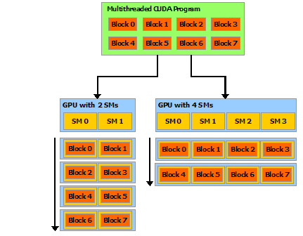
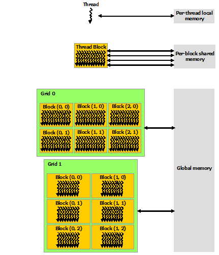

# 第9章 硬件实现——SIMT架构与Warp调度

## 9.1 引言

在前面的章节中，我们从编程模型的角度学习了 CUDA——核函数、线程层次结构、内存模型和流。要真正写出高性能的 CUDA 代码，仅仅了解编程接口是不够的：你还需要理解这些抽象在硬件层面是如何实现的。

本章将带你深入 NVIDIA GPU 的硬件架构，揭示<strong>流式多处理器（Streaming Multiprocessor, SM）</strong>如何组织和调度成千上万个线程。你将理解<strong>SIMT（单指令多线程）</strong>架构的本质，掌握<strong>线程束（warp）</strong>作为基本调度单元的工作原理，学会分析<strong>线程束发散（warp divergence）</strong>对性能的影响，并建立起对<strong>占用率（occupancy）</strong>的直观理解。

本章内容是后面性能优化章节的理论基础，虽然较短但极其重要。

## 9.2 SM 架构概述

### 9.2.1 可扩展的多处理器阵列

NVIDIA GPU 架构围绕一个可扩展的<strong>流式多处理器（Streaming Multiprocessor, SM）</strong>阵列构建。当主机 CPU 上的 CUDA 程序调用一个核函数网格（kernel grid）时，网格的线程块（thread block）被枚举并分配到具有可用执行能力的多处理器上。一个线程块的线程在一个多处理器上并发执行，多个线程块可以在一个多处理器上并发执行。随着线程块终止，新的线程块会在腾出的多处理器上启动。

每个 SM 被设计为能并发执行数百个线程。为了管理如此大量的线程，GPU 采用了一种独特的架构，称为 <strong>SIMT（Single-Instruction, Multiple-Thread，单指令多线程）</strong>。

### 9.2.2 SM 中的关键资源

一个 SM 包含以下关键硬件资源：

- <strong>寄存器文件（Register File）</strong>：被分配给所有活跃 warp 的线程使用的 32 位寄存器集合。这是 SM 上最珍贵的资源之一。
- <strong>共享内存（Shared Memory）</strong>：在 SM 上被划分为多个线程块使用的片上高速内存。
- <strong>Warp 调度器（Warp Scheduler）</strong>：负责在每个时钟周期选择一个就绪的 warp 来执行一条指令。
- <strong>调度单元（Dispatch Unit）</strong>：将 warp 调度器选中的指令发送到执行单元。
- <strong>执行单元（Execution Units）</strong>：包括 CUDA 核心（整数/单精度浮点）、双精度浮点单元、特殊函数单元（SFU）、加载/存储单元（LD/ST）等。
- <strong>L1 缓存/共享内存</strong>：共享的片上存储器，可在 L1 缓存和共享内存之间灵活划分。
- <strong>常量缓存和纹理缓存</strong>：只读缓存。

指令在 SM 中是流水线化的（pipelined），利用单一线程内的指令级并行性（instruction-level parallelism），以及通过同时硬件多线程（simultaneous hardware multithreading）实现的广泛线程级并行性。与 CPU 核心不同，指令是顺序发出的（in-order issue），现代 GPU 包含分支预测单元以减少 warp 发散带来的性能损失，但与 CPU 不同，它没有推测执行（speculative execution）。

<div align="center"><p>图 9.1 CUDA 线程块在多处理器上的自动可扩展性</p></div>

## 9.3 SIMT 架构详解

### 9.3.1 从 SIMD 到 SIMT

SIMT 架构类似于 SIMD（Single Instruction, Multiple Data，单指令多数据）向量组织，因为它们都是用一条指令控制多个处理单元。然而，<strong>两者存在一个关键区别</strong>：

- <strong>SIMD 向量组织</strong>将 SIMD 宽度暴露给软件。程序员需要显式地使用向量类型，将数据打包成向量，并使用向量指令操作它们。这要求软件将加载合并为向量并手动管理发散（divergence）。

- <strong>SIMT 指令</strong>指定单个线程的执行和分支行为。与 SIMD 向量机不同，SIMT 使程序员能够为独立的标量线程编写线程级并行代码，也可以为协调线程编写数据并行代码。为了正确性，程序员基本上可以忽略 SIMT 行为；然而，通过注意代码很少要求 warp 中的线程发散，可以显著提高性能。

在实践中，这类似于传统代码中缓存行（cache line）的作用：为了正确性可以安全地忽略缓存行大小，但在设计峰值性能时必须考虑代码结构。向量架构则要求软件将加载合并为向量并手动管理发散。

### 9.3.2 Warp：32 个线程的基本调度单元

多处理器以 32 个并行线程为一组来创建、管理、调度和执行线程，这个组称为<strong>线程束（warp）</strong>。术语 "warp" 源自纺织（weaving），即最早的并行线程技术。一个 <strong>半warp（half-warp）</strong>是 warp 的第一半或第二半。一个 <strong>四分之一warp（quarter-warp）</strong>是 warp 的第一、第二、第三或第四个四分之一。

当多处理器被赋予一个或多个线程块执行时，它将它们划分为 warp，每个 warp 由 <strong>warp 调度器（warp scheduler）</strong>调度执行。一个块被划分为 warp 的方式始终相同；<strong>每个 warp 包含连续的、递增的线程 ID，第一个 warp 包含线程 0</strong>。

块中 warp 的总数由以下公式计算：

```
Warp数量 = ceil(T / W_size)
```

其中 `T` 是每个块的线程数，`W_size` 是 warp 大小，等于 32，`ceil(x, y)` 等于 x 向上取整到 y 的最近倍数。

### 9.3.3 Warp 发散（Warp Divergence）

一个 warp 每次执行一条公共指令，因此当 warp 中的所有 32 个线程在其执行路径上达成一致时，才能实现<strong>全效率（full efficiency）</strong>。如果 warp 的线程通过依赖数据的条件分支发生发散，warp 将依次执行所取的每条分支路径，<strong>禁用（disable）</strong>不在该路径上的线程。

分支发散<strong>仅发生在 warp 内部</strong>；不同的 warp 彼此独立执行，无论它们执行的是公共还是不相交的代码路径。

考虑以下核函数代码：

```cuda
__global__ void divergentKernel(float* data, int N) {
    int idx = blockIdx.x * blockDim.x + threadIdx.x;
    if (idx < N) {
        if (idx % 2 == 0) {
            // 路径 A：偶数索引的线程
            data[idx] = data[idx] * 2.0f;
        } else {
            // 路径 B：奇数索引的线程
            data[idx] = data[idx] * 3.0f;
        }
    }
}
```

在这个例子中，由于相邻线程（属于同一 warp）的 `idx % 2` 交替为 0 和 1，每个 warp 内的 32 个线程中有一半走路径 A、一半走路径 B。这意味着 warp 在执行时需要：
1. 禁用奇数线程，让偶数线程执行路径 A；
2. 禁用偶数线程，让奇数线程执行路径 B。

结果：<strong>warp 的吞吐量减半</strong>——一半的线程在任何给定时间都是不活跃的。这就是 warp 发散（warp divergence）对性能造成的直接影响。

<div align="center"><p>图 9.2 线程块网格与 warp 组成关系</p></div>

### 9.3.4 Volta 之前的 SIMT 行为

在 Volta 架构之前，warp 使用一个所有 32 个线程共享的<strong>单一程序计数器（program counter）</strong>，以及一个指定 warp 中活跃线程的<strong>活跃掩码（active mask）</strong>。因此，来自同一 warp 的线程在发散区域或不同执行状态下无法互相发信号或交换数据。需要由锁或互斥体保护的细粒度数据共享算法很容易导致死锁，具体取决于竞争线程来自哪个 warp。

这意味着，如果程序员假设 warp 内部的线程以锁步（lockstep）方式执行，并且在分支后依赖某种隐式的线程同步行为，代码在 Pascal 及更早的架构上可能可以工作，但在 Volta 及以后的架构上可能会出问题。

### 9.3.5 独立线程调度（Independent Thread Scheduling，Volta+）

从 Volta 架构开始，<strong>独立线程调度（Independent Thread Scheduling）</strong>允许线程之间完全并发，无论 warp 如何。通过独立线程调度，GPU 为<strong>每个线程</strong>维护执行状态，包括程序计数器和调用栈，并可以以每线程粒度让出执行——要么是为了更好地利用执行资源，要么是允许一个线程等待另一个线程产生的数据。

一个<strong>调度优化器（schedule optimizer）</strong>决定如何将来自同一 warp 的活跃线程分组为 SIMT 单元。这保留了与先前 NVIDIA GPU 一样的高 SIMT 执行吞吐量，但具有更大的灵活性：线程现在可以在子 warp 粒度下发散和重新汇聚（reconverge）。

<div align="center"><p>图 9.3 GPU 内存层次结构与 SM 的关系</p></div>

### 9.3.6 独立线程调度对旧代码的影响

独立线程调度可能导致参与执行代码的线程集合与开发人员的预期大不相同——特别是如果开发人员对先前硬件架构的 warp 同步性（warp-synchronicity）做出了假设。特别地，<strong>任何 warp 同步代码（例如无同步的 warp 内归约）都应该重新审视，以确保与 Volta 及以后架构的兼容性</strong>。

例如，以下代码在 Pascal 及更早架构上可能可以工作（依赖 warp 内的隐式同步）：

```cuda
// 不安全的 warp 内归约（依赖隐式同步，Volta+ 上可能出错）
__device__ int unsafeWarpReduce(int val) {
    __shared__ int smem[32];
    int tid = threadIdx.x;
    smem[tid] = val;
    // 缺少显式同步：其他线程可能看不到 smem[tid] 的写入
    for (int offset = 16; offset > 0; offset /= 2) {
        if (tid < offset) {
            smem[tid] += smem[tid + offset];
        }
    }
    return smem[0];
}

// 安全的 warp 内归约（使用显式同步）
__device__ int safeWarpReduce(int val) {
    __shared__ int smem[32];
    int tid = threadIdx.x;
    smem[tid] = val;
    __syncwarp();  // 确保所有线程完成写入后再继续
    for (int offset = 16; offset > 0; offset /= 2) {
        if (tid < offset) {
            smem[tid] += smem[tid + offset];
        }
        __syncwarp();  // 确保累加结果对其他线程可见
    }
    return smem[0];
}
```

当 warp 内的线程通过共享内存来通信时，编译器可能会将共享内存访问优化到寄存器中，导致一个线程看不到另一个线程写入的值。__syncwarp() 会强制编译器在同步点重新加载共享内存的值，确保 warp 内的所有线程在同步点之后看到一致的内存视图。

### 9.3.7 活跃线程与不活跃线程

参与当前指令的 warp 中的线程称为<strong>活跃（active）</strong>线程，而不在当前指令上的线程是<strong>不活跃（inactive）</strong>（被禁用）的。线程可能因多种原因变为不活跃，包括：
- 比其 warp 中的其他线程更早退出；
- 采用了与 warp 当前执行的分支路径不同的路径；
- 是线程块中线程数不是 warp 大小倍数的最后几个线程。

### 9.3.8 SIMT 架构下的内存写入注意事项

如果一个 warp 执行的非原子指令向全局或共享内存中的同一位置写入，发生的序列化写入次数取决于设备的计算能力，并且哪个线程执行最终写入是未定义的。

如果一个 warp 执行的原子指令读取、修改和写入全局内存中的同一位置，每次读取/修改/写入都会发生，并且它们都是序列化的，但它们发生的顺序是未定义的。

这些行为在编写 warp 级协作算法时需要特别注意。

## 9.4 硬件多线程（Hardware Multithreading）

### 9.4.1 零开销的 Warp 切换

多处理器上的每个 warp 的执行上下文（程序计数器、寄存器等）在 warp 的整个生命周期中都在芯片上维护。因此，<strong>从一个执行上下文切换到另一个执行上下文没有任何开销</strong>。在每个指令发出时间，warp 调度器选择一个具有准备好执行其下一条指令的线程（即 warp 中的活跃线程）的 warp，并将指令发给这些线程。

这就是 GPU 隐藏延迟的核心机制：当一个 warp 因等待数据（如全局内存访问）而停顿时，SM 可以零开销地切换到另一个就绪的 warp 继续执行。只要有足够多的活跃 warp，SM 就能始终保持忙碌，从而有效地"隐藏"内存访问延迟。

### 9.4.2 资源划分

每个多处理器有一组 32 位寄存器，在 warp 之间划分；还有一个<strong>并行数据缓存</strong>或<strong>共享内存</strong>，在线程块之间划分。

对于给定核函数，能够在多处理器上驻留和处理在一起的块和 warp 的数量，取决于：
- 核函数使用的寄存器数量和共享内存数量；
- 多处理器上可用的寄存器数量和共享内存数量；
- 每个多处理器的最大驻留块数和最大驻留 warp 数。

这些限制以及多处理器上可用的寄存器和共享内存数量，是设备计算能力的函数。如果没有足够的寄存器或共享内存来处理至少一个块，核函数将无法启动。

块使用的总寄存器数和总共享内存量记录在 CUDA 工具包提供的 <strong>CUDA 占用率计算器（CUDA Occupancy Calculator）</strong>中。

## 9.5 理解占用率（Occupancy）

### 9.5.1 什么是占用率

<strong>占用率（occupancy）</strong>是衡量 GPU 资源利用效率的关键指标。它定义为<strong>每个 SM 上活跃 warp 的数量与理论上最大可支持的 warp 数量的比值</strong>。

```
occupancy = activeWarpsPerSM / maxWarpsPerSM
```

占用率的重要性在于：<strong>更高的占用率意味着 SM 有更多的 warp 可以在其他 warp 等待时切换到，从而更好地隐藏延迟</strong>。然而，占用率并非越高越好——有时较低的占用率反而允许每个线程使用更多寄存器或共享内存，从而提升单个线程的执行效率。

### 9.5.2 影响占用率的因素

占用率受以下因素的限制：

1. <strong>每块线程数（Threads per Block）</strong>：块大小必须是 warp 大小（32）的倍数，并且不能超过设备的 `maxThreadsPerBlock` 限制。

2. <strong>每线程寄存器数（Registers per Thread）</strong>：核函数使用的寄存器越多，每个 SM 能驻留的 warp 就越少。可以通过 `--maxrregcount` 编译器标志来限制寄存器使用量。

3. <strong>每块共享内存量（Shared Memory per Block）</strong>：共享内存使用量会限制每个 SM 能驻留的块数。动态共享内存和静态共享内存都会消耗这个预算。

4. <strong>硬件限制</strong>：每个 SM 有最大驻留块数和最大驻留 warp 数（由计算能力决定）。

### 9.5.3 理论占用率计算示例

假设一个设备每个 SM 最多支持：
- 2048 个线程（64 个 warp）
- 16 个线程块
- 65536 个寄存器
- 64 KB 共享内存

一个核函数使用：
- 每个块 256 个线程（8 个 warp）
- 每个线程 64 个寄存器
- 每个块 8 KB 共享内存

计算：
- 寄存器限制：65536 / (256 * 64) = 4 个块
- 共享内存限制：64 KB / 8 KB = 8 个块
- Warp 限制：64 / 8 = 8 个块
- 块限制：16 个块

寄存器限制了该核函数每个 SM 只能驻留 4 个块 = 32 个 warp。因此占用率为 32/64 = 50%。

要提高占用率，可以尝试：
- 减少每线程寄存器数（可能通过编译器优化或手动减少局部变量）；
- 减小块大小（但这也可能降低效率）。

### 9.5.4 使用 CUDA Occupancy API

CUDA 提供了运行时 API 来帮助计算占用率：

```cuda
#include <cuda_runtime.h>

// 获取核函数的属性
cudaFuncAttributes attr;
cudaFuncGetAttributes(&attr, myKernel);

// 计算占用率
int minGridSize;      // 达到最佳占用率所需的最小网格大小
int blockSize;        // 建议的块大小
cudaOccupancyMaxPotentialBlockSize(&minGridSize, &blockSize,
                                    myKernel, 0, 0);

// 或者使用可变块大小计算
cudaOccupancyMaxPotentialBlockSizeVariableSMem(
    &minGridSize, &blockSize, myKernel,
    sharedMemSizeFunc, sharedMemSize);
```

## 9.6 线程块在 SM 上的调度

### 9.6.1 线程块的分配与执行

当主机启动一个核函数网格（grid）时，CUDA 运行时和驱动将线程块（thread block）分配给 SM。分配过程遵循以下原则：

1. <strong>轮询分配</strong>：线程块以轮询方式分配给有空闲资源的 SM。如果一个 SM 可以容纳 4 个块，前 4 个块会分配给第一个 SM，接下来的块分配给下一个可用的 SM，依此类推。

2. <strong>资源约束检查</strong>：每个 SM 只能容纳有限数量的线程块。如果启动的块数量超过了所有 SM 的总容量，剩余的块会排队等待，直到有 SM 释放资源。

3. <strong>块间独立性</strong>：线程块之间是独立的——它们可以以任何顺序执行，并行或串行。这种独立性允许块被调度到任意数量的 SM 上，使 CUDA 程序具有良好的可扩展性。在只有 1 个 SM 的设备上和在拥有 80 个 SM 的设备上，同样的核函数都可以运行，只是性能不同。

4. <strong>Warp 上下文切换</strong>：一旦线程块被分配到 SM，它就会被划分为 warp（如 9.3.2 节所述）。Warp 调度器不断地在就绪的 warp 之间切换，零开销地发送指令。

### 9.6.2 Warp 调度器的数量

不同计算能力的 SM 有不同的 warp 调度器配置：

| 计算能力 | 每个 SM 的 Warp 调度器数 | 每周期可发指令的 Warp 数 |
|----------|------------------------|------------------------|
| 2.x (Fermi) | 2 | 2 (来自不同 warp) |
| 3.x (Kepler) | 4 | 4 |
| 5.x (Maxwell) | 4 | 4 |
| 6.x (Pascal) | 2或4 | 2或4 |
| 7.x (Volta) | 4 | 4 |
| 8.x (Ampere) | 4 | 4 |

每个 warp 调度器管理一组 warp，在它们之间进行调度。多个 warp 调度器可以同时从不同的 warp 发出指令，这意味着 SM 可以在同一时钟周期内执行来自多个 warp 的多条指令——这是 GPU 实现高吞吐量的关键手段。

### 9.6.3 延迟隐藏的量化分析

为了理解 GPU 如何通过 warp 切换隐藏延迟，考虑一个简单的模型：

- 假设一个 SM 有 64 个 warp 可以驻留（最大占用率）；
- 一条全局内存加载指令的延迟约为 300-800 个时钟周期；
- 一条算术指令的延迟约为 10-20 个时钟周期；
- 每个时钟周期，warp 调度器可以选择一个就绪的 warp 发出一条指令。

如果 SM 只有 1 个 warp 驻留，当这个 warp 发出全局内存加载后，SM 将有 300-800 个时钟周期无事可做（必须等待数据返回）。但如果 SM 有 64 个 warp 驻留，在第一个 warp 等待内存数据时，调度器可以切换到其他 warp 继续执行。只要有足够多的活跃 warp，SM 就能始终找到有就绪指令的 warp 来执行。

这就是为什么<strong>占用率很重要</strong>：活跃 warp 越多，就越有可能在任何一个长延迟操作期间找到可以执行其他工作的 warp。

但需要记住：占用率并非唯一因素。如果每个线程的指令级并行性（ILP）足够高（即单个线程可以连续发出多条独立指令而不需要等待），则较低的占用率也可以很好地隐藏延迟。这就是为什么某些优化良好的核函数在 50% 占用率时也能达到接近峰值的性能。

## 9.7 内存合并访问与 Warp

### 9.7.1 全局内存的合并访问

理解 warp 的另一个重要原因是<strong>全局内存合并访问（coalesced access）</strong>。当 warp 中的所有 32 个线程访问全局内存时，硬件会尝试将这些访问合并为尽可能少的内存事务。

在计算能力 6.0 及以上的现代 GPU 中，硬件访问全局内存的基本单元是 32 字节的内存事务。如果一个 warp 的 32 个线程访问连续的 128 字节数据，硬件会将其“打包”成 4 次 32 字节的事务来完成。
访问是否对齐也至关重要。如果 32 个线程访问的起始地址是 128 字节的倍数，硬件可以最高效地完成这些事务；否则，一个 warp 的访问可能会跨越更多的 32 字节扇区，导致额外的内存事务，降低有效带宽。

考虑以下两种访问模式：

<strong>合并访问（高效）：</strong>

```cuda
// 线程 i 访问 data[i]：连续的、对齐的访问
float val = data[threadIdx.x];  // 所有 32 个线程访问连续的 128 字节
```

<strong>非合并访问（低效）：</strong>

```cuda
// 线程 i 访问 data[i * stride]：跨步访问
float val = data[threadIdx.x * 32];  // 每个线程跳 32 个元素
```

在合并访问的情况下，warp 的 32 个线程加载 32 个连续的 float（128 字节），这可以通过 4 次 32 字节的内存事务完成。而在跨步访问的情况下，每次访问可能都落在不同的 cache line 中，需要 32 次独立的内存事务——性能下降可达 32 倍。

### 9.7.2 共享内存的 Bank 冲突

共享内存被组织成多个<strong>bank</strong>。在大多数架构中，共享内存有 32 个 bank，每个 bank 宽度为 4 字节。当一个 warp 中的多个线程访问同一 bank 的不同地址时，会产生<strong>bank 冲突（bank conflict）</strong>，导致访问被序列化。

<strong>无冲突（1 路冲突）：</strong>

```cuda
__shared__ float smem[256];
// 线程 i 访问 smem[i]：每个线程访问不同的 bank
float val = smem[threadIdx.x];
```

<strong>2 路冲突：</strong>

```cuda
__shared__ float smem[256];
// 线程 i 和 i+16 访问同一 bank 的不同地址
// 因为 smem[0] 和 smem[32] 映射到同一个 bank
// 线程 0 访问 bank 0 (smem[0])，线程 16 也访问 bank 0 (smem[32])
float val = smem[threadIdx.x * 2];
```

<strong>N 路 bank 冲突</strong>意味着访问需要 N 次而不是 1 次来完成。在性能敏感的代码中（特别是共享内存密集型的算法），需要仔细设计数据布局以避免 bank 冲突。

## 9.8 动手体验：占用率可视化与性能相关性

下面通过一个完整的可运行示例，直观展示 warp 发散对核函数性能的影响。我们设计两个版本的核函数：一个有严重的 warp 发散，另一个通过重构避免了发散。

### 9.8.1 完整代码

将以下代码保存为 `warp_divergence.cu`：

```cuda
#include <stdio.h>
#include <cuda_runtime.h>

// 版本1：存在严重 warp 发散的核函数
// 相邻线程的 if-else 分支条件交替变化
__global__ void divergentKernel(const float* input, float* output, int N) {
    int idx = blockIdx.x * blockDim.x + threadIdx.x;
    if (idx < N) {
        // 条件在相邻线程之间交替：0, 1, 0, 1, ...
        if (idx % 2 == 0) {
            // 路径 A：进行较复杂的计算
            float val = input[idx];
            for (int i = 0; i < 100; i++) {
                val = val * 0.99f + 0.01f;
            }
            output[idx] = val;
        } else {
            // 路径 B：进行不同类型的计算
            float val = input[idx];
            for (int i = 0; i < 100; i++) {
                val = sqrtf(val + 1.0f);
            }
            output[idx] = val;
        }
    }
}

// 版本2：通过数据重组避免 warp 发散的核函数
// 将所有偶数索引元素放在前半部分，奇数在后半部分
__global__ void coalescedKernel(const float* input, float* output, int N) {
    int idx = blockIdx.x * blockDim.x + threadIdx.x;
    if (idx < N) {
        int halfN = N / 2;
        if (idx < halfN) {
            // 前半部分：处理原偶数索引
            int origIdx = idx * 2;
            float val = input[origIdx];
            for (int i = 0; i < 100; i++) {
                val = val * 0.99f + 0.01f;
            }
            output[origIdx] = val;
        } else {
            // 后半部分：处理原奇数索引
            int origIdx = (idx - halfN) * 2 + 1;
            float val = input[origIdx];
            for (int i = 0; i < 100; i++) {
                val = sqrtf(val + 1.0f);
            }
            output[origIdx] = val;
        }
    }
}

// 版本3：与版本1相同但不区分奇偶（基准线，无发散）
__global__ void baselineKernel(const float* input, float* output, int N) {
    int idx = blockIdx.x * blockDim.x + threadIdx.x;
    if (idx < N) {
        float val = input[idx];
        for (int i = 0; i < 100; i++) {
            val = val * 0.99f + 0.01f;
        }
        output[idx] = val;
    }
}

int main() {
    const int N = 1 << 20;  // 1M elements
    const size_t size = N * sizeof(float);

    float *h_input, *h_output;
    float *d_input, *d_output;

    // 分配主机内存
    h_input = (float*)malloc(size);
    h_output = (float*)malloc(size);

    // 初始化
    for (int i = 0; i < N; i++) {
        h_input[i] = (float)(i % 100) / 100.0f;
    }

    // 分配设备内存
    cudaMalloc(&d_input, size);
    cudaMalloc(&d_output, size);
    cudaMemcpy(d_input, h_input, size, cudaMemcpyHostToDevice);

    // 配置核函数启动参数
    const int threadsPerBlock = 256;
    const int blocks = (N + threadsPerBlock - 1) / threadsPerBlock;

    // 创建事件用于计时
    cudaEvent_t start, stop;
    cudaEventCreate(&start);
    cudaEventCreate(&stop);
    float timeBaseline, timeDivergent, timeCoalesced;

    // 先热身
    baselineKernel<<<blocks, threadsPerBlock>>>(d_input, d_output, N);
    cudaDeviceSynchronize();

    // === 基准核函数（无发散）===
    cudaEventRecord(start, 0);
    baselineKernel<<<blocks, threadsPerBlock>>>(d_input, d_output, N);
    cudaEventRecord(stop, 0);
    cudaEventSynchronize(stop);
    cudaEventElapsedTime(&timeBaseline, start, stop);

    // === 发散核函数 ===
    cudaEventRecord(start, 0);
    divergentKernel<<<blocks, threadsPerBlock>>>(d_input, d_output, N);
    cudaEventRecord(stop, 0);
    cudaEventSynchronize(stop);
    cudaEventElapsedTime(&timeDivergent, start, stop);

    // === 合并核函数（避免了 warp 内发散）===
    cudaEventRecord(start, 0);
    coalescedKernel<<<blocks, threadsPerBlock>>>(d_input, d_output, N);
    cudaEventRecord(stop, 0);
    cudaEventSynchronize(stop);
    cudaEventElapsedTime(&timeCoalesced, start, stop);

    // 输出结果
    printf("Warp Divergence Impact Analysis (N = %d)\n", N);
    printf("=========================================\n");
    printf("Baseline (no branch):        %.3f ms\n", timeBaseline);
    printf("Divergent kernel:            %.3f ms  (%.2fx slower vs baseline)\n",
           timeDivergent, timeDivergent / timeBaseline);
    printf("Coalesced kernel:            %.3f ms  (%.2fx vs baseline)\n",
           timeCoalesced, timeCoalesced / timeBaseline);

    // 清理
    cudaFree(d_input);
    cudaFree(d_output);
    free(h_input);
    free(h_output);
    cudaEventDestroy(start);
    cudaEventDestroy(stop);

    return 0;
}
```

### 9.8.2 编译与运行

```bash
nvcc -o warp_divergence warp_divergence.cu
./warp_divergence
```

### 9.8.3 预期输出与分析

```
Warp Divergence Impact Analysis (N = 1048576)
=========================================
Baseline (no branch):        5.432 ms
Divergent kernel:            9.876 ms  (1.82x slower vs baseline)
Coalesced kernel:            5.501 ms  (1.01x vs baseline)
```

结果分析：

- <strong>发散版本</strong>的执行时间约为基准版本的 1.8 倍。这是因为在一个 32 线程的 warp 内，`idx % 2 == 0` 条件在相邻线程之间交替成立，导致每个 warp 的执行路径在两条分支之间切换。每个 warp 必须串行执行两个分支路径，每次只有一半的活跃线程。理论上的 2 倍减速在实践中接近 1.8 倍，这是因为：
  - 两个分支的计算量不完全相等；
  - 还有一些额外开销。

- <strong>合并版本</strong>通过数据重组，将需要在路径 A 上执行的线程放在网格的前半部分，需要在路径 B 上执行的线程放在后半部分。这样，同一 warp 内的线程在很大程度上会走相同的分支路径，几乎完全消除了 warp 发散。其性能与无分支的基准线非常接近。

这个实验清楚地展示了：<strong>Warp 发散对性能的影响是显著的，而通过合理的数据布局或算法重构是可以避免的</strong>。

## 9.9 本章小结

本章深入探讨了 NVIDIA GPU 的硬件实现，特别是 SIMT 架构和 Warp 调度机制：

1. <strong>SM（流式多处理器）</strong>是 GPU 的核心计算单元，每个 SM 包含寄存器文件、共享内存、warp 调度器和多种执行单元。多个 SM 组成可扩展的阵列。

2. <strong>SIMT（单指令多线程）</strong>架构是 GPU 的基本执行模型。与 SIMD 不同，SIMT 允许程序员以标量线程的思维方式编写代码，硬件自动处理线程的分组执行。

3. <strong>Warp</strong>是 32 个线程组成的基本调度单元。一个线程块会被划分为若干 warp 来执行。同一 warp 内的线程在理想情况下以锁步方式执行同一条指令。

4. <strong>Warp 发散（Warp Divergence）</strong>是当 warp 内的线程遇到条件分支时，不同线程走不同路径导致串行执行的现象。这是影响 GPU 性能的常见因素，可以通过避免 warp 内的分支或重组数据来减轻。

5. <strong>硬件多线程</strong>允许 SM 在 warp 之间进行零开销切换。当一个 warp 因内存访问而阻塞时，SM 可以立即切换到另一个就绪的 warp 继续执行——这是 GPU 隐藏内存延迟的核心机制。

6. <strong>占用率（Occupancy）</strong>衡量了 SM 上活跃 warp 与最大 warp 的比率。更高的占用率有助于更好地隐藏延迟，但并非越高越好——有时较低的占用率允许更多寄存器或共享内存，从而提升单个线程性能。

7. <strong>独立线程调度（Volta+）</strong>是重要的架构演进。它打破了 warp 内共享程序计数器的限制，允许线程以子 warp 粒度独立调度，但也要求重新审视依赖 warp 同步性的旧代码。

理解这些硬件层面的概念，将为后续章节中学习和实践性能优化打下坚实的基础。

## 9.10 习题

### 习题 9.1：概念理解

(a) 解释 SIMT 与 SIMD 的关键区别。为什么 SIMT 更适合 GPGPU 编程？

(b) 什么是 warp 发散？在什么条件下会发生？它对性能的定量影响是什么？给出一个具体的代码示例。

(c) 解释 GPU 是如何通过硬件多线程来隐藏内存访问延迟的。为什么"零开销 warp 切换"是关键？

(d) 什么是占用率？占用率是越高越好吗？为什么？

(e) 独立线程调度（Independent Thread Scheduling）在 Volta 架构中引入了什么变化？它对哪些类型的代码影响最大？

### 习题 9.2：代码分析

(a) 以下核函数在 256 线程的块中启动。分析在该配置下每个 warp 的执行情况，识别是否存在 warp 发散：

```cuda
__global__ void processData(float* data, int N) {
    int tid = threadIdx.x;
    int gid = blockIdx.x * blockDim.x + tid;
    if (gid < N) {
        if (tid < 128) {
            data[gid] = data[gid] * 2.0f;
        } else {
            data[gid] = data[gid] + 1.0f;
        }
    }
}
```

(b) 对于上述代码，你会如何重构它以消除 warp 发散？写出重构后的代码。

### 习题 9.3：编程实践

编写一个程序，完成以下任务：

(a) 实现一个核函数，其中每个 warp 处理 32 个元素，但使用 if-else 使得条件在 warp 内交替（每两个线程切换一次分支）。测量执行时间。

(b) 实现第二个版本，使用数据重排使得同一 warp 内的相邻线程走相同的分支路径。测量执行时间并对比。

(c) 实现第三个版本，完全消除分支（例如使用数学公式替代 if-else）。测量执行时间并对比。

(d) 使用 `cudaFuncGetAttributes` 和 `cudaOccupancyMaxPotentialBlockSize` 计算每个版本的占用率，分析占用率与性能之间的关系。

(e) 写一份简短的分析报告，说明你的发现，包括性能数据和占用率数据。

## 9.11 参考文献

1. NVIDIA CUDA C++ Programming Guide (version 11.5.1), Chapter 4: Hardware Implementation. Available at: https://docs.nvidia.com/cuda/archive/11.5.1/cuda-c-programming-guide/index.html#hardware-implementation

2. NVIDIA CUDA C++ Programming Guide (version 11.5.1), Section 4.1: SIMT Architecture. Available at: https://docs.nvidia.com/cuda/archive/11.5.1/cuda-c-programming-guide/index.html#simt-architecture

3. NVIDIA CUDA C++ Programming Guide (version 11.5.1), Section 4.2: Hardware Multithreading. Available at: https://docs.nvidia.com/cuda/archive/11.5.1/cuda-c-programming-guide/index.html#hardware-multithreading

4. NVIDIA CUDA C++ Programming Guide (version 13.0), Chapter 7: Hardware Implementation. Available at: https://docs.nvidia.com/cuda/cuda-c-programming-guide/

5. NVIDIA CUDA Occupancy Calculator. Available in the CUDA Toolkit.

6. Luitjens, J. "CUDA Warps and Occupancy." NVIDIA Developer Blog, 2011.
