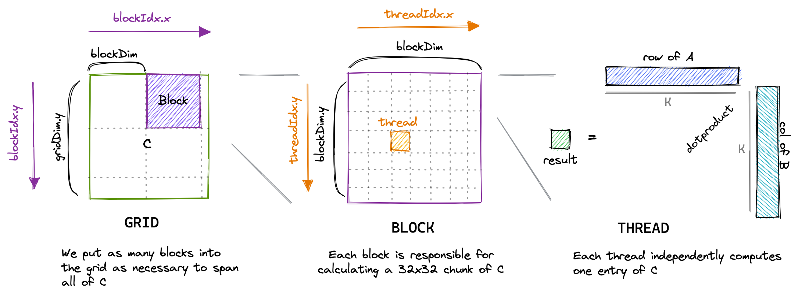
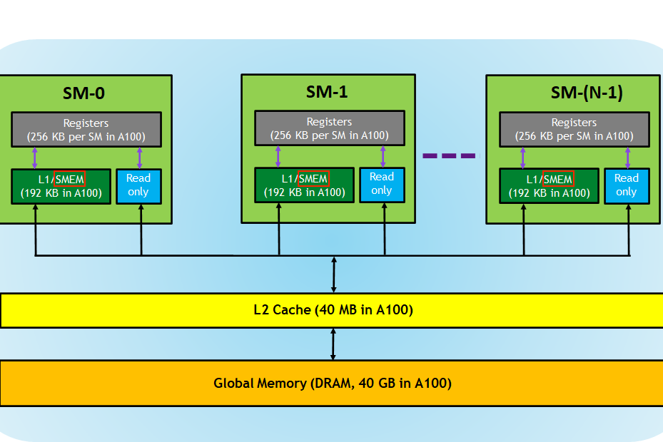

# 实验1：朴素矩阵乘法实现

## 实验目标

1. 理解 CUDA kernel 的启动配置与线程索引计算方式
2. 掌握如何将线程映射到结果矩阵的每个元素
3. 实现基本的 SGEMM（单精度通用矩阵乘法）运算
4. 理解 tile quantization（瓦片量化）问题及边界检查的重要性

## 背景知识

矩阵乘法是科学计算和深度学习中最基础也最重要的运算之一。SGEMM 的全称是 Single-precision General Matrix Multiply，即单精度浮点矩阵乘法，其数学表达式为：

<strong>C = alpha * A * B + beta * C</strong>

其中 <strong>A</strong> 的大小为 M x K，<strong>B</strong> 的大小为 K x N，<strong>C</strong> 的大小为 M x N。

在 CUDA 编程中，我们通过启动大量的线程来并行完成矩阵乘法。每个线程负责计算结果矩阵 <strong>C</strong> 中的一个元素。对于一个输出元素 C[x][y]，需要计算 A 的第 x 行与 B 的第 y 列的内积（dot product），共 K 次乘法和 K 次加法。

CUDA 的线程组织分为三个层级：
- <strong>线程（Thread）</strong>：最基本的执行单元
- <strong>线程块（Block）</strong>：一组线程，可以共享共享内存（shared memory）
- <strong>网格（Grid）</strong>：一组线程块，构成整个 kernel 的启动配置

每个线程可以通过内置变量 `blockIdx`、`threadIdx`、`blockDim`、`gridDim` 来确定自己在整个网格中的唯一位置。

## 对应 CUDA 概念

- <strong>线程层级（Thread Hierarchy）</strong>：Grid -> Block -> Thread 的三级结构
- <strong>内置变量</strong>：`blockIdx.x/y/z`、`threadIdx.x/y/z`、`blockDim.x/y/z`、`gridDim.x/y/z`
- <strong>Kernel Launch</strong>：`<<<gridDim, blockDim>>>` 启动语法
- <strong>全局内存（Global Memory）</strong>：所有线程都能访问的最大内存空间
- <strong>Tile Quantization</strong>：当矩阵维度不是 block 大小的整数倍时需要边界检查
- <strong>Row-Major 存储</strong>：矩阵在内存中按行主序排列

## 原始代码分析

实验1是纯手工编写，没有"原始代码"。我们需要从零开始编写第一个 CUDA kernel。

核心思想非常简单：启动一个 2D 的 grid 和 2D 的 block，每个线程通过 `blockIdx` 和 `threadIdx` 计算自己在矩阵 C 中的位置 (x, y)，然后执行内积循环计算 C[x][y] 的值。

<div align="center"><p>图 1-1 朴素矩阵乘法：每个线程计算 C 矩阵的一个元素</p></div>

## 实验步骤

### 步骤1：环境搭建

首先确保你的系统已安装 CUDA Toolkit（推荐 11.0 以上版本）。使用以下命令确认：

```bash
nvcc --version
nvidia-smi
```

然后创建本次实验的工作目录，并准备好 `sgemm_common.h` 公共头文件（已提供，包含计时、错误检查、矩阵初始化等工具函数）。

### 步骤2：理解矩阵乘法的数据依赖

对于 C 中的一个元素 C[x][y]：
- 需要 A 矩阵的第 x 行（共 K 个元素）
- 需要 B 矩阵的第 y 列（共 K 个元素）
- 计算：C[x][y] = sum(A[x][i] * B[i][y] for i in 0..K-1)

在 Row-Major 存储格式下，A[x][i] 的内存地址是 <strong>A + x * K + i</strong>，B[i][y] 的内存地址是 <strong>B + i * N + y</strong>。

### 步骤3：编写朴素 Kernel

编写 `sgemm_naive` kernel，关键点如下：

1. <strong>计算全局位置</strong>：使用 `blockIdx.x * blockDim.x + threadIdx.x` 得到 x 坐标，同理得到 y 坐标
2. <strong>边界检查</strong>：当 M 或 N 不能被 block 大小整除时，`if (x < M && y < N)` 防止越界访问
3. <strong>内积循环</strong>：遍历 K 维，累加 `A[x * K + i] * B[i * N + y]`
4. <strong>GEMM 更新</strong>：`C[x * N + y] = alpha * tmp + beta * C[x * N + y]`

### 步骤4：配置 Kernel 启动参数

使用 2D grid 和 2D block：

```cpp
dim3 gridDim(CEIL_DIV(M, 32), CEIL_DIV(N, 32));
dim3 blockDim(32, 32);
```

每个 block 有 32x32 = 1024 个线程，这是一个常见的选择（1024 是大多数 GPU 的最大线程数/block）。

### 步骤5：验证正确性

将你的结果与 cuBLAS 的输出对比。cuBLAS 是 NVIDIA 官方优化的矩阵乘法库，可以作为参考标准。验证时需要允许一定的浮点误差（比如使用 `abs(ref - out) < 0.01` 作为判断标准）。

### 步骤6：性能分析

使用 `cudaEvent` 进行精确计时：

```cpp
cudaEvent_t start, stop;
cudaEventCreate(&start);
cudaEventCreate(&stop);
cudaEventRecord(start);
sgemm_naive<<<gridDim, blockDim>>>(M, N, K, alpha, d_A, d_B, beta, d_C);
cudaEventRecord(stop);
cudaEventSynchronize(stop);
float elapsed_ms;
cudaEventElapsedTime(&elapsed_ms, start, stop);
```

计算 GFLOPS：<strong>GFLOPS = (2 * M * N * K) / (elapsed_ms * 1e6)</strong>

这里 2*M*N*K 是因为每个输出元素需要 K 次乘法和 K 次加法。

## 关键代码

```cuda
__global__ void sgemm_naive(int M, int N, int K, float alpha,
                             const float *A, const float *B,
                             float beta, float *C) {
  // 计算当前线程对应的 C 矩阵位置
  const uint x = blockIdx.x * blockDim.x + threadIdx.x;
  const uint y = blockIdx.y * blockDim.y + threadIdx.y;

  // 边界检查（处理 tile quantization）
  if (x < M && y < N) {
    float tmp = 0.0;
    // 内积循环：A 的第 x 行 与 B 的第 y 列做点积
    for (int i = 0; i < K; ++i) {
      tmp += A[x * K + i] * B[i * N + y];
    }
    // GEMM: C = alpha * A*B + beta * C
    C[x * N + y] = alpha * tmp + beta * C[x * N + y];
  }
}
```

启动配置：

```cpp
// M, N 是矩阵维度, BLOCK_SIZE = 32
dim3 gridDim(CEIL_DIV(M, 32), CEIL_DIV(N, 32));
dim3 blockDim(32, 32);
sgemm_naive<<<gridDim, blockDim>>>(M, N, K, alpha, d_A, d_B, beta, d_C);
```

## 预期结果

- <strong>预期性能</strong>：矩阵大小 4096x4096 时，约 <strong>309 GFLOPS/s</strong>
- <strong>相对 cuBLAS</strong>：约为 cuBLAS 的 <strong>1.3%</strong>
- <strong>相对 A6000 峰值性能</strong>：约为峰值的 <strong>1.0%</strong>（A6000 峰值约 30 TFLOPS FP32）

<div align="center"><p>图 1-2 GPU 内存层级结构：朴素实现直接访问全局内存（GMEM），未利用任何快速内存</p></div>

性能极低的原因分析：
- 每个线程需要从全局内存（GMEM）读取 2K 个元素（比如 K=4096 时，每个线程读 8192 个 float = 32KB）
- 全局内存的带宽约为 768 GB/s（A6000），但延迟很高（数百个时钟周期）
- 大量重复的全局内存读取：A 的每个元素被 N 个线程重复读取，B 的每个元素被 M 个线程重复读取
- 内存访问模式是非合并的（non-coalesced），导致实际内存吞吐量极低（约 15 GB/s）

## 思考题

1. 朴素实现中每个线程需要从全局内存读取多少数据？总内存流量是多少？（提示：考虑 K 次循环迭代，每次读 A 和 B 各一个元素）
2. 为什么 2D block 的 threadIdx 计算使用了 `threadIdx.x` 和 `threadIdx.y` 两个维度？如果使用 1D block（例如 blockDim.x=1024）会有什么区别？
3. 当 M 或 N 不能被 block 大小整除时，`if (x < M && y < N)` 的作用是什么？如果没有这个边界检查会发生什么？
4. 计算理论所需数据传输量。对于 M=N=K=4096 的矩阵，最少需要传输多少数据？实际传输量是理论最少值的多少倍？

## 参考文献

1. [How to Optimize a CUDA Matmul Kernel for cuBLAS-like Performance](https://siboehm.com/articles/22/CUDA-MMM) - Simon Boehm, 2022
2. [CUDA C++ Programming Guide - Thread Hierarchy](https://docs.nvidia.com/cuda/cuda-c-programming-guide/index.html#thread-hierarchy) - NVIDIA
3. [SGEMM_CUDA 源代码](https://github.com/siboehm/SGEMM_CUDA) - 配套开源代码
