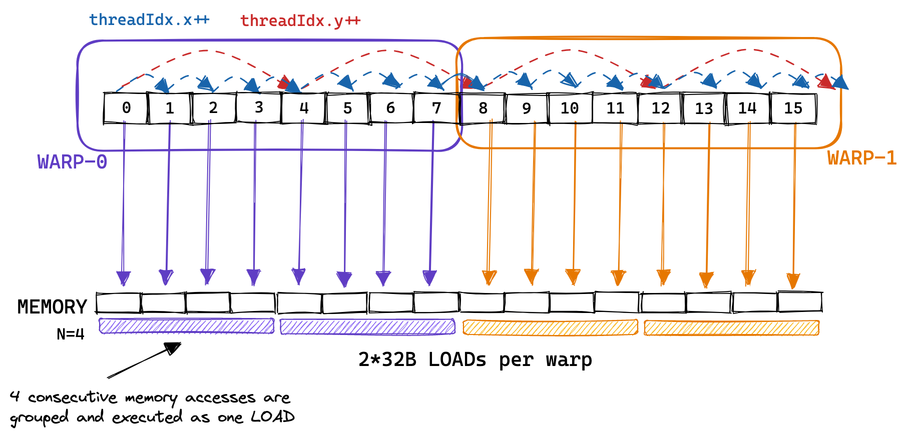
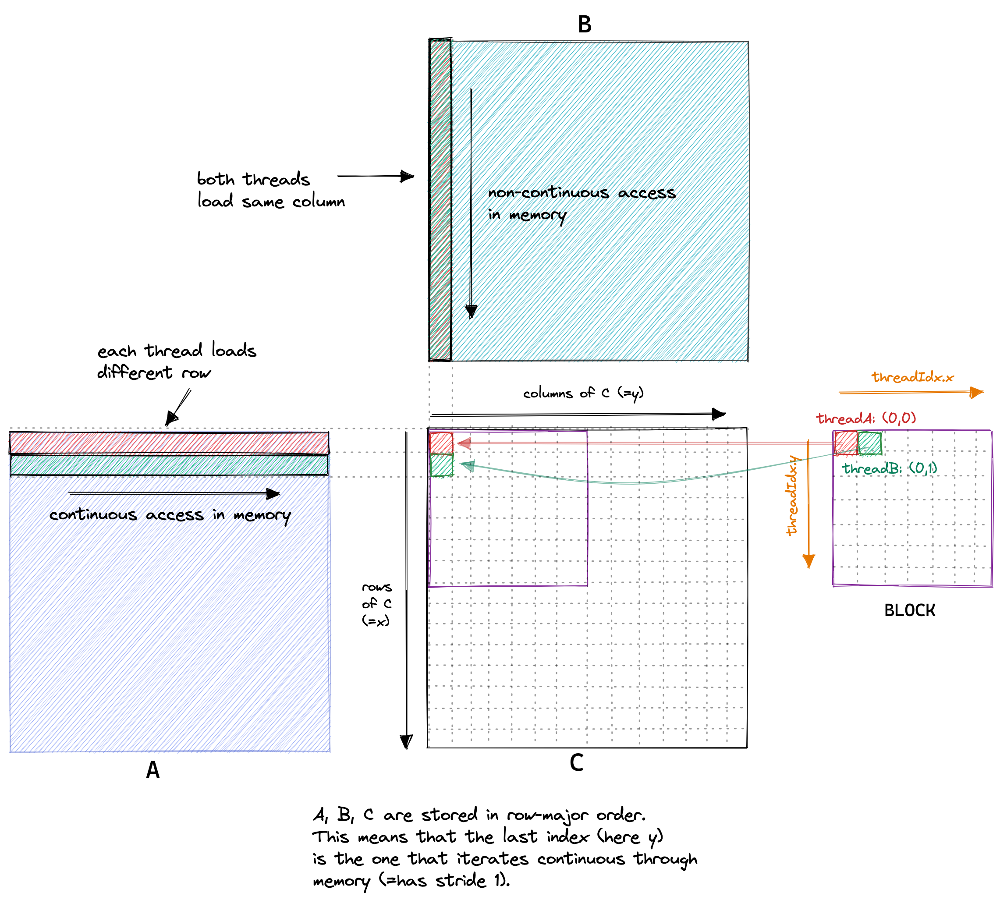

# 实验2：全局内存合并访问（Global Memory Coalescing）

## 实验目标

1. 理解 Warp 的概念：32 个线程为一组同时执行，同一 Warp 内的线程的内存访问可以被合并
2. 掌握线程 ID 到 Warp 的映射规则
3. 学会通过调整线程到 C 元素的映射关系，使同一 Warp 内线程访问连续的内存地址
4. 理解 128 字节内存事务（cache line）的工作机制

## 背景知识

在 CUDA 架构中，线程以 <strong>Warp</strong>（32 个线程）为单位在 SM（Streaming Multiprocessor）上调度执行。同一个 Warp 内的 32 个线程同时执行同一条指令（SIMT 模式）。

GPU 的全局内存（GMEM）访问以 <strong>内存事务（Memory Transaction）</strong> 为单位。在 A6000（Ampere 架构）上，一个内存事务的大小是 128 字节（32 个 4 字节的 float）。<strong>合并访问（Coalesced Access）</strong> 指的是：如果同一 Warp 内的 32 个线程访问的内存地址恰好覆盖一个连续 128 字节的区域，那么只需要 1 次内存事务就能完成。反之，如果这 32 个线程访问的是分散的地址，则可能需要 32 次内存事务。

线程 ID 到 Warp 的映射规则是：
<strong>threadId = threadIdx.x + blockDim.x * (threadIdx.y + blockDim.y * threadIdx.z)</strong>

Warp ID = threadId / 32。因此，<strong>连续 threadIdx.x 的线程属于同一个 Warp</strong>。

实验1 的 2D block (32, 32) 中，同一个 Warp 包含的是 threadIdx.x 连续的 32 个线程。这些线程对应的 C 矩阵位置 y（列索引）是连续的（因为 y = threadIdx.x），但 x（行索引）是相同的（因为同一 Warp 中 threadIdx.x 变化时 threadIdx.y 不变）。这意味着访问 A 矩阵时地址不连续，访问 B 矩阵时也不连续——都是非合并访问。

<div align="center"><p>图 2-1 全局内存合并访问示意：连续的线程访问连续的内存地址时，可合并为单次 128 字节事务</p></div>

## 对应 CUDA 概念

- <strong>Warp 调度</strong>：32 个线程为一组执行
- <strong>SIMT（Single Instruction, Multiple Thread）</strong>：同一 Warp 内的线程执行相同的指令
- <strong>全局内存合并访问（Global Memory Coalescing）</strong>：连续线程访问连续地址
- <strong>内存事务（Memory Transaction）</strong>：128 字节的最小访问单位

## 原始代码分析

实验1 的朴素实现使用 2D block：

```cuda
const uint x = blockIdx.x * blockDim.x + threadIdx.x;  // 行索引
const uint y = blockIdx.y * blockDim.y + threadIdx.y;  // 列索引
```

在读取 A[x * K + i] 时，同一 Warp 内连续 threadIdx.x 的线程对应的 x 不同，因此访问 A 的地址跨度为 K 个元素（约 K * 4 字节），是<strong>非合并的</strong>。

在读取 B[i * N + y] 时，y 来自 threadIdx.y，同一 Warp 内 threadIdx.y 相同，y 也相同，因此同一 Warp 内的线程在读取同一次内积循环迭代中的 B 元素时地址完全分散——也是<strong>非合并的</strong>。

## 实验步骤

### 步骤1：分析实验1的内存访问模式

画出 2D block (32x32) 中线程的内存访问图：
- 同一 Warp（threadIdx.x 连续的 32 个线程）访问 A 的模式：地址跨度为 K 个元素，非连续
- 同一 Warp 访问 B 的模式：同一 Warp 的所有线程访问的 B 地址完全分散

### 步骤2：修改线程到 C 的映射

核心改动：将 blockDim 从 2D 改为 1D，使连续的 threadIdx.x 映射到连续的 C 列坐标（即连续的 B 访问地址）：

```cuda
const int cRow = blockIdx.x * BLOCKSIZE + (threadIdx.x / BLOCKSIZE);
const int cCol = blockIdx.y * BLOCKSIZE + (threadIdx.x % BLOCKSIZE);
```

这个映射使得：threadIdx.x 连续 -> cCol 连续 -> 访问 B[i * N + cCol] 时地址连续。

启动配置也相应变化：
```cpp
dim3 gridDim(CEIL_DIV(M, 32), CEIL_DIV(N, 32));
dim3 blockDim(32 * 32);  // 1D block, 1024个线程
```

### 步骤3：分析优化后的内存访问模式

- 循环中 `B[i * N + cCol]` 的访问：同一 Warp 的 32 个线程访问连续的 B 元素，可以合并为 1 次 128 字节事务
- `A[cRow * K + i]` 的访问：cRow 的变化使得访问跨度仍为 K，但 A 的访问次数相对 B 来说绝对值更少

### 步骤4：性能对比

测量 GFLOPS 和全局内存吞吐量，比较实验1与实验2的性能变化。

## 关键代码

```cuda
template <const uint BLOCKSIZE>
__global__ void sgemm_global_mem_coalesce(int M, int N, int K, float alpha,
                                           const float *A, const float *B,
                                           float beta, float *C) {
  // 重映射：使 threadIdx.x 连续 => cCol 连续 => 合并访问 B
  const int cRow = blockIdx.x * BLOCKSIZE + (threadIdx.x / BLOCKSIZE);
  const int cCol = blockIdx.y * BLOCKSIZE + (threadIdx.x % BLOCKSIZE);

  if (cRow < M && cCol < N) {
    float tmp = 0.0;
    for (int i = 0; i < K; ++i) {
      // B[cCol + i*N] 访问是连续的同一个 Warp 内
      tmp += A[cRow * K + i] * B[i * N + cCol];
    }
    C[cRow * N + cCol] = alpha * tmp + beta * C[cRow * N + cCol];
  }
}
```

启动配置：

```cpp
dim3 gridDim(CEIL_DIV(M, 32), CEIL_DIV(N, 32));
dim3 blockDim(32 * 32);
sgemm_global_mem_coalesce<32><<<gridDim, blockDim>>>(...);
```

## 预期结果

- <strong>预期性能</strong>：矩阵大小 4096x4096 时，约 <strong>1986.5 GFLOPS/s</strong>
- <strong>性能提升</strong>：从实验1的 309 GFLOPS 提升到 1986.5 GFLOPS，约 <strong>6.4 倍</strong>
- <strong>内存吞吐量</strong>：从约 15 GB/s 提升到约 110 GB/s，约 <strong>7.3 倍</strong>
- <strong>相对 cuBLAS</strong>：达到 cuBLAS 的 <strong>8.5%</strong>

<div align="center"><p>图 2-2 朴素实现的内存访问模式 vs 合并访问模式</p></div>

## 思考题

1. 为什么实验1中使用 2D block 时无法实现内存合并访问？哪一次内存访问（读 A 还是读 B）是更严重的非合并访问？为什么？
2. 如果 GPU 支持 32B、64B 和 128B 的内存事务，32 个线程各读取一个 float（4B），理想情况下需要几次事务？
3. 除了修改线程到元素的映射关系，还有哪些因素可能影响全局内存合并访问的效率？（提示：内存对齐）
4. 为什么在实验2的代码中使用了模板参数 `BLOCKSIZE` 而不是硬编码？这有什么好处？

## 参考文献

1. [How to Optimize a CUDA Matmul Kernel for cuBLAS-like Performance](https://siboehm.com/articles/22/CUDA-MMM) - Simon Boehm, 2022
2. [CUDA C++ Programming Guide - Global Memory Coalescing](https://docs.nvidia.com/cuda/cuda-c-programming-guide/index.html#global-memory-3-0) - NVIDIA
3. [CUDA C++ Best Practices Guide - Coalesced Access](https://docs.nvidia.com/cuda/cuda-c-best-practices-guide/index.html#coalesced-access-to-global-memory) - NVIDIA
