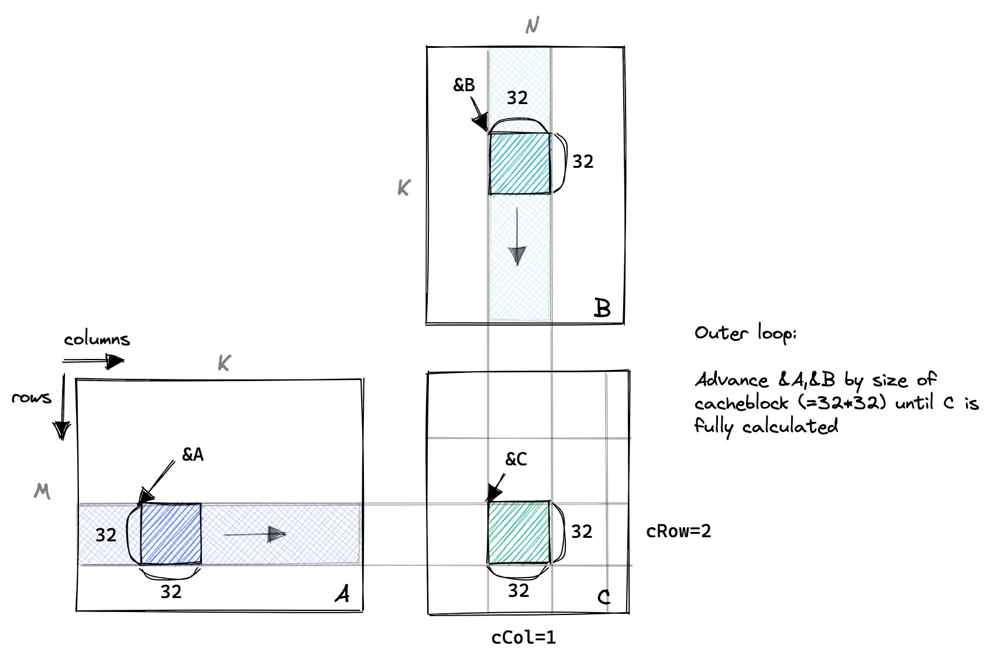
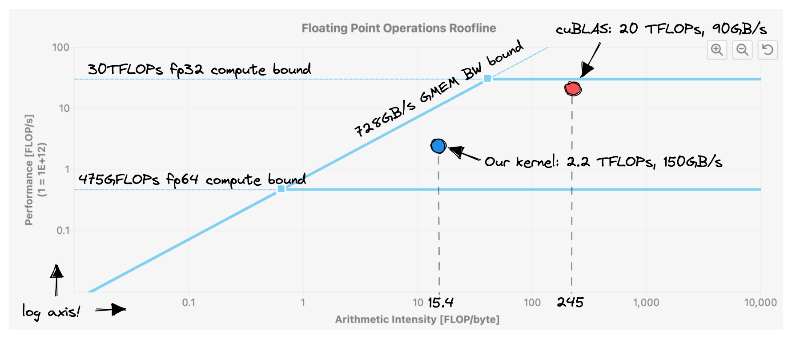

# 实验3：共享内存缓存分块（Shared Memory Cache-Blocking）

## 实验目标

1. 理解共享内存（Shared Memory）的物理位置和性能优势
2. 掌握 `__shared__` 关键字和 `__syncthreads()` 同步屏障的使用
3. 理解缓存分块（Cache-Blocking）的核心思想：将复用数据从慢速全局内存移到快速共享内存
4. 分析矩阵乘法中的数据复用模式

## 背景知识

GPU 的内存层级从快到慢依次是：寄存器（Register）、共享内存（Shared Memory / SMEM）、L1/L2 缓存、全局内存（Global Memory / GMEM）。共享内存位于 GPU 芯片内部（on-chip），带宽约为全局内存的 <strong>16 倍</strong>，延迟约为全局内存的 <strong>1/20</strong>。

矩阵乘法具有极高的数据复用率：
- A 矩阵的每个元素被 <strong>N 个线程</strong> 重复使用
- B 矩阵的每个元素被 <strong>M 个线程</strong> 重复使用

然而在实验2中，每个线程在内积循环中每次都从全局内存读取 A 和 B 的各一个元素，完全没有利用数据复用。

<strong>缓存分块（Cache-Blocking）</strong> 的核心思想是：将一个 Block 内的所有线程需要的数据先<strong>协作加载</strong>到共享内存中，然后所有线程在共享内存上完成计算。这样每个元素从 GMEM 只加载一次，但在 SMEM 中被多个线程共享读取。

<div align="center"><p>图 3-1 缓存分块示意：将矩阵分块加载到共享内存，每个 Block 共享使用</p></div>

## 对应 CUDA 概念

- <strong>共享内存（Shared Memory）</strong>：使用 `__shared__` 关键字声明，Block 内所有线程共享
- <strong>__syncthreads()</strong>：块内同步屏障，确保所有线程完成指定阶段后再继续
- <strong>生产者-消费者模式</strong>：部分线程"生产"数据（加载到 SMEM），所有线程"消费"数据（从 SMEM 读取计算）
- <strong>Occupancy</strong>：SM 上活跃 Warp 数与最大可容纳 Warp 数的比值

## 原始代码分析

实验2 的代码在内积循环中每次都从 GMEM 读取数据：

```cuda
for (int i = 0; i < K; ++i) {
    tmp += A[cRow * K + i] * B[i * N + cCol];
}
```

对于 K=4096 的情况，每个线程执行 4096 次循环迭代，每次读取 A 和 B 各一个元素。总共 <strong>M*N*K*2 = 1370 亿次 GMEM 访问</strong>，其中有大量数据被重复读取。

## 实验步骤

### 步骤1：理解数据复用

分析矩阵乘法中哪些数据被重复使用：
- 同一个 Block 计算 C 的一个 (BLOCKSIZE x BLOCKSIZE) 子块时
- A 中同样的一批 BLOCKSIZE 行被 Block 内的所有 BLOCKSIZE^2 个线程反复读取
- B 中同样的一批 BLOCKSIZE 列被 Block 内的所有 BLOCKSIZE^2 个线程反复读取

### 步骤2：设计共享内存分块方案

定义 BLOCKSIZE（例如 32）：
1. 在共享内存中声明 `__shared__ float As[BLOCKSIZE * BLOCKSIZE]` 和 `Bs[BLOCKSIZE * BLOCKSIZE]`
2. 外层循环沿 K 维度以 BLOCKSIZE 为步长移动
3. 每次迭代中，Block 内线程协作将 A 和 B 的当前子块加载到 SMEM
4. 内层循环在 SMEM 数据上执行分块矩阵乘法

### 步骤3：实现共享内存加载

每个线程负责从 GMEM 加载 A 和 B 各一个元素到 SMEM。关键是要保持合并访问：让 threadIdx.x 的连续维度对应于加载的连续地址。

```cuda
__shared__ float As[BLOCKSIZE * BLOCKSIZE];
__shared__ float Bs[BLOCKSIZE * BLOCKSIZE];

// 每个线程加载一个元素（保持合并访问）
As[threadRow * BLOCKSIZE + threadCol] = A[threadRow * K + threadCol];
Bs[threadRow * BLOCKSIZE + threadCol] = B[threadRow * N + threadCol];
__syncthreads();  // 确保所有线程加载完成
```

### 步骤4：实现分块计算与同步

在共享内存数据上执行内积，并正确放置两个 `__syncthreads()`：

1. <strong>加载后同步</strong>：确保所有线程将数据加载到 SMEM 后再开始计算
2. <strong>计算后同步</strong>：防止快线程提前加载下一块数据覆盖正在被慢线程读取的 SMEM

### 步骤5：Occupancy 分析

计算当前 kernel 的资源占用：
- SMEM 使用：`2 * BLOCKSIZE * BLOCKSIZE * 4B = 8KB` per block（当 BLOCKSIZE=32）
- 每个 SM 的 SMEM 总量：100KB（A6000）
- 理论上最多同时驻留：`100KB / 8KB = 12.5` -> 按其他资源限制

使用 `cudaFuncSetAttribute` 将 L1 缓存让渡给 SMEM（因为本 kernel 不再使用 L1 缓存）。

## 关键代码

```cuda
template <const int BLOCKSIZE>
__global__ void sgemm_shared_mem_block(int M, int N, int K, float alpha,
                                        const float *A, const float *B,
                                        float beta, float *C) {
  const uint cRow = blockIdx.x;
  const uint cCol = blockIdx.y;

  // 在共享内存中分配当前 Block 的缓存
  __shared__ float As[BLOCKSIZE * BLOCKSIZE];
  __shared__ float Bs[BLOCKSIZE * BLOCKSIZE];

  const uint threadCol = threadIdx.x % BLOCKSIZE;
  const uint threadRow = threadIdx.x / BLOCKSIZE;

  // 指针移动到当前 Block 负责的区域
  A += cRow * BLOCKSIZE * K;
  B += cCol * BLOCKSIZE;
  C += cRow * BLOCKSIZE * N + cCol * BLOCKSIZE;

  float tmp = 0.0;
  for (int bkIdx = 0; bkIdx < K; bkIdx += BLOCKSIZE) {
    // 协作加载数据到共享内存（保持合并访问）
    As[threadRow * BLOCKSIZE + threadCol] = A[threadRow * K + threadCol];
    Bs[threadRow * BLOCKSIZE + threadCol] = B[threadRow * N + threadCol];
    __syncthreads();  // 确保数据加载完成

    A += BLOCKSIZE;
    B += BLOCKSIZE * N;

    // 在共享内存上执行内积
    for (int dotIdx = 0; dotIdx < BLOCKSIZE; ++dotIdx) {
      tmp += As[threadRow * BLOCKSIZE + dotIdx] *
             Bs[dotIdx * BLOCKSIZE + threadCol];
    }
    __syncthreads();  // 防止快线程提前覆盖数据
  }
  C[threadRow * N + threadCol] = alpha * tmp + beta * C[threadRow * N + threadCol];
}
```

## 预期结果

- <strong>预期性能</strong>：矩阵大小 4096x4096 时，约 <strong>2980.3 GFLOPS/s</strong>
- <strong>性能提升</strong>：从实验2的 1986.5 GFLOPS 提升到 2980.3 GFLOPS，约 <strong>1.5 倍</strong>
- <strong>相对 cuBLAS</strong>：达到 cuBLAS 的 <strong>12.8%</strong>

<div align="center"><p>图 3-2 实验3的 Roofline 分析：kernel 仍处于 memory-bound 区域</p></div>

## 思考题

1. 为什么需要两个 `__syncthreads()`？少一个会有什么后果？具体分析两个同步点各自的作用。
2. 当前 kernel 的内存访问模式中，每个线程计算结果需要多少次 GMEM 访问和多少次 SMEM 访问？用 K 和 BLOCKSIZE 表示。
3. 如果 `BLOCKSIZE=32`，共享内存使用量为 8KB。如果增加到 `BLOCKSIZE=64`，SMEM 使用量变为 32KB。增大 BLOCKSIZE 对 occupancy 和性能分别有什么影响？
4. 为什么使用 `cudaFuncSetAttribute` 将 L1 缓存 carve out 给共享内存？什么情况下这个操作有意义？

## 参考文献

1. [How to Optimize a CUDA Matmul Kernel for cuBLAS-like Performance](https://siboehm.com/articles/22/CUDA-MMM) - Simon Boehm, 2022
2. [CUDA C++ Programming Guide - Shared Memory](https://docs.nvidia.com/cuda/cuda-c-programming-guide/index.html#shared-memory) - NVIDIA
3. [CUDA C++ Best Practices Guide - Shared Memory](https://docs.nvidia.com/cuda/cuda-c-best-practices-guide/index.html#shared-memory) - NVIDIA
