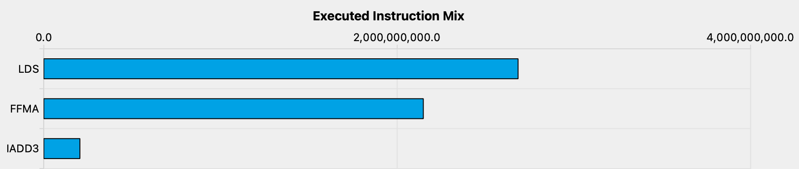
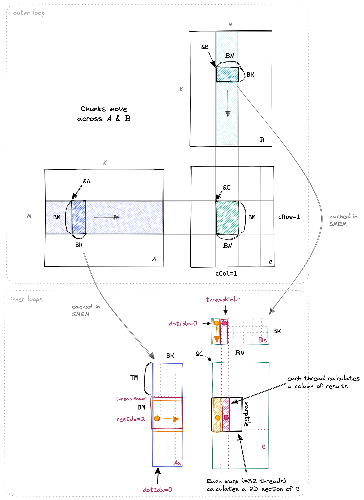

# 实验4：一维 Block Tile - 每线程计算多个结果

## 实验目标

1. 理解算术强度（Arithmetic Intensity）的定义及其对性能的影响
2. 学会通过增加每线程计算量（Thread Tile）来提升算术强度
3. 掌握寄存器数组 `float threadResults[TM]` 的使用
4. 理解循环结构（dotIdx 外层 vs resIdx 外层）对数据复用的影响
5. 使用 Nsight Compute 分析 Warp Stall 原因

## 背景知识

<strong>算术强度（Arithmetic Intensity）</strong> 定义为：<strong>FLOPs / Bytes Transferred</strong>。一个 kernel 的性能瓶颈可能是计算（compute-bound）或内存（memory-bound）。在实验3中，尽管我们使用了共享内存，但 kernel 仍然受到 SMEM 访问吞吐量的限制。

从 NCU 的 profiler 可以看到，实验3 中大部分指令是 <strong>LDS（Load from Shared memory）</strong> 而非 <strong>FMA（Fused Multiply-Add）</strong>，且主要的 Warp Stall 原因是 <strong>Stall MIO Throttle</strong>（内存输入/输出指令队列排满）。这说明我们需要进一步提高算术强度——让每个 SMEM 加载的数据参与更多次 FMA 运算。

<div align="center"><p>图 4-1 实验3的指令混合：大部分时间是 LDS 指令，而非 FMA</p></div>

<strong>每线程计算多个结果</strong> 的核心思想是：让共享内存中加载的 A 的一个元素参与 TM 次（而非 1 次）FMA 运算。例如，如果每个线程计算 TM=8 个沿 M 方向的输出元素，那么 As 中同样一个元素可以被一个线程的 8 次 FMA 复用。

<div align="center"><p>图 4-2 一维 Block Tile 示意：Block Tile (BM x BN) 划分为 Thread Tile (TM x 1)</p></div>

## 对应 CUDA 概念

- <strong>算术强度（Arithmetic Intensity）</strong>：FLOPs / Bytes
- <strong>Thread Tile（线程瓦片）</strong>：每个线程负责计算的子区域
- <strong>寄存器缓存（Register File）</strong>：使用寄存器数组存储部分和
- <strong>循环展开（Loop Unrolling）</strong>：编译器自动展开小循环
- <strong>MIO Throttle</strong>：内存 I/O 指令队列饱和导致的 Warp Stall

## 原始代码分析

实验3 的每个线程只计算 1 个结果。内积循环：

```cuda
for (int dotIdx = 0; dotIdx < BLOCKSIZE; ++dotIdx) {
    tmp += As[threadRow*BLOCKSIZE + dotIdx] * Bs[dotIdx*BLOCKSIZE + threadCol];
}
```

每次循环迭代从 SMEM 读取 2 个元素（As 和 Bs 各一），执行 1 次 FMA，算术强度仅为 0.5 FLOP/byte。这远低于 FMA 吞吐所需的算术强度。

## 实验步骤

### 步骤1：分析实验3的瓶颈

使用 Nsight Compute 分析 warp stall 原因：
- 主要 stall 原因：`Stall MIO Throttle`（等待 MIO 指令队列）
- 次要 stall 原因：`Stall Short Scoreboard`（等待寄存器写回）
- 结论：kernel 被 SMEM 访问吞吐限制，需要提高算术强度

### 步骤2：设计一维 Block Tile 方案

引入模板参数 `BM`（Block M 维度）、`BN`（Block N 维度）、`BK`（Block K 维度）、`TM`（每线程计算的输出数量）：

| 参数 | 实验3 | 实验4 | 说明 |
|------|-------|-------|------|
| BM | 32 | 64 | Block Tile 的 M 维度 |
| BN | 32 | 64 | Block Tile 的 N 维度 |
| BK | 32 | 8 | Block Tile 的 K 维度 |
| TM | 1 | 8 | 每线程输出结果数 |
| Threads/Block | 1024 | 512 | (BM*BN)/TM |

### 步骤3：修改内积循环结构

<strong>关键改变</strong>：将 `dotIdx` 循环放在最外层（而非 `resIdx` 循环），这样 Bs 的一个元素可以被缓存到寄存器 `Btmp` 中，同一线程的 TM 次 FMA 都复用这个 `Btmp`：

```cuda
for (uint dotIdx = 0; dotIdx < BK; ++dotIdx) {
    float Btmp = Bs[dotIdx * BN + threadCol];  // 缓存 Bs 元素
    for (uint resIdx = 0; resIdx < TM; ++resIdx) {
        threadResults[resIdx] +=
            As[(threadRow * TM + resIdx) * BK + dotIdx] * Btmp;
    }
}
```

### 步骤4：内存访问量对比计算

对比实验3（每线程 1 个结果）和实验4（每线程 TM=8 个结果）的内存访问量：

- <strong>实验3</strong>（每结果）：GMEM 约 K/BLOCKSIZE 次，SMEM 约 K*2 次
- <strong>实验4</strong>（每结果）：GMEM 约 K/(2*BM) 次，SMEM 约 (BK+TM)/TM 次
- 每结果内存访问量<strong>显著下降</strong>

### 步骤5：验证和 Profiling

使用 NCU 分析 warp stall 状态变化，确认 Stall MIO Throttle 显著减少。

## 关键代码

```cuda
template <const int BM, const int BN, const int BK, const int TM>
__global__ void sgemm1DBlocktiling(int M, int N, int K, float alpha,
                                    const float *A, const float *B,
                                    float beta, float *C) {
  const uint cRow = blockIdx.y;
  const uint cCol = blockIdx.x;

  const int threadCol = threadIdx.x % BN;
  const int threadRow = threadIdx.x / BN;

  __shared__ float As[BM * BK];
  __shared__ float Bs[BK * BN];

  A += cRow * BM * K;
  B += cCol * BN;
  C += cRow * BM * N + cCol * BN;

  // 每线程的加载索引（保持合并访问）
  const uint innerColA = threadIdx.x % BK;
  const uint innerRowA = threadIdx.x / BK;
  const uint innerColB = threadIdx.x % BN;
  const uint innerRowB = threadIdx.x / BN;

  float threadResults[TM] = {0.0};  // 寄存器数组

  for (uint bkIdx = 0; bkIdx < K; bkIdx += BK) {
    As[innerRowA * BK + innerColA] = A[innerRowA * K + innerColA];
    Bs[innerRowB * BN + innerColB] = B[innerRowB * N + innerColB];
    __syncthreads();

    A += BK;
    B += BK * N;

    // dotIdx 在外层循环：让 Bs 元素被多个 resIdx 复用
    for (uint dotIdx = 0; dotIdx < BK; ++dotIdx) {
      float Btmp = Bs[dotIdx * BN + threadCol];
      for (uint resIdx = 0; resIdx < TM; ++resIdx) {
        threadResults[resIdx] +=
            As[(threadRow * TM + resIdx) * BK + dotIdx] * Btmp;
      }
    }
    __syncthreads();
  }

  for (uint resIdx = 0; resIdx < TM; ++resIdx) {
    C[(threadRow * TM + resIdx) * N + threadCol] =
        alpha * threadResults[resIdx] +
        beta * C[(threadRow * TM + resIdx) * N + threadCol];
  }
}
```

启动配置：

```cpp
const uint BM = 64, BN = 64, BK = 8, TM = 8;
dim3 gridDim(CEIL_DIV(N, BN), CEIL_DIV(M, BM));
dim3 blockDim((BM * BN) / TM);  // 512 threads
```

## 预期结果

- <strong>预期性能</strong>：矩阵大小 4096x4096 时，约 <strong>8474.7 GFLOPS/s</strong>
- <strong>性能提升</strong>：从实验3的 2980.3 GFLOPS 提升到 8474.7 GFLOPS，约 <strong>2.8 倍</strong>
- <strong>相对 cuBLAS</strong>：达到 cuBLAS 的 <strong>36.5%</strong>

## 思考题

1. 为什么将 `dotIdx` 放在外层循环比 `resIdx` 放在外层更好？（提示：分析 Bs 元素被访问的次数）
2. 如果 `TM=8`，当前配置的 SMEM 使用量是多少？与实验3相比如何变化？
3. 算术强度的提升是否总会带来性能提升？什么时候继续增加 TM 不再有效？（提示：寄存器压力）
4. 实验4 中为什么 BK 从 32 减小到了 8？BK 的大小对性能和 SMEM 占用有什么影响？

## 参考文献

1. [How to Optimize a CUDA Matmul Kernel for cuBLAS-like Performance](https://siboehm.com/articles/22/CUDA-MMM) - Simon Boehm, 2022
2. [CUDA C++ Best Practices Guide - Arithmetic Intensity](https://docs.nvidia.com/cuda/cuda-c-best-practices-guide/index.html#arithmetic-intensity) - NVIDIA
3. [NVIDIA Nsight Compute Profiling Guide](https://docs.nvidia.com/nsight-compute/ProfilingGuide/) - NVIDIA
