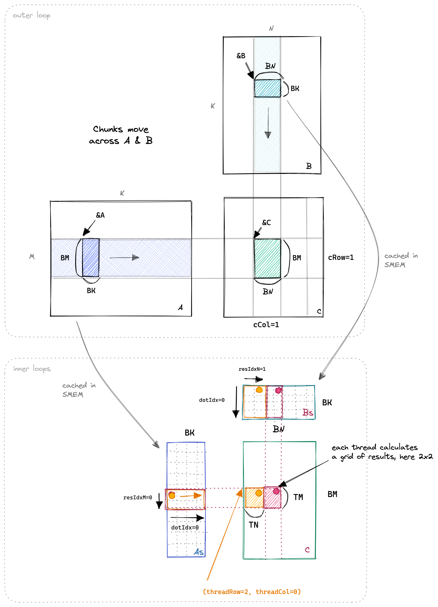
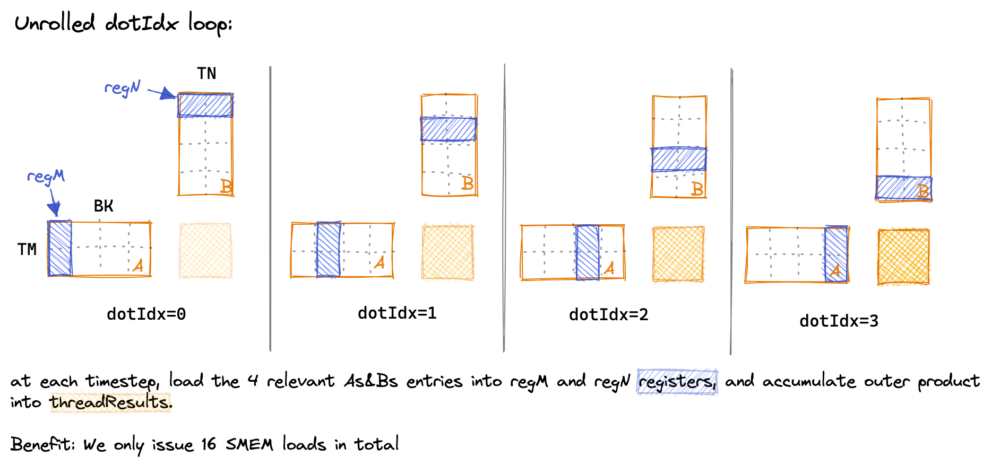

# 实验5：二维 Block Tile - 进一步提高算术强度

## 实验目标

1. 理解 2D Thread Tile（TM x TN）相比 1D Thread Tile（TM x 1）的优势
2. 掌握多元素加载（每个线程使用循环从 GMEM 加载多个元素到 SMEM）
3. 掌握 Register Blocking 使用模式：从 SMEM 批量加载到寄存器再执行外积
4. 理解 Strided Load 的索引计算

## 背景知识

实验4 中只有 M 维度的数据被线程复用（每个 Btmp 被 TM 次 FMA 复用），但 N 维度的数据没有被发掘复用潜力。在 2D Thread Tile 中，每个线程计算 TM x TN 个结果（形成一个正方形 Tile），需要从 SMEM 加载 TM + TN 个元素，却执行 TM x TN 次 FMA，进一步提高了算术强度。

| 方案 | SMEM Loads/Thread | FMAs/Thread | 算术强度 (FLOP/B) |
|------|-------------------|-------------|-------------------|
| 1D Tile (TM=8) | BK * (8+1) = 72 | BK*8 = 64 | ~1.78 |
| 2D Tile (TM=8,TN=8) | BK * (8+8) = 128 | BK*64 = 512 | ~8.0 |

<div align="center"><p>图 5-1 二维 Block Tile 示意：每个线程计算 TM x TN 个结果</p></div>

另一个重要优化是<strong>多元素加载（Multi-Element Loading）</strong>：在实验3和4中，每个线程只加载一个元素到 SMEM。当 Block Tile 变大后，需要更多线程来覆盖整个 Tile。使用跨步循环，每个线程可以负责加载多个元素。

<div align="center"><p>图 5-2 Register Blocking：先批量加载到 regM 和 regN，再执行外积</p></div>

## 对应 CUDA 概念

- <strong>2D Thread Tile</strong>：每个线程计算 TM x TN 的矩形子区域
- <strong>Register Blocking</strong>：从 SMEM 加载到寄存器数组 regM[TM] 和 regN[TN]，再外积累加
- <strong>Strided Load</strong>：使用跨步循环让每个线程加载多个不连续位置的元素
- <strong>编译器循环展开</strong>：编译时常量使得所有循环被完全展开

## 原始代码分析

实验4 使用 1D Block Tile，每个线程计算 TM 个结果（沿 M 方向）。内积循环中，Bs 的一个元素被缓存（`Btmp`）并复用 TM 次，但每次新的 `dotIdx` 迭代都要重新从 SMEM 加载 As 元素。

在实验5中，我们将向量化到 2D Tile，同时增加了 TN 维度的复用。核心思路是：
1. 从 SMEM 批量加载 regM[TM] 和 regN[TN]
2. 执行外积：每个 regM[i] 与每个 regN[j] 相乘累加到 threadResults[i*TN+j]
3. 这样每个 SMEM 元素被复用 max(TM, TN) 次

## 实验步骤

### 步骤1：分析 1D Tile 的局限

实验4 中，在整个 `dotIdx` 循环中：
- Bs 的读取次数：BK（每次 dotIdx 读一个 Bs 元素）
- As 的读取次数：BK * TM（每次 dotIdx 读 TM 个 As 元素）
- 执行 FMAs：BK * TM

N 维度的数据没有复用，Bs 被读取 BK 次，但每次只读一个元素参与一次 FMA（在 dotIdx 的特定迭代中）。

### 步骤2：实现多元素加载

每个线程使用跨步循环从 GMEM 加载多个元素到 SMEM：

```cuda
// 沿 BM 维度跨步加载 A 到 As
for (uint loadOffset = 0; loadOffset < BM; loadOffset += strideA) {
    As[(innerRowA + loadOffset) * BK + innerColA] =
        A[(innerRowA + loadOffset) * K + innerColA];
}
// 沿 BK 维度跨步加载 B 到 Bs
for (uint loadOffset = 0; loadOffset < BK; loadOffset += strideB) {
    Bs[(innerRowB + loadOffset) * BN + innerColB] =
        B[(innerRowB + loadOffset) * N + innerColB];
}
```

其中 `strideA = numThreads / BK`，`strideB = numThreads / BN`。

### 步骤3：实现 Register Blocking

将内积循环改造为外积模式：

```cuda
for (uint dotIdx = 0; dotIdx < BK; ++dotIdx) {
    // 1. 批量加载到寄存器
    for (uint i = 0; i < TM; ++i) {
        regM[i] = As[(threadRow * TM + i) * BK + dotIdx];
    }
    for (uint i = 0; i < TN; ++i) {
        regN[i] = Bs[dotIdx * BN + threadCol * TN + i];
    }
    // 2. 外积累加
    for (uint resIdxM = 0; resIdxM < TM; ++resIdxM) {
        for (uint resIdxN = 0; resIdxN < TN; ++resIdxN) {
            threadResults[resIdxM * TN + resIdxN] +=
                regM[resIdxM] * regN[resIdxN];
        }
    }
}
```

### 步骤4：编译器行为分析

由于 BM、BN、BK、TM、TN 都是编译时常量（模板参数），编译器会完全展开所有循环。Bs 从 SMEM 的加载会被编译器向量化为 LDS.128（使用 `float4` 一次加载 4 个元素）。

### 步骤5：内存访问量对比

| 指标 | 实验4 (1D, TM=8) | 实验5 (2D, TM=TN=8) |
|------|------------------|---------------------|
| 每线程结果数 | 8 | 64 |
| GMEM/结果 | K/32 | K/64 |
| SMEM/结果 | K*9/8 | K/4 |
| FMAs/SMEM load | ~1.0 | ~4.0 |

## 关键代码

```cuda
template <const int BM, const int BN, const int BK, const int TM, const int TN>
__global__ void __launch_bounds__((BM * BN) / (TM * TN), 1)
    sgemm2DBlocktiling(int M, int N, int K, float alpha, const float *A,
                       const float *B, float beta, float *C) {
  const uint cRow = blockIdx.y;
  const uint cCol = blockIdx.x;

  const int threadCol = threadIdx.x % (BN / TN);
  const int threadRow = threadIdx.x / (BN / TN);

  __shared__ float As[BM * BK];
  __shared__ float Bs[BK * BN];

  A += cRow * BM * K;
  B += cCol * BN;
  C += cRow * BM * N + cCol * BN;

  const uint numThreadsBlocktile = (BM * BN) / (TM * TN);
  const uint innerRowA = threadIdx.x / BK;
  const uint innerColA = threadIdx.x % BK;
  const uint strideA = numThreadsBlocktile / BK;
  const uint innerRowB = threadIdx.x / BN;
  const uint innerColB = threadIdx.x % BN;
  const uint strideB = numThreadsBlocktile / BN;

  float threadResults[TM * TN] = {0.0};
  float regM[TM] = {0.0};
  float regN[TN] = {0.0};

  for (uint bkIdx = 0; bkIdx < K; bkIdx += BK) {
    // 多元素加载
    for (uint loadOffset = 0; loadOffset < BM; loadOffset += strideA) {
      As[(innerRowA + loadOffset) * BK + innerColA] =
          A[(innerRowA + loadOffset) * K + innerColA];
    }
    for (uint loadOffset = 0; loadOffset < BK; loadOffset += strideB) {
      Bs[(innerRowB + loadOffset) * BN + innerColB] =
          B[(innerRowB + loadOffset) * N + innerColB];
    }
    __syncthreads();

    A += BK;
    B += BK * N;

    for (uint dotIdx = 0; dotIdx < BK; ++dotIdx) {
      for (uint i = 0; i < TM; ++i)
        regM[i] = As[(threadRow * TM + i) * BK + dotIdx];
      for (uint i = 0; i < TN; ++i)
        regN[i] = Bs[dotIdx * BN + threadCol * TN + i];

      for (uint resIdxM = 0; resIdxM < TM; ++resIdxM)
        for (uint resIdxN = 0; resIdxN < TN; ++resIdxN)
          threadResults[resIdxM * TN + resIdxN] +=
              regM[resIdxM] * regN[resIdxN];
    }
    __syncthreads();
  }

  for (uint resIdxM = 0; resIdxM < TM; ++resIdxM)
    for (uint resIdxN = 0; resIdxN < TN; ++resIdxN)
      C[(threadRow * TM + resIdxM) * N + threadCol * TN + resIdxN] =
          alpha * threadResults[resIdxM * TN + resIdxN] +
          beta * C[(threadRow * TM + resIdxM) * N + threadCol * TN + resIdxN];
}
```

## 预期结果

- <strong>预期性能</strong>：矩阵大小 4096x4096 时，约 <strong>15971.7 GFLOPS/s</strong>
- <strong>性能提升</strong>：从实验4的 8474.7 GFLOPS 提升到 15971.7 GFLOPS，约 <strong>1.88 倍</strong>
- <strong>相对 cuBLAS</strong>：达到 cuBLAS 的 <strong>68.7%</strong>

## 思考题

1. 为什么 2D tile (TM x TN) 的算术强度比 1D tile (TM x 1) 更高？计算两者的 SMEM 访问/FLOPs 比。
2. 如果 `TM = TN = 8`，每个线程的 `threadResults[64]` 占用多少字节？如果寄存器总数为 65536 per SM，最多能容纳多少个这样的线程？
3. 编译器如何自动将 Bs 的 SMEM 加载向量化？As 的加载能否自动向量化？为什么？
4. 多元素加载中，`strideA` 和 `strideB` 的计算逻辑是什么？`strideA = numThreadsBlocktile / BK` 的含义是什么？

## 参考文献

1. [How to Optimize a CUDA Matmul Kernel for cuBLAS-like Performance](https://siboehm.com/articles/22/CUDA-MMM) - Simon Boehm, 2022
2. [NVIDIA CUTLASS Efficient GEMM](https://github.com/NVIDIA/cutlass/blob/master/media/docs/efficient_gemm.md) - NVIDIA
3. [CUDA C++ Programming Guide - Register Pressure](https://docs.nvidia.com/cuda/cuda-c-programming-guide/index.html#register-pressure) - NVIDIA
