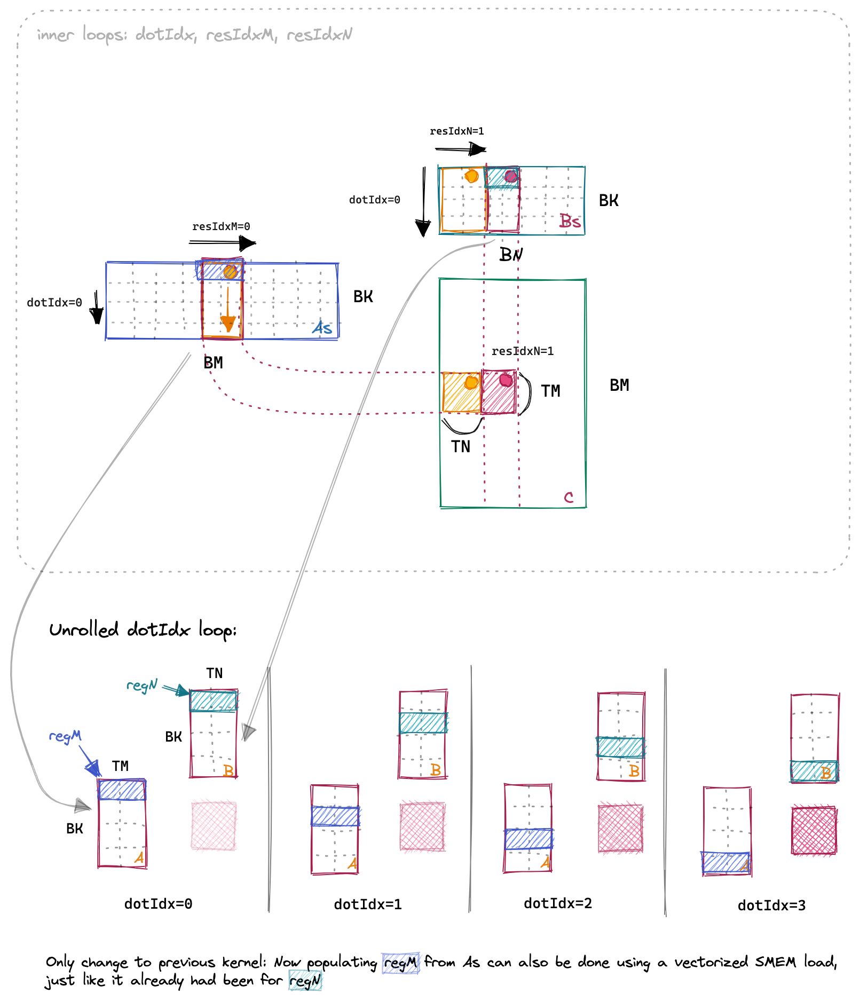

# 实验6：向量化内存访问（Vectorized Memory Access）

## 实验目标

1. 理解向量化内存访问的原理：使用 float4 类型一次加载/存储 4 个 float（128-bit）
2. 掌握 `reinterpret_cast<float4*>()` 的用法和对齐承诺
3. 理解 A 矩阵的转置加载（Transpose on Load）：边加载边转置，使 SMEM 中的数据布局有利于后续向量化访问
4. 向量化 C 矩阵的写回操作

## 背景知识

在 GPU 上，内存访问的宽度对性能有重要影响。CUDA 支持 <strong>向量化数据类型</strong>，如 `float2`（64-bit）、`float4`（128-bit）。使用向量化类型可以让 GPU 执行 <strong>LDG.E.128</strong>（128-bit 全局加载）和 <strong>LDS.128</strong>（128-bit 共享内存加载），而非 32-bit 的 LDG.E 和 LDS 指令。这相当于单条指令完成 4 个 float 的传输，大幅提升内存带宽利用率。

实验5 中，编译器已经自动将 Bs 的 SMEM 加载向量化为 LDS.128。这是因为 Bs 在 SMEM 中按行存储，连续 `threadCol` 对应 Bs 中行方向连续的元素，自然满足 LDS.128 的连续性要求。

但 As 的加载仍然是非向量化的 LDS（32-bit），因为 As 在 SMEM 中按行存储（行主序），而我们需要访问列方向的元素（As[(threadRow * TM + i) * BK + dotIdx]），这些元素在内存中是不连续的，跨度为 BK。

<div align="center"><p>图 6-1 As 转置加载：在从 GMEM 加载到 SMEM 时进行行列转置</p></div>

<strong>解决方案</strong>：在从 GMEM 加载 A 到 SMEM 时，进行<strong>转置存储（Transpose on Load）</strong>。将 GMEM 中行方向连续的 4 个 float 以列方向排列的方式写入 SMEM。这样 SMEM 中的 As 变为列主序，后续从 SMEM 到寄存器的 As 加载就会变得连续，可以被编译器向量化为 LDS.128。

## 对应 CUDA 概念

- <strong>向量化数据类型</strong>：float4（128-bit / 16 字节）
- <strong>LDG.E.128</strong>：128-bit 全局内存加载指令
- <strong>LDS.128</strong>：128-bit 共享内存加载指令
- <strong>STG.E.128</strong>：128-bit 全局内存存储指令
- <strong>Transpose on Load</strong>：加载时进行行列转置
- <strong>reinterpret_cast</strong>：指针类型重解释（承诺内存对齐）
- <strong>内存对齐</strong>：float4 要求 16 字节对齐

## 原始代码分析

实验5 的 As 加载（非向量化）：

```cuda
for (uint loadOffset = 0; loadOffset < BM; loadOffset += strideA) {
    As[(innerRowA + loadOffset) * BK + innerColA] =
        A[(innerRowA + loadOffset) * K + innerColA];
}
```

每次只加载 1 个 float，使用 32-bit 事务。而从 SMEM 读 As 时：

```cuda
regM[i] = As[(threadRow * TM + i) * BK + dotIdx];
```

这里每次读取跨度为 BK 个 float，完全无法被编译器向量化。

## 实验步骤

### 步骤1：理解向量化需求的来源

分析实验5 的 SASS 汇编：
- Bs 加载：已自动向量化为 LDS.128（因为 Bs 按行存储）
- As 加载：仍是 LDS 32-bit（因为 As 按行存储但访问模式是列方向）

### 步骤2：实现 A 矩阵的转置加载

使用 float4 从 GMEM 一次读取 4 个连续元素，但写入 SMEM 时分散到 4 个不同的列：

```cuda
// 从 GMEM 读取一行中连续的 4 个元素
float4 tmp = reinterpret_cast<float4 *>(&A[innerRowA * K + innerColA * 4])[0];
// 转置写入 SMEM：行方向变为列方向
As[(innerColA * 4 + 0) * BM + innerRowA] = tmp.x;
As[(innerColA * 4 + 1) * BM + innerRowA] = tmp.y;
As[(innerColA * 4 + 2) * BM + innerRowA] = tmp.z;
As[(innerColA * 4 + 3) * BM + innerRowA] = tmp.w;
```

注意：线程索引也需要相应调整。原来 `innerColA = threadIdx.x % BK`，现在变为 `innerColA = threadIdx.x % (BK / 4)`，因为每次处理 4 个元素。

### 步骤3：实现 B 矩阵的向量化加载

B 的加载相对简单，因为不需要转置：

```cuda
reinterpret_cast<float4 *>(&Bs[innerRowB * BN + innerColB * 4])[0] =
    reinterpret_cast<float4 *>(&B[innerRowB * N + innerColB * 4])[0];
```

### 步骤4：调整 SMEM 中的数据读取

由于 As 已转置为列主序，从 SMEM 读 As 时的索引需要改变：

```cuda
// 原来（行主序）：
regM[i] = As[(threadRow * TM + i) * BK + dotIdx];
// 现在（列主序）：
regM[i] = As[dotIdx * BM + threadRow * TM + i];
```

现在 `threadRow * TM + i` 连续变化时，As 的地址是连续的（跨度为 1），编译器可以将其向量化为 LDS.128。

### 步骤5：向量化 C 矩阵的写回

使用 float4 一次写回 4 个结果元素：

```cuda
for (uint resIdxN = 0; resIdxN < TN; resIdxN += 4) {
    float4 tmp = reinterpret_cast<float4 *>(
        &C[(threadRow * TM + resIdxM) * N + threadCol * TN + resIdxN])[0];
    tmp.x = alpha * threadResults[resIdxM * TN + resIdxN] + beta * tmp.x;
    tmp.y = alpha * threadResults[resIdxM * TN + resIdxN + 1] + beta * tmp.y;
    tmp.z = alpha * threadResults[resIdxM * TN + resIdxN + 2] + beta * tmp.z;
    tmp.w = alpha * threadResults[resIdxM * TN + resIdxN + 3] + beta * tmp.w;
    reinterpret_cast<float4 *>(
        &C[(threadRow * TM + resIdxM) * N + threadCol * TN + resIdxN])[0] = tmp;
}
```

### 步骤6：验证向量化效果

检查 PTX/SASS 生成，确认使用了 LDG.E.128、LDS.128、STG.E.128 指令。

## 关键代码

完整 kernel 的 SMEM 加载部分：

```cuda
// 向量化加载 A（带转置）
float4 tmp =
    reinterpret_cast<float4 *>(&A[innerRowA * K + innerColA * 4])[0];
As[(innerColA * 4 + 0) * BM + innerRowA] = tmp.x;
As[(innerColA * 4 + 1) * BM + innerRowA] = tmp.y;
As[(innerColA * 4 + 2) * BM + innerRowA] = tmp.z;
As[(innerColA * 4 + 3) * BM + innerRowA] = tmp.w;

// 向量化加载 B（无需转置）
reinterpret_cast<float4 *>(&Bs[innerRowB * BN + innerColB * 4])[0] =
    reinterpret_cast<float4 *>(&B[innerRowB * N + innerColB * 4])[0];
__syncthreads();

// 计算部分：As 已转置为列主序，读取地址连续
for (uint dotIdx = 0; dotIdx < BK; ++dotIdx) {
    for (uint i = 0; i < TM; ++i)
        regM[i] = As[dotIdx * BM + threadRow * TM + i];  // 连续！
    for (uint i = 0; i < TN; ++i)
        regN[i] = Bs[dotIdx * BN + threadCol * TN + i];  // 原本就连续
    // ... FMA 外积 ...
}
```

## 预期结果

- <strong>预期性能</strong>：矩阵大小 4096x4096 时，约 <strong>18237.3 GFLOPS/s</strong>
- <strong>性能提升</strong>：从实验5的 15971.7 GFLOPS 提升到 18237.3 GFLOPS，约 <strong>1.14 倍</strong>
- <strong>相对 cuBLAS</strong>：达到 cuBLAS 的 <strong>78.4%</strong>

## 思考题

1. 为什么直接用 `float4` 手动展开加载 B 也能自动向量化，而加载 A 不转置就不能向量化？分析 SMEM 中 As 和 Bs 的布局与 LDS.128 的连续性要求。
2. `reinterpret_cast<float4*>()` 的作用是强制生成 128-bit 加载指令。如果指针实际未 128-bit 对齐会发生什么？
3. 向量化写回时，为什么需要在 `resIdxN` 循环中以步长 4 遍历？如果 TN=8，需要几次 float4 写回操作？
4. 转置加载 A 时，为什么 `innerColA` 的计算从 `threadIdx.x % BK` 变为 `threadIdx.x % (BK / 4)`？这种变化如何影响线程分工？

## 参考文献

1. [How to Optimize a CUDA Matmul Kernel for cuBLAS-like Performance](https://siboehm.com/articles/22/CUDA-MMM) - Simon Boehm, 2022
2. [CUDA Pro Tip: Increase Performance with Vectorized Memory Access](https://developer.nvidia.com/blog/cuda-pro-tip-increase-performance-with-vectorized-memory-access/) - NVIDIA Developer Blog
3. [CUDA C++ Programming Guide - Vectorized Memory Access](https://docs.nvidia.com/cuda/cuda-c-programming-guide/index.html#vectorized-memory-access) - NVIDIA
