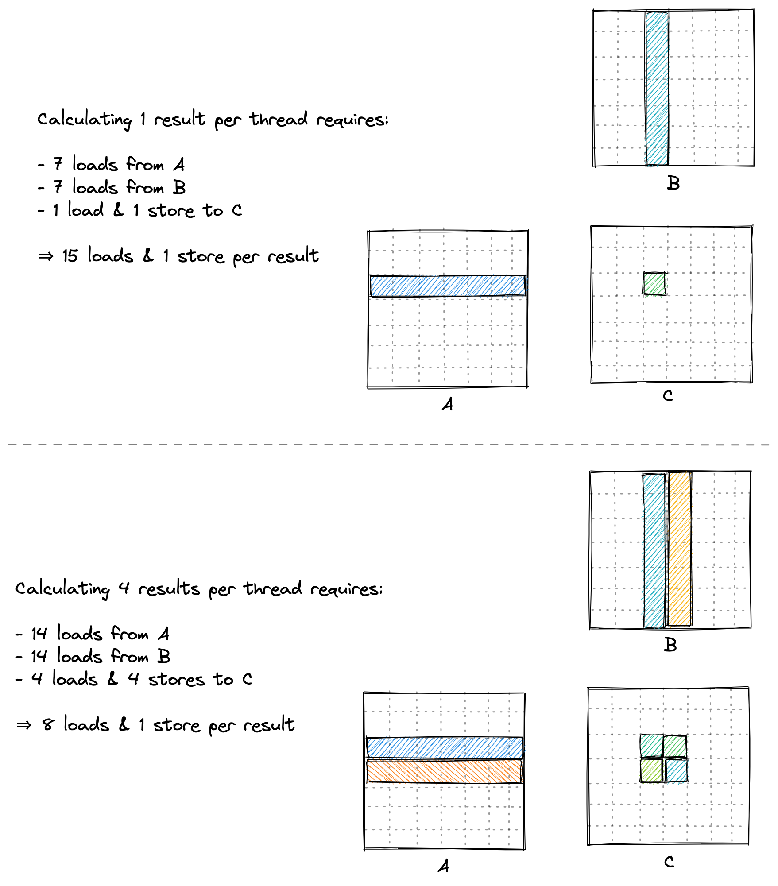

# 实验7：参数自动调优（Autotuning）

## 实验目标

1. 理解 Tile 参数（BM, BN, BK, TM, TN）对性能的多方面影响
2. 掌握参数空间的约束条件：SMEM 大小限制、寄存器数量限制、向量化对齐要求
3. 学会设计参数搜索脚本，自动化 benchmark 和择优
4. 理解为什么不同 GPU 架构的最优参数不同

## 背景知识

前面的实验使用了一组固定的 Tile 参数（BM=BN=128, BK=TM=TN=8）。但这些参数是否是最优的？不同大小的 Tile 会有不同的 SMEM 占用、寄存器占用、算术强度以及同步开销。

实际上，最优参数依赖于<strong>具体的 GPU 架构</strong>。例如：
- <strong>NVIDIA A6000</strong>（Ampere, CC 8.6, 84 SM, 100KB SMEM/SM）：最优为 BM=BN=128, BK=16, TM=TN=8
- <strong>NVIDIA A100</strong>（Ampere, CC 8.0, 108 SM, 164KB SMEM/SM）：最优为 BM=BN=64, BK=16, TM=TN=4

<strong>参数调优（Autotuning）</strong> 就是系统性地搜索参数空间，找到在目标硬件上性能最佳的参数组合。

<div align="center"><p>图 7-1 不同 Tile 大小的算术强度对比</p></div>

## 对应 CUDA 概念

- <strong>模板元编程</strong>：使用模板参数控制编译时常量
- <strong>参数空间搜索</strong>：枚举参数组合并评估性能
- <strong>Occupancy 与资源限制</strong>：SMEM、寄存器、线程数之间的权衡
- <strong>__launch_bounds__</strong>：编译时提示预期的线程数，帮助编译器优化寄存器分配

## 原始代码分析

实验6 的固定参数（BM=BN=128, BK=8, TM=TN=8）已经达到 18237 GFLOPS。这个配置下：
- SMEM 使用：`(128*8 + 8*128) * 4B = 8KB`（非常小）
- 线程数：`(128*128) / (8*8) = 256`
- 每个线程计算 64 个结果

大的 BK（例如 16 或 32）可以减少外层循环的迭代次数以及 `__syncthreads()` 的开销，但会增加 SMEM 使用量。同样，增加 BM 和 BN 可以增加数据复用，但会增加寄存器压力。

## 实验步骤

### 步骤1：理解参数约束

设计参数搜索时必须满足以下约束：

1. <strong>SMEM 约束</strong>：`(BM * BK + BK * BN) * 4B <= 48KB`（A6000 最大 per-block SMEM）
2. <strong>线程数约束</strong>：`(BM * BN) / (TM * TN)` 必须是合理的 block 线程数（如 128, 256, 512 等）
3. <strong>向量化约束</strong>：`NUM_THREADS * 4` 必须能被 `BK` 和 `BN` 整除（确保 float4 加载覆盖完整行/列）
4. <strong>整除约束</strong>：`BM % (16*TM) == 0` 和 `BN % (16*TN) == 0`（避免 tile quantization）
5. <strong>SMEM 整除约束</strong>：`(BM*BK) % (4*NUM_THREADS) == 0` 和 `(BN*BK) % (4*NUM_THREADS) == 0`

### 步骤2：编写参数搜索脚本

枚举以下参数空间：
- BM, BN ∈ {64, 128, 256}
- BK ∈ {8, 16, 32}
- TM, TN ∈ {4, 8}
- NUM_THREADS ∈ {128, 256}

过滤掉不满足约束的组合，对每个合法配置编译并 benchmark。可以使用 Python 或 Bash 脚本自动化此流程。

### 步骤3：实验中引入 Warp 级索引

实验7 的参考实现（kernel 9）实际上已经包含了 Warp Tiling 的元素——通过 `WMITER` 和 `WNITER` 将 Block Tile 进一步划分为 Warp Tile。这为实验8 打下了基础。

Warp Tile 的核心概念：
- Block Tile (BM x BN) 被划分为多个 Warp Tile (WM x WN)
- 每个 Warp 计算一个连续的 WM x WN 子区域
- 线程在 Warp 中的位置决定其负责的 Thread Tile (TM x TN)

### 步骤4：添加 __launch_bounds__ 提示

```cuda
__global__ void __launch_bounds__(NUM_THREADS)
    sgemmAutotuned(...) {
    // ...
}
```

`__launch_bounds__` 告知编译器预期的线程数，帮助编译器在寄存器压力和 occupancy 之间取得平衡。

### 步骤5：对比不同参数的性能

对于 A6000：
| 参数组合 | BM | BN | BK | TM | TN | GFLOPS |
|---------|----|----|----|----|----|--------|
| 默认 | 128 | 128 | 8 | 8 | 8 | ~18237 |
| 调优 | 128 | 128 | 16 | 8 | 8 | ~19721 |

关键改变：BK 从 8 增加到 16。这减少了外层循环的迭代次数（从 512 次减到 256 次），也减少了 `__syncthreads()` 的次数。

## 关键代码

```cuda
const int NUM_THREADS = 256;

template <const int BM, const int BN, const int BK, const int TM, const int TN>
__global__ void __launch_bounds__(NUM_THREADS)
    sgemmAutotuned(int M, int N, int K, float alpha, float *A, float *B,
                   float beta, float *C) {
  // Warp Tile 的划分
  constexpr int WM = TM * 16;
  constexpr int WN = TN * 16;
  constexpr int WMITER = CEIL_DIV(BM, WM);
  constexpr int WNITER = CEIL_DIV(BN, WN);

  // ... SMEM 分配、向量化加载、Register Blocking ...

  // 外层循环遍历 Warp Tile
  for (uint wmIdx = 0; wmIdx < WMITER; ++wmIdx) {
    for (uint wnIdx = 0; wnIdx < WNITER; ++wnIdx) {
      for (uint dotIdx = 0; dotIdx < BK; ++dotIdx) {
        // 加载 regM, regN, 执行外积
      }
    }
  }
}
```

启动参数（A6000 最优）：
```cpp
const uint BM = 128, BN = 128, BK = 16, TM = 8, TN = 8;
dim3 gridDim(CEIL_DIV(N, BN), CEIL_DIV(M, BM));
dim3 blockDim(256);
```

## 预期结果

- <strong>预期性能</strong>：矩阵大小 4096x4096 时，约 <strong>19721.0 GFLOPS/s</strong>
- <strong>性能提升</strong>：从实验6的 18237.3 GFLOPS 提升到 19721.0 GFLOPS，约 <strong>1.08 倍</strong>
- <strong>相对 cuBLAS</strong>：达到 cuBLAS 的 <strong>84.8%</strong>

## 思考题

1. 为什么 BK 从 8 增加到 16 能提升性能？具体减少了哪些开销？
2. 为什么 A100 的最优参数（BM=64）比 A6000 的最优参数（BM=128）小？这与两个 GPU 的 SM 数量和 SMEM 配置有什么关系？
3. 在实际生产环境中（如 cuBLAS、CUTLASS），autotuning 是如何工作的？参数搜索在编译时还是运行时完成？
4. 如果我们要在运行时动态选择最优参数（而不是编译时），应该如何设计代码？CUDA 的 template kernel 能否在运行时选择模板参数？

## 参考文献

1. [How to Optimize a CUDA Matmul Kernel for cuBLAS-like Performance](https://siboehm.com/articles/22/CUDA-MMM) - Simon Boehm, 2022
2. [NVIDIA CUTLASS - Efficient GEMM](https://github.com/NVIDIA/cutlass/blob/master/media/docs/efficient_gemm.md) - NVIDIA
3. [CUDA C++ Best Practices Guide - Occupancy](https://docs.nvidia.com/cuda/cuda-c-best-practices-guide/index.html#occupancy) - NVIDIA
