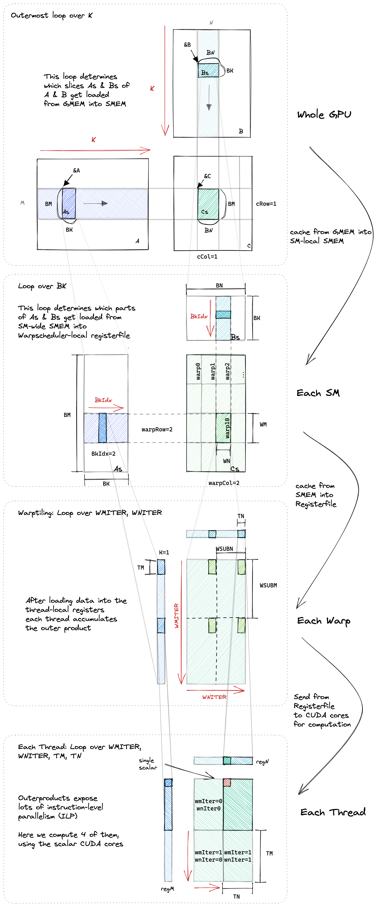
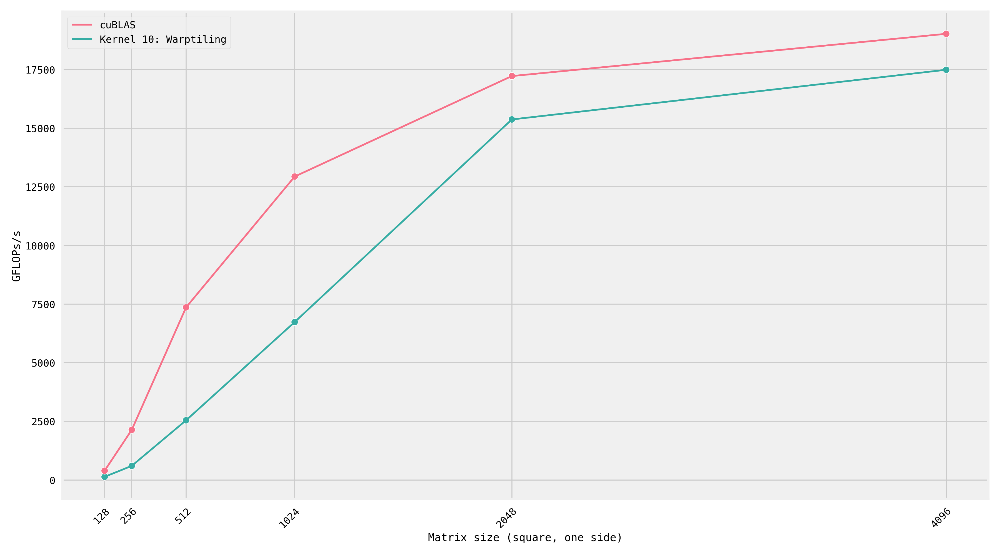
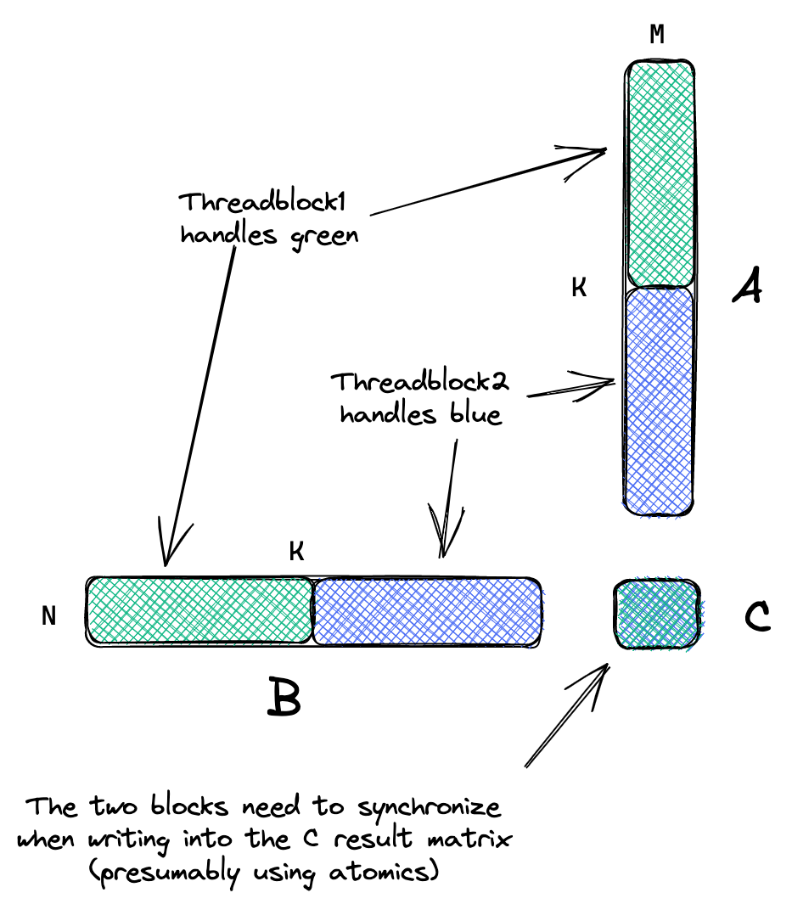

# 实验8：Warp Tile、Bank Conflict 与性能对比 cuBLAS

## 实验目标

1. 理解 Warp Tiling：在 Block Tile 和 Thread Tile 之间增加 Warp 层级
2. 理解共享内存 Bank Conflict 的原因和两种解决方案
3. 理解双缓冲（Double Buffering）的基本思想
4. 使用 Nsight Compute 对比自己的实现与 cuBLAS 的性能差距
5. 分析剩余性能差距的来源

## 背景知识

到实验7 为止，我们已经将性能优化到了 cuBLAS 的 84.8%。但要达到接近 cuBLAS 的水平（93.7%+），还需要进一步的技术。

### Warp Tiling

在 GPU 中，一个 Block 内的线程被划分为多个 <strong>Warp</strong>（每组 32 个线程）。Warp 是 SM 上的<strong>基本调度单位</strong>。在实验7 中，我们实际上已经引入了 Warp 级的分区（WMITER 和 WNITER），但实验8 将这一设计更加显式化。

<div align="center"><p>图 8-1 Warp Tiling 的三层结构：Block Tile -> Warp Tile -> Thread Tile</p></div>

Warp Tiling 的三层结构：
1. <strong>Block Tile</strong>（BM x BN）：一个 Block 负责计算的区域
2. <strong>Warp Tile</strong>（WM x WN）：一个 Warp 负责计算的子区域
3. <strong>Thread Tile</strong>（TM x TN）：一个线程负责计算的子区域

Warp Tiling 的优势在于：同一 Warp 内的线程共享更紧密的数据区域，可以从 SMEM 批量加载一个 Warp Subtile 的所有数据到寄存器，在寄存器缓存上执行密集的外积运算。这最大化利用了寄存器文件的局部性。

### Bank Conflict

共享内存由 <strong>32 个 Bank</strong> 组成（Bank 索引 = (地址 / 4) % 32）。当同一个 Warp 内的多个线程访问同一个 Bank 的不同地址时，就会发生 <strong>Bank Conflict</strong>，导致访问被串行化。

在实验6 和实验7 中，从 SMEM 读取 Bs 时存在 Bank Conflict：
- `regN[i] = Bs[dotIdx * BN + threadCol * TN + i]`
- 当多个线程的 `threadCol` 不同但访问的地址落在同一个 Bank 时，冲突发生

两种解决方案：
- <strong>方法一（Linearize）</strong>：重新排列 Bs 的 SMEM 布局，将地址重新映射使访问模式解耦
- <strong>方法二（Extra Col / Padding）</strong>：在 Bs 每行末尾添加额外列（padding），使相邻行的相同列偏移到不同的 Bank

### Double Buffering

双缓冲的核心思想：分配 2 倍的 SMEM 空间，一半用于<strong>加载</strong>下一次迭代的数据，另一半用于<strong>计算</strong>当前数据。理想情况下，可以完全隐藏 GMEM 加载延迟（在计算当前块的同时，在后台加载下一个块）。

## 对应 CUDA 概念

- <strong>Warp 级并行</strong>：以 Warp 为单位的子区域划分和计算
- <strong>共享内存 Bank Conflict</strong>：32 路 Bank 结构导致的访问冲突
- <strong>双缓冲（Double Buffering）</strong>：使用两倍 SMEM 空间并行加载和计算
- <strong>寄存器缓存局部性</strong>：将数据批量加载到寄存器后尽可能多地复用

## 原始代码分析

实验7（kernel 9）已经包含了 Warp Tile 的隐式实现。实验8（kernel 10）将其显式化，并采用以下 A6000 最优参数：

```
BM=128, BN=128, BK=16, WM=64, WN=64, WNITER=4, TM=8, TN=4, NUM_THREADS=128
```

这个配置下：
- Block 有 4 个 Warp（128 / 32 = 4）
- 每个 Warp 负责 64x64 的 Warp Tile
- WNITER=4 表示每个 Warp Tile 在 N 方向上被分成 4 个 Warp Subtile（每个 64x16）
- WMITER = (64*64)/(32*8*4*4) = 4096/4096 = 1（Warp Subtile 在 M 方向不划分）
- 每个线程计算 8x4 = 32 个结果

<div align="center"><p>图 8-2 Warp Tiling 的循环结构</p></div>

## 实验步骤

### 步骤1：实现 Warp Tiling

核心改动包括：
1. 计算 warp 索引：`warpIdx = threadIdx.x / WARPSIZE`
2. 将 Block Tile 按 Warp 划分：`warpRow = warpIdx / (BN/WN)`, `warpCol = warpIdx % (BN/WN)`
3. 从 SMEM 加载数据时，同时加载整个 Warp Subtile 的所有元素到寄存器
4. 在 regM 和 regN 上执行密集的外积

### 步骤2：三层循环结构

```
for bkIdx (K 维外层)
  for dotIdx (BK 维内层)
    for wSubRowIdx (Warp Subtile 行迭代)
      加载 regM[wSubRowIdx*TM + i]
    for wSubColIdx (Warp Subtile 列迭代)
      加载 regN[wSubColIdx*TN + i]
    for wSubRowIdx
      for wSubColIdx
        执行 FMA 外积累加
```

### 步骤3：理解 Bank Conflict 及解决方案

Bank Conflict 发生在同一 Warp 内的线程访问 SMEM 时：

<strong>方法一（Linearize）</strong>：通过改变 Bs 在 SMEM 中的布局，将线性化的地址映射到不影响访问模式的 Bank：

```cuda
// 转置存储 B 到 SMEM（重新排列地址）
Bs[((innerColB % 2) * 4 + innerRowB * 8 + 0) * 16 + innerColB / 2] = tmp.x;
// ...
// 读取时使用新的索引公式
regN[i] = Bs[(dotIdx * 8 + i) * 16 + threadCol];
```

<strong>方法二（Padding / Extra Col）</strong>：在 Bs 每行末尾添加 padding 列：

```cuda
const int extraCols = 5;
__shared__ float Bs[BK * (BN + extraCols)];
// 访问时使用 (BN + extraCols) 作为行步长
regN[i] = Bs[dotIdx * (BN + extraCols) + threadCol * TN + i];
```

Padding 方法更简单，但浪费一些 SMEM 空间。Linearize 方法不浪费空间，但访问模式更复杂。

### 步骤4：理解 Double Buffering

双缓冲需要：
1. 2 倍 SMEM：`As[2 * BM * BK]` 和 `Bs[2 * BK * BN]`
2. 将线程分为两半：一半加载 Buffer 0，另一半加载 Buffer 1
3. 交替：加载 Buffer 1 的同时计算 Buffer 0
4. 使用异步内存拷贝或手动调度

### 步骤5：性能对比分析

完成实验8 后，将自己最终实现的性能与 cuBLAS 对比（本实验最终达到 93.7%）。

<div align="center"><p>图 8-3 实验8 (Kernel 10) vs cuBLAS 在不同矩阵尺寸下的性能对比</p></div>

<div align="center"><p>图 8-4 cuBLAS 在 256x256 时使用 split-K 策略：一个 GEMM kernel + 一个 reduce kernel</p></div>

剩余 ~6.3% 的性能差距可能来自：
- <strong>Tensor Core 使用</strong>：cuBLAS 可以使用 TF32 Tensor Core（在 Ampere 上），而我们的实现是纯 FP32
- <strong>Split-K 策略</strong>：小矩阵时 cuBLAS 将 K 维度拆分到多个 kernel，用 reduce kernel 合并
- <strong>更优的数据布局</strong>：cuBLAS 可能使用更复杂的 SMEM 数据布局
- <strong>更多的参数调优</strong>：cuBLAS 对每个尺寸使用不同的参数组合
- <strong>汇编级优化</strong>：cuBLAS 包含手写 SASS 汇编

## 关键代码

```cuda
namespace wt {

// 从 GMEM 加载数据（向量化 + 转置）
template <const int BM, const int BN, const int BK,
          const int rowStrideA, const int rowStrideB>
__device__ void loadFromGmem(int N, int K, const float *A, const float *B,
                              float *As, float *Bs, ...) {
  for (uint offset = 0; offset + rowStrideA <= BM; offset += rowStrideA) {
    float4 tmp = reinterpret_cast<const float4 *>(
        &A[(innerRowA + offset) * K + innerColA * 4])[0];
    As[(innerColA * 4 + 0) * BM + innerRowA + offset] = tmp.x;
    As[(innerColA * 4 + 1) * BM + innerRowA + offset] = tmp.y;
    As[(innerColA * 4 + 2) * BM + innerRowA + offset] = tmp.z;
    As[(innerColA * 4 + 3) * BM + innerRowA + offset] = tmp.w;
  }
  for (uint offset = 0; offset + rowStrideB <= BK; offset += rowStrideB) {
    reinterpret_cast<float4 *>(
        &Bs[(innerRowB + offset) * BN + innerColB * 4])[0] =
        reinterpret_cast<const float4 *>(
            &B[(innerRowB + offset) * N + innerColB * 4])[0];
  }
}

// 从 SMEM 处理 Warp Tile
template <const int BM, const int BN, const int BK, const int WM, const int WN,
          const int WMITER, const int WNITER, const int WSUBM, const int WSUBN,
          const int TM, const int TN>
__device__ void processFromSmem(float *regM, float *regN, float *threadResults,
                                 const float *As, const float *Bs, ...) {
  for (uint dotIdx = 0; dotIdx < BK; ++dotIdx) {
    // 批量加载整个 Warp Subtile 到寄存器
    for (uint wSubRowIdx = 0; wSubRowIdx < WMITER; ++wSubRowIdx) {
      for (uint i = 0; i < TM; ++i) {
        regM[wSubRowIdx * TM + i] =
            As[(dotIdx * BM) + warpRow * WM + wSubRowIdx * WSUBM +
               threadRowInWarp * TM + i];
      }
    }
    for (uint wSubColIdx = 0; wSubColIdx < WNITER; ++wSubColIdx) {
      for (uint i = 0; i < TN; ++i) {
        regN[wSubColIdx * TN + i] =
            Bs[(dotIdx * BN) + warpCol * WN + wSubColIdx * WSUBN +
               threadColInWarp * TN + i];
      }
    }
    // 在寄存器上执行密集外积
    for (uint wSubRowIdx = 0; wSubRowIdx < WMITER; ++wSubRowIdx) {
      for (uint wSubColIdx = 0; wSubColIdx < WNITER; ++wSubColIdx) {
        for (uint resIdxM = 0; resIdxM < TM; ++resIdxM) {
          for (uint resIdxN = 0; resIdxN < TN; ++resIdxN) {
            threadResults[...] +=
                regM[wSubRowIdx*TM + resIdxM] * regN[wSubColIdx*TN + resIdxN];
          }
        }
      }
    }
  }
}

} // namespace wt

template <const int BM, const int BN, const int BK, const int WM, const int WN,
          const int WNITER, const int TM, const int TN, const int NUM_THREADS>
__global__ void __launch_bounds__(NUM_THREADS)
    sgemmWarptiling(int M, int N, int K, float alpha, float *A, float *B,
                    float beta, float *C) {
  const uint warpIdx = threadIdx.x / WARPSIZE;
  const uint warpCol = warpIdx % (BN / WN);
  const uint warpRow = warpIdx / (BN / WN);

  // ... 索引计算、SMEM 分配、加载、计算、写回 ...
}
```

Bank Conflict 解决（Padding 方法示例）：
```cuda
const int extraCols = 5;
__shared__ float Bs[BK * (BN + extraCols)];
// 加载时使用 (BN + extraCols) 步长
Bs[innerRowB * (BN + extraCols) + innerColB * 4 + 0] = tmp.x;
// 读取时使用 (BN + extraCols) 作为行步长
regN[i] = Bs[dotIdx * (BN + extraCols) + threadCol * TN + i];
```

## 预期结果

- <strong>预期性能（Warp Tiling）</strong>：矩阵大小 4096x4096 时，约 <strong>21779.3 GFLOPS/s</strong>
- <strong>相对 cuBLAS</strong>：达到 cuBLAS 的 <strong>93.7%</strong>
- <strong>相对 A6000 峰值</strong>：约为峰值的 <strong>72.6%</strong>（A6000 FP32 峰值约 30 TFLOPS）

<strong>性能总览（矩阵 4096x4096）</strong>：

| 实验 | 优化技术 | GFLOPS | 相对 cuBLAS | 相对上一实验 |
|------|---------|--------|------------|-------------|
| 实验1 | 朴素实现 | 309.0 | 1.3% | - |
| 实验2 | GMEM 合并访问 | 1986.5 | 8.5% | 6.4x |
| 实验3 | SMEM 缓存分块 | 2980.3 | 12.8% | 1.5x |
| 实验4 | 1D Block Tile | 8474.7 | 36.5% | 2.8x |
| 实验5 | 2D Block Tile | 15971.7 | 68.7% | 1.88x |
| 实验6 | 向量化访问 | 18237.3 | 78.4% | 1.14x |
| 实验7 | 参数调优 | 19721.0 | 84.8% | 1.08x |
| 实验8 | Warp Tile | 21779.3 | 93.7% | 1.10x |
| cuBLAS | 参考 | 23249.6 | 100.0% | - |

## 思考题

1. 为什么 Warp Tiling 能带来额外性能提升？考虑寄存器缓存局部性和 Warp 调度器的特性。
2. Bank Conflict 中，"Linearize" 方法和 "Extra Col" 方法的原理分别是什么？各自有什么优缺点？
3. Double Buffering 是否能真正隐藏 GMEM 加载延迟？在什么条件下它的效果不明显？
4. cuBLAS 在矩阵尺寸 256x256 时使用了 split-K 策略（一个 matmul kernel + 一个 reduce kernel）。split-K 的目的是什么？为什么在小矩阵时特别有用？
5. 剩余 ~6.3% 的性能差距可能的来源是什么？如果要将性能提升到 cuBLAS 的 95%+，还有哪些技术可以尝试？

## 参考文献

1. [How to Optimize a CUDA Matmul Kernel for cuBLAS-like Performance](https://siboehm.com/articles/22/CUDA-MMM) - Simon Boehm, 2022
2. [SGEMM_CUDA 源代码](https://github.com/siboehm/SGEMM_CUDA) - 配套开源代码
3. [CUDA C++ Programming Guide - Shared Memory Bank Conflicts](https://docs.nvidia.com/cuda/cuda-c-programming-guide/index.html#shared-memory-5-x) - NVIDIA
4. [CUDA C++ Best Practices Guide - Warp](https://docs.nvidia.com/cuda/cuda-c-best-practices-guide/index.html) - NVIDIA
5. [NVIDIA CUTLASS Efficient GEMM](https://github.com/NVIDIA/cutlass/blob/master/media/docs/efficient_gemm.md) - NVIDIA
6. [Understanding Latency Hiding on GPUs](https://www2.eecs.berkeley.edu/Pubs/TechRpts/2016/EECS-2016-143.pdf) - V. Volkov 博士论文
